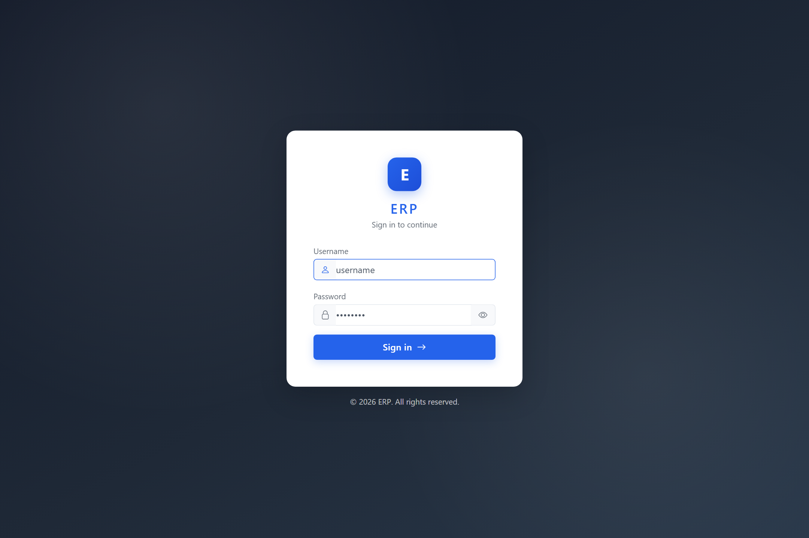
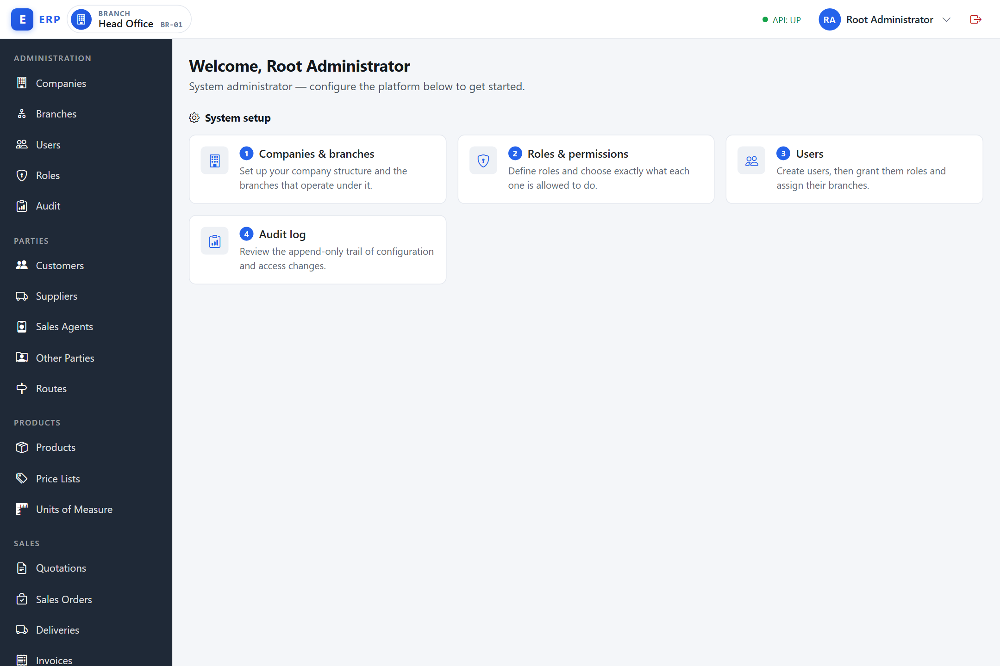

# Getting Started

Welcome to the ERP system. This chapter explains how to sign in, find your way around, and use the common patterns you will meet on every screen.

---

## Signing In

**What signing in is.** Authentication is the process of proving your identity to the system. You present a username and password; the system checks them, issues you a short-lived access token (a cryptographically signed credential, invisible to you), and loads your personal session. Everything you do after this is recorded against your identity.

**Why it exists.** Without authentication, anyone who could reach the URL could read, create, or delete business data. The system needs to know *who* you are before it can decide *what* you are allowed to do.

**When it happens.** Every time you open the application in a fresh browser tab, after your session expires (timeout is set by your administrator), or after you sign out.

**How it works.** On successful sign-in the system reads your default branch assignment and resolves your effective permissions for that branch. The main menu is built from those permissions — screens you cannot access are never shown. The access token is refreshed automatically in the background; when it cannot be refreshed (for example, your account was disabled mid-session) you are returned to the login page.

1. Open your browser and navigate to the URL your administrator gave you (for example, `http://erp.yourcompany.com`). The login page appears automatically.
2. Enter your **username** in the first field. Usernames are not case-sensitive.
3. Enter your **password** in the second field.
4. Click **Sign in**.

If your credentials are correct you are taken straight to the main dashboard. The system reads your assigned permissions and builds your personal menu — you will only see the sections you are allowed to use.

### Sign-in problems

| What you see | What to do |
|---|---|
| "Invalid username or password." | Check your username and password. The message is the same whether the username or the password is wrong — this is intentional. |
| "Account is locked. Try again later or contact an administrator." | Your account was locked after too many failed attempts. Ask an administrator to unlock it for you. |
| "Your session has expired. Please sign in again." | Your session timed out. Sign in again. Any unsaved work will be lost. |

> Your account is automatically locked for 15 minutes after 5 consecutive wrong-password attempts. A successful sign-in resets the counter.

### Signing out

Click your name or initials in the top-right corner of the screen to open the account menu, then click **Sign out**. (On wider screens a dedicated **Sign out** icon button is also shown in the top bar, so you can sign out in one click.) You are returned to the login page and your session is ended immediately.

---

## The App Layout

Once signed in you see three main areas.

### Top bar

The horizontal bar across the top of every screen contains:

- **Brand / logo** on the left.
- **Active branch indicator** — a chip showing the name of the branch you are currently working in (with its branch code shown beside the name on wider screens). Click it to switch to a different branch if you are assigned to more than one (see the Branch Switcher section below). If you have no assigned branch the chip reads **No branch**.
- A small coloured dot showing whether the system service is reachable (the indicator reads **API: UP** in green when healthy).
- **Your name / initials** on the right. Click to open the account menu, which shows your display name, your **@username**, a **Root administrator** badge if you are signed in as `rootadmin`, and a **Sign out** action. On medium and larger screens a separate **Sign out** icon button also sits in the top bar for one-click sign-out.

### Sidebar navigation

A dark slate panel on the left (or opened by the menu icon on small screens) groups all available screens by business area — for example **Administration**, **Sales**, **Inventory**, **Accounting**, and so on — with each screen listed under its group heading. Click a screen name to navigate there.

The sidebar is **personalised** — items you do not have permission to see are simply not shown, and a group whose every item is hidden disappears entirely. If you cannot find a screen you expect, you probably lack the required permission. Contact your system administrator. (If a screen is part of the system but not yet released, it appears greyed-out with a small **soon** badge instead of a working link.)

Press **Escape** at any time to close the sidebar on a small screen.

### Main content area

The large area to the right of the sidebar is where each screen loads. The current route is reflected in the browser address bar.

### The home page

When you sign in — or are redirected after trying to open a screen you cannot access — you land on the **home page** (`/admin/home`).

What you see depends on your account:

- **System administrators (`rootadmin`)** see a **System setup** panel — its heading reads "System setup", under the page subtitle "System administrator — configure the platform below to get started." It presents an ordered set of configuration steps as cards — *1 Companies & branches → 2 Roles & permissions → 3 Users → 4 Audit log* — for standing the platform up. Each card links straight to that area.
- **Everyone else** sees a personalised **launchpad**: the page subtitle reads "Quick links to your most-used screens," and below it a **Quick launch** grid shows one card per screen you actually hold the permission to open, drawn from a curated set spanning the dashboard, sales, purchasing, stock, finance, and manufacturing (for example Dashboard, Sales orders, POS sell, Stock on-hand, Post journal). Each card is checked against the exact permission its target screen requires, so a card you can see is always a card you can open — there is no dead-end tile. The **Dashboard** card is always shown first when you hold `BI.VIEW`. If none of the curated destinations are open to you, you instead see a brief, calm placeholder ("Your workspace is ready.") prompting you to use the menu on the left. Either way, the home page does **not** repeat the full sidebar menu — the sidebar remains the complete map of everywhere you can go.

The home page never requires a permission and never loads business data, so it is always safe to land on; this is why the system uses it as the silent redirect target for screens you cannot access.

---

## The Branch Switcher

**What a branch is.** A branch is a physical or logical operating unit within a company — for example, a shop, a warehouse, a regional office, or a cost centre. Every transaction you create is stamped with the branch you were working in at the time.

**Why branch switching exists.** A single user may work across multiple locations or departments. Rather than logging in and out with different accounts, you stay logged in and tell the system which branch context to use for your current task. The system then shows you data scoped to that branch and enforces the permissions that apply there.

**When it matters.** On login the system activates your **default branch** automatically. If you are assigned to more than one branch, you can switch before performing a transaction to ensure it is recorded in the correct location.

**How it works.** Switching branches does not re-issue your login token. Instead the system records your active branch choice and attaches it to every subsequent request. Your effective permissions are re-resolved for the new branch's company on the very next call — permissions can differ between branches if your roles are scoped differently.

- On login the system activates your **default branch** automatically.
- If you are assigned to more than one branch, click the branch chip in the top bar to open a dropdown. Click any branch in the list to switch to it. The list shows only your active, assigned branches; each row shows the branch **name** with its short branch **code** beside it (the code is a human-readable identifier, never a raw internal identifier).
- Switching branches takes effect immediately; your permissions and the data you see may change depending on your role grants.
- Selecting the branch you are already in is a no-op — the menu simply closes.

> If you have no active branch (for example, your only branch was removed or archived), you will be in a read-only state. Contact your administrator to be assigned to an active branch.

---

## How Permissions Shape What You See

**What permissions and roles are.** A permission is a named capability — for example, `USER.MANAGE` or `GL.POST`. A role is a named bundle of permissions: for instance, an "Accountant" role might bundle all the GL, AR, AP, and cash permissions that a typical accountant needs. Users are not assigned permissions directly; they are assigned roles, and those roles carry the permissions.

**Why this model exists.** Assigning individual permissions to each user does not scale when you have dozens of staff and hundreds of capabilities. Roles let you define a job function once and then grant or revoke it from any number of people in a single action. It also makes auditing straightforward: you can read a role's permission set and know exactly what every holder can do.

**When permissions are evaluated.** Every time you navigate to a screen or perform an action, the system checks your effective permissions for your active branch. If you switch branches, your permissions are re-checked against the roles you hold in the new branch's context.

**How it works.** Your administrator creates roles, assigns specific permissions to each role, and then grants those roles to you scoped to a company (and optionally a specific branch). The system computes the union of all permissions from all your active role grants in the current branch's context.

- **Nav items** you lack permission for are hidden entirely — you will not see a greyed-out item, just no item at all.
- If you type a URL directly for a screen you cannot access, the system redirects you to the home page quietly.
- If you are on a screen and try to perform an action you lack permission for, the system declines it without an alarming pop-up — the relevant part of the screen shows a calm "no permission" message instead. (See "When something goes wrong" under Common UI Patterns.)

The special account **rootadmin** is the system superuser and sees every screen and every action regardless of role assignment. This account is used by IT administrators only.

---

## Common UI Patterns

### Resource pickers — choosing a related record by name

Throughout the system, whenever one record links to another (for example, a sales order links to a customer, a journal line links to an account, or a user is assigned to a branch), you choose the related record **by name** from a list. You **never type a code or an internal identifier**. This applies everywhere — fiscal year, customer, supplier, product, account, branch, agent, task, and so on.

The picker is a dropdown labelled with what you are choosing (for example **Customer**):

1. Click or focus the picker field.
2. Pick the matching item from the dropdown list.
3. For longer lists (more than 12 options) a **"Type to filter by name…"** box appears automatically above the dropdown — type part of the name to narrow the list, then pick the item.

Because raw identifiers are never accepted as input, you cannot pick a record that does not exist or mistype an identifier. Internal identifiers (the long machine codes the system uses behind the scenes) are not shown anywhere in the interface; records are always presented by their human-readable name, code, or a link.

### The Currency Picker — choosing a currency on a form

Wherever a form asks you for a currency — for example when entering a supplier bill, recording a customer receipt, setting an opening balance, raising a credit note, creating a sales order, invoice, quotation, blanket or standing order, ringing up a POS sale, raising a purchase order, setting up pricing tiers or a customer price, entering a product's cost or selling price, an opportunity value, an HR loan, a customer credit limit, or purchase settings — you choose it from a **Currency Picker**, not by typing a 3-letter code.

The Currency Picker is a dropdown that lists currencies as **"CODE — Name"** (for example, `TZS — Tanzanian Shilling`, `USD — US Dollar`):

- It shows **only the currencies enabled for your company** (and, where relevant, your branch). You cannot choose a currency that has not been enabled.
- It **defaults to your company's default document currency**, so for everyday single-currency work you can simply leave it as-is.
- If the list is long, a small filter box lets you type part of the code or name to narrow it.

The set of enabled currencies and the default document currency are configured by your administrator (per company, and optionally per branch). The **base currency** — the home currency your accounts are kept in — is set once for the company and **cannot be changed once any journal entries exist**, so plan it carefully at setup time. If you ever need a currency that is not in the list, ask your administrator to enable it.

> You will never be asked to "type a 3-letter currency code" or told that a field "defaults to TZS" — those are out of date. Always pick the currency from the dropdown.

### List screens — search and pagination

Every list screen (for example, **Sales Orders** or **Users**) behaves the same way:

- A **search** or filter bar at the top lets you narrow results by keyword, status, date range, or other criteria relevant to that list.
- A **pager** at the bottom shows page numbers and **First / Previous / Next / Last** controls. If all results fit on one page the pager hides itself.
- Column headings may be clicked to sort the list (where supported).

### Using the system on a phone or tablet

The system is usable on a phone or tablet, not just a desktop browser. On a narrow screen the sidebar becomes the slide-out menu described above, and wide transaction list tables (for example Sales Orders, Purchase Orders, Customers, or Products) scroll horizontally within their own frame rather than squeezing every column to fit. The row action in the last column (**Open**, **Edit**, **Ledger**, **Adjust**, and so on) stays pinned to the right edge of that frame as you scroll, so it is always reachable — you are never stranded with the action for a row scrolled off-screen. A soft shadow on the right edge of a table hints that more columns are available if you scroll. The interface has been verified for accessibility at phone and tablet screen sizes as well as desktop — no serious or critical issues were found across the main screens when it was last checked.

### The four screen states

Every data screen can be in one of four states. The system displays a distinct visual for each:

| State | What you see |
|---|---|
| **Loading** | A spinner or skeleton while data is being fetched. A thin progress stripe also runs across the top of the screen whenever the system is talking to the server. |
| **Empty** | A clear message that there are no records matching your criteria. This is not an error. |
| **Error** | A message explaining that something went wrong, with a prompt to try again. |
| **No access** | If you navigate directly to a screen you cannot use, you are redirected to the home page silently. If you can open a screen but lack permission for a particular *action* on it, that part of the screen shows a calm "no permission" message rather than an alarming pop-up. |

### When something goes wrong — errors and conflicts

The system aims to tell you plainly what happened and what to do, rather than showing a raw technical failure:

- A genuine failure (the server is unreachable, or an unexpected error) appears as a centered **"Something went wrong"** alert that you acknowledge with **OK**. The message is written in plain language.
- A **validation** problem (a missing required field, a value out of range, an unsupported file) is reported clearly so you can correct it and try again — you will not see a raw internal error.
- A **conflict** — for example, two people edited the same record at the same time — appears through the same centered **"Something went wrong"** alert, with the body explaining that the record was modified by another transaction and asking you to reload and try again. Reopen the record to get the latest version, re-apply your change, and save again.
- A session that has expired returns you to the login page with the toast "Your session has expired. Please sign in again." (see the Signing In section).

### Money and date formats

**What currency-aware money means.** Every monetary value in this system is stored and displayed as a pair: an amount and its currency code (for example, `TZS 1,234.56` or `USD 200.00`). A bare number with no currency is never used. This matters because a figure of `1500` means something completely different in TZS than in USD.

**Why this design.** The system is built for organisations that may trade in multiple currencies. Attaching the currency to every amount from the start prevents a class of errors where amounts in different currencies are accidentally compared or summed. It also allows a second company under the same organisation to operate in a different base currency without any data migration.

- **Money** is always shown with the currency code and two decimal places, for example `TZS 1,234.56` or `USD 200.00`. You never type a currency symbol or a free-text currency code — when a form needs a currency you choose it from the **Currency Picker** (see above), which is pre-set to your company's default.
- **Dates** are shown in your local timezone. When entering dates use the date picker provided — never type raw date strings.

### Creating, editing, and saving records

The general flow for creating or editing a record is:

1. Click **Create** (or open an existing record).
2. Fill in the form. Required fields are marked. The system validates as you go and shows inline messages if something is wrong.
3. Click **Save** (or the specific action button, for example **Confirm** for a sales order).
4. A brief success notification (a "toast") appears at the top of the screen to confirm the action was saved. If something went wrong, an error message appears in the form itself or as an alert — read it, correct the issue, and try again.

> **Company and Branch default to where you are working.** Where a create screen has its own **Company** and/or **Branch** picker (for example New Stock Count, New Stock Transfer, or Register New Asset), it opens pre-set to your currently **active** branch and company — the same one shown in the top bar — not simply the first company in the organisation. You can still change it before saving if you are creating the record for a different branch; only the starting default changed.

### Record status and soft-delete

**What soft-delete means.** The system does not permanently erase records. When you deactivate a user, archive a product, or cancel a transaction, the record's status changes to `INACTIVE` or `ARCHIVED` but the record itself remains in the database and in audit history. This is called a soft-delete.

**Why this exists.** Business records have legal and operational significance beyond their active life. A cancelled invoice must still be traceable; a former employee's username must still appear in audit logs. Keeping the record preserves that history. It also means mistakes can be corrected by re-enabling a record rather than recreating it.

**How statuses work.** Most master records (users, roles, companies, branches) follow the `ACTIVE → INACTIVE / ARCHIVED` lifecycle. An `INACTIVE` record cannot be used in new transactions. An `ARCHIVED` record is additionally excluded from selection pickers and branch-switching lists. You can view inactive and archived records in the relevant administration screens by adjusting the status filter.

A record's status is shown throughout the system as a small coloured **status pill** (a status tag) — for example a green pill for active records and a muted pill for inactive or archived ones — so you can see at a glance where each record stands in a list.

> The system does not hard-delete records. Deactivating a user, archiving a product, or cancelling an order leaves the record in the system in an inactive or historical state. You can always review past records.

---

## Signing In as rootadmin

**What rootadmin is.** `rootadmin` is the system superuser — a special account created once during deployment. It bypasses all permission checks and operates across every company and branch without needing role assignments.

**Why it exists.** Every system needs a recovery mechanism. If all administrator accounts were somehow locked or misconfigured, `rootadmin` is the account that can restore access. It is also used for the initial bootstrapping of the organisation, companies, and first administrative users before any role grants exist.

**When to use it.** Exclusively for initial system setup and emergency recovery. Every action taken as `rootadmin` — including any cross-company operations — is recorded in the audit trail. Normal day-to-day work must use named user accounts with appropriate roles so that audit logs are meaningful and access is scoped correctly.

The `rootadmin` account bypasses all permission checks and sees every screen and every action in every company and branch. It is reserved for initial system setup and emergency recovery. Normal day-to-day work should use named user accounts with appropriate roles.
