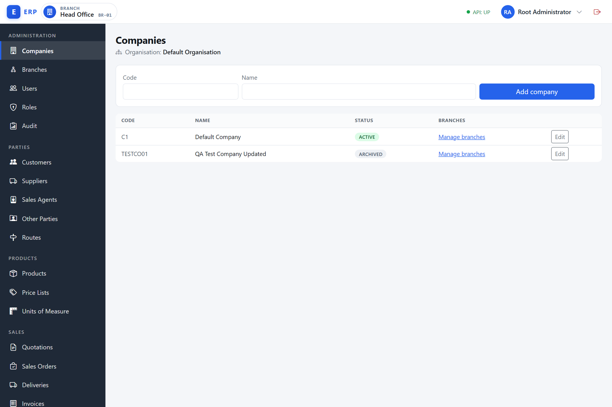
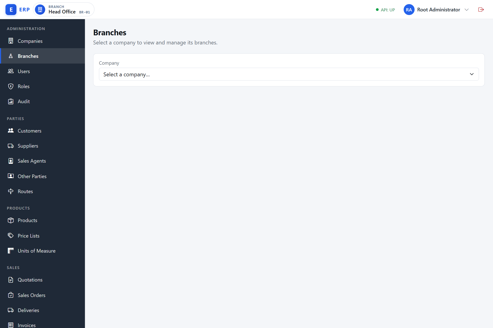
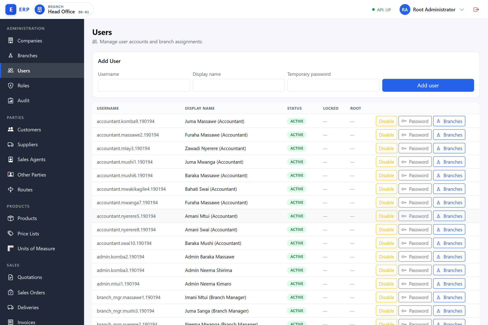
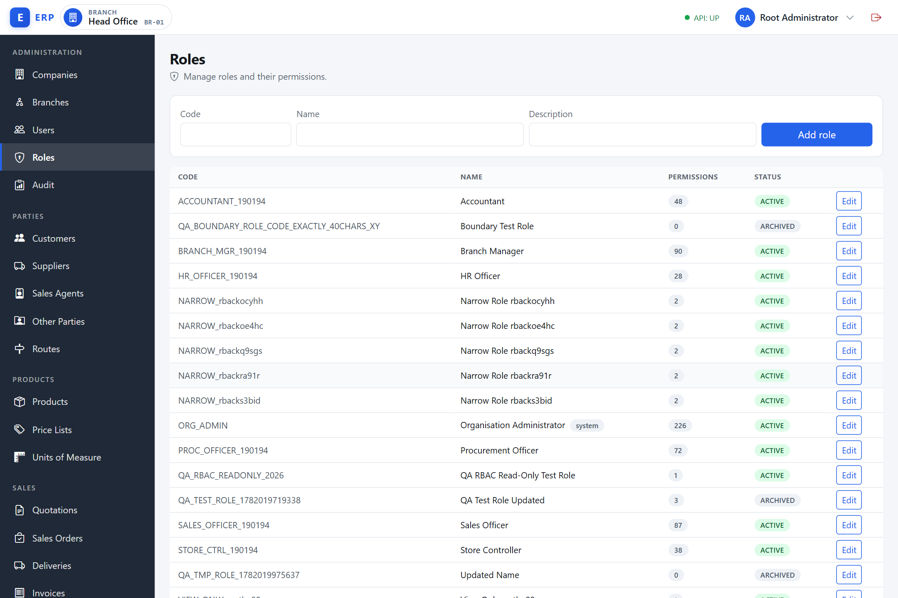
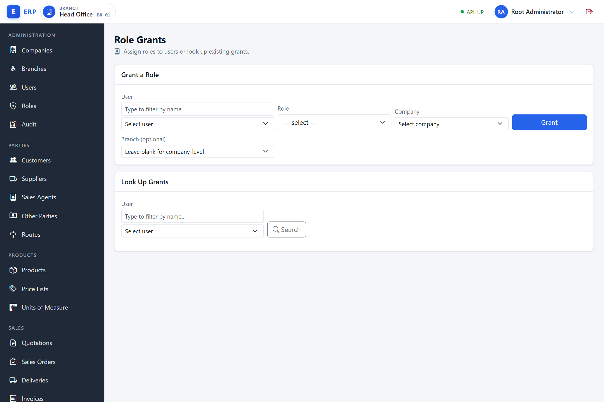
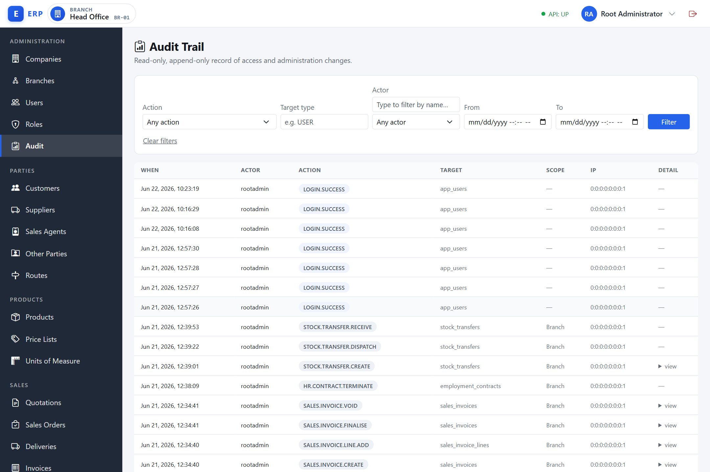

# Administration and Access

This chapter is for administrators — typically users who hold the **ORG_ADMIN** role. It covers how to set up the organisation hierarchy (companies and branches), manage user accounts, define roles and their permissions, assign roles and branches to users, and review the audit trail.

> **Permissions required.** You need specific permissions for each section below. If a menu item or button is not visible to you, your role does not include that permission. See the table in each section.

> **The sidebar adapts to your permissions.** Navigation items you cannot use are hidden, and a navigation group whose every item is hidden disappears entirely — you will never see an empty group header. If a whole section of this chapter seems to be missing from your sidebar, your role lacks the permissions for it.

---

## Organisation, Companies, and Branches

**What the three-level hierarchy is.** The system is structured in three nested levels. An **organisation** is the top-level entity representing your entire business group — think of it as the holding entity that owns everything else. A **company** is a distinct legal entity under the organisation (for example, a registered limited company or a subsidiary with its own tax ID). A **branch** is a physical or logical operating unit under a company — a shop, warehouse, regional office, or cost centre.

**Why this structure exists.** Different businesses have different legal and operational structures. A retail chain might operate a single registered company with many store branches. A group of businesses might operate several legally distinct companies sharing one ERP platform. Separating these levels allows each company to have its own data, its own base currency, and its own set of branches, while all of them are administered through one system.

**When each level matters.**
- The organisation is set up once during deployment and is resolved automatically — you never need to type an organisation identifier.
- Companies are created by an administrator with `COMPANY.MANAGE` permission, typically during the initial rollout or when a new legal entity is formed.
- Branches are created whenever a new location or operating unit is needed.

**How the levels connect.** Every transaction in the system is tagged with the branch it was performed in. A branch belongs to exactly one company, and from there the company's base currency, fiscal calendar, and legal details apply. A user's session is always scoped to an active branch; switching branches changes the company context as well (the active company is always the company that owns the active branch).

The system is structured in three levels:

- **Organisation** — the top-level entity representing your business group. It is configured by IT during deployment and is resolved automatically; you never type an organisation ID.
- **Company** — a legal entity under the organisation (for example, a registered company or subsidiary). Each company has its own data.
- **Branch** — a physical or logical office, store, or cost centre under a company. Transactions are scoped to a branch.

### Viewing companies

**Required permission:** `COMPANY.VIEW`

Navigate to **Administration › Companies** (`/admin/companies`) in the sidebar.

The list shows each company's code, name, status (Active or Archived), and a **Manage branches** link in the last column. Above the list, the organisation name for this deployment is shown. The list is scoped to your access: a **root administrator** sees every company in the organisation, while everyone else (even holders of `COMPANY.VIEW`) sees only the companies they belong to — those they are assigned to via company membership, a branch, or a role. This keeps the company list from revealing companies you have no access to.

> The Companies screen is intentionally lean: it lets you create a company (code and name), rename it inline (see below), re-provision its default data (see below), and open each company's branches. There is no separate company detail screen — the company code can never be changed after creation.

### Creating a company

**What a company record is.** A company record represents one legal entity — a separately registered business with its own identity, tax registration, and (optionally) its own functional currency. Creating a company in the system establishes the container under which that entity's branches, users, and transactions will live.

**Why you would create one.** You create a new company when a new legal entity joins your group, or when you first deploy the system and need to register your existing companies. Without at least one company, no branches can exist and no users can be assigned a working context.

**Required permission:** `COMPANY.MANAGE`

The create form is an inline card at the top of the Companies list (it appears only if you hold `COMPANY.MANAGE`).

1. On the Companies list, in the create card fill in:
   - **Code** — a short, unique code. Cannot be changed after creation.
   - **Name** — the company display name.
2. Click **Add company**.

The new company appears in the list with status **Active**. The organisation is resolved automatically; you do not choose it. Code and name are the only fields you enter — there is no Legal Name, Tax ID, or Timezone field on this screen.

> A duplicate code is rejected with a conflict (409) error shown beneath the form.

### Renaming a company

**When to rename.** The system ships with a seeded **Default Company**. When you go live you will usually want to give it your real trading name. Renaming lets you correct that — and any later name change — without touching the code (which stays fixed forever).

**Required permission:** `COMPANY.MANAGE`

Each company row carries an **Edit** button (it appears only if you hold `COMPANY.MANAGE` — a view-only user with only `COMPANY.VIEW` sees no Edit control). To rename a company:

1. On the Companies list, click **Edit** on the company's row. The Name cell turns into an editable text box.
2. Type the new name.
3. Click **Save** to keep the change, or **Cancel** to discard it.

Only the name changes — the code, status, and other attributes are untouched. There is no Archive control on the Companies list. (Archiving exists in the underlying API but is not exposed in the admin UI.)

### Provisioning a company's default data

**What "Provision defaults" does.** A newly created company is automatically seeded, in the same transaction as its creation, with the baseline operational and reference data every module expects to find — default tax rates, GL accounts, units of measure, enabled currencies, and the like. **Provision defaults** re-runs that same seeding for an existing company, on demand. It is idempotent: anything the company already has is left alone — the action only fills in whatever is missing.

**When to use it.** Use it if a company is missing expected reference data — for example, a company created before automatic provisioning existed, one whose original provisioning only partially completed, or one you simply want to heal after noticing a gap (a missing tax rate, an unset default account). It is safe to click on a company that is already fully provisioned; nothing is duplicated.

**Required permission:** `COMPANY.MANAGE`

Each company row carries a **Provision defaults** button alongside **Edit** (visible only if you hold `COMPANY.MANAGE`).

1. On the Companies list, click **Provision defaults** on the company's row.
2. Confirm the prompt — *"Restore the default setup (tax rates, accounts, units, …) for "\<company name\>"?"*.
3. The button switches to **Provisioning…** while the request is in flight. The Provision-defaults and Edit actions are interlocked across the **whole** company list, not per row: while any row is being renamed the **Provision defaults** button is disabled on every row, and while a Provision-defaults request is in flight **Edit** is disabled on every row.
4. On success, a confirmation alert ("Default setup restored") appears. On failure, an error alert explains what went wrong.

---

### Viewing branches

**Required permission:** `BRANCH.VIEW`

There are two ways to reach a company's branch list:

- **From the sidebar.** Navigate to **Administration › Branches** (`/admin/branches`). This standalone page is reachable with `BRANCH.VIEW` alone — you do not need `COMPANY.VIEW`. It first shows a **Company** picker listing only the companies you can act in; choose one to load its branches. If you can act in exactly one company, the page selects it for you automatically and goes straight to that company's branch list.
- **From the Companies screen.** Navigate to **Administration › Companies** (`/admin/companies`), then click the **Manage branches** link on the company's row to open its branch list at `/admin/companies/<companyUid>/branches`. (This path requires `COMPANY.VIEW` to reach the Companies screen.)

Either way, the branch list shows each branch's code, name, default flag, and status.

### Creating a branch

**What a branch record is.** A branch is the smallest organisational unit in the system. It represents one operating location or logical division — a physical store, a warehouse, a regional sales office, or an accounting department. Every transaction (a sales invoice, a goods receipt, a payment) is tagged to the branch that was active when it was created.

**Why branches exist.** Without branches, all transactions for a company would be lumped together with no way to separate one location's performance from another's. Branches let management analyse stock levels by store, compare revenue by region, control what each staff member can see and do (a storekeeper at one branch cannot access another branch's data), and ensure that GL postings land in the right cost centre.

**When to create one.** Create a branch when a new physical location opens, when a new department or cost centre is established, or during initial setup to represent your existing offices and stores.

**How a branch interacts with users.** A user must be assigned to at least one branch to have an active session. One of their assigned branches is marked as their **default branch** — this is the branch that activates automatically on login. A user can be assigned to many branches and can switch between them during a session without logging out.

**Required permission:** `BRANCH.MANAGE`

The create form is an inline card at the top of the branch list.

1. From the branch list of a company, in the create card fill in:
   - **Code** — a unique code within this company.
   - **Name** — the branch display name.
   - **Set as default** — check this to make the new branch the company's default branch. If another branch was already the default, that branch's default flag is cleared automatically.
2. Click **Add branch**.

There is no Timezone field on the form — branches inherit the company's settings.

### Setting the company default branch

**What the company default branch is.** Each company has exactly one branch flagged as its default. This default is the branch that new users in this company start in when they have no personal default of their own, and it is used by the system in contexts where a company-level default is needed (for example, documents that auto-populate a branch).

**Why only one default per company.** Having more than one "default" is ambiguous — the system would not know which one to apply. The uniqueness rule (enforced at the database level) ensures there is always one unambiguous answer.

Only one branch per company can be the default. The default branch is the one users are taken to on login when no other preference is active.

1. On the branch list, find the branch you want to make default.
2. Click **Make default** on that row.

The current default branch shows a **Default** status tag instead of a button. The previously default branch is cleared automatically.

### Renaming a branch

**When to rename.** A new deployment seeds a **Head Office** branch. Rename it (and any other branch) to match how your locations are actually called — a store name, a depot, a regional office. As with companies, the code is fixed at creation; only the name can change.

**Required permission:** `BRANCH.MANAGE`

Each branch row carries an **Edit** button (it appears only if you hold `BRANCH.MANAGE` — a view-only user with only `BRANCH.VIEW` sees no Edit control). To rename a branch:

1. On the branch list, click **Edit** on the branch's row. The Name cell turns into an editable text box.
2. Type the new name.
3. Click **Save** to keep the change, or **Cancel** to discard it.

### Archiving a branch

A branch's code is fixed at creation; the per-row actions are **Edit** (rename), **Make default**, and **Archive**.

To archive a branch, click **Archive** on its row. The branch status changes to **Archived** and it is removed from branch-selector lists. Any users whose default was this branch will lose their active branch on next login.

> The current default branch cannot be archived directly — its row shows the **Default** tag and no Archive button. Make another branch the default first, then archive the former default.

---

## Users

**What a user account is.** A user account is a named login identity in the system. It consists of a username (the login name), a display name (shown in the interface and in audit logs), a password, and optional contact details (email, phone). A user is an organisation-wide record — the same account can be active in multiple companies, though its permissions depend on which company and branch it is working in at any given moment.

**Why user accounts exist.** Shared logins (for example, a single "accountant" password passed around the team) make audit trails meaningless — the log shows "accountant did X" and you cannot know who actually did it. Named individual accounts mean every action is attributable to a real person, accounts can be individually disabled without disrupting others, and each person can be given exactly the permissions their job requires.

**When to create a user.** Create a user when a new employee joins, when a contractor needs access, or when a role needs an automated service account. If you create the user while acting as a non-root company administrator, the system automatically makes the new user a member of your active company in the same step — you do not need a separate action for this common case. You then still need to assign at least one branch and grant at least one role; a user with no branches and no roles can log in but will see no menu and have no active branch. (The `rootadmin` account has no single active company, so a user created while signed in as root is left with no company membership — assign one explicitly first; see [Assigning Companies to Users](#assigning-companies-to-users).) Branches and roles can only be assigned within a company the user already belongs to.

**How the user lifecycle works.** A user starts `ACTIVE`. An administrator can `DISABLE` the account (status becomes `INACTIVE`) to prevent login while preserving the account and its history — for example, during a leave of absence or pending investigation. `ENABLE` restores it to `ACTIVE`. The `rootadmin` account cannot be disabled. If too many wrong-password attempts are made, the account is automatically locked for 15 minutes; an administrator can clear this with **Unlock**. User accounts are never hard-deleted.

**Required permission to view:** `USER.VIEW`
**Required permission to create/edit/disable/unlock/reset password:** `USER.MANAGE`

Navigate to **Administration › Users** (`/admin/users`) in the sidebar.

### The users list

The list shows columns for **Username**, **Display name**, **Status**, **Locked**, and **Root** (a marker on the `rootadmin` account), plus a per-row action area. The actions on each row are **Disable**/**Enable**, **Unlock** (only when the account is locked), **Password** (an inline set-password form), and **Assignments** (a link that opens the user's Assignments page at `/admin/users/uid/<uid>`, where you manage the user's companies, branches, and roles). Root accounts do not show a Disable action.

The list is scoped to your access: a **root administrator** sees every user in the organisation, while everyone else sees only the (non-root) users who are members of their active company — including any user they have just created, since creating a user makes it a member of the creator's active company automatically (see below, and [Assigning Companies to Users](#assigning-companies-to-users)).

### Creating a user

The create form is an inline card (**Add User**) at the top of the Users list.

1. On the Users list, in the **Add User** card fill in:
   - **Username** — must be unique. Stored in lowercase. May contain only letters, digits, dots (`.`), underscores (`_`), and hyphens (`-`); spaces and other characters are rejected. Up to 80 characters.
   - **Display name** — the name shown in the UI. Up to 160 characters.
   - **Temporary password** — must be at least 8 characters and contain at least one letter and one number. Common passwords (such as `password1` or `admin123`) are rejected.
2. Click **Add user**.

The user is created with status **Active** and no role or branch assignments. The create form captures only the username, display name, and temporary password — there are no email or phone fields here. Assign roles and branches next (see below). If you created the user while acting as a non-root administrator, the user is also automatically made a member of your active company — no separate step is needed, and the user immediately appears in your Users list.

> Usernames are compared case-insensitively. `Alice.Smith` and `alice.smith` refer to the same account. Creating a user whose username already exists is rejected with a conflict (409) error.

### Disabling and enabling a user

- **Disable** — click **Disable** on the user's row. The user's persisted status changes to **Inactive** and they can no longer sign in. The account and its history are preserved. (Immediately after you click, the row may briefly show **Disabled** as an optimistic in-memory label; on the next refresh it settles to the stored **Inactive** status.)
- **Enable** — click **Enable** on the row to restore the user to **Active** status.

The **rootadmin** account cannot be disabled.

### Unlocking a locked account

**What account locking is.** After 5 consecutive wrong-password attempts, the system locks the account for 15 minutes — a security measure to slow down automated guessing attacks. While locked, even the correct password is rejected and the user sees a specific message.

**When to unlock manually.** If a user cannot wait 15 minutes (for example, during a time-sensitive business operation), an administrator with `USER.MANAGE` can clear the lockout immediately. The failed-attempt counter resets on unlock.

If a user has been locked out after too many failed sign-in attempts, a locked indicator appears on their row. Click **Unlock** to clear the lockout. The user can then sign in again with the correct password.

### Resetting a user's password

**When to reset.** Reset a password when a user forgets theirs, when you suspect a password has been compromised, or when a new user needs to change the temporary password set on account creation.

1. On the Users list, click **Password** on the user's row to expand the inline set-password form.
2. Enter a new password that meets the policy (at least 8 characters, at least one letter and one number, not a common password).
3. Click **Save**.

The user can sign in immediately with the new password. Passwords are never stored in plain text and are not shown in audit logs.

### The user Assignments page

Click **Assignments** on a user's row to open their Assignments page (`/admin/users/uid/<uid>`). This page shows a **read-only header** (username, display name, and status, locked, and root tags) followed by three management cards in order: **Companies**, **Branch Assignments**, and **Role Assignments** (see the sections below). It does not contain a form for editing display name, email, or phone — there is no contact-details edit screen in the current interface.

> **Assign a company first.** Company membership is the prerequisite for the other two cards. Until the user belongs to at least one company, the Branch and Role cards show a hint to assign a company first, and their company pickers are empty. Once you assign a company, that company becomes selectable when assigning the user's branches and roles. (See [Assigning Companies to Users](#assigning-companies-to-users) below.)

---

## Roles

**What a role is.** A role is a named, reusable bundle of permissions. For example, an `ACCOUNTANT` role might include permissions such as `GL.POST`, `AR.VIEW`, `AP.BILL.ENTER`, and `CASH.RECONCILE`. Once defined, the role can be granted to any number of users. If the business needs to change what accountants can do, the administrator updates the role once and the change takes effect for every holder immediately.

**Why roles exist — RBAC.** This design is called Role-Based Access Control (RBAC). It exists because managing permissions per-user does not scale: a company with 50 staff and over 220 permission codes would require thousands of individual permission grants, each needing manual maintenance. With roles you manage a small set of job functions, not a large matrix of individual grants. RBAC also makes compliance simpler: you can demonstrate to an auditor exactly which capabilities any given role confers.

**When roles are created.** Roles are created during initial setup (to match the job functions in your organisation) and updated whenever those functions evolve. A small set of **system roles** (such as `ORG_ADMIN`) are seeded during deployment and cannot be archived; custom roles can be freely created and modified.

**How a role's permissions take effect.** When a role's permission set is saved, the system invalidates its permission cache. Users who hold the role see the change on their very next request — there is no need to log out and back in.

**The effective permission set.** A user may hold multiple roles. Their effective permissions at any moment are the **union** of all permissions from all their active role grants in the current company and branch context. If Role A grants `GL.VIEW` and Role B grants `GL.POST`, a user with both roles has both.

**Required permission to view:** `ROLE.VIEW`
**Required permission to create / edit / set permissions:** `ROLE.ADMIN` (the role catalogue itself is guarded by `ROLE.ADMIN`; the separate `ROLE.MANAGE` permission governs assigning existing roles to users — see *Assigning Roles to Users* below)

Navigate to **Administration › Roles** (`/admin/roles`) in the sidebar.

Roles are named bundles of permissions. A user can be granted one or more roles; the effective permissions are the union of all granted roles in the active branch context.

### The roles list

The list shows each role's code, name, a permission count, and its status, plus a marker on **system** roles (pre-defined and cannot be archived). The code and name cells are plain text — they are not clickable. To open a role's edit page at `/admin/roles/uid/<uid>`, click the **Edit** button in the row's actions column.

### Creating a role

The create form is an inline card at the top of the Roles list.

1. In the create card, fill in:
   - **Code** — a short identifier, unique within the organisation. Cannot be changed after creation.
   - **Name** — a human-readable label.
   - **Description** — optional notes.
2. Click **Add role**.

The new role is created with no permissions. Assign permissions next.

> A duplicate role code is rejected with a conflict (409) error.

### Editing a role's name or description

Open the role's edit page (`/admin/roles/uid/<uid>`) and update the name or description fields, then click **Save details**. The code cannot be changed.

### Setting a role's permissions

**What the permission catalogue is.** A permission is the finest-grained unit of access control in the system — a named capability that says "the holder may perform this specific action." Permissions are grouped by module (for example, all `GL.*` permissions belong to the General Ledger module). The full catalogue contains over 220 codes covering every module.

> **System roles cannot have their permissions changed.** Built-in system roles (such as **ORG_ADMIN**) are marked with a notice on their edit page — *"This is a built-in system role. The code cannot be changed."* Their permission set is fixed: attempting to save a changed permission selection on a system role is rejected with a conflict (409) error (*"System role permissions cannot be modified"*). Only custom roles can have their permissions edited.

**How the "replace" save works.** When you click **Save permissions**, the system replaces the role's entire permission set with exactly the codes you have checked. Unchecking a box removes that permission. This means saving an empty selection leaves the role with no permissions — which is valid and means the role grants no access.

On the role edit page, the permissions panel lists every available permission grouped by module (for example, **iam**, **sales**, **accounting**).

1. Check the boxes for the permissions this role should have.
2. Uncheck any permissions to remove them.
3. Click **Save permissions**.

Saving replaces the role's entire permission set with the checked selections. Removing a permission takes effect for users who hold this role on their next request (the system re-resolves permissions promptly after changes).

> The permission catalogue contains over 220 codes across all modules. An empty permission set is valid — it means the role grants no access.

### Read-closure advisory

**What it is.** Below the Permissions card, the role edit page can show a **Read-closure advisory** panel. It flags screens the role's checked permissions let a user *open* (because the role holds that screen's primary action permission) where the role is still missing one or more supporting **read** permissions the same screen needs on load — for example, a role that can create a sales order but was not also given the customer and product picker reads. The panel is advisory only: it never blocks **Save permissions**, and saving an incomplete selection is always allowed.

**Why it exists.** A screen's primary action and its reference-data pickers are separate permission checks. Without this advisory, a role that is missing a picker's read looks complete to the administrator composing it (everything saves without error) but a real user holding only that role hits a partial, confusing block once they open the screen — the button they can see, but a supporting dropdown 403s. Testing as `rootadmin` never reveals this, because root holds every permission. The advisory surfaces the gap to the administrator at grant time instead.

**When you see it.** The panel appears automatically on the role edit page (`/admin/roles/uid/<uid>`) whenever the role's current permission set leaves at least one reachable screen with a missing required read; it is empty and hidden otherwise. It refreshes each time you click **Save permissions**, so you can immediately confirm a fix.

Each gap reads in the form:

> This role can open **\<screen name\>** but is missing `<CODE>`, `<CODE>` — users with only this role will be blocked on that screen.

Grant the listed codes on the Permissions panel above and click **Save permissions** again to clear the gap.

### Archiving a role

There is no Archive control in the current interface. The role edit page offers only **Save details** and **Save permissions**, and the roles list has no Archive action — its only per-row action is **Edit**. (Archiving exists in the underlying API but is not exposed in the admin UI; system roles such as **ORG_ADMIN** cannot be archived in any case.)

---

## Assigning Companies to Users

**What company membership is.** Company membership is an explicit record that a user belongs to a specific company. It is the foundation of a user's access: before a user can be given any branch or role in a company, they must first be made a member of that company. A user can be a member of several companies.

**Why membership is required first (assign-company-first).** Tying branch and role assignment to an explicit company membership makes "which companies is this person part of?" a single, deliberate decision rather than a side effect of the first role grant. It also keeps the company pickers on the Branches and Roles cards focused — they list only the companies the user actually belongs to, so you cannot accidentally grant access in the wrong company.

**When to assign a company.** A non-root administrator's active company is assigned automatically the moment they create the user (see [Creating a user](#creating-a-user)), so you will usually only need this screen when a user created by `rootadmin` needs their first company, or whenever an existing user takes on responsibilities in an additional company.

**How removal is protected.** You cannot remove a user's company membership while they still hold any branch assignment or role grant in that company — the system blocks it with a message asking you to remove those first. This prevents leaving a user with branches or roles in a company they are no longer a member of.

**Required permission:** `USER.COMPANY.MANAGE`

> The **Companies** card appears on every user's Assignments page, but the **Assign company** and **Remove** controls are shown only to administrators who hold `USER.COMPANY.MANAGE`. Other administrators can see which companies a user belongs to but cannot change them.

### Assigning a user to a company

1. Open the user's Assignments page (**Assignments** on the user's row in **Administration › Users**).
2. In the **Companies** card, choose a company from the **Assign Company** picker. (Root and full administrators can choose any company in the organisation; other administrators choose from the companies they can act in.)
3. Click **Assign**.

The company appears in the user's Companies list. Its branches and roles can now be assigned in the cards below.

### Removing a company membership

In the **Companies** card, click **Remove** on the company's row.

- If the user still has any branch assignment or role grant in that company, the removal is **rejected** — remove those branches and roles first (see the two sections below).
- Otherwise the membership is removed. The user is no longer a member of that company and can be re-assigned later if needed.

---

## Assigning Roles to Users

**What a role grant is.** A role grant is a record that links a specific user to a specific role, scoped to a company and optionally to a single branch. It is not a permanent property of the user; it is an explicit, revocable assignment. A user can hold many grants, and each grant has its own scope.

**Why grants are scoped to a company (and optionally a branch).** A user might be an accountant in the Head Office branch and a read-only viewer in the Mwanza branch. Scoping the grant to a company-and-branch means the right permissions apply in the right context. A company-wide grant (no branch restriction) gives the role's permissions in every branch of that company. A branch-scoped grant gives those permissions only when the user is active in that specific branch.

**When to grant a role.** After creating a new user, before they can do meaningful work. Also when an existing user takes on new responsibilities. Role grants take effect immediately on the user's next request — no re-login required.

**How revocation works.** Revoking a grant marks it as revoked (the record is kept for audit purposes) and removes its permissions from the user's effective set immediately. The user's currently open session will lose those permissions on their next request.

**Required permission:** `ROLE.MANAGE`

Navigate to **Administration › Role Grants** (`/admin/role-grants`) in the sidebar.

This screen lets you grant a role to a user for a specific company, optionally restricted to a single branch.

> You can also manage one user's role grants directly from their Assignments page. The **Role Assignments** card on `/admin/users/uid/<uid>` (reached via **Assignments** on the user's row) has the same **Grant Role** form (Role, Company, optional Branch) and a per-row **Revoke** action, scoped to that single user. On this card the **Company** picker lists only the companies the user is a member of (see [Assigning Companies to Users](#assigning-companies-to-users)).

> **Company membership is required.** A role can only be granted in a company the user already belongs to. If the user is not yet a member of the target company, assign the company first — otherwise the grant is rejected. (On the user's Assignments page the Role card simply will not offer a company the user does not belong to.)

### Granting a role

1. On the Role Grants screen (`/admin/role-grants`), choose the **User** in the picker (placeholder *Select user*).
2. Choose the **Role** from the dropdown — each option is shown as `code — name` (for example `ACCOUNTANT — Accountant`).
3. Choose the **Company** in the picker. It starts empty (placeholder *Select company*) and is required — there is no default company; you must pick one.
4. Optionally choose a **Branch** to restrict the grant to one branch. Leave it blank (the picker reads *Leave blank for company-level*) to grant the role across all branches of that company.
5. Click **Grant**.

The grant appears in the grants list. The user's effective permissions update on their next request.

> You can only grant roles within a company you are active in. The `rootadmin` account can grant across companies.

### Revoking a role grant

On the Role Grants screen, look up the user's current grants by selecting their name. Each active grant is listed. Click **Revoke** on the grant row you want to remove.

The grant is revoked immediately. The user loses those permissions on their next request.

> Revoking a grant that was already revoked is a no-op.

---

## Assigning Branches to Users

**What a branch assignment is.** A branch assignment is a record that links a user to a specific branch, granting them the ability to switch to that branch and operate within it. Without at least one branch assignment, a user has no active branch after login and can only view limited screens.

**Why branch assignments are separate from role grants.** Branch access (which branches you can switch to) and permission access (what you can do in each branch) are two different concerns that can be managed independently. You might assign a user to a branch for data-visibility reasons without granting them any elevated permissions there, or you might grant a company-wide role that applies to all branches simultaneously while still controlling which branches the user can physically switch to.

**The default branch rule.** Each user has exactly one default branch — the branch that becomes active on login. The system enforces this at the database level: you cannot have two defaults for the same user simultaneously. If you set a new default, the previous one is cleared automatically. If a user's default branch is removed or archived, the system automatically promotes the earliest-assigned remaining branch as the new default. If no branches remain, the user has no active branch (read-only session) until an administrator assigns one.

**When to use "Make default".** Tick **Make default** when assigning the branch that should be this user's primary working location — typically their home branch or the branch they will use most often. You can change the default at any time.

**Required permission to view branch assignments:** `USER.VIEW`
**Required permission to assign / change default / remove:** `BRANCH.ASSIGN`

Branch assignments control which branches a user can switch to and which data they can access. Open a user's Assignments page (`/admin/users/uid/<uid>`) by clicking **Assignments** on the user's row in the **Administration › Users** (`/admin/users`) list. A branch can only be assigned within a company the user is already a member of (see [Assigning Companies to Users](#assigning-companies-to-users)).

### Assigning a user to a branch

1. On the user's Assignments page, find the **Branch Assignments** card.
2. Choose the **Company** by name. The picker lists only the companies this user is a member of — if the company you want is not listed, assign it first in the **Companies** card above.
3. Once a company is selected, the **Branch** picker loads that company's branches. Choose one by name.
4. Check **Make default** if you want this branch to become the user's new default.
5. Click **Assign**.

The branch appears in the user's assignments list. If **Make default** was checked and the user already had a different default branch, the old default is cleared automatically — a user can only have one default at a time.

### Changing the default branch

In the user's branch assignments list, click **Set Default** on the row for the branch you want to make default. The previous default is cleared automatically.

### Removing a branch assignment

Click **Remove** on the assignment row. If you remove the user's current default branch:

- If other branches remain, the system automatically promotes the earliest-assigned remaining branch as the new default.
- If no branches remain, the user will have no active branch on their next login (read-only session).

> You can only assign or remove branches within a company you are active in.

---

**Example — Create the ACCOUNTANT role and assign it to a new user scoped to the Head Office branch**

This example walks through the complete new-staff onboarding flow for Amina Juma, who joins as an accountant at the Head Office branch of Orbix Trading Co.

**Step 1 — Create the role (if it does not already exist)**

1. Navigate to **Administration › Roles** (`/admin/roles`).
2. In the create card, enter Code `ACCOUNTANT`, Name `Accountant`, Description `GL posting, AR, AP, Cash & Bank, Tax`.
3. Click **Add role**. The role is created with no permissions.
4. Click **Edit** on the `ACCOUNTANT` row to open `/admin/roles/uid/<uid>`.
5. In the permissions panel, check the following codes: `GL.VIEW`, `GL.POST`, `AR.VIEW`, `AR.RECEIPT.RECORD`, `AR.STATEMENT.VIEW`, `AP.VIEW`, `AP.BILL.ENTER`, `AP.PAYMENT.RUN`, `CASH.VIEW`, `CASH.ENTRY.RECORD`, `CASH.TRANSFER`, `CASH.RECONCILE`, `VAT.VIEW`, `TAXRATE.VIEW`, `REPORT.PL.VIEW`, `REPORT.BS.VIEW`, `REPORT.CASHFLOW.VIEW`, `REPORT.LEDGER.VIEW`.
6. Click **Save permissions**. The panel refreshes showing 18 of the total codes selected.

**Step 2 — Create the user account**

1. Navigate to **Administration › Users** (`/admin/users`).
2. In the **Add User** card, enter Username `amina.juma`, Display name `Amina Juma`, Temporary password `Amina2024#`.
3. Click **Add user**. The row appears with status **Active**. (Email and phone are not collected on this form.)

**Step 3 — Assign the Head Office branch**

1. Click **Branches** on Amina Juma's row to open `/admin/users/uid/<uid>`.
2. In the **Branch Assignments** panel, select Company `Orbix Trading Co.`, Branch `HO — Head Office`.
3. Check **Make default**.
4. Click **Assign**. The branch appears in the list marked as default.

**Step 4 — Grant the ACCOUNTANT role**

1. Navigate to **Administration › Role Grants** (`/admin/role-grants`).
2. Select User `Amina Juma`, Role `ACCOUNTANT`, Company `Orbix Trading Co.`, Branch `HO — Head Office`.
3. Click **Grant**. The grant row appears immediately.

**Step 5 — Verify**

1. Navigate to **Administration › Audit** (`/admin/audit`).
2. Filter by Actor `rootadmin` (or whichever admin performed these steps). Confirm five audit entries: `ROLE.CREATE` and `ROLE.PERMISSIONS_SET` (Step 1), `USER.CREATE` (Step 2), `BRANCH.ASSIGN` (Step 3), and `ROLE.GRANT` (Step 4).
3. Sign in as `amina.juma` / `Amina2024#`. Confirm the **Accounting** sidebar group is visible and items such as **Chart of Accounts** (`/admin/gl/accounts`) and **Payables** (`/admin/ap/supplier-bills`) are accessible.

---

## Audit Trail

**What the audit trail is.** The audit trail is a chronological, append-only log of every significant action performed in the system. Each record captures who did it (the actor), what they did (the action code), which record was affected (the target), in which company and branch, and when. It cannot be edited, backdated, or deleted — not even by `rootadmin`.

**Why it exists.** The audit trail serves several business and legal purposes. It creates accountability: every change to a user account, every permission grant, every password reset has a named, timestamped owner. It supports security investigations: if an account is suspected of misuse, the audit log shows exactly what actions it took and when. It satisfies compliance requirements: many financial regulations require evidence that access controls were applied and that privilege changes were authorised.

**When audit records are written.** Every create, update, status change (such as enabling or disabling a user), role grant, and role revocation generates an audit record. Login successes, failures, and lockout events are also recorded. Actions by `rootadmin` that cross company boundaries produce an additional `ROOT.BYPASS` record. Audit records are written in the same database transaction as the action they record — if the action rolls back, the audit record rolls back with it.

**What is and is not recorded.** Action codes and target identifiers are always recorded. For profile-field edits (email, phone, display name) only the fact of the change is recorded — not the old or new values — to minimise personal data in the audit store. Passwords and token values are never recorded.

**Required permission:** `AUDIT.VIEW`

Navigate to **Administration › Audit** (`/admin/audit`) in the sidebar.

The audit trail is an append-only log of every significant action performed in the system — who did it, what they did, and when. It cannot be edited or deleted.

### What the audit trail records

Every create, update, state change (such as enabling or disabling a user), grant, and revoke generates an audit record. Records include:

- The **action** (for example, `USER.CREATE`, `ROLE.GRANT`, `BRANCH.UNASSIGN`). Action codes are dotted throughout.
- The **actor** — the username who performed the action (shown as *system* when there is no signed-in user).
- The **target** — the type of the affected record (for example `USER`, `user_branch`).
- The **timestamp** (date and time).
- For cross-company actions by `rootadmin`, a special `ROOT.BYPASS` entry is also recorded.

The audit list is a table with columns **When**, **Actor**, **Action**, **Target**, **Scope** (Company or Branch), **IP**, and **Detail** (an expandable *view* link for any extra context). It is paginated.

### Reviewing the audit log

1. Navigate to **Administration › Audit** (`/admin/audit`).
2. Use the filter bar at the top to narrow the results:
   - **Action** — a dropdown of known action codes (choose *Any action* for all).
   - **Target type** — a free-text field (for example `USER`).
   - **Actor** — a name picker that resolves to the chosen user.
   - **From** and **To** — a date-and-time range.
   Click **Filter** to apply, or **Clear filters** to reset.
3. The list shows the most recent events first. Use the pager to browse older records.

Audit records show the actor's username and the action and target *type* — not raw internal identifiers. Sensitive data (such as password hashes) is never included in audit details; for profile-field edits only the fact of the change is recorded, not the old or new values.

---

## Key Concepts Reference

### uid vs id — why records have two identifiers

**What they are.** Every record in the system carries two numeric identifiers. The `id` is an internal database sequence number used only for database-level joins between tables — you never see it in the interface or in URLs. The `uid` is a ULID (Universally Unique Lexicographically Sortable Identifier) — a 26-character string such as `01HY7FKMQ5T3V6NP8A2X4BQERD` — used in every URL and in every place where a record is referenced outside the database.

**Why two identifiers.** Sequential numeric IDs in URLs expose information about record counts (a competitor could learn how many orders you have by looking at the URL of the latest one). ULIDs are opaque and reveal nothing about volume or sequence. They are also time-sortable, collision-resistant, and URL-safe without encoding. The internal `id` remains for efficient database foreign-key joins, which are performance-sensitive. This duality is a deliberate design choice throughout the system.

**What this means for you.** You never need to know or type a uid. The system passes uids between pages in URLs automatically. When you pick a user, a branch, or a role by name in a form, the picker stores the uid in the background — the interface always works by name.

### Fiscal period

**What a fiscal period is.** A fiscal period is a defined accounting time window — typically a calendar month — within a financial year. Transactions (invoices, payments, journal entries) are posted to an open period; once a period is closed, historical records in it cannot be altered.

**Why fiscal periods matter.** They are the foundation of financial reporting: a profit-and-loss statement, a balance sheet, and a cash-flow report all aggregate transactions by period. Closing a period locks the numbers so that prior-period reports are stable and comparable. Without fiscal periods, a transaction entered late could silently change a figure that was already reported.

**When you interact with periods.** Accountants and finance managers interact with fiscal periods when posting journal entries, running period-end reports, and performing the year-end close. Transactions in operational modules (sales, purchases, inventory) automatically post to the current open period of the active branch's company.
