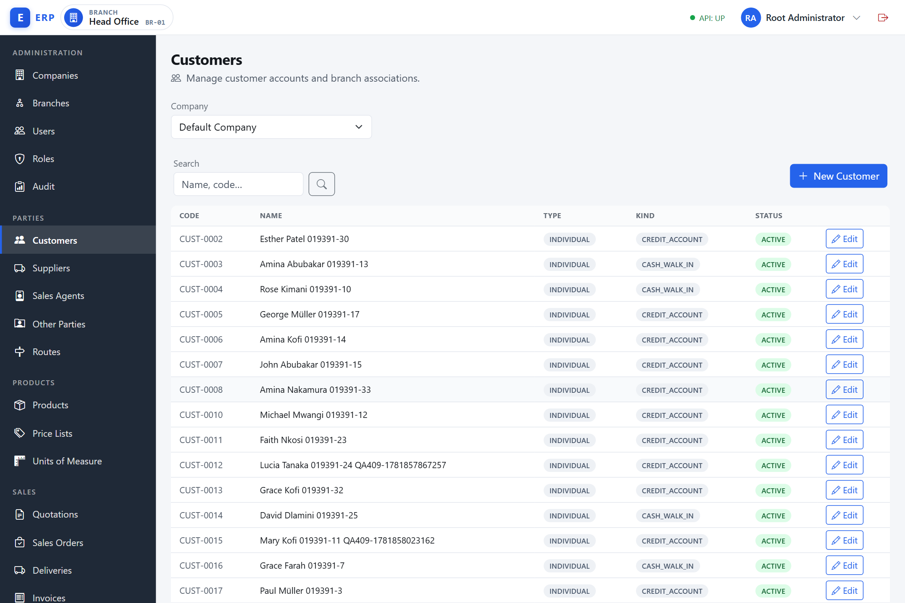
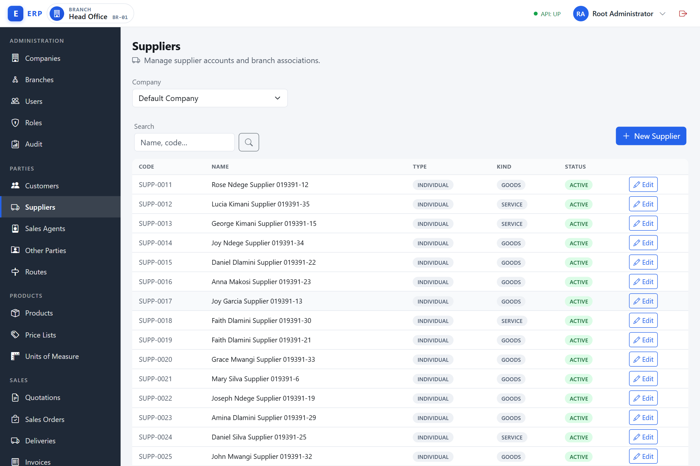
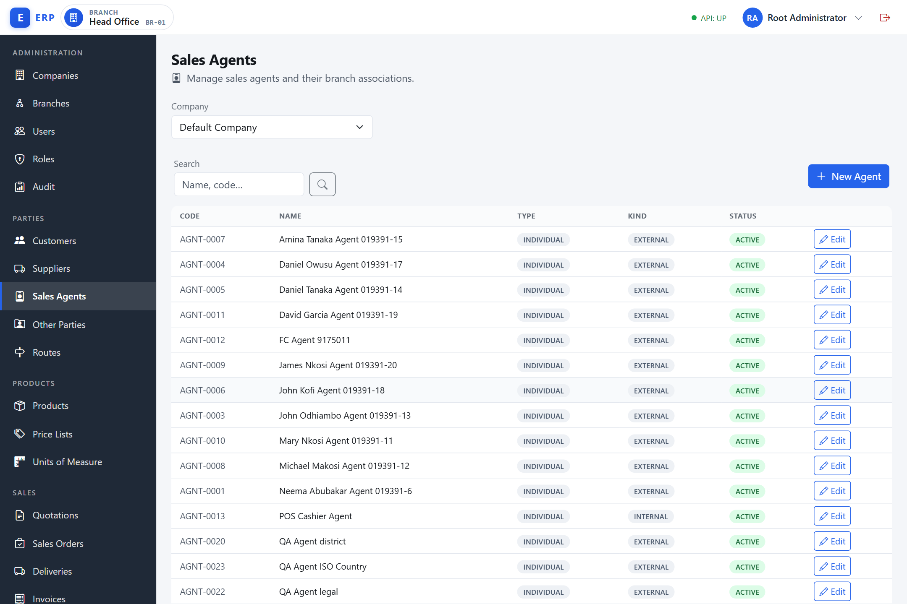
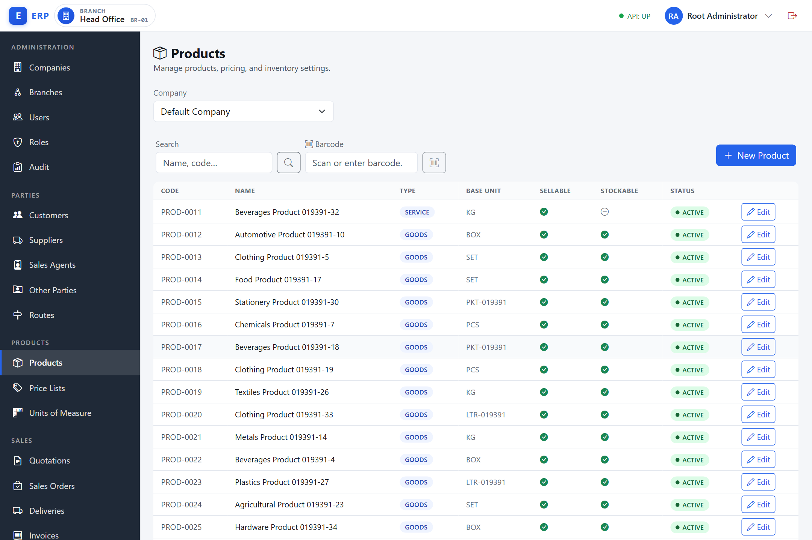
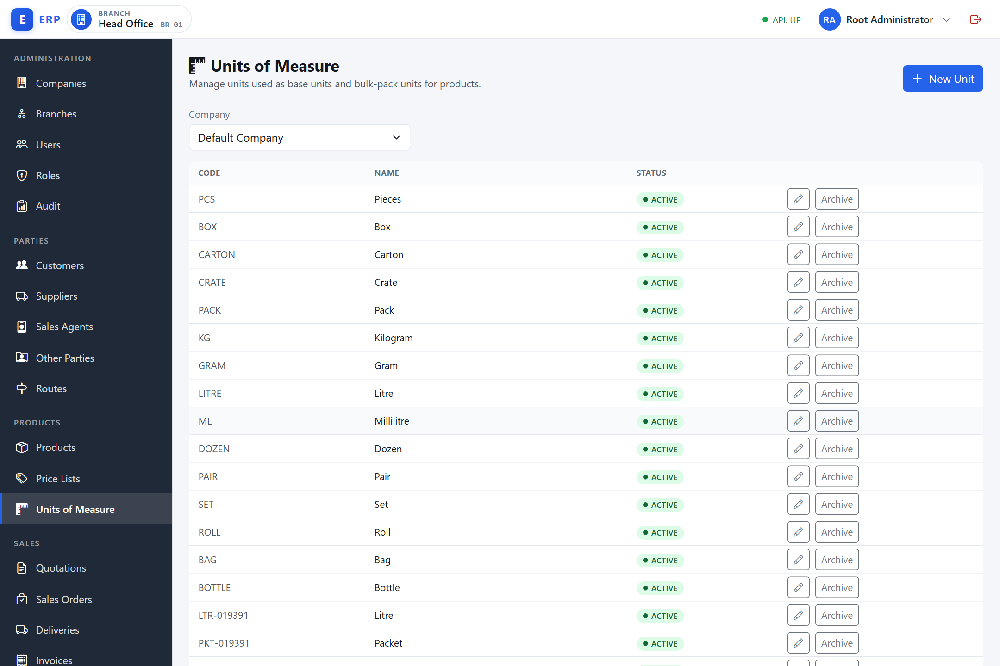
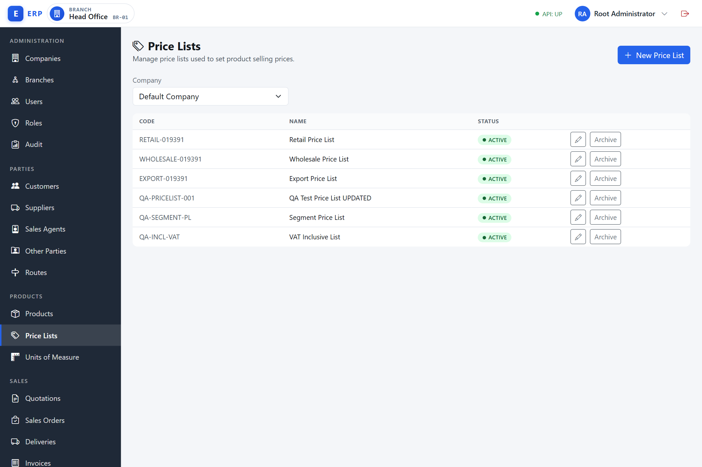
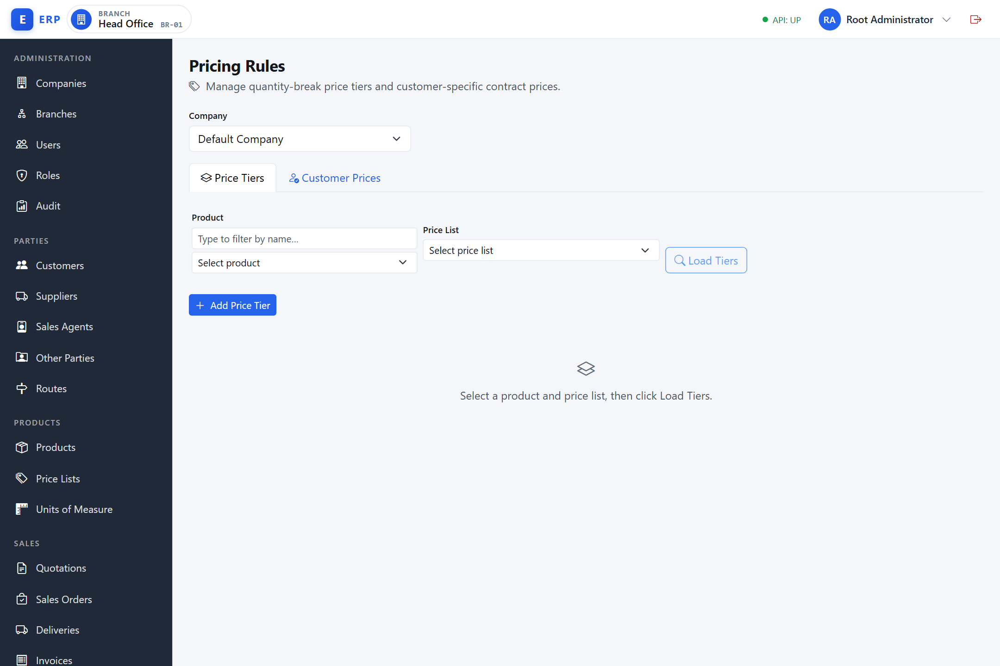
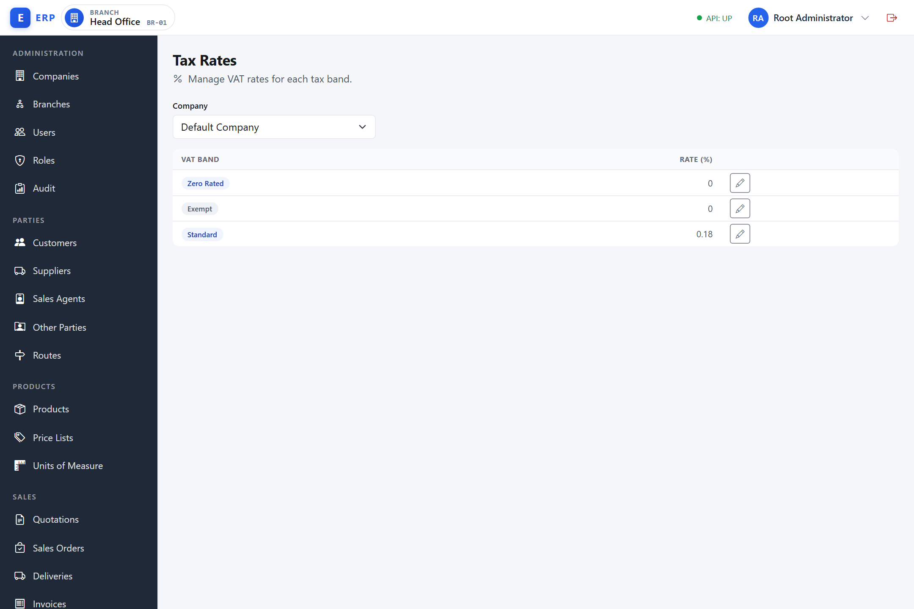
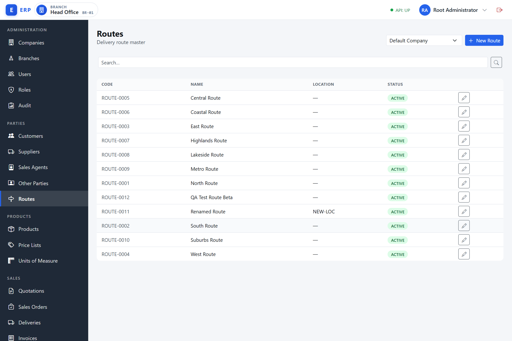

# Master Data

Master data is the reference information shared across the system: the parties you trade with, the products you sell or buy, the prices you charge, the currencies you transact in, the taxes you apply, and the routes your sales team covers. Set this up first; every transaction in Sales, Procurement, Inventory, and Finance depends on it.

All master data screens are under the **Admin** section of the navigation. Your access depends on the permissions assigned to your role — the sections below note which permission is required for each area.

---

## Customers

**Navigation:** **Parties › Customers** (`/admin/customers`) | **Permission to view:** `CUSTOMER.VIEW` | **Permission to create / edit:** `CUSTOMER.MANAGE`

A **customer** is any person or organisation that your business sells to. The customer record is the permanent, reusable identity for that buyer: it carries their legal details, contact information, VAT registration, and credit terms, and it is referenced by every sales document you raise against them. Without a customer record you cannot create a quotation, a sales order, or an invoice for that buyer.

**Why it exists.** Storing buyer details once — rather than re-entering them on every sale — gives you consistent names on documents, a single place to update a phone number or credit limit, an audit trail of all transactions with that party, and the foundation for aged-debtor reporting. The customer record is also the control point for credit: a customer classified as a credit-account holder carries a credit limit the sales process can check.

**When it is used.** A customer record is created by a sales administrator or master-data manager before (or during) the first sale to that party. It is used every time a quotation, sales order, or invoice is raised, and every time a payment or receipt is applied to that buyer's account.

**How it works.** A customer is created with status **Active**, assigned a system-generated code (`CUST-0001`, `CUST-0002`, …), and scoped to one company. It is then associated with one or more branches so that those branches can see and select it in sales flows. Archiving a customer makes it unavailable for new transactions but preserves it in historical records. The record can be restored at any time.

Customers are the parties you sell to. Each customer belongs to one company and carries a system-generated code (`CUST-0001`, `CUST-0002`, …). You never enter or see the internal uid — the system uses that behind the scenes.

### Customer types

Every customer record has two classification fields set at creation time:

| Field | Options | Notes |
|---|---|---|
| **Party type** | Individual, Business | A Business party must have a TIN at creation. |
| **Kind** | Cash / Walk-in, Credit Account | Credit-account customers carry a credit limit and payment terms (set on the detail page). |

**Party type** distinguishes a private individual from a registered legal entity. For a business, a Tax Identification Number (TIN) — the government-issued taxpayer reference — is required at creation because it must appear on formal tax invoices. Individuals are exempt. On the detail/edit page the TIN is no longer blocked for businesses; the label there reads *(recommended for businesses)*.

**Kind** describes the trading relationship. A **Cash / Walk-in** customer pays at the point of sale; no ongoing credit account is maintained. A **Credit Account** customer is extended a line of credit: the business ships goods or delivers services now and expects payment within agreed terms (for example, 30 days). Credit-account customers therefore carry a **credit limit** (the maximum outstanding balance the business will allow) and **payment terms** (the number of days before payment is due). These fields are **not** part of the create form — they appear on the customer detail page when the Kind is set to Credit Account, and are hidden for Cash / Walk-in customers.

Once saved, Party type and Kind can be changed on the detail edit form.

### How to create a customer

The create form is deliberately **minimal** — it captures only the fields needed to identify the party. Everything else (credit terms, contact details, addresses) is added afterwards on the customer detail page.

1. Navigate to **Parties › Customers** (`/admin/customers`).
2. Click **New Customer**. An inline form appears below the toolbar.
3. Enter the **Display name** (required).
4. Select **Party type** (Individual or Business).
5. Select **Kind** (Cash / Walk-in or Credit Account).
6. If **Party type** is **Business**, an identity row appears with a required **TIN** plus optional **Legal name**, **Business reg. no.**, and a **VAT registered** checkbox. If you tick **VAT registered**, a **VRN** field appears — you cannot enter a VRN unless VAT registered is ticked. (For an Individual, only an optional **TIN** is shown.)
7. Click **Create**.

The system assigns a unique code and sets the status to **Active**. The new row appears in the list immediately.

> **No credit, contact, or address fields at create time.** Selecting **Credit Account** here does **not** reveal credit-limit or payment-terms inputs, and there are no phone, email, or address fields on the create form. To set a credit limit, payment terms, contact details, or addresses, open the new customer's detail page after creating it (see *How to view and edit a customer* below).

### How to search for a customer

On the **Parties › Customers** (`/admin/customers`) list:

- Type in the **Search** box (placeholder **Name, code…**). Typing filters the list automatically after a short pause; pressing Enter or clicking the search button applies it immediately. The search matches on name or code and is case-insensitive.
- The list resets to the first page when you start a new search.
- Click **Clear** to return to the full unfiltered list.
- The list is paginated; use the pager at the bottom (First / Previous / page numbers / Next / Last) to move between pages. See *List screens — search and pagination* in **Getting Started › Common UI Patterns**.

### How to view and edit a customer

1. Click the **Edit** action on any row in the customer list to open the detail page (`/admin/customers/uid/<uid>`).
2. The URL contains the customer's uid — you do not need to read or type this.
3. The detail page carries the **full** set of customer fields — far more than the create form. In addition to Display name, Legal name, Party type, Kind, TIN, VAT registered and VRN, and Business reg. no., you can set:
   - **Contact:** Phone, Mobile money no., Email.
   - **Address:** Physical address, Postal address, Region, District.
4. If Kind is **Credit Account**, three more fields appear: **Credit limit amount**, **Currency**, and **Payment terms (days)**. If Kind is **Cash / Walk-in**, these are hidden — switch to Credit Account to reveal them.
5. The credit-limit **Currency** is chosen with the **Currency Picker** (a dropdown of the company's enabled currencies, defaulting to the company default) rather than free-typed — see **Getting Started › Common UI Patterns**.
6. Click **Save changes** to apply.

The header status badge, the Kind tag, and the **Archive** / **Restore** controls sit above the form.

### How to archive and restore a customer

An archived customer remains in the database for historical reporting but is not available for new transactions.

1. Open the customer detail page (`/admin/customers/uid/<uid>`).
2. Click **Archive**. The status badge changes to **Archived**.
3. To reverse, click **Restore**. The status returns to **Active**.

Archiving and restoring are both immediate and do not require a reason.

### Branch associations

A customer can be associated with specific branches of your company. This determines which branches can see the customer in their scoped views.

A **branch association** links a party to a specific operating location within the company. Because your business may have multiple branches (offices, warehouses, or sales points), each transaction is tied to the branch that raised it. A customer that has not been associated with any branch will not appear in selection lists at any branch, even though the record exists in the system. Associating a customer with a branch makes them available to that branch's sales team.

1. Open the customer detail page (`/admin/customers/uid/<uid>`).
2. Scroll to the **Branch Associations** panel.
3. Select the **Company** from the first dropdown, then select the **Branch** (shown as `code — name`) from the second.
4. Click **Assign**. The branch appears in the association list with the date it was assigned.
5. To remove a branch, click **Remove** on the relevant row.

You need the `PARTY.BRANCH.ASSIGN` permission to assign or remove branches. You can only assign branches that belong to the same company as the customer.

---

**Example — Register a new credit-account business customer**

Scenario: Sales admin Fatuma Msongo is on-boarding Karibu Wholesale Ltd, a new B2B buyer on 30-day credit terms.

1. Navigate to **Parties › Customers** (`/admin/customers`). Click **New Customer**.
2. Enter Display name `Karibu Wholesale Ltd`, Party type `Business`, Kind `Credit Account`.
3. In the Business identity row, enter TIN `100-456-789`, Legal name `Karibu Wholesale Limited`. Tick **VAT registered** and enter VRN `40-045678-H`.
4. Click **Create**. The system assigns code `CUST-0012` and status **Active**. (No credit-limit, payment-terms, contact, or address fields appear at this stage.)
5. Click the **Edit** action on the `CUST-0012` row to open `/admin/customers/uid/<uid>`.
6. In the **Details** form, the credit-account fields are now shown. Enter Credit limit amount `5000000`, leave **Currency** at the pre-selected company default (or pick another enabled currency from the **Currency Picker**), and Payment terms (days) `30`. Optionally fill in Phone `+255 22 211 0099`, Email `orders@karibuwholesale.co.tz`, Region `Dar es Salaam`. Click **Save changes**.
7. In the **Branch Associations** panel, select Company `Orbix Trading Co.`, Branch `DSM — Dar es Salaam Branch`. Click **Assign**. The branch association is saved.

Karibu Wholesale Ltd is now available as a customer on all sales flows for the DSM branch.

---

## Suppliers

**Navigation:** **Parties › Suppliers** (`/admin/suppliers`) | **Permission to view:** `SUPPLIER.VIEW` | **Permission to create / edit:** `SUPPLIER.MANAGE`

A **supplier** is any person or organisation that your business purchases from. The supplier record is the permanent identity for that vendor: their legal details, tax registration, contact information, and the kind of goods or services they provide. Without a supplier record you cannot raise a purchase order, record a goods receipt, or register an invoice from that vendor.

**Why it exists.** Centralising supplier details ensures that purchase orders always go to the right party with the right tax and legal details, that every procurement transaction is traceable back to an approved supplier, and that accounts-payable balances can be correctly allocated. It also enables three-way matching: matching a purchase order to a goods receipt to a supplier invoice — the core control that prevents paying for goods you did not order or receive.

**When it is used.** A procurement officer or master-data manager creates the supplier record before (or at the time of) the first purchase from that vendor. It is referenced on every purchase order, goods receipt, and supplier invoice.

**How it works.** Suppliers follow the same lifecycle as customers: created **Active**, assigned a `SUPP-####` code, scoped to one company, associated with branches, and archivable. The key difference from a customer is the **Supplier Kind** field — Goods or Service — which indicates the nature of supply. There are no credit-limit or payment-terms fields on a supplier record; those are managed on the AP (Accounts Payable) side.

Suppliers are the parties you purchase from. The data structure mirrors customers, with one difference: the kind field distinguishes **Goods** suppliers from **Service** suppliers (there are no credit limit or payment terms fields on a supplier record).

Supplier codes are prefixed `SUPP-` (for example, `SUPP-0001`).

### How to create a supplier

The supplier create form mirrors the customer one and is equally **minimal**.

1. Navigate to **Parties › Suppliers** (`/admin/suppliers`).
2. Click **New Supplier**.
3. Enter **Display name** (required), **Party type**, and **Kind** (Goods or Service).
4. If Party type is Business, an identity row appears with a required **TIN** plus optional **Legal name**, **Business reg. no.**, and a **VAT registered** checkbox (which reveals a **VRN** field). For an Individual, only an optional **TIN** is shown.
5. Click **Create**.

The same rules apply: TIN required at creation for Business parties, VRN only when **VAT registered** is ticked. Contact details and addresses (where applicable) are added on the supplier detail page after creation, exactly as for customers.

### Search, edit, archive, restore, and branch associations

These work exactly as described for Customers above, substituting the **Parties › Suppliers** (`/admin/suppliers`) screen and the detail page at `/admin/suppliers/uid/<uid>`, using the `SUPPLIER.MANAGE` / `PARTY.BRANCH.ASSIGN` permissions.

---

**Example — Register a goods supplier**

Scenario: Procurement officer Hassan Kamau adds Tembo Industries Ltd as a VAT-registered goods supplier.

1. Navigate to **Parties › Suppliers** (`/admin/suppliers`). Click **New Supplier**.
2. Enter Display name `Tembo Industries Ltd`, Party type `Business`, Kind `Goods`.
3. In the Business identity row, enter TIN `100-789-321`. Tick **VAT registered** and enter VRN `40-078901-T`.
4. Click **Create**. System assigns code `SUPP-0008` and status **Active**.
5. Open the supplier from its **Edit** action to add contact details (Phone `+255 27 254 4400`, Region `Arusha`) and any branch associations.

---

## Other Parties

**Navigation:** **Parties › Other Parties** (`/admin/other-parties`) | **Permission to view:** `OTHERPARTY.VIEW` | **Permission to create / edit:** `OTHERPARTY.MANAGE`

An **other party** is any third party that your business has a financial or operational relationship with but that does not fit neatly into the customer or supplier categories. Common examples include landlords (you pay rent to them), utility providers (you pay electricity or water bills), regulatory bodies (you pay licence fees or levies), and freight or clearing companies (you pay logistics costs). Without an other-party record, these payments would have no addressable counterpart in the system.

**Why it exists.** The customer and supplier masters are purpose-built for sales and procurement flows. Forcing every conceivable counterpart into those categories would pollute the selection lists that sales and procurement teams use daily. Other Parties is a catch-all master that keeps the core lists clean while still giving every payable a named, traceable counterpart for accounting and audit purposes.

**When it is used.** A finance administrator or master-data manager creates an other-party record when a new type of expenditure or relationship arises that is not covered by the supplier master — for example, when setting up a monthly rent payment to a landlord for the first time.

**How it works.** Other parties follow the same lifecycle as customers and suppliers: created **Active**, assigned an `OTHR-####` code, scoped to one company, and archivable. The only structural difference is the **Kind / category** field (shown as **Kind** in the list column), which is free text rather than a fixed list. You can type any descriptive label (for example, `Landlord`, `Utility`, `Freight Forwarder`) to classify the party informally.

Other Parties covers any third party that is not a customer, supplier, or agent — for example, landlords, regulatory bodies, utility providers, or freight companies. Other Party codes are prefixed `OTHR-`.

The key difference from customers and suppliers is the **Kind / category** field (the *Kind* column in the list), which is free text (not a fixed list). You can type any label, such as "Landlord", "Utility", or "Freight Forwarder". The field is optional.

All other behaviour — TIN rule for Business parties, VAT/VRN pairing, archive/restore lifecycle, and branch associations — is identical to Customers and Suppliers. The detail page for an other party is at `/admin/other-parties/uid/<uid>`.

---

## Sales Agents

**Navigation:** **Parties › Sales Agents** (`/admin/agents`) | **Permission to view:** `AGENT.VIEW` | **Permission to create / edit:** `AGENT.MANAGE`

A **sales agent** is the person or organisation responsible for bringing in a sale. An agent is credited on sales documents (quotations, orders, invoices) and is the link between a customer and the company's sales team. Agents are referenced by distribution routes, by opportunities in the CRM module, and by sales invoices — where the agent's primary route is automatically carried across to provide a geographic reference for the sale.

**Why it exists.** Tracking which agent made which sale enables commission reporting, performance management, and territory analysis. The agent is also the connection between the geographic route structure and individual sales staff: assigning an agent to a route as its primary agent means that any sale to a customer on that route is automatically tagged with the correct route on the invoice.

**When it is used.** A master-data manager or HR administrator creates an agent record when onboarding a new sales representative (internal) or registering a new external reseller or freelance agent (external). The agent is then assigned to routes and used on sales documents.

**How it works.** The agent has a status lifecycle identical to customers and suppliers (Active → Archived → Active). An important distinction governs the agent's relationship to the system's user accounts:

Sales agents represent the people or organisations that sell on your behalf. Agent codes are prefixed `AGNT-`.

### Agent kinds

| Kind | Meaning | User link |
|---|---|---|
| **Internal** | An employee who is also an app user | Must be linked to an active user in the same company |
| **External** | A third-party agent, not an app user | Must NOT be linked to an app user |

An **Internal** agent is a staff member who logs in to the system. Linking the agent record to a user account enables the system to associate that person's sales activity with their login identity — useful for task lists, permission-gated views, and commission attribution. The linked user must be active and belong to the same company.

An **External** agent is a freelance representative, a distributor, or a third-party reseller who does not have a login to your ERP system. They are tracked as a party for document and reporting purposes only.

### How to create an agent

1. Navigate to **Parties › Sales Agents** (`/admin/agents`).
2. Click **New Agent**.
3. Enter **Display name**, **Party type**, and **Agent kind** (the dropdown options read **External** and **Internal (IAM user)**).
4. If Kind is **Internal (IAM user)**, an **App user** selector appears. Choose the user from the list (each option shows the display name and username). The system stores the link internally — you do not type a user id.
5. If Kind is **External**, the App user selector is hidden.
6. Click **Create**.

### Switching an agent between Internal and External

On the agent detail page (`/admin/agents/uid/<uid>`), changing Kind from Internal to External clears the user link automatically on save. Changing from External to Internal requires you to select a user before saving.

### Search, edit, archive, restore, and branch associations

These work as described for Customers, using the **Parties › Sales Agents** (`/admin/agents`) screen and the `AGENT.MANAGE` and `PARTY.BRANCH.ASSIGN` permissions.

---

**Example — Create an external field agent and assign them to a route**

Scenario: Operations manager registers Juma Rashidi as a freelance distribution agent for the Coast route.

1. Navigate to **Parties › Sales Agents** (`/admin/agents`). Click **New Agent**.
2. Enter Display name `Juma Rashidi`, Party type `Individual`, Agent kind `External`.
3. Click **Create**. System assigns code `AGNT-0004`.
4. Open the route at **Parties › Routes** (`/admin/routes`), click the **Edit** (pencil) action on the **Coast Distribution Route** row.
5. In the **Agents** panel, type `Juma` and select `AGNT-0004 — Juma Rashidi`. Tick **Primary**. Click **Assign**.

---

## Products

**Navigation:** **Products › Products** (`/admin/products`) | **Permission to view:** `PRODUCT.VIEW` | **Permission to create / edit:** `PRODUCT.MANAGE`

A **product** is any item or service that your business sells, buys, or manufactures. The product record is the central catalogue entry that links a name and code to its cost, its selling prices, its unit of measurement, and — for stocked goods — its inventory tracking. Every sales line, purchase line, and stock movement references a product record.

**Why it exists.** Without a product catalogue, every transaction would require staff to invent descriptions, prices, and codes on the spot — leading to inconsistency, mispricing, and an inability to report on what was sold or bought. The product master is the single source of truth for what the business trades in: it enforces consistent naming, links prices to agreed price lists, defines the packaging hierarchy (base unit and bulk packs), and controls whether an item appears in sales or procurement flows.

**When it is used.** A catalogue manager or product administrator creates product records before the first transaction involving those items. Products are used on every sales quotation and order (if sellable), every purchase order and goods receipt (if a goods product), every stock movement (if stockable), and every manufacturing or assembly job (if it has a recipe).

**How it works.** A product is created **Active** with a `PROD-####` code (or a custom code you supply), scoped to one company, and associated with branches. Its lifecycle is Active → Archived → Active. Once created, you can add barcodes for scanning at the point of sale, define bulk-pack conversions (for example, 50 kg bags per carton), set selling prices on each of your price lists, and define a component recipe for manufactured or bundled items. You can also build all of this — identity, pricing, units of measure, opening stock and barcodes, and branch availability — in a single pass on the **Product Master** screen (the **Full product form** button on the products list) instead of visiting each panel separately; see *The Product Master — one screen for the whole product* below.

Products are the items you sell, buy, or manufacture. Each product belongs to one company and carries a system-generated code (for example, `PROD-0001`) unless you supply your own code at creation time.

### Product types

| Field | Options | Rules |
|---|---|---|
| **Type** | Goods, Service | Service products cannot be stockable (the Stockable checkbox is forced off). |
| **Stockable** | Yes / No | Only Goods products can be stockable. |
| **Sellable** | Yes / No | Controls whether the product appears in sales flows. |
| **VAT Status** | Standard, Zero-rated, Exempt | Defaults to Standard. |

**Type** determines the fundamental nature of the item. A **Goods** product is a physical item that can be received into stock, transferred between locations, and dispatched to customers. A **Service** product is an intangible deliverable — consulting, installation, transport — that cannot be stocked or counted in a warehouse. This distinction matters because inventory and stock-movement rules apply only to goods.

**Stockable** controls whether the system maintains an inventory balance for this product. A non-stockable good might be a consumable expensed immediately on purchase; a non-stockable service is an intangible. Only goods can be stockable — the system prevents a service product from being marked stockable because there is nothing physical to count.

**Sellable** controls whether the product appears on sales quotations and orders. An internal intermediate product used only in manufacturing recipes would typically not be sellable.

**VAT Status** determines how value-added tax is calculated on sales lines for this product. **Standard** applies the current standard VAT rate (18%). **Zero-rated** applies 0% — the line is technically within the VAT system but taxed at nil (common for basic food items in some jurisdictions). **Exempt** items are outside the VAT system entirely and produce no VAT entry. These statuses drive the tax lines on invoices and the VAT return.

### Age restriction

A product can carry an **age-restriction classification** that marks it as something which may only be sold to buyers above a certain age — for example, alcohol or tobacco. There are three settings: **None**, **18+**, and **21+**. Every product is **None** by default, so existing products are unaffected and nothing changes until you deliberately mark an item as restricted.

The classification is purely a label on the product record; on its own it does not block anything. Its effect is felt at the point of sale: when a cashier rings up a product marked **18+** or **21+**, the till prompts the cashier to confirm the buyer's age before the sale can complete (see **Point of Sale** for how this works at the till). Setting a product back to **None** removes the prompt for that item.

### How to create a product

1. Navigate to **Products › Products** (`/admin/products`).
2. Click **New Product**.
3. Optionally enter a **Code**. If you leave it blank the system assigns `PROD-####` (the hint reads *Blank = PROD-####*). If you type a code it is trimmed of spaces and converted to upper case.
4. Enter the **Name** (required).
5. Select **Type** (Goods or Service). If you select Service, the **Stockable** checkbox becomes unavailable (shown as *N/A for service*).
6. Select the **Base unit** from the dropdown by its code and name (for example, `EA — Each`). Only active units of measure are offered. (If no units exist yet, a *Create units first* link appears.)
7. Tick **Sellable** and/or **Stockable** as required.
8. Optionally enter a **Description**, then set the **VAT Status**.
9. Enter the **Cost amount**. The **Currency** beside it is the **Currency Picker** — a dropdown of the company's enabled currencies, pre-set to the company default — not a free-text code (see **Getting Started › Common UI Patterns**).
10. Click **Create**.

### The Product Master — one screen for the whole product

**What it is.** Next to **New Product** on the products list toolbar, a **Full product form** button opens the **Product Master** (`/admin/products/master`, permission `PRODUCT.MANAGE`) — one screen, organised into five tabs, that captures the whole product record in a single save: identity, pricing, supplier and units of measure, opening stock and barcodes, and branch availability.

**Why it exists.** The quick create form above, followed by the separate Barcodes, Bulk Packs, Product prices, and Branch Associations panels on the product detail page, gets you there, but takes several round trips even for a straightforward new item. The Product Master orchestrates the same underlying steps from one screen: it creates the product first, then submits each section you filled in, in turn, against the new product's uid — reporting exactly which parts saved and which need attention if a step fails partway through.

**How it works.** The five tabs are **General**, **Pricing**, **Supplier & UoM**, **Stock & Barcodes**, and **Branches**. Switching tabs does not save anything by itself — nothing is written until you click the save button at the bottom of the screen.

1. Navigate to **Products › Products** (`/admin/products`) and click **Full product form**.
2. If your organisation has more than one company, select the **Company** first (the picker only appears when there is more than one; it is fixed once the product is created).
3. On the **General** tab, enter the identity fields: optionally a **Code** (blank assigns `PROD-####`; not editable once created), the required **Name**, **Type** (Goods or Service — Service forces **Stockable** off), **VAT Status**, **Description**, **Department / Category** (free text, not linked to HR departments), **Brand / Trade name**, **Manufacturer**, **HS Code**, **Image URL**, the **Sellable** / **Stockable** / **Purchasable** flags, the **Lot tracked** / **Serial tracked** / **Expiry tracked** flags (disabled when **Type** is Service), and **Internal Notes**.
4. On the **Pricing** tab, enter the **Cost (buying) price** — an **Amount** and a **Currency** (the **Currency Picker**) — then click **Add price list** for each **Selling price** row and set its **Price list**, **Amount**, **Currency**, and optional **Effective from** date. A first selling-price row is pre-added automatically, pre-selected to the company's default price list where the system can resolve one (the list flagged as default, a list coded `DEFAULT`/`STANDARD`, or the only list that exists); otherwise it is left for you to choose.
5. On the **Supplier & UoM** tab (headed *Supplier & Unit of Measure*), select the required **Base unit of measure**, optionally add **Pack / bulk units** — a **Unit** and a **Factor to base**, then click **Add** — the same bulk-pack conversions described under *Bulk packs* below, optionally search for and select a **Preferred supplier**, and set the **Stock planning defaults** (**Reorder level**, **Reorder qty**, **Safety stock**, **Min stock**, **Max stock** — disabled when **Type** is Service, since a Service product cannot be stockable).
6. On the **Stock & Barcodes** tab, add any **Barcodes / Article numbers** — a **Barcode value**, optional **Type** and **Unit**, and a **Primary** checkbox (the first barcode you add is marked primary automatically even if you don't tick it) — and, if the product is stockable, an **Opening stock Quantity** and **Note**, seeded into your current active branch.
7. On the **Branches** tab, leave **Make available in all branches** ticked (the default) to activate the product everywhere, or untick it and set each branch's own **Active** switch, **Reorder level** (stockable products only), and **Branch price** (blank inherits the price-list price).
8. Click **Create product**.

**Validation.** **Name** and **Base unit of measure** are required — leaving either blank shows an error and switches you to the tab that needs it. If you add any barcodes, exactly one must be marked **Primary**.

**The save result.** If the product itself fails to save, the error is surfaced as a toast (for example a duplicate code) or, for an unexpected failure, the "Something went wrong" dialog — the form shows no inline message and the result panel below does not appear until the product has actually been created. Correct the issue and click **Create product** again. Once the product itself has saved, the screen always shows a result panel listing every section — **Product**, **Selling prices**, **Barcodes**, **Pack units**, **Branch availability**, **Opening stock** — each with a status: a check for a section that saved, a cross with the error message for one that failed, or a dash for one you left empty. Click **Retry** next to a failed section (other than **Product** itself) to resubmit just that part without repeating the whole form. From here, click **Open product** to go to the product's detail page, **Back to list** to return to the product list, or — if any section failed — **Continue editing** to go back to the form.

**Editing.** The product list's **Edit** action opens the classic product detail page described in the sections below (Barcodes, Bulk packs, Product prices, Product components, Branch Associations), not the Product Master screen.

### How to set a custom code

Type the code in the **Code** field. The system converts it to upper case (so `sku-001` becomes `SKU-001`). Codes must be unique within the company — if you enter a duplicate you will see an error after you submit.

### How to edit a product

1. Click the **Edit** (pencil) action on any product row to open the detail page (`/admin/products/uid/<uid>`).
2. Modify fields as needed. The **Code** field is read-only on the detail page.
3. Click **Save changes**.

If you change Type from Goods to Service, the Stockable checkbox is forced off automatically.

### How to archive and restore a product

Open the product detail page (`/admin/products/uid/<uid>`) and click **Archive** (to make it unavailable) or **Restore** (to make it active again). Archived products are excluded from order lines and component pickers.

### How to search for a product

The Products list toolbar has two lookups:

- A **Search** box (placeholder **Name, code…**) that filters the list by name or code as you type, with **Search** and **Clear** buttons.
- A **Barcode** lookup with the icon and placeholder **Scan or enter barcode…**. Scan or type a barcode and click the barcode button: a match opens an info banner showing the product code, name, and type with a **View** link; if nothing matches you see *No product found for that barcode*.

The list is paginated — use the pager at the bottom to move between pages.

### Branch associations

Works exactly as described for Customers. The permission required is `PRODUCT.BRANCH.ASSIGN`.

### Barcodes

A **barcode** is a scannable value printed on product packaging — EAN-13, UPC, QR code, or a supplier's own code. Registering barcodes against a product enables point-of-sale staff to scan an item and have the system identify it instantly, rather than searching by name or code. One barcode is designated **primary** — it is the default identifier used on documents and the one that scanning resolves to first.

In the **Barcodes** panel on the product detail page:

1. Type the **Barcode value**.
2. Tick **Set as primary** if this is the product's primary barcode.
3. Click **Add Barcode**.
4. To remove a barcode, click **Remove** on the relevant row.

Each barcode row shows a **Primary** or **Secondary** tag.

#### Scale labels (weight and price barcodes)

Supermarket scales print their own labels for loose goods sold by weight — for example, a label on a tray of meat that carries the item plus the weighed amount or the calculated price inside the barcode itself. The system can read these labels: when such a label is scanned in the product barcode lookup or at the till, it identifies the product and reads the embedded weight or price out of the barcode automatically, so the cashier does not have to key in the amount.

How a particular store's labels are laid out is set up once by an administrator as a set of **barcode symbology rules** for the company (this requires the `PRODUCT.SYMBOLOGY.MANAGE` permission). These rules are configured in the back office rather than on a screen in the main application; once they are in place, the product **Barcode** lookup and the till accept scale labels with no further setup. If your business does not sell weighed goods, you can ignore this — ordinary EAN-13 and UPC barcodes work without any rules.

### Bulk packs

A **bulk pack** defines how a product is packaged for storage or sale in larger quantities than its base unit. For example, if the base unit is `EA` (Each), a carton might contain 24 units. Bulk packs are used in procurement (ordering by the carton), in warehousing (counting by pallet or crate), and in wholesale sales (pricing by the case). The **factor** is the number of base units in one pack — the conversion ratio that lets the system translate between units.

Bulk packs define how many base units fit into a larger packaging unit (for example, 24 `EA` in a `CTN — Carton`).

1. In the **Bulk Packs** panel, select the **Unit** (the larger packaging unit) from the dropdown by code and name.
2. Enter the **Factor to base** — the number of base units in one pack (must be greater than zero).
3. Click **Add Bulk Pack**.
4. To remove a bulk pack, click **Remove**.

**A product's allowed units of measure.** A product's base unit (set when it is created) plus any bulk packs added here together form the **complete set of units this product can be transacted in**. Everywhere a line item lets you pick a unit — purchase orders, sales orders, sales invoices, sales quotations, RFQs, blanket and standing orders, purchase requisitions, CRM opportunities, and Point of Sale — the **Unit** field on that line loads only this product's configured units once you select the product, defaults to the base unit, and stays disabled until a product is chosen. You cannot pick a unit that isn't this product's base unit or one of its active bulk packs; the system rejects any other unit rather than silently mis-converting the quantity.

### Product prices

A **product price** is the selling price of this product on a specific price list. A price must be set on a price list before the product can be sold at that list's rate. You can maintain different prices on different lists — for example, a higher retail price and a lower wholesale price for the same product.

You can set a selling price for this product on each of your price lists.

1. In the **Prices** panel, select the **Price list** by its code and name.
2. Enter the **Amount**. The **Currency** beside it is the **Currency Picker** (the company's enabled currencies, defaulting to the company default) — you pick from the list rather than typing a code (see **Getting Started › Common UI Patterns**).
3. Click **Set Price**.

Setting a price on a price list that already has a price for this product overwrites the existing price. To remove a price, click **Remove** on the row.

### Product components (recipe)

A **product component** (also called a recipe or bill of materials) records the constituent parts of a composed product — for example, the raw materials needed to assemble a finished good, or the individual items bundled together in a gift set. In the current version, the recipe records the structure only: it does not automatically trigger stock movements or cost calculations. That behaviour is reserved for the manufacturing module.

Components define the ingredients or sub-products that make up this product — used in manufacturing or bundled sales.

1. In the **Components / Recipe** panel, start typing a product name in the search box.
2. Select the component product from the results (shown as `code — name`). The product itself and archived products are excluded from the list.
3. Enter the **Quantity** (must be greater than zero).
4. Click **Add Component**.
5. To remove a component, click **Remove** on the row.

---

**Example — Set up Sugar (1 kg) with a retail price, a carton bulk pack, and a barcode**

Scenario: Catalogue manager sets up a new FMCG line before the first purchase order.

1. Navigate to **Products › Products** (`/admin/products`). Click **New Product**.
2. Leave Code blank. Enter Name `Sugar 1kg`, Type `Goods`, Base unit `KG — Kilogram`, tick **Sellable** and **Stockable**, VAT Status `Standard`, Cost amount `1800`. Leave **Currency** at the pre-selected company default. Click **Create**. System assigns `PROD-0034`.
3. Click the **Edit** action on `PROD-0034` to open `/admin/products/uid/<uid>`.
4. **Barcodes panel:** Enter `6009876543210`, tick **Set as primary**, click **Add Barcode**.
5. **Bulk Packs panel:** Select Unit `CTN — Carton`, Factor to base `50`. Click **Add Bulk Pack**. (50 kg bags per carton.)
6. **Prices panel:** Select Price list `RETAIL — Retail Price List`, Amount `2500`, leave **Currency** at the default. Click **Set Price**.
7. **Prices panel:** Select Price list `WHOLESALE — Wholesale Price List`, Amount `2200`, leave **Currency** at the default. Click **Set Price**.

The product `PROD-0034 — Sugar 1kg` is now available for sale at the correct retail price and will appear in stock movements tracked in kilograms.

---

**Example — Set up a product in one pass with the Product Master**

Scenario: Catalogue manager sets up Cooking Oil 5L from scratch using the one-screen template instead of the classic multi-panel flow.

1. Navigate to **Products › Products** (`/admin/products`). Click **Full product form**.
2. **General tab:** leave Code blank, enter Name `Cooking Oil 5L`, Type `Goods`, VAT Status `Standard`, tick **Sellable** and **Stockable**.
3. **Pricing tab:** Cost (buying) price Amount `12000`, Currency left at the company default. On the pre-added Selling price row, leave the Price list at the resolved default and enter Amount `15500`.
4. **Supplier & UoM tab:** Base unit of measure `LTR — Litre`. Under Pack / bulk units, select Unit `CTN — Carton`, Factor to base `4`, click **Add**.
5. **Stock & Barcodes tab:** enter Barcode value `6009876500001` (kept as primary automatically, being the first row). Opening stock Quantity `200`.
6. **Branches tab:** leave **Make available in all branches** ticked.
7. Click **Create product**.

The save-result panel shows **Product**, **Selling prices**, **Barcodes**, **Pack units**, **Branch availability**, and **Opening stock** all marked done. Clicking **Open product** opens the new record on the classic detail page, already carrying its retail price, its carton bulk pack, its barcode, and 200 litres of opening stock — all set up from the one screen.

---

## Units of Measure

**Navigation:** **Products › Units of Measure** (`/admin/units`) | **Permission to view:** `UOM.VIEW` | **Permission to create / edit:** `UOM.MANAGE`

A **unit of measure (UoM)** is the label attached to a quantity: it defines what one "unit" of a product means. Examples include `EA` (Each), `KG` (Kilogram), `LTR` (Litre), and `CTN` (Carton). Every product must be assigned a base unit, and every order line, stock movement, and bulk pack references a unit.

**Why it exists.** Without defined units, quantities on documents are ambiguous — does "10" mean ten individual items, ten kilograms, or ten cartons? Consistent units ensure that stock balances are measured correctly, that picking and packing instructions are unambiguous, and that unit conversions (via bulk packs) are mathematically reliable. Centralising units in a master also provides a single pick-list that avoids the "pcs vs piece vs pieces" label drift that arises when staff type units freehand.

**When it is used.** A master-data manager creates units before creating products, because every product requires a base unit. Units are also referenced when defining bulk packs (the larger packaging unit) and on order lines where a specific packaging unit is selected.

**How it works.** Each unit has a short **Code** (used as the label on documents) and a **Name** (the display name). Units can be archived to remove them from selection dropdowns; archived units are excluded from product creation but remain on existing records for historical accuracy.

Units of measure (UoM) are the quantity labels used on products, bulk packs, and order lines — for example, `EA` (Each), `KG` (Kilogram), `CTN` (Carton).

### How to create a unit

1. Navigate to **Products › Units of Measure** (`/admin/units`).
2. Click **New Unit**.
3. Enter the **Code** (for example, `CTN`) and the **Name** (for example, `Carton`). Both are required and the code must be unique within the company.
4. Click **Create**.

### How to edit a unit

Click **Edit** on a row, change the **Name** (the Code is read-only after creation), and click **Save**.

### Archive and restore

Click **Archive** to deactivate a unit. Archived units are removed from product and bulk-pack dropdowns — only active units are selectable. Click **Restore** to make the unit active again.

---

## Price Lists

**Navigation:** **Products › Price Lists** (`/admin/price-lists`) | **Permission to view:** `PRICELIST.VIEW` | **Permission to create / edit:** `PRICELIST.MANAGE`

A **price list** is a named set of selling prices. Rather than storing a single price on each product, the system lets you maintain multiple lists — for example, a Retail list, a Wholesale list, and a Distributor list — each with different prices for the same product. When a sales document is created, the system looks up the product's price from the price list assigned to that customer or order, ensuring that different categories of buyer are automatically charged at their agreed rates.

**Why it exists.** Different customer segments — retail walk-ins, wholesale buyers, key distributors — typically receive different pricing. Without named price lists, a business would have to manually enter prices on every order line and hope for consistency. Price lists enforce pricing discipline: the price is looked up, not typed, so discrepancies and pricing errors are structurally prevented.

**When it is used.** A pricing manager or catalogue administrator creates price lists once, then sets prices on each product for each list (in the Product detail page). Price lists are assigned to customers or selected on individual orders at sale time.

**How it works.** A price list has a short **Code** (such as `RETAIL`) and a **Name** (such as `Retail Price List`). Both are fixed at creation; the code is unique within the company. The list can be archived to prevent it from being selected on new orders; archiving does not remove prices already set on products.

Price lists group selling prices. You might have a Retail list (`RETAIL`), a Wholesale list (`WHOLESALE`), and a Distributor list. Customers and orders are assigned a price list, and the system looks up the price from there.

### How to create a price list

1. Navigate to **Products › Price Lists** (`/admin/price-lists`).
2. Click **New Price List**.
3. Enter a **Code** (for example, `RETAIL`) and a **Name** (for example, `Retail Price List`). Both are required and the code must be unique within the company.
4. Click **Create**.

### Edit, archive, restore

Click **Edit** on a row to change the name (code is read-only after creation). Archive and restore work as on all master records.

---

## Pricing Rules

**Navigation:** **Sales › Pricing Rules** (`/admin/pricing-rules`) | **Permission to view:** `SALES.PRICING.RULE.VIEW` | **Permission to create / deactivate:** `SALES.PRICING.RULE.MANAGE`

The standard price list gives every buyer one price per product. **Pricing Rules** lets you go further in two common situations: rewarding bigger orders with a lower unit price, and giving a particular customer their own negotiated price. Both live on a single screen with two tabs — **Price Tiers** and **Customer Prices** — and both feed the price the system proposes when a sales document is raised.

**Why it exists.** Wholesale and distribution businesses rarely charge one flat price. A buyer who takes ten cartons expects a better rate than one who buys a single unit, and a key account may have a contract price agreed for the year. Capturing these rules as data — rather than relying on staff to remember and key them in by hand — keeps pricing consistent and auditable.

**How it works.** You first pick the **Company** at the top of the screen (the picker only appears when you have more than one). Each rule is then created against a product (and, for tiers, a price list) or a customer. Rules are never deleted: instead you **deactivate** a rule you no longer want, which preserves the history while removing it from future pricing.

### Price tiers (quantity breaks)

A **price tier** sets a special unit price that applies once the order quantity reaches a minimum. For example, you might price a product at its normal rate for one to nine units, but drop the unit price for ten or more. Each tier is recorded against a specific product on a specific price list, so the same product can have different break points on your Retail and Wholesale lists.

To view existing tiers, on the **Price Tiers** tab select a **Product** and a **Price List** from their pickers, then click **Load Tiers**. The table lists each tier's minimum quantity, unit price, currency, and status.

To add a tier (you need the manage permission):

1. Click **Add Price Tier**. A **New Price Tier** form appears.
2. Choose the **Product** and **Price List** from their pickers.
3. Enter the **Min Quantity** (the order size at which this price starts to apply) and the **Unit Price**.
4. The **Currency** is chosen with the **Currency Picker** (the company's enabled currencies, defaulting to the company default).
5. Click **Save Tier**.

Each product/price-list combination can have only one **active** tier at a given minimum quantity. If you previously deactivated a tier at that quantity, you are free to create a fresh one at the same quantity — the limit applies only to tiers that are currently active. To retire a tier, click the deactivate (slash-circle) button on its row; its status changes and it no longer affects pricing.

### Customer prices (contract prices)

A **customer price** is a fixed unit price for one product agreed with one specific customer — a contract or negotiated rate that overrides the ordinary price list for that buyer. You can optionally bound it with an **Effective From** and **Effective To** date, so a seasonal or promotional rate switches itself on and off automatically.

To view a customer's prices, switch to the **Customer Prices** tab, select the **Customer** from the picker, and click **Load Prices**. The table shows each product's agreed unit price, currency, the effective-date window (a dash means open-ended), and status.

To add one (you need the manage permission):

1. Click **Add Customer Price**. A **New Customer Price** form appears.
2. Choose the **Customer** and the **Product** from their pickers.
3. Enter the **Unit Price** and choose the **Currency** with the **Currency Picker**.
4. Optionally set **Effective From** and **Effective To** dates (leave them blank for a price with no time limit).
5. Click **Save Price**.

As with tiers, a customer price is deactivated rather than deleted — click the deactivate button on its row to stop it applying.

---

## Currencies and FX Rates

**Navigation:** **FX / Currency › Exchange Rates** (`/admin/fx/rates`) | **Permission to view:** `CURRENCY.VIEW` | **Permission to add rates:** `CURRENCY.MANAGE`

A **currency** is a monetary unit of account — Tanzanian Shillings (TZS), US Dollars (USD), Euros (EUR), Kenyan Shillings (KES), and so on. Every monetary amount in this system is recorded as a pair: a number and a currency code. This means the system is currency-aware from the start, so transactions in foreign currencies are recorded correctly alongside local-currency ones.

**Why currencies are always explicit.** Storing a bare number without a currency — for example, "1,000" with an implied TZS — is a source of silent errors: import prices in USD would be compared directly with local costs in TZS, and reports would add unlike amounts. Every price, cost, credit limit, and invoice total in this system therefore carries its currency code alongside the number.

**The enabled-currency allow-list and default document currency.** Each company has a **base currency** (seeded as **TZS**) and an admin-configured **allow-list of enabled currencies**, optionally refined per branch, together with a **default document currency**. Anywhere a form asks for a currency, you choose from a filtered **Currency Picker** that offers only the company's enabled currencies and is pre-set to the resolved default — you no longer type a free-text three-letter code. This is the same picker used for the customer credit-limit currency, product cost and price currencies, and every other currency field across Sales, Procurement, and Finance; it is documented once in **Getting Started › Common UI Patterns**. The enabled list and default are maintained by an administrator with the `CURRENCY.MANAGE` permission. The base currency itself **cannot be changed once journal entries exist**.

An **FX rate** (foreign exchange rate) is the conversion factor between two currencies on a given date. When you receive a supplier invoice in USD, or raise a customer invoice in USD, the system needs to know how many TZS equal one USD on that particular day in order to record the correct local-currency equivalent in the general ledger and for reporting.

**Why FX rates exist.** Without exchange rates, foreign-currency transactions cannot be translated into the company's reporting currency. The rate on the day of the transaction is the authoritative rate for that transaction; a rate entered later cannot retroactively fix a document. Recording each day's rate as an immutable append-only row gives a permanent audit trail that regulators and auditors can verify.

**When they are used.** The finance officer or treasury administrator enters FX rates each day (or each time a foreign-currency transaction is expected). The system uses the most recent effective-dated rate for each currency pair when converting amounts.

**How it works.** Currencies are global reference data — you cannot create or delete them; an administrator instead enables a subset per company (the allow-list above). FX rates are **append-only**: you add a new row for each rate change; you never edit a past rate. If you discover an error, you add a corrected row with the right date and value. The list is sorted newest-first. A rate between two currencies is selected by finding the row with the latest effective date on or before the transaction date.

The seeded base currency is **TZS**. You can enable additional currencies (USD, EUR, KES, and others) for a company and record foreign exchange rates to support transactions in them.

### Currency list

Currencies are global reference data — you cannot create or delete them. The system-seeded currencies (TZS, USD, EUR, KES, and others) appear in the **From** / **To** dropdowns on this screen. Unlike the filtered **Currency Picker** used elsewhere, these two dropdowns list **all** active currencies (the full global reference set), **not** only the company's enabled allow-list — so you may record a rate for any currency pair. (If the currency list fails to load, each dropdown falls back to a free-text three-letter ISO-code input.) Which currencies a company may use *on documents* — and the default — is still controlled by the admin-managed enabled-currency allow-list described above.

### How to add an FX rate

The on-screen page heading is **Currency Exchange Rates** (subtitle *Effective-dated rates used for multi-currency transactions*).

1. Navigate to **FX / Currency › Exchange Rates** (`/admin/fx/rates`).
2. Click **New Rate**.
3. Select the **From Currency** and the **To Currency** from the dropdowns. They must be different.
4. Enter the **Rate** (must be greater than zero). The hint reads *Units of To-currency per 1 unit of From-currency*.
5. Set the **Effective Date** (required; use the date picker).
6. Optionally choose a **Rate Type** from the dropdown (— none —, Spot, Forward, or Official) and a free-text **Source** (for example, `Central Bank`).
7. Click **Save Rate**.

FX rates are **append-only**: you cannot edit a rate in place. To correct a rate, add a new row with the corrected value and the correct effective date. The system uses the latest effective-dated rate for each currency pair when converting amounts.

The rates list is sorted newest-first and is paginated.

---

**Example — Record today's USD buying rate**

Scenario: Finance officer records the Bank of Tanzania mid-rate on 14 June 2026 for USD invoices received from an overseas supplier.

1. Navigate to **FX / Currency › Exchange Rates** (`/admin/fx/rates`). Click **New Rate**.
2. From Currency `USD`, To Currency `TZS`, Rate `2542.50`, Effective Date `2026-06-14`, Rate Type `Spot`, Source `Central Bank`.
3. Click **Save Rate**. The row `USD → TZS @ 2,542.50 (2026-06-14)` appears at the top of the list.

Tomorrow, if the rate changes to `2,548.00`, simply click **New Rate** again and submit the new row — the old record is preserved for historical reporting.

---

## Tax Rates

**Navigation:** **Sales › Tax Rates** (`/admin/tax-rates`) | **Permission to view:** `TAXRATE.VIEW` | **Permission to create / edit:** `TAXRATE.MANAGE`

A **tax rate** is the percentage applied to a sale line to calculate value-added tax (VAT). VAT is a consumption tax collected by the business on behalf of the tax authority: the business charges the customer a price plus VAT, then remits the VAT element to the government. Getting the rate right on every transaction is a legal obligation, not an option.

**Why tax rates exist as a configurable master.** The VAT rate in Tanzania (and in many countries) is set by law and can change. Hardcoding 18% into the software would require a code change every time the rate changed. Instead, the system maintains three configurable VAT bands per company — Standard, Zero-rated, and Exempt — each with an editable rate. When the government adjusts the rate, the finance manager updates the single master record and all future transactions use the new rate automatically.

**The three bands explained:**
- **Standard** — the normal VAT rate, currently 18% in Tanzania. Applied to most goods and services. The tax amount on a sale line is the net price multiplied by this rate.
- **Zero-rated** — technically within the VAT system but taxed at 0%. Businesses selling zero-rated goods can still reclaim input VAT on their purchases. Common for staple food items in many jurisdictions.
- **Exempt** — outside the VAT system entirely. No VAT is charged and no VAT can be reclaimed on inputs. Different from zero-rated because exempt status completely removes the item from the VAT computation.

**When it is used.** A finance manager or system administrator reviews and (if required) adjusts the rates when the tax authority changes them. The rates are applied automatically to every sales and purchase line based on the product's VAT status (set on the product record).

**How it works.** The three bands are normally seeded automatically when a company is created, and you can only edit the rate of each one. The updated rate applies to all future transactions that reference that band; past transactions retain the rate that was in effect when they were created. If a company's seeding was skipped or only partially completed — so one or more classifications are missing — you can create the missing band(s) yourself from this screen instead of waiting on a seeder run; see *How to add a tax rate* below. There is no archive or delete on tax rates: once a band exists for a company it is permanent, and you can only ever have one row per classification.

Three VAT bands are seeded per company:

| Band | Default rate |
|---|---|
| Standard | 18% (0.18) |
| Zero-rated | 0% (0.00) |
| Exempt | 0% (0.00) |

### How to edit a tax rate

1. Navigate to **Sales › Tax Rates** (`/admin/tax-rates`).
2. Click **Edit** on the relevant band row.
3. Enter the new **Rate** as a percentage (for example, `18` for 18%). The value must be between 0 and 99.99.
4. Click **Save**.

The rate applies to all future transactions that reference this VAT band on a product.

### How to add a tax rate

If a company is missing one or more of the three VAT classifications, an **Add tax rate** section appears below the table.

1. Navigate to **Sales › Tax Rates** (`/admin/tax-rates`).
2. Under **Add tax rate**, select the **VAT classification** — the dropdown offers only classifications not yet configured for this company (Standard, Zero Rated, Exempt).
3. Enter the **Rate (%)** as a percentage (for example, `18` for 18%). The value must be between 0 and 99.99.
4. Click **Add**.

The new band appears in the table immediately. Once all three classifications are configured, the **Add tax rate** section is replaced by the message *All VAT classifications are configured.* Submitting a rate for a classification that already exists is rejected with *A rate for this classification already exists.* You need the `TAXRATE.MANAGE` permission to add a rate, same as to edit one.

---

## Distribution Routes

**Navigation:** **Parties › Routes** (`/admin/routes`) | **Permission to view:** `ROUTE.VIEW` | **Permission to create / edit / assign branches:** `ROUTE.MANAGE` | **Permission to assign customers and agents:** `ROUTE.ASSIGN`

A **distribution route** (or simply a route) is a named geographic or logical territory that groups a set of customers and assigns the sales agent or agents responsible for serving them. Routes answer the question "which customers does this agent visit, and on which road or region?" They provide an organising layer above individual customers and are the bridge between the customer master, the agent master, and the sales invoice.

**Why routes exist.** In distribution-heavy businesses — FMCG, wholesale, van-sales — a sales team covers fixed territories. Without a route structure, there is no way to know which agent is responsible for which customers, to plan delivery runs efficiently, or to report sales performance by territory. Routes solve these problems by grouping customers under a named area and assigning one or more agents to that area, with a **primary** agent designated as the default for invoices raised against customers on that route.

**When they are used.** A distribution or operations manager creates routes when setting up the company's sales territories, then assigns customers and agents to those routes. Once set up, routes are largely static — they are updated when territory boundaries change, when customers are transferred between routes, or when agents change. On every sales invoice, the system automatically carries across the selling agent's primary route, so invoices are tagged geographically without any manual entry by the sales team.

**How it works.** A route is created with a name and an optional free-text location identifier (describing the geography informally). It is then associated with branches (so branch-level users can see it), with customers (so those customers appear in the route's list for run-planning), and with agents (so the agent is responsible for that route). Only **External** agents can be assigned to routes — internal agents work within the application and do not need a field territory assignment. One agent can be marked **Primary** on a route; this agent's route is the default on invoices, making geographic reporting automatic. The route lifecycle follows the same Active/Archived pattern as other masters.

Routes represent geographic or logical delivery areas used to group customers and assign agents. Each route has a system-generated code, a name, and an optional location identifier.

### How to create a route

1. Navigate to **Parties › Routes** (`/admin/routes`).
2. Click **New Route**.
3. Enter the **Name** (required) and optionally a **Location Identifier**.
4. Click **Save**.

The system assigns a code. Status defaults to Active.

### How to edit a route

1. Click the **Edit** (pencil) action on any route row to open the detail page (`/admin/routes/uid/<uid>`).
2. Change the name or location identifier (code and company are read-only).
3. Click **Save**.

### Archive and restore

Click **Archive** on the route detail page (`/admin/routes/uid/<uid>`) to deactivate it. Click **Restore** to reactivate.

### Assigning customers to a route

1. Open the route detail page (`/admin/routes/uid/<uid>`).
2. In the **Customers** panel, start typing a customer name in the search box.
3. Select the customer from the results (shown as `code — displayName`).
4. Click **Assign**.
5. To remove a customer from the route, click **Remove** on the row.

Only active customers from the same company appear in the picker. You need the `ROUTE.ASSIGN` permission.

### Assigning agents to a route

1. In the **Agents** panel, start typing an agent name.
2. Select the agent from the results. Only **External** agents are available — internal agents cannot be assigned to a route.
3. Tick **Primary** if this agent is the primary agent for this route.
4. Click **Assign**.
5. To remove an agent, click **Remove**.

You need the `ROUTE.ASSIGN` permission.

### Assigning branches to a route

1. In the **Branches** panel, select the **Company** from the first dropdown, then select the **Branch** (shown as `code — name`).
2. Click **Assign**.
3. To remove a branch, click **Remove**.

You need the `ROUTE.MANAGE` permission (not `ROUTE.ASSIGN`) to manage branch assignments on a route.

---

**Example — Set up the Northern Route with customers and an agent**

Scenario: Operations manager creates the Arusha / Moshi distribution route before the first delivery run.

1. Navigate to **Parties › Routes** (`/admin/routes`). Click **New Route**.
2. Enter Name `Northern Route`, Location Identifier `Arusha–Moshi Corridor`. Click **Save**. System assigns code `RTE-0003`.
3. Click the **Edit** (pencil) action on the `RTE-0003` row to open `/admin/routes/uid/<uid>`.
4. **Branches panel:** Company `Orbix Trading Co.`, Branch `ARU — Arusha Branch`. Click **Assign**.
5. **Customers panel:** type `Kilimanjaro`, select `CUST-0007 — Kilimanjaro Stores Ltd`. Click **Assign**. Repeat for `CUST-0011 — Moshi Distributors`.
6. **Agents panel:** type `Baraka`, select `AGNT-0004 — Baraka Hamisi` (External). Tick **Primary**. Click **Assign**.

The Northern Route is now ready. The delivery team can filter orders and customers by route, and the agent Baraka Hamisi appears as the primary contact on route-based reports.
