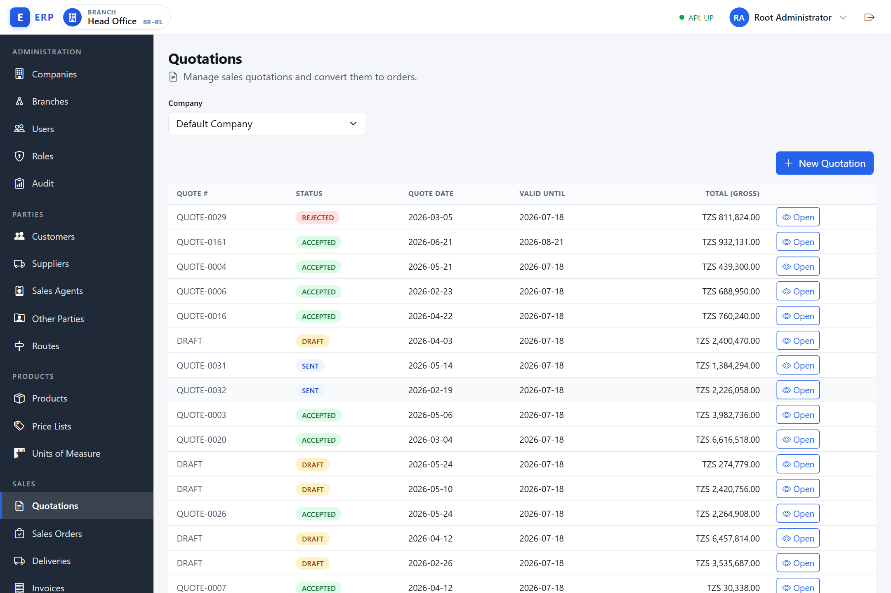
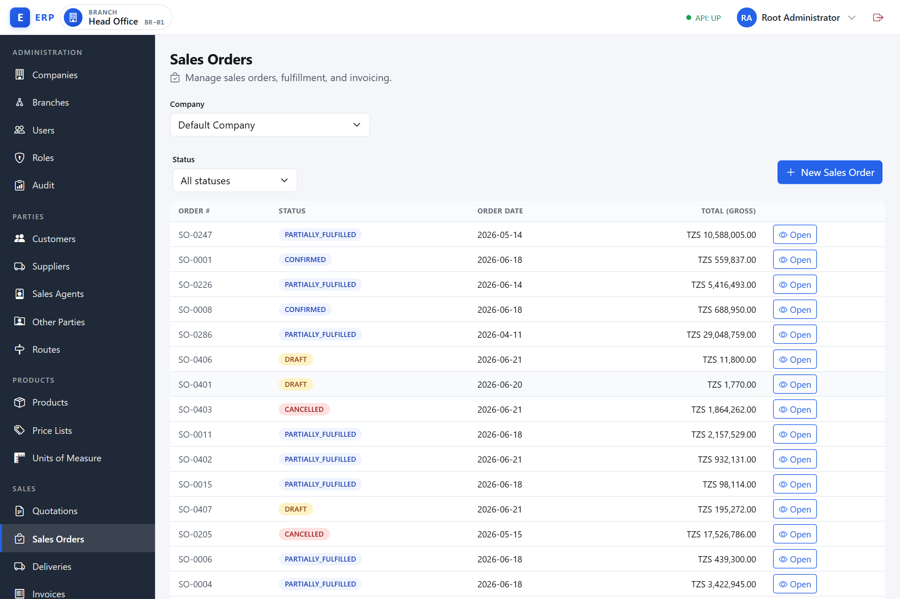
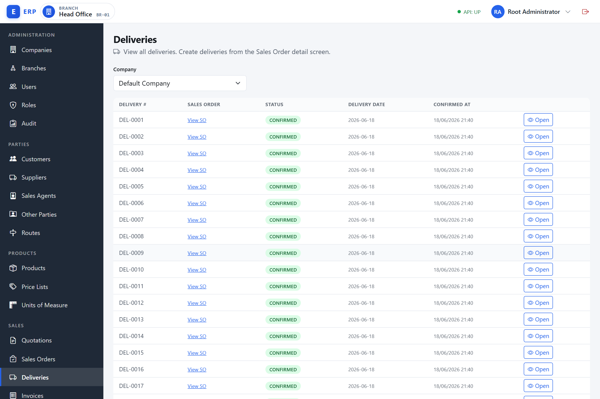
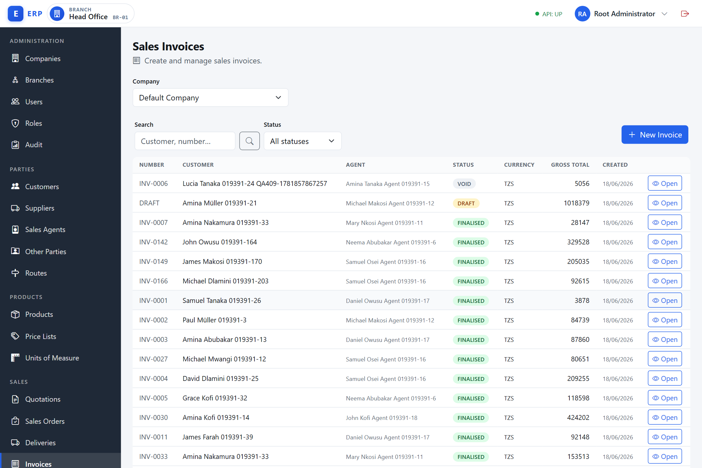
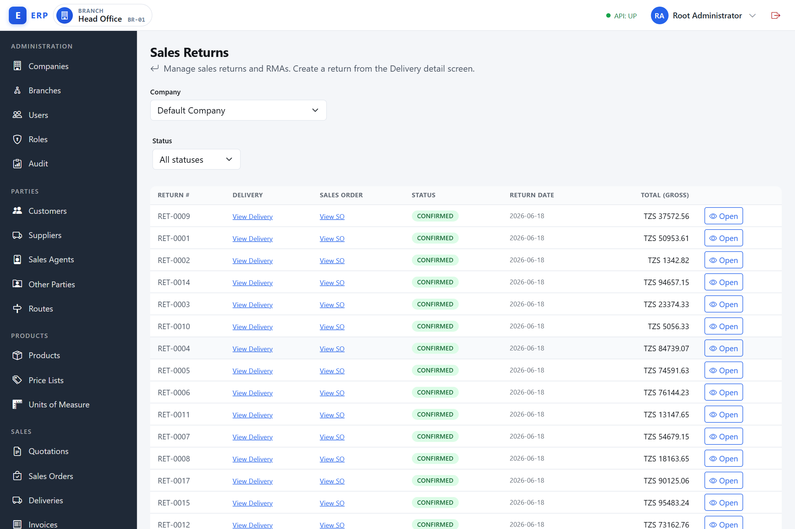
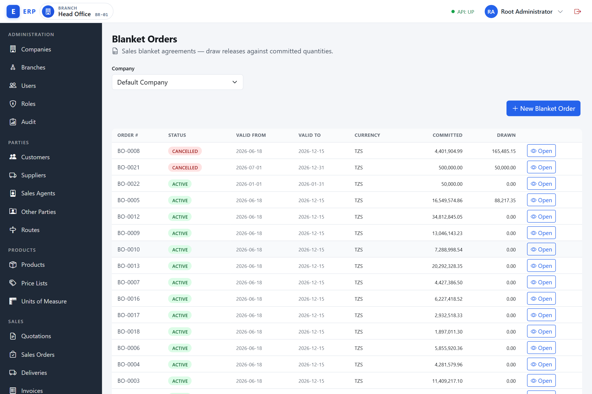
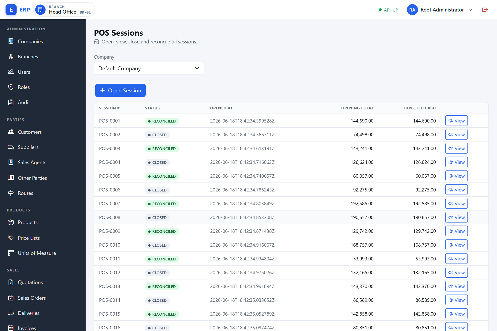
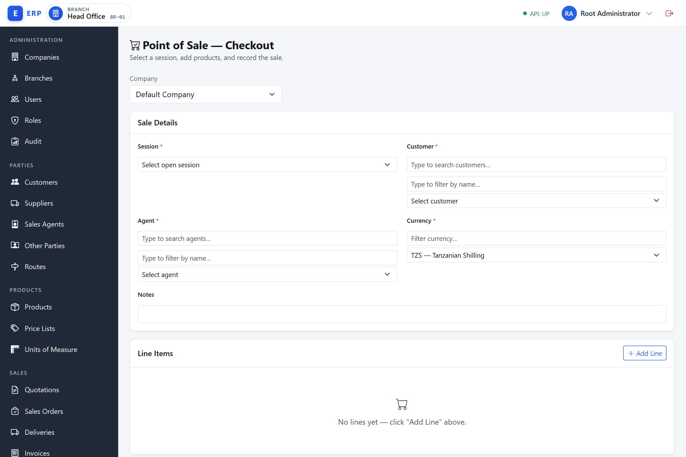

# Sales and Point of Sale

This chapter covers everything from quoting a customer through to collecting payment, including recurring and blanket agreements, advanced pricing, and the Point of Sale cashier workflow.

---

## Overview

The sales module follows the order-to-cash (O2C) path:

```
Quotation → Sales Order → Delivery → Sales Invoice → Payment
```

Walk-in cash sales skip the first three steps and begin directly with a Sales Invoice or a POS sale.

**What "order-to-cash" means.** Order-to-cash is the end-to-end business process that starts the moment a customer expresses intent to buy and ends when the business has received and accounted for the money. Each step in the chain creates a document that serves as a control point: stock is only committed when an order is confirmed, goods only leave the warehouse when a delivery is recorded, and revenue is only recognised when an invoice is finalised. Without this chain, businesses would have no audit trail, no way to match what was promised to what was shipped, and no reliable basis for the accounts receivable ledger.

**Required permissions** — the navigation menu only shows items your role includes. Key permission groups:

| Activity | Permission codes required |
|---|---|
| Quotations | `SALES.QUOTE.VIEW`, `SALES.QUOTE.CREATE`, `SALES.QUOTE.SEND`, `SALES.QUOTE.ACCEPT` |
| Sales Orders | `SALES.ORDER.VIEW`, `SALES.ORDER.CREATE`, `SALES.ORDER.CONFIRM`, `SALES.ORDER.CANCEL` |
| Deliveries | `SALES.DELIVERY.VIEW`, `SALES.DELIVERY.CREATE` |
| Sales Invoices | `SALES.INVOICE.VIEW`, `SALES.INVOICE.CREATE`, `SALES.INVOICE.SETTLE`, `SALES.INVOICE.VOID` |
| Sales Returns | `SALES.RETURN.VIEW`, `SALES.RETURN.CREATE` |
| Blanket Orders | `SALES.BLANKET.VIEW`, `SALES.BLANKET.CREATE` |
| Standing Orders | `SALES.STANDING.VIEW`, `SALES.STANDING.CREATE` |
| Pricing Rules | `SALES.PRICING.RULE.VIEW`, `SALES.PRICING.RULE.MANAGE` |
| POS (tills) | `POS.TILL.VIEW`, `POS.TILL.MANAGE` |
| POS (cashier) | `POS.SESSION.OPEN`, `POS.SALE.CREATE`, `POS.SESSION.VIEW` |
| POS (reverse / age override) | `POS.SALE.VOID`, `POS.SALE.AGE_OVERRIDE` |
| POS (close/reconcile) | `POS.SESSION.CLOSE`, `POS.SESSION.RECONCILE` |

Contact your administrator if an expected menu item is missing.

**Concurrent edits.** If two people act on the same document at the same time (for example, both try to confirm the same order), the second action is rejected with a conflict message asking you to reload and retry, rather than failing silently or corrupting the record. Reload the screen to see the current state and act again.

---

## 1. Quotations

Navigate to **Sales › Quotations** (`/admin/quotations`).



**What a quotation is.** A quotation (also called a quote or a sales proposal) is a formal written offer that the business sends to a customer. It states the products, quantities, unit prices, any discounts, and a validity period — that is, the date by which the customer must respond if the offered price is to be honoured.

**Why quotations exist.** Without a quotation, pricing agreements between a salesperson and a customer exist only verbally. A quotation creates a timestamped, auditable record of what was offered at what price, protects the business from disputes, and gives management visibility of the sales pipeline (how many offers are outstanding, what value, and when they expire). It also means that once a customer accepts, the system can convert the offer into a Sales Order automatically, carrying the agreed prices across without any re-entry.

**When a quotation is used.** A quotation is raised when a customer asks "what will it cost me?" before committing to buy — typically by a salesperson or sales assistant. It sits at the very beginning of the O2C chain: nothing is reserved from stock and no financial entry is made; the quotation is a promise, not a transaction.

**How a quotation flows.** A quotation begins as a `DRAFT` (editable, no number yet). When it is sent to the customer the status moves to `SENT` and a `QUOTE-####` number is assigned. If the customer accepts, the quotation moves to `ACCEPTED` and a Sales Order is created automatically with the same lines and agreed prices. If the customer declines it is `REJECTED`; if the validity date passes without a response the system marks it `EXPIRED` and acceptance is blocked.

### 1.1 Create a quotation

1. Navigate to **Sales › Quotations** (`/admin/quotations`).
2. Click **New Quotation**.
3. In the **Customer** field, type part of the customer name or code and select the correct entry from the list. Do not type or paste a raw ID.
4. Choose the **Currency** from the Currency Picker (see *Common UI Patterns* in chapter 00 — only the company's enabled currencies are offered, defaulting to the company default).
5. Set **Quote Date** (today by default) and **Valid Until** (the date the offer expires; it must be on or after the Quote Date).
6. Click **Create Quotation**. The quotation is saved in **DRAFT** status. A quote number is assigned later when you send it.

**Required fields:** Customer, Currency, Quote Date, Valid Until.

### 1.2 Add lines to a quotation

1. Open the draft quotation (navigate to **Sales › Quotations** then click the **Open** action on the quotation row, or go to `/admin/quotations/uid/{uid}`).
2. In the **Lines** section, search for the product by name or code and select it.
3. Choose a **Unit**, enter **Quantity**, optionally enter a **Price Override** (otherwise the list price is used), and optionally enter a **Disc %** (line discount as a percentage — the quotation and Sales Order line forms only offer a percentage discount, not a fixed amount).
4. Click the **+** (Add line) button. The system calculates net amount, VAT, and gross from the configured price list.

Repeat for each product. You can also add **Service** products; these are priced the same way but do not affect stock.

To remove a line, click the delete icon on the line row. Lines can only be changed while the quotation is in DRAFT.

### 1.3 Send a quotation

When the quotation is ready to share with the customer:

1. Open the draft quotation.
2. Click **Send to Customer**.
3. The status changes to **SENT** and a quote number (QUOTE-####) is assigned.

**Prerequisites:** The quotation must have at least one line, and the Valid Until date must be today or in the future.

### 1.4 Accept or reject a quotation

When the customer responds:

- **Accept** — click **Accept & Convert to Order** on the sent quotation. A **Sales Order** is created automatically with the same lines and discounts. The quotation status changes to **ACCEPTED**. A success message shows the new order number and provides a link to it.
- **Reject** — click **Reject**. The quotation status changes to **REJECTED**.

Both actions require the `SALES.QUOTE.ACCEPT` permission. If the Valid Until date has already passed, the system prevents acceptance and marks the quotation **EXPIRED**.

### 1.5 Quotation statuses

| Status | Meaning |
|---|---|
| DRAFT | Being prepared; lines can be added or removed |
| SENT | Sent to customer; awaiting response |
| ACCEPTED | Customer accepted; Sales Order created |
| REJECTED | Customer declined |
| EXPIRED | Valid Until date passed before acceptance |

---

**Example — Quotation for Karibu Supermarkets:**

Salesperson Ali opens **Sales › Quotations** (`/admin/quotations`) and clicks **New Quotation**. He types "Karibu" in the Customer field and selects **Karibu Supermarkets Ltd**. He sets Quote Date to **2026-06-14** and Valid Until to **2026-07-14**, then saves. The quotation is created in DRAFT with no number yet.

Ali adds two lines:
- Product **Unga wa Ngano 2kg**, Unit **CARTON (12 pcs)**, Qty **50**, Line Discount **0%** — system prices at TZS 18,000 per carton = TZS 900,000 net.
- Product **Mafuta ya Kupikia 1L**, Unit **CARTON (12 pcs)**, Qty **30**, Line Discount **5%** — list price TZS 22,000; after 5% = TZS 20,900 per carton = TZS 627,000 net.

VAT at 18% is added by the system: total gross = TZS 1,535,400 + VAT. Ali clicks **Send to Customer** — status becomes SENT and the number **QUOTE-0047** is assigned.

Karibu calls back and accepts. Ali clicks **Accept & Convert to Order**. The system creates **Sales Order SO-0112** from the same lines and shows a link. Quotation status is now ACCEPTED.

---

## 2. Sales Orders

Navigate to **Sales › Sales Orders** (`/admin/sales-orders`).



**What a Sales Order is.** A Sales Order (SO) is the internal document that records a customer's confirmed purchase intent. It lists the products, quantities, agreed prices, and any discounts. Unlike a quotation (which is an offer), a Sales Order is a commitment: the business has agreed to supply, and the customer has agreed to buy.

**Why Sales Orders exist.** The Sales Order is the control centre of the fulfilment process. Two things happen that do not happen at the quotation stage: first, confirming the order **reserves stock** so those goods cannot be sold to someone else; second, the order creates the traceability link between the customer's request, the delivery that ships the goods, and the invoice that bills them. Without Sales Orders, a warehouse would not know what to pick, finance would have no basis for revenue recognition, and there would be no way to track partial deliveries or backorders systematically.

**When a Sales Order is used.** A Sales Order is created either automatically (when a customer accepts a quotation) or directly (when a salesperson or order-desk clerk enters it fresh — for example, a telephone order that was never quoted). It is used any time a customer is buying goods that need to be fulfilled from stock and billed after delivery, as opposed to a walk-in cash purchase which goes straight to an invoice.

**How a Sales Order flows.** An SO begins as `DRAFT` (a `SO-####` number is assigned immediately at creation, even in draft). When the user confirms it, the status moves to `CONFIRMED` and stock is soft-reserved. As deliveries are made against the order the status tracks fulfilment progress (`PARTIALLY_FULFILLED` → `FULFILLED`). As invoices are raised from those deliveries it tracks invoicing progress (`PARTIALLY_INVOICED` → `CLOSED`). Cancellation at any point releases the reservations.

**Stock reservation explained.** When you confirm a Sales Order, the system writes a "soft reservation" against each product in the warehouse. The reserved quantity is not physically moved — the goods stay on the shelf — but they are marked as committed. This means the available-to-promise figure (what can still be sold to other customers) is reduced immediately. A reservation prevents double-selling: two salespeople cannot independently confirm orders for the same last 10 units. When a delivery is made, the reservation for the delivered quantity is released (because the goods have actually left) and the on-hand balance is reduced instead.

### 2.1 Create a standalone Sales Order

1. Navigate to **Sales › Sales Orders** (`/admin/sales-orders`).
2. Click **New Sales Order**.
3. Pick the **Customer** by name.
4. Choose the **Currency** from the Currency Picker (see *Common UI Patterns* in chapter 00 — the list is limited to the company's enabled currencies and defaults to the company default).
5. Set **Order Date**. Optionally pick an **Agent** by name and add **Notes**.
6. Click **Create Order**. The order is created in **DRAFT**.

### 2.2 Add lines to a Sales Order

The same process as adding quotation lines. Lines can only be added, edited, or removed while the order is in DRAFT.

### 2.3 Confirm an order

Confirming an order reserves stock for every GOODS line.

1. Open the draft order at **Sales › Sales Orders** then click the **Open** action on the order row (or navigate to `/admin/sales-orders/uid/{uid}`).
2. The order must have at least one line.
3. Click **Confirm Order**. A confirmation dialog appears explaining that confirming will attempt to reserve stock for all order lines, and that **if insufficient stock is available the order will confirm with a backorder**.
4. Click **Yes, Confirm**.
5. The status changes to **CONFIRMED** and each line shows its reserved quantity. Where stock was short, the line keeps an **Open (backorder)** quantity that you fulfil with a later delivery.

This requires the `SALES.ORDER.CONFIRM` permission. A user who can create orders but not confirm them will not see this button.

**Credit-control hard block.** When the customer is a **Credit Account** customer, confirming the order runs a credit-control check. Confirmation is blocked (the order stays in DRAFT and the system returns a clear conflict message) if **any one** of these three independent conditions is true:

- the customer's **credit status** is `ON_HOLD` or `STOPPED`;
- the customer is on a **manual hold** (a credit-control staff override — the hold reason, if recorded, is shown in the message); or
- the order's gross total, added to the customer's current outstanding balance, would **exceed their credit limit**.

The block is overridable only by a user holding the `SALES.CREDIT.OVERRIDE` permission; every override is recorded in the audit trail. **Cash / walk-in customers are exempt** — this check never applies to them.

> A separate, advisory credit warning may also appear without blocking confirmation; it is informational only and the order still confirms.

### 2.4 Cancel an order

Cancelling an order releases any stock reservations.

1. Open the order.
2. Click **Cancel Order**, enter an optional reason, and click **Confirm Cancel**.

Cancellation is allowed from any status except **CANCELLED** and **CLOSED**.

### 2.5 Order status lifecycle

| Status | Meaning |
|---|---|
| DRAFT | Being prepared; no stock reserved |
| CONFIRMED | Stock reserved |
| PARTIALLY_FULFILLED | At least one delivery made; not all lines delivered |
| FULFILLED | All lines delivered |
| PARTIALLY_INVOICED | Some deliveries invoiced |
| CLOSED | Fully fulfilled and fully invoiced |
| CANCELLED | Cancelled; reservations released |

---

## 3. Deliveries

Navigate to **Sales › Deliveries** (`/admin/deliveries`).



**What a Delivery is.** A Delivery is the document that records goods physically leaving the warehouse and being shipped or handed to the customer. It references the Sales Order it fulfils and specifies the exact quantities dispatched on that date. It is also sometimes called a "dispatch note" or "delivery note."

**Why Deliveries exist.** Without a delivery document there is no system record of when goods actually left — only what was ordered. The Delivery is the trigger for two critical events: it reduces the physical stock balance (goods have left), and it becomes the source document for the customer's invoice (you invoice what you delivered, not what was ordered — because partial deliveries are common). The delivery is also the moment that the cost of those goods is posted to the Profit and Loss account as Cost of Goods Sold (COGS), matching the cost to the revenue period in which the goods are billed.

**When a Delivery is used.** A delivery is created by a warehouse or logistics clerk once goods are ready to ship, always against a confirmed Sales Order. Multiple deliveries can be made against a single order (backorders), and each delivery generates its own invoice.

**How a Delivery flows.** A delivery can only be created against a `CONFIRMED` or `PARTIALLY_FULFILLED` Sales Order. When created it is immediately `CONFIRMED` (there is no separate pick/confirm step in the current version). The delivery is immutable — once confirmed it cannot be edited; corrections are handled through a Sales Return. Stock is reduced at the branch and the SO line counters are updated. An invoice is generated from the delivery as a separate action.

**Full delivery vs partial delivery (backorder).** If you deliver less than the full ordered quantity on any line, the system creates a partial delivery and the order moves to `PARTIALLY_FULFILLED`. The remaining undelivered quantity is the **backorder**. You create a second delivery later for the remaining quantity. Each delivery is independent and can be invoiced separately.

### 3.1 Create a delivery

Deliveries are always created from a Sales Order. The **Deliveries** list (`/admin/deliveries`) is view-only — it has no "New Delivery" button (its subtitle reads *"Create deliveries from the Sales Order detail screen."*).

1. Open a **CONFIRMED** (or **PARTIALLY_FULFILLED**) Sales Order and click its **Create Delivery** action. This opens the delivery create form at `/admin/deliveries/create` for that order; there is no Sales Order picker — the order is carried through from the button.
2. The form's **Lines to Deliver** table lists all open (undelivered) lines with the remaining (Open Qty) quantity pre-filled in **Deliver Qty**.
3. Untick a line's **Include** checkbox to leave it out, or lower its **Deliver Qty** if you are making a **partial delivery** (backorder). The quantity you enter cannot exceed the open balance.
4. Set **Delivery Date** (required) and optionally enter **Notes**.
5. Click **Create Delivery**.

Deliveries are created immediately in **CONFIRMED** status and cannot be undone. Each delivery is assigned a DELIVERY-#### number.

### 3.2 Partial delivery (backorder)

Enter a quantity less than the open balance on any line to create a partial delivery. The Sales Order status moves to **PARTIALLY_FULFILLED**. Create another delivery later for the remaining quantity.

### 3.3 Generate an invoice from a delivery

Once goods are delivered, you can invoice the customer for that delivery:

1. Open the delivery (navigate to **Sales › Deliveries** and click the **Open** action on the delivery row, or go to `/admin/deliveries/uid/{uid}`).
2. Click **Invoice this Delivery**.
3. A draft **Sales Invoice** is created automatically with the delivered lines. The doc discount from the source order is pro-rated to the delivered quantity.

Proceed to section 4 to finalise the invoice.

---

## 4. Sales Invoices

Navigate to **Sales › Invoices** (`/admin/sales-invoices`).



**What a Sales Invoice is.** A Sales Invoice is the formal billing document sent to the customer. It is the legal record of the sale: it states what was sold, at what price, the VAT due, and the amount the customer owes. Once finalised, a sales invoice is immutable — it cannot be edited, only voided (which raises a reversing credit note).

**Why Sales Invoices exist.** The invoice is the document that creates the customer's obligation to pay. In accounting terms, finalising an invoice posts the revenue to the General Ledger (DR Accounts Receivable or Cash / CR Sales Revenue and VAT Payable). For credit customers it opens an AR (Accounts Receivable) item — a record of the amount owed — which is then tracked and aged until payment is received. Without invoices, the business has no formal claim on the customer and no basis for its revenue figures or tax filings.

**Direct invoices vs SO-sourced invoices.** There are two origins for a sales invoice:

- **`DIRECT` (walk-in):** created manually for a cash customer who is buying on the spot with no prior order. Stock is issued and revenue posted at the moment of finalisation.
- **`SALES_ORDER`-sourced:** created from a Delivery (section 3.3). These invoices post revenue only — stock was already issued when the delivery was confirmed. This distinction prevents the same goods from being costed twice.

**Why the origin matters.** If a `SALES_ORDER`-sourced invoice also issued stock, the Cost of Goods Sold would be posted twice: once at delivery and once at invoicing. The system prevents this by tracking the origin on every invoice and skipping the stock-issue step for SO-sourced invoices. A walk-in invoice (DIRECT) has no prior delivery, so it must issue stock at finalisation — that is the only point at which goods leave.

**The VAT calculation.** All prices are entered tax-exclusive (net). The system calculates VAT per line using each product's VAT status (Standard 18%, Zero-Rated 0%, or Exempt 0%). The VAT rate is snapshotted onto the line at sale time so a later rate change cannot silently alter a historical invoice. The invoice prints a VAT analysis breaking down the tax by rate band.

**Price snapshots.** When you add a product line to an invoice (or any sales document), the system reads the current price from the price list and records it permanently on that line. If the price list is updated tomorrow, the historical invoice is unaffected — it retains the price that applied at sale time. This is called a "price snapshot" and is mandatory for any document that is legally an audit record.

### 4.1 Create a direct (walk-in) invoice

1. Navigate to **Sales › Invoices** (`/admin/sales-invoices`).
2. Click **New Invoice**.
3. Pick the **Customer** by name.
4. Choose the **Currency** from the Currency Picker (see *Common UI Patterns* in chapter 00 — enabled currencies only, defaulting to the company default).
5. Optionally pick an **Agent** and a **Route**; if omitted the system uses the logged-in user's linked agent and that agent's primary route.
6. Click **Create Invoice**. A draft invoice is created.

### 4.2 Add lines to an invoice

Same process as adding lines to a quotation or order. Lines can only be added, edited, or removed while the invoice is in DRAFT.

### 4.3 Record a payment

Payments can be recorded on a draft invoice before it is finalised.

1. In the **Record Payment** panel (shown on a DRAFT invoice).
2. Choose the **Tender type**: Cash or Mobile Money.
3. Enter the **Amount**, and optionally a **Reference** (for example, the M-Pesa transaction reference for Mobile Money).
4. Click **Record**.

Recording payments requires the `SALES.INVOICE.SETTLE` permission (separate from the permission to create lines).

For **cash / walk-in customers** the total payments must equal the invoice gross before you can finalise. Credit customers may have a balance that becomes an open AR item.

### 4.4 Finalise an invoice

1. Open the draft invoice.
2. Click **Finalise**.
3. The status changes to **FINALISED** and an invoice number is assigned.

After finalisation:
- For DIRECT invoices, stock is issued from the branch.
- For invoices from a delivery, revenue is posted (stock was already issued at delivery).
- For credit customers, an AR open item is created for any unpaid balance.

**Paid-in-full rule:** walk-in (cash) customers must be fully paid before finalisation is allowed.

**Credit limit:** if a credit customer's outstanding balance plus this invoice would exceed their credit limit, finalisation is blocked unless you hold the `SALES.CREDIT.OVERRIDE` permission. (This is a credit-limit check at finalisation. For SO-sourced sales, the broader credit-control hard block — covering credit status, manual hold, and the limit — already runs earlier, at Sales Order confirm; see section 2.3.)

### 4.5 Void an invoice

**What voiding means.** Voiding a finalised invoice reverses its financial effect: the revenue is reversed, the AR item is cancelled, and VAT is adjusted. The original invoice number is retained on the record (voiding is not deletion — the document remains as evidence that the transaction happened and was corrected). A reversing credit note is raised automatically. Use voiding only when an invoice was issued in error; for goods returned by the customer use a Sales Return (section 5) instead.

A finalised invoice can be voided if it was issued in error:

1. Open the finalised invoice (navigate to **Sales › Invoices**, open it from its row action, or go to `/admin/sales-invoices/uid/{uid}`).
2. Click **Void Invoice**, enter a mandatory reason, and confirm.
3. The invoice status changes to **VOID** and a reversing credit note is posted.

The original invoice number is retained on the voided record. Voiding is not the same as deletion.

### 4.6 Invoice status reference

| Status | Meaning |
|---|---|
| DRAFT | Being prepared; lines and payments editable |
| FINALISED | Issued; posted to AR and GL; immutable |
| VOID | Reversed; credit note posted; number retained |

---

**Example — Full O2C: Karibu Supermarkets (credit account):**

Continuing from section 1's example, Sales Order **SO-0112** was created from the accepted quotation. The warehouse confirms goods are ready.

1. **Confirm SO:** Ali opens **Sales › Sales Orders** (`/admin/sales-orders`), clicks the **Open** action on the SO-0112 row, clicks **Confirm Order**, and clicks **Yes, Confirm** in the dialog. Karibu is within its credit limit and not on hold, so the credit-control check passes. Status becomes CONFIRMED; stock reserved — 50 cartons Unga + 30 cartons Mafuta.

2. **Deliver:** From the confirmed **SO-0112** detail page, Ali clicks **Create Delivery**. The delivery form opens with both lines pre-filled at their full open quantity. He keeps both lines included (50 + 30 cartons), sets Delivery Date 2026-06-15, and clicks **Create Delivery**. Delivery **DELIVERY-0089** is created; SO status → FULFILLED.

3. **Invoice from delivery:** Ali opens DELIVERY-0089 at `/admin/deliveries/uid/{uid}` and clicks **Invoice this Delivery**. A DRAFT invoice is created. Since Karibu is a CREDIT_ACCOUNT customer, Ali clicks **Finalise** without adding a payment — the unpaid balance of TZS 1,535,400 (plus 18% VAT = TZS 1,811,772 gross) becomes an open AR item. Invoice number **INV-0203** is assigned.

**Example — Walk-in direct invoice (cash customer):**

Cashier Fatuma opens **Sales › Invoices** (`/admin/sales-invoices`) and clicks **New Invoice**. She picks customer **Amina Hassan (walk-in)**. She adds one line: **Sukari 1kg**, Unit **KG**, Qty **5**, price TZS 2,200/kg = TZS 11,000 net; VAT 18% = TZS 1,980; gross = TZS 12,980. In the **Record Payment** panel she sets Tender type **Cash**, Amount **TZS 12,980**, and clicks **Record**. She clicks **Finalise** — status becomes FINALISED, invoice number **INV-0204** is assigned, stock is issued, and the cash is recorded.

---

## 5. Sales Returns (RMA)

Navigate to **Sales › Sales Returns** (`/admin/sales-returns`).



**What a Sales Return is.** A Sales Return (also called an RMA — Return Merchandise Authorisation) is the document that records goods coming back from the customer. It is always tied to a specific delivery so the system knows exactly which shipment is being reversed.

**Why Sales Returns exist.** When a customer returns goods — because they are damaged, wrong, or surplus — several things need to happen simultaneously: the stock must come back into the warehouse, the customer's account must be credited (so they do not owe money for goods they no longer have), the revenue must be reversed, and the cost of those goods must be put back. Doing these four things as separate manual steps would be error-prone and would leave the accounts temporarily out of balance. A Sales Return handles all four atomically: on creation, stock is returned to the branch, a credit note is raised automatically, revenue and VAT are reversed, and (for a credit customer) the AR open item is reduced.

**When a Sales Return is used.** A Sales Return is created by a warehouse clerk or sales supervisor when goods arrive back from the customer. It can only reference a previous delivery — you cannot return more than was delivered on that delivery, and returns against the same delivery can be processed in multiple batches up to the full delivered quantity.

**How a Sales Return flows.** A Sales Return is created and immediately `CONFIRMED` in a single step. There is no draft stage. The return number (`RET-####`) is assigned at creation. A credit note is raised in the same transaction.

**What a credit note is.** A credit note is the financial document that reduces what the customer owes. If an invoice says "you owe us TZS 100,000," a credit note for TZS 20,000 on the same account means the customer's balance is reduced to TZS 80,000. Credit notes are raised automatically by the system on a Sales Return (for the returned goods) and on a void (for a fully reversed invoice); they cannot be raised manually through the sales return screen.

### 5.1 Create a return

The **Sales Returns** list (`/admin/sales-returns`) is view-only — it has no "New Return" button (its subtitle reads *"Create a return from the Delivery detail screen."*). There are two ways to reach the create form:

- Open the relevant CONFIRMED delivery and click **Create Return** (the delivery is pre-loaded), or
- Go directly to `/admin/sales-returns/create` and select the **Delivery** from the picker, then click **Load** to pull in its lines.

1. With the delivery loaded, the form shows the delivered lines with **Delivered**, **Already Returned**, and **Returnable** columns.
2. Enter the **Return Qty** for each line being returned (cannot exceed the **Returnable** balance — delivered minus what has already been returned).
3. Set the **Return Date** and optionally enter a **Reason**.
4. Click **Confirm Return**.

Returns are created directly in **CONFIRMED** status. Stock is returned to the branch. A credit note is raised automatically (pro-rated to the returned quantity).

### 5.2 Returnable quantity

Each return reduces the returnable balance for that delivery line. You can process multiple returns against the same delivery line until the full delivered quantity has been returned.

---

**Example — Partial sales return (Karibu Supermarkets):**

Two days after delivery, Karibu reports 5 cartons of Mafuta ya Kupikia arrived leaking. The stock controller opens delivery **DELIVERY-0089** and clicks **Create Return** (which pre-loads that delivery). She enters **Return Qty = 5** on the Mafuta line, sets return date **2026-06-17**, reason **"Damaged packaging — leaking oil"**, and clicks **Confirm Return**. Return **RET-0031** is created in CONFIRMED status. Five cartons of Mafuta stock are returned to the warehouse and a credit note for TZS 104,500 (5 × TZS 20,900) plus VAT is automatically raised against INV-0203.

---

## 6. Blanket Orders

Navigate to **Sales › Blanket Orders** (`/admin/blanket-orders`).



**What a Blanket Order is.** A Blanket Order is a framework supply agreement with a customer that fixes the unit price for a product and commits to a total quantity over a defined validity window. Instead of raising a new Sales Order with price negotiations each time the customer buys, both parties agree upfront: "you will buy up to 1,000 bags at TZS 6,500 each over the next six months." Each actual purchase draws down against this agreement — these draws are called **releases** or **call-offs**.

**Why Blanket Orders exist.** Regular customers who buy in predictable volumes benefit from negotiated prices locked in for a period, while the business gains revenue predictability and avoids repeated pricing discussions. Without a blanket order, each purchase is independent — a busy sales desk might accidentally apply inconsistent prices to the same customer, or forget what was agreed. The blanket order is the single source of truth for the agreed terms. It also automatically prevents over-delivery: the system tracks how much has been called off against the committed quantity and refuses to draw more than the total commitment.

**When a Blanket Order is used.** A blanket order is created by a sales manager when a long-term supply contract is signed with a customer. Once active, the sales team creates call-off Sales Orders against it whenever the customer exercises part of their commitment.

**How a Blanket Order flows.** A blanket order is `ACTIVE` from creation. Call-offs (draw-downs) produce ordinary Sales Orders that flow through the normal O2C chain (confirm → deliver → invoice). The blanket itself tracks the remaining committed quantity on each product line. When all quantities are fully drawn, the validity window expires, or a manager closes it manually, the blanket becomes `CANCELLED` (no further releases). The blanket document itself posts no stock and no GL entries — only the resulting Sales Orders do.

### 6.1 Create a blanket order

1. Navigate to **Sales › Blanket Orders** (`/admin/blanket-orders`) and click **New Blanket Order**, or go directly to `/admin/blanket-orders/create`.
2. Select the **Company** and **Branch**.
3. Pick the **Customer** by name.
4. Choose the **Currency** from the Currency Picker (see *Common UI Patterns* in chapter 00 — enabled currencies only, defaulting to the company default), then set **Valid From** and **Valid To** dates.
5. Add one or more **Lines**: for each, pick the product by name, choose a unit, and enter the committed quantity and unit price.
6. Optionally add notes (up to 500 characters).
7. Click **Create Blanket Order**.

The blanket order is created with status **ACTIVE** and assigned an order number.

### 6.2 Create a release (draw-down)

When the customer calls off part of their commitment:

1. Open the blanket order (navigate to `/admin/blanket-orders/uid/{uid}`).
2. Click **Draw Release** (visible only when the blanket is ACTIVE and you hold the manage permission).
3. Enter the **Branch ID** for the delivery branch.
4. Pick the **Agent** by name.
5. For each line you want to include, tick it and enter the **Draw Quantity** (cannot exceed the remaining committed quantity).
6. Click **Create Release**.

A **Sales Order** is created and linked to the blanket. The committed remaining quantity on each drawn line decreases.

### 6.3 Cancel a blanket order

Open the blanket order and click **Cancel** then confirm. The status changes to **CANCELLED**. Previously generated Sales Orders from this blanket are unaffected.

### 6.4 Blanket order statuses

| Status | Meaning |
|---|---|
| ACTIVE | Agreement in force; releases can be drawn |
| CANCELLED | Cancelled; no further releases |

---

**Example — Blanket supply agreement:**

Duka Kuu Ltd signs a 6-month supply deal for 1,000 bags of Mchele wa Zambia at TZS 6,500/bag. The sales manager opens **Sales › Blanket Orders** (`/admin/blanket-orders`), creates a new blanket for **Duka Kuu Ltd**, Valid From **2026-07-01** to **2026-12-31**, adds one line: **Mchele wa Zambia 10kg**, Unit **BAG**, Qty **1,000**, Unit Price **6,500**. Order is saved as ACTIVE.

In July, Duka Kuu calls off 200 bags. The sales manager opens the blanket, clicks **Draw Release**, draws 200 bags → Sales Order **SO-0145** is created. Remaining committed quantity on the blanket is now 800 bags.

---

## 7. Standing Orders (Recurring)

Navigate to **Sales › Standing Orders** (`/admin/standing-orders`).

**What a Standing Order is.** A Standing Order (also called a recurring order or repeat order) is a template that tells the system to generate a new Sales Order automatically on a regular schedule — weekly, bi-weekly, or monthly. It holds the customer, the products, the quantities, and the prices for a typical delivery cycle.

**Why Standing Orders exist.** Some customers receive the same goods on the same schedule every week or month — a hotel that takes 50 loaves of bread every Monday, or a distributor that replenishes the same five products on the first of each month. Without standing orders, the sales desk must manually create the same Sales Order repeatedly, risking forgetting, using the wrong quantities, or applying the wrong prices. A standing order removes the repetitive work and ensures consistent, timely order creation without manual intervention.

**When a Standing Order is used.** Standing orders are set up by a sales manager or sales administrator for customers with regular, predictable buying patterns. Once active, the cashier or sales desk does not need to do anything — orders appear automatically. The standing order can be paused if supply is interrupted and resumed when normal service resumes.

**How a Standing Order flows.** A standing order is `ACTIVE` from creation. The system runs a nightly check and generates a new Sales Order (in `DRAFT` status — a human must confirm it deliberately) for every active standing order whose next run date is today or earlier. After generation, the next run date advances by one period. A standing order can be `PAUSED` (no generation while paused) and `RESUMED`, or permanently `CANCELLED`. The generated Sales Orders flow through the normal O2C chain.

### 7.1 Create a standing order

1. Navigate to **Sales › Standing Orders** (`/admin/standing-orders`) and click **New Standing Order**, or go directly to `/admin/standing-orders/create`.
2. Pick the **Branch** and **Customer**, then choose the **Currency** from the Currency Picker (see *Common UI Patterns* in chapter 00 — enabled currencies only, defaulting to the company default).
3. Choose a **Frequency**: Daily, Weekly, Bi-Weekly, or Monthly.
4. Set a **Start Date**. Optionally set an **End Date**; leave it blank for open-ended.
5. Add lines: pick each product and unit by name, enter quantity and unit price.
6. Click **Create Standing Order**.

The standing order is created with status **ACTIVE** and the first `Next Run Date` is set.

### 7.2 Pause and resume

- **Pause** — open the standing order (navigate to `/admin/standing-orders/uid/{uid}`) and click **Pause**. No Sales Orders are generated while the order is paused.
- **Resume** — click **Resume** to make it active again.

### 7.3 Trigger a run manually

Click **Trigger Now** to generate a Sales Order immediately (without waiting for the scheduled run). The next run date advances by the configured frequency.

### 7.4 Cancel a standing order

Click **Cancel** to stop the standing order permanently. The status changes to **CANCELLED** and no further Sales Orders are generated.

### 7.5 Automatic generation

The system checks every night at midnight and generates Sales Orders for all ACTIVE standing orders whose next run date is today or earlier. Each generated order advances the next run date by one period.

### 7.6 Standing order statuses

| Status | Meaning |
|---|---|
| ACTIVE | Generating on schedule |
| PAUSED | Temporarily stopped; can be resumed |
| CANCELLED | Permanently stopped |

---

**Example — Weekly bread delivery for Hoteli ya Pwani:**

Hoteli ya Pwani orders 50 loaves of bread every Monday. The sales rep opens **Sales › Standing Orders** (`/admin/standing-orders`), creates a new standing order for **Hoteli ya Pwani**, Frequency **Weekly**, Start Date **2026-06-16**, no end date. Line: **Mkate Mzima**, Unit **PCS**, Qty **50**, Unit Price **TZS 800**. The system auto-generates **Sales Order SO-0151** on Monday 16 June, then **SO-0158** on 23 June, and so on every week without manual action.

---

## 8. Pricing Rules

Navigate to **Sales › Pricing Rules** (`/admin/pricing-rules`).

**What pricing rules are.** Pricing rules are pre-configured exceptions to the standard price list. Without any rules, every customer is charged the standard list price for a product. Rules let the business offer lower prices automatically under specific conditions — for example, a lower price per bag when a customer orders more than 100 bags at once (a quantity break), or a privately negotiated price that applies only to one specific customer.

**Why pricing rules exist.** Manual price overrides by sales staff are error-prone and untraceable. A salesperson might give a loyal customer a discount one day and forget it the next, or apply the wrong discount tier. Pricing rules encode the business's commercial agreements in the system so that the correct price is applied automatically and consistently every time, without needing the salesperson to remember or calculate. They also create an audit trail: when a line is priced, the system records which rule was applied (standard list, a tier, or a customer-specific price) as a diagnostic field on the line.

**How pricing rules resolve.** When a product line is added to any sales document (quotation, order, invoice, or POS sale), the system runs a single price-resolution check in the following priority order, applying the first rule that matches:

1. **Customer price** (highest priority) — a contract price for this exact customer and product
2. **Active promotion** — a time-limited offer matching the product or product category
3. **Price tier** — a volume-break price if the ordered quantity meets the tier's minimum
4. **Standard list price** — the product's price on the customer's assigned price list
5. **No price found** — the line is rejected; the product cannot be sold without a price

Once the price is resolved, the standard totals calculation (net, VAT, gross) runs unchanged — pricing rules only affect the unit price input.

### 8.1 Price tiers (quantity breaks)

**What a price tier is.** A price tier is a volume-break discount: if a customer orders at least a minimum quantity of a specific product, they receive a lower unit price than the standard list price. For example, the standard price for a 50 kg bag of cement is TZS 15,200, but any order of 100 or more bags is priced at TZS 14,500 per bag.

**Why tiers exist.** Volume pricing rewards large orders and encourages customers to consolidate purchases. Without tiers, a salesperson would have to manually override the price and justify the discount each time — an inconsistent and unaudited process. Tiers make the volume price automatic, consistent, and visible on the price list.

A price tier gives a lower unit price when a customer orders at least a minimum quantity of a product on a given price list.

**To create a tier:**

1. Open **Sales › Pricing Rules** (`/admin/pricing-rules`) and go to the **Price Tiers** tab.
2. Click **Add Price Tier**.
3. Pick the **Product** and **Price List** by name.
4. Enter **Min Quantity** and **Unit Price**, and choose the **Currency** from the Currency Picker (see *Common UI Patterns* in chapter 00 — enabled currencies only, defaulting to the company default).
5. Click **Save Tier**.

The tier status is **ACTIVE**. To deactivate a tier, click the **Deactivate** button on the row; the tier is soft-deactivated and no longer applied to new transactions.

You cannot have two active tiers for the same product, price list, and minimum quantity combination.

### 8.2 Customer prices (contract prices)

**What a customer price is.** A customer price (also called a contract price or a customer-specific price) is a fixed unit price agreed between the business and one specific customer for one specific product. It overrides every other pricing rule — including tiers and promotions — and applies regardless of quantity, as long as it is active and within its effective date window.

**Why customer prices exist.** Key accounts and long-term customers often negotiate individualised prices as part of a supply agreement — prices that are lower than the standard list but not published generally. Storing these as customer prices means the correct price is applied automatically on every transaction for that customer, with no risk of the wrong price being used by a different salesperson who does not know the agreement.

A customer price sets a fixed unit price for a specific product for a specific customer, overriding the standard price list.

**To create a customer price:**

1. Open **Sales › Pricing Rules** (`/admin/pricing-rules`) and go to the **Customer Prices** tab.
2. Click **Add Customer Price**.
3. Pick the **Customer** and **Product** by name.
4. Enter the **Unit Price** and choose the **Currency** from the Currency Picker (see *Common UI Patterns* in chapter 00 — enabled currencies only, defaulting to the company default).
5. Optionally set **Effective From** and **Effective To** dates for a time-limited contract.
6. Click **Save Price**.

Only one customer price record can exist per customer-and-product pair. Deactivate the existing record before creating a new one is not possible (the unique constraint is status-agnostic); raise a support request to change an existing contract price.

### 8.3 Pricing resolution order

When a sale line is priced the system applies the first matching rule in this priority:

1. Customer price (highest priority)
2. Active promotion (managed via the API; no UI currently)
3. Price tier
4. Standard list price
5. No price configured (the line is rejected)

---

**Example — Volume tier for cement:**

The sales manager opens **Sales › Pricing Rules** (`/admin/pricing-rules`), goes to **Price Tiers**, and clicks **Add Price Tier**. He picks product **Saruji 50kg**, Price List **Wholesale TZS**, Min Quantity **100**, Unit Price **TZS 14,500**, Currency **TZS**. Any order for 100+ bags on the Wholesale price list will now use TZS 14,500 instead of the standard TZS 15,200.

**Example — Contract price for Karibu Supermarkets:**

Under the **Customer Prices** tab the manager creates: Customer **Karibu Supermarkets Ltd**, Product **Unga wa Ngano 2kg**, Unit Price **TZS 17,500** (negotiated). From the next sale, whenever a sales line is added for this customer and product, TZS 17,500 is applied — regardless of the price list.

---

## 9. Point of Sale

Navigate to the **Point of Sale** group in the sidebar.

**What the Point of Sale module is.** Point of Sale (POS) is the in-store face-to-face retail workflow. It provides a cashier-facing checkout screen to ring up products, accept cash, and issue receipts. Everything processed through POS is ultimately a sales invoice — POS wraps the invoice channel with till management and session-level drawer accountability.

**Why POS exists as a distinct module.** A back-office sales invoice is fine for credit-account customers who receive goods on account and pay later. Counter retail is different: a cashier is processing many small transactions rapidly, cash is flowing in and out of a physical drawer, and at end of day the business needs to verify that the cash in the drawer matches what the system says was collected. The POS module adds the `till` and `session` layer on top of the invoice to manage this accountability — without it, cash sales would have no way to reconcile the physical drawer to the books.

**What a till is.** A till is a physical cash register position at a branch (for example, "Counter 1" or "Counter 2"). In the system a till is a named record tied to a branch and to a bank/cash account that represents the drawer. Multiple tills can operate at the same branch simultaneously. A till must be `ACTIVE` before a session can be opened on it.

**What a session is.** A session is the till's working period — typically one business day or one shift. Before a cashier can ring sales, they open a session by declaring the opening float (the cash placed in the drawer to make change). During the session every POS sale, refund, and payout is tracked against that session. At end of day the cashier or manager closes the session by counting the cash in the drawer, and then a manager reconciles the session to post any variance to the General Ledger.

**What a POS sale is.** A POS sale is a cash counter transaction. It produces a finalised sales invoice with origin `POS` (it is stamped with the originating POS session), the cash payment is recorded automatically for the full amount, and revenue is posted on finalisation. The invoice number (`INV-####`) is assigned on the spot. No quotation, sales order, or delivery step is involved — POS is designed for speed at the counter.

> **Note on stock.** Unlike a walk-in `DIRECT` invoice, a `POS`-origin invoice does **not** trigger the stock-issue step at finalisation under the current code — the stock-issue handler issues stock only for `DIRECT`-origin invoices. Treat POS stock movement as a known limitation pending confirmation; do not rely on a POS sale decrementing on-hand stock the way a direct walk-in invoice does.

POS is used for face-to-face retail transactions. A **till** is a physical cash register position. Each till must be opened in a **session** before sales can be processed. The session is closed and reconciled at end of day.

### 9.1 Roles

| Role | Typical permissions |
|---|---|
| Cashier | Open session, ring sales, view sessions |
| Manager | All cashier permissions plus create/deactivate tills, close sessions, reconcile |

Your administrator assigns the appropriate POS permissions to your role. Contact them if POS is not visible in your menu.

### 9.2 Set up a till

This is a one-time setup task done by a manager.

1. Navigate to **Point of Sale › POS Tills** (`/admin/pos/tills`).
2. Click **New Till**.
3. Enter a **Till Name** (e.g. "Counter 1").
4. Pick the **Branch** by name.
5. Click **Create Till**.

The till is created with status **ACTIVE**. To deactivate a till, click **Deactivate** on its row.

### 9.3 Open a session (start of day)

**What opening a session means.** Opening a session declares the start of a cashier's working period on a specific till. The opening float is the starting cash in the drawer (coins and notes placed there before the first sale so the cashier can make change). The system records this amount and uses it as the baseline for the end-of-day cash reconciliation. Only one session can be open on a till at a time — you cannot accidentally open a second session on the same counter without closing the first.

The **POS Sessions** list shows every session with its number, status (OPEN, CLOSED, RECONCILED), opening float, and expected cash; use the **Open Session** button to start a new one and the **View** action on a row to open a session's detail.



1. Navigate to **Point of Sale › POS Sessions** (`/admin/pos/sessions`).
2. Click **Open Session**.
3. Pick the **Till** by name (only ACTIVE tills are listed).
4. Enter the **Opening Float** — the cash amount placed in the drawer at the start of the day.
5. Click **Open Session**.

A new session is created with status **OPEN**. Only one session can be open on a till at a time.

### 9.4 Ring a sale

**What "ringing a sale" means.** This is the cashier's checkout step: entering the products and quantities the customer is buying, taking the cash the customer hands over, and completing the transaction. The system calculates the total, computes the change due, and — on completion — records the cash payment, finalises the sales invoice, posts the revenue, and issues the receipt. (See the stock note above: a `POS`-origin invoice does not currently run the stock-issue step that a `DIRECT` walk-in invoice does.)

**What the tendered amount is.** The tendered amount is the cash the customer physically hands to the cashier — often a round number larger than the total. If the total is TZS 13,000 and the customer hands over TZS 20,000, the tendered amount is TZS 20,000 and the change is TZS 7,000. The system calculates the change and the cashier returns it. A sale cannot be submitted if the tendered amount is less than the total.



1. Navigate to **Point of Sale › Point of Sale** (`/admin/pos/sell`) — this is the checkout screen.
2. If your organisation has more than one company, select the correct company.
3. Pick the **Session** — only OPEN sessions are listed. Each option is labelled *"Session &lt;…&gt; (Till &lt;till id&gt;)"* (a short fragment of the session's UID plus its till id), not the `POS-####` session number.
4. Pick the **Customer** (type in the search box above the picker to filter the list, then select).
5. Pick the **Agent** (search then select) — required; leaving Agent blank will cause the sale to be rejected.
6. Choose the **Currency** from the Currency Picker (see *Common UI Patterns* in chapter 00 — enabled currencies only, defaulting to the company default).
7. Click **Add Line**. Pick the **Product**; confirm or adjust the **Unit**, enter **Quantity** and **Unit Price**, and optionally a line **Discount** (entered as an amount).
8. Add further lines as needed. The **Total** updates in the footer.
9. Enter the **Tendered Amount** (the cash handed over by the customer). The **Change** is calculated immediately. The sale cannot be submitted if the tendered amount is less than the total.
10. Click **Complete Sale**.

A success receipt is displayed showing the invoice number and total. Click **View Invoice** to open the full invoice, or **New Sale** to start the next transaction.

**Notes:**
- On this checkout screen the sale is settled in cash — you enter a single **Tendered Amount** and the payment is recorded as Cash automatically. (The POS sale itself can also accept several tenders together; see *Splitting payment across tenders* below.)
- The agent field is mandatory on the backend; leaving it blank will cause the sale to be rejected.
- If the chosen session has been closed in the meantime, the sale is rejected with a message of the form *"POS session &lt;session-uid&gt; is not OPEN."* (the message quotes the session's internal UID, not its `POS-####` number) so you know to re-open or re-select an OPEN session.
- If a **Complete Sale** click is interrupted (network drop, slow response) and the cashier retries, the system recognises the repeat and returns the original sale instead of ringing it twice — a sale is never double-posted, so it is safe to retry.

#### Splitting payment across tenders

A POS sale does not have to be settled with a single cash amount. It can be split across **several tenders** at once — for example part **cash** and part **card**, or cash plus **mobile money** — as long as the tenders together cover the sale total. Each tender is recorded as its own payment on the resulting invoice (cash, card, mobile money, or cheque), so the receipt and the books show exactly how the customer paid. The standard checkout screen above records a single cash tender; mixed-tender sales are taken on a connected POS terminal or device that offers the tender breakdown.

#### Age-restricted items

If any product on the sale is **age-restricted** (for example an 18+ or 21+ line — see *Products and Catalog* in chapter 02), the sale is **blocked** until age has been dealt with. The cashier must either confirm that the customer's age has been verified (the prompt to confirm appears when an age-restricted line is present) or hold the `POS.SALE.AGE_OVERRIDE` permission. Without one or the other, completing the sale is refused so restricted goods cannot be sold without an age check.

#### Scale labels (embedded weight or price barcodes)

Deli, butchery, and produce items are often weighed at a counter scale that prints a special **scale label** — a barcode that carries the item plus its weight or its price inside the code. When such a label is scanned at the till, the system recognises the format, identifies the product, and works out the **quantity** (or the line price) automatically from the embedded value, so the cashier does not type the weight by hand. Ordinary fixed-price barcodes are read as usual.

#### Reversing (voiding) a POS sale

A completed POS sale that was rung in error can be **reversed** at the till. Reversing a sale undoes everything the sale did: it reverses the revenue and VAT, refunds the cash out of the drawer, and returns the goods to stock — the opposite of the original transaction, recorded as evidence rather than deleted.

A reversal is only allowed while the **till session is still OPEN**, so that the cash refund comes out of the same drawer that took the money. Once the session has been closed or reconciled, a mis-rung sale is corrected through a back-office invoice void (section 4.5) instead. Reversing a sale requires the `POS.SALE.VOID` permission; you enter a reason, which is recorded on the void and in the audit trail.

### 9.5 Record a payout

**What a payout is.** A payout is any cash that leaves the drawer during the session that is not change given to a customer. The two types are:
- **Paid Out:** a safe drop (moving excess cash from the drawer to the safe mid-shift) or a petty-cash payment made from the drawer.
- **Refund:** cash paid back to a customer as a refund.

Both types reduce the expected closing cash and are recorded so the end-of-day reconciliation remains accurate. Without recording payouts, the drawer would appear short at close-of-day even though the cash was accounted for.

A payout records cash leaving the drawer during the session — for example, a drop to the safe or a petty-cash refund.

1. Open the session detail (**Point of Sale › POS Sessions** (`/admin/pos/sessions`), click **View** on the OPEN session, or navigate to `/admin/pos/sessions/uid/{uid}`).
2. Click **Record Payout**.
3. Select the **Type**: Paid Out (cash removed from the drawer) or Refund (customer cash refund).
4. Enter the **Amount** and a **Reason**.
5. Click **Record**.

Both payout types reduce the expected closing cash. The live X-read total updates automatically.

### 9.6 X-Read (live totals during the day)

**What an X-Read is.** An X-Read (from the retail term "X-reading the register") is a snapshot of running totals for the current session without closing or resetting it. Cashiers and managers use it to verify the session is on track during the day — for example, after a safe drop, to confirm the expected cash figure has decreased correctly. Unlike a Z-Read (see section 9.8), an X-Read does not close anything.

The **X-Read** card on the session detail page shows running totals without closing the session:

| Field | Meaning |
|---|---|
| Sales Total | Sum of all POS sale totals in this session |
| Payouts | Sum of all payouts (PAID_OUT + REFUND) |
| Expected Cash | Opening Float + Sales Total − Payouts |
| Invoice Count | Number of sales processed |

Click the refresh icon to reload the X-read at any time.

### 9.7 Close a session (end of day)

**What closing a session means.** Closing a session is the end-of-shift step where the cashier physically counts the cash in the drawer and enters the counted amount. The system compares this to the expected cash (computed from the opening float plus all sales minus all payouts) and calculates the variance. A zero variance means the drawer balances perfectly. A positive variance (more cash than expected) is a till surplus. A negative variance (less cash than expected) is a till shortage. The session moves to `CLOSED` but the variance is not yet posted to the General Ledger — that happens at reconciliation.

Closing records the physical cash count.

1. Open the session detail (navigate to `/admin/pos/sessions/uid/{uid}`).
2. Click **Close Session**.
3. Enter the **Counted Cash** — the amount physically in the drawer.
4. Optionally add closing notes.
5. Click **Close Session**.

The session status changes to **CLOSED** and a **variance** is computed:

```
Variance = Counted Cash − Expected Cash
```

- **Positive variance** (over): more cash in the drawer than expected.
- **Negative variance** (short): less cash than expected.
- **Zero variance**: drawer balances exactly.

### 9.8 Reconcile a session (Z-Read)

**What reconciliation is.** Reconciliation is the final accounting step for a session. A manager reviews the closed session, confirms the figures are correct, and posts the cash variance — if any — to the General Ledger. After reconciliation the session is permanently locked and no further changes are possible. The result is called the **Z-Read** (again from retail terminology: the Z-read "zeroes" the register for the next session).

**What the GL posting means.** If the drawer is over (more cash than expected), the excess is income — the business has more cash than it should, which is a gain. The system debits the Cash account and credits a Till Surplus income account. If the drawer is short, the shortfall is an expense — the business is missing cash. The system debits a Till Shortage expense account and credits Cash. A zero variance produces no journal entry.

Reconciliation posts the variance to the general ledger and produces the final Z-Read report.

1. Open a **CLOSED** session (navigate to `/admin/pos/sessions/uid/{uid}`).
2. Click **Reconcile**.
3. Optionally add notes.
4. Click **Reconcile**.

The session status changes to **RECONCILED**. The **Z-Read** card shows all session figures plus the variance and (if non-zero) the journal reference:

- **Over variance** — debit Cash, credit income account 4900 (Till Surplus).
- **Short variance** — debit expense account 5170 (Till Shortage), credit Cash.
- **Zero variance** — no journal posted.

After reconciliation the session is read-only and no further sales or payouts can be recorded.

### 9.9 Cash variance explained

**What cash variance is.** Cash variance is the difference between the cash that should be in the drawer (the expected cash, calculated by the system) and the cash that is actually in the drawer (the counted cash, declared by the cashier). Every business aims for zero variance — a perfectly balanced drawer — but small discrepancies occur in practice due to rounding on change, counting errors, or occasional till errors.

The formula is:

```
Expected Cash = Opening Float + Sum of all cash sales in the session − Sum of all payouts
Variance = Counted Cash − Expected Cash
```

A variance greater than zero means there is more cash in the drawer than the sales records account for (a surplus — perhaps the cashier made change errors that favoured the business). A variance less than zero means there is less cash than expected (a shortage — perhaps an error or a discrepancy). Both are posted to the GL at reconciliation so the books always reflect the actual cash held.

### 9.10 Session lifecycle

| Status | Meaning |
|---|---|
| OPEN | Sales and payouts can be recorded |
| CLOSED | Session counted; reconciliation pending |
| RECONCILED | Final Z-read produced; GL posted; session closed |

Transitions are one-way: OPEN → CLOSED → RECONCILED. A session cannot be re-opened.

### 9.11 Daily workflow summary

1. **Open** a session on your till with the day's opening float.
2. **Ring sales** as customers arrive.
3. **Record payouts** for any cash removed from the drawer.
4. Check the **X-Read** at any time for running totals.
5. At end of day, **count** the cash in the drawer.
6. **Close** the session by entering the counted amount.
7. A manager **reconciles** the closed session; the system posts any variance to the GL.

---

**Example — Walk-in cash sale (full POS day):**

Cashier Jane starts her shift at Duka Moja. She navigates to **Point of Sale › POS Sessions** (`/admin/pos/sessions`) and clicks **Open Session**. She picks till **Counter 1** (Branch: Dar es Salaam Main) and enters Opening Float **TZS 100,000**. Session **POS-0041** opens with status OPEN.

During the morning Jane processes three customers at **Point of Sale › Point of Sale** (`/admin/pos/sell`):

1. She picks her open session from the Session picker (shown as *"Session … (Till …)"* — the picker does not display the `POS-0041` number), customer **Mteja wa Kawaida**, agent **Omar Salim**, currency TZS. She adds: **Sukari 1kg** × 2 @ TZS 2,500 = TZS 5,000; **Mafuta ya Kupikia 1L** × 1 @ TZS 8,000 = TZS 8,000. Total TZS 13,000. Customer hands over TZS 20,000 — Change shown as TZS 7,000. Jane clicks **Complete Sale** — Invoice **INV-0211** issued.

2. Second sale: **Unga wa Ngano 2kg** × 3 @ TZS 3,200 = TZS 9,600. Tendered TZS 10,000, change TZS 400. Invoice INV-0212 issued.

3. Third sale: **Chumvi 500g** × 5 @ TZS 500 = TZS 2,500. Tendered exact. Invoice INV-0213 issued.

At midday Jane does a safe drop: she opens session detail (`/admin/pos/sessions/uid/{uid}`), clicks **Record Payout**, Type **Paid Out**, Amount **TZS 20,000**, Reason "Midday safe drop". Expected cash now: TZS 100,000 + TZS 25,100 − TZS 20,000 = **TZS 105,100**.

Jane checks the X-Read: Sales Total TZS 25,100, Payouts TZS 20,000, Expected Cash TZS 105,100, Invoice Count 3. Correct.

At end of day Jane counts the drawer: TZS 105,200 (TZS 100 over). She clicks **Close Session**, enters Counted Cash **TZS 105,200** — Variance is **+TZS 100.00** (over).

Manager Rehema opens the session detail, clicks **Reconcile**. Status → RECONCILED. Z-Read confirms the +TZS 100 variance and shows Journal **JNL-0519**: DR Cash 100 / CR Till Surplus (4900) 100.
