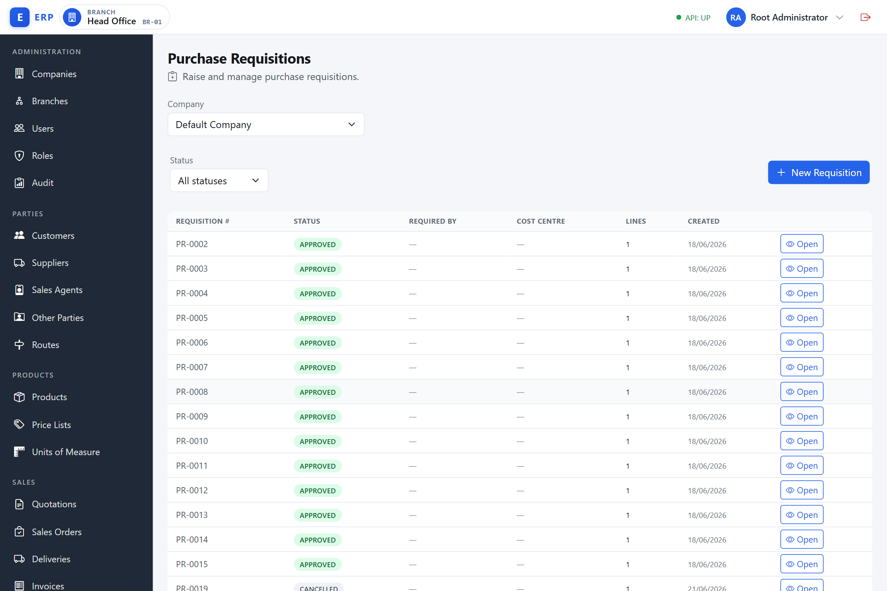
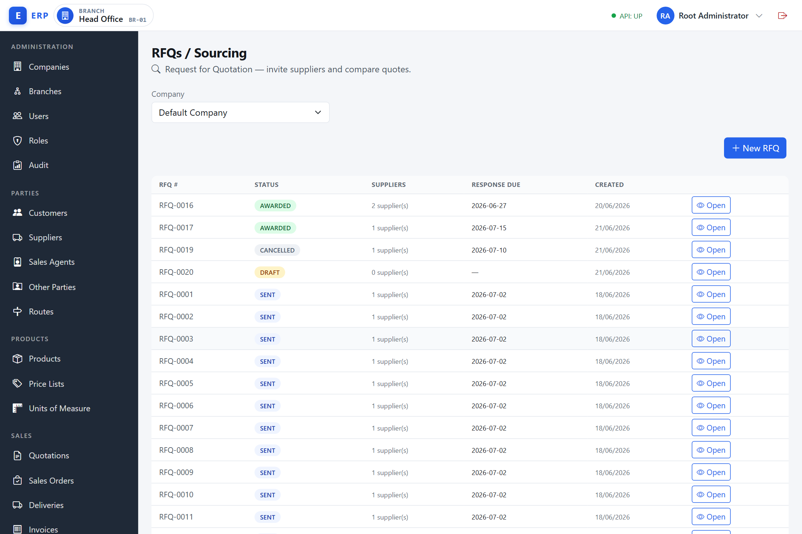
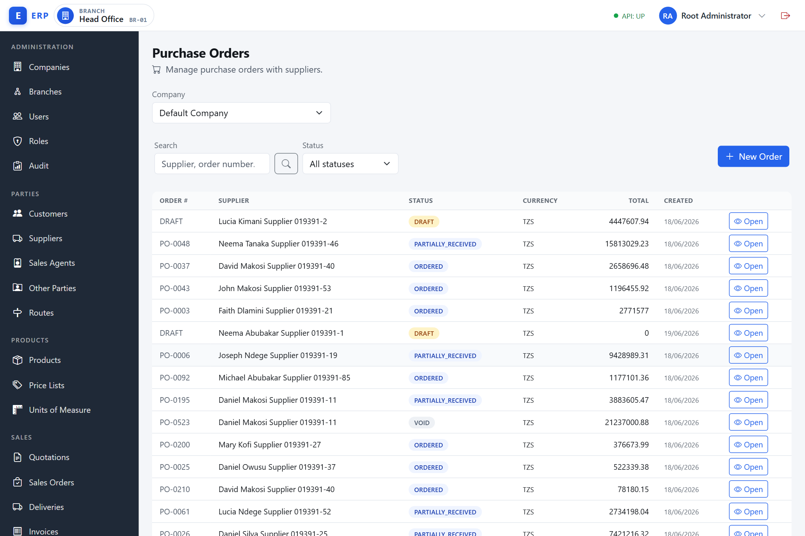
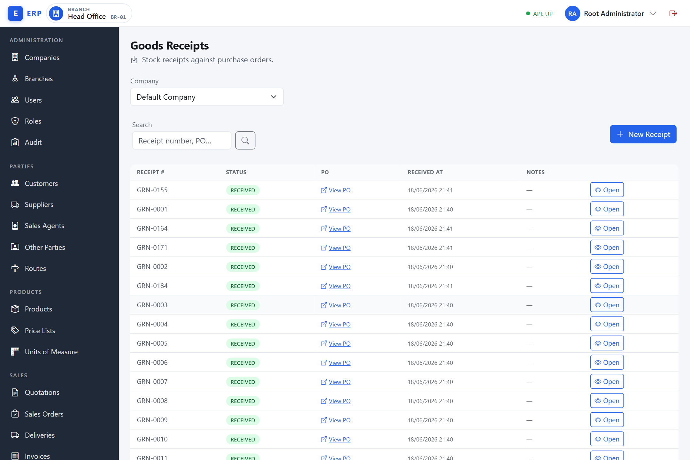
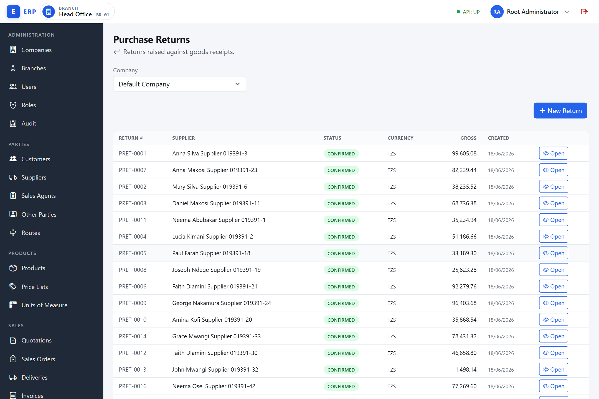

# Procurement (Procure-to-Pay)

This chapter covers the full procure-to-pay (P2P) chain from raising a purchase request through to settling the supplier's invoice, including goods receipt, landed costs, purchase returns, and purchase settings.

---

## Overview

**What the P2P chain is and why it exists.**
Every business that buys goods or services needs a structured buying process. Without it, anyone could commit the business to purchases without authorisation, prices would go unverified, goods might be received without a matching order, and the business would have no audit trail when a supplier dispute arose. The Procure-to-Pay chain is the end-to-end control framework for buying: it starts with an internal request, works through supplier selection, raises a formal commitment to buy, records what actually arrived, validates the supplier's invoice against what was ordered and received, and ends with a payment that clears the liability. Each step is a gate — the next step cannot start until the previous one is completed and, where required, approved. This is how the system enforces budget control, prevents fraud, and supports accurate financial reporting.

The P2P chain follows this path:

```
Purchase Requisition → RFQ → Supplier Quotes → Award → Purchase Order
    → Goods Receipt → [Landed Cost] → Supplier Bill → 3-Way Match → AP Payment
```

For direct purchases without a sourcing process, the chain can start at the Purchase Order (created from a converted requisition or from the RFQ award).

**Required permissions** — the navigation menu only shows items your role includes:

| Activity | Permission codes |
|---|---|
| Requisitions | `PURCHASE.REQUISITION.VIEW`, `PURCHASE.REQUISITION.CREATE`, `PURCHASE.REQUISITION.APPROVE` |
| RFQ / Supplier Quotes | `PURCHASE.RFQ.VIEW`, `PURCHASE.RFQ.MANAGE` |
| Purchase Orders | `PURCHASE.ORDER.VIEW`, `PURCHASE.ORDER.CREATE`, `PURCHASE.ORDER.VOID`, `PURCHASE.ORDER.APPROVE` |
| Goods Receipt | `PURCHASE.GOODS_RECEIPT.VIEW`, `PURCHASE.RECEIVE` |
| Landed Cost | `PURCHASE.LANDEDCOST.VIEW`, `PURCHASE.LANDEDCOST.MANAGE` |
| Supplier Bills / AP | `AP.VIEW`, `AP.BILL.ENTER`, `AP.BILL.MATCH` |
| Purchase Returns | `PURCHASE.RETURN.VIEW`, `PURCHASE.RETURN.CREATE` |
| Purchase Settings | `PURCHASE.SETTINGS.MANAGE` |

Contact your administrator if an expected menu item is missing.

---

## 1. Purchase Requisitions

Navigate to **Purchasing › Purchase Requisitions** (`/admin/purchase-requisitions`).



The list shows every requisition with its number, status, required-by date, cost centre, line count, and creation date. Use **+ New Requisition** to raise one, and the **Open** button on a row to view or act on it.

**What a purchase requisition is.**
A purchase requisition (also called a "purchase request" or PR) is a formal internal document raised by a member of staff to request that the business buys goods or services. It is not sent to a supplier — it is an internal request that must be reviewed and approved before any external commitment is made. Think of it as a "permission to buy" request.

**Why it exists.**
Without a requisition step, any employee could initiate a purchase directly, bypassing budget checks, management oversight, and cost-centre accountability. The requisition creates a written record of what is needed, when it is needed, and at what estimated cost. This allows management to prioritise spending, check that the purchase fits the budget, and maintain an audit trail from the first idea to the final payment.

**When it is used.**
A requisition is raised whenever a department or individual needs to buy something and does not have pre-authorised standing orders in place. Common triggers are low stock (detected by the Low Stock flag in Inventory), a project requirement, or routine scheduled re-ordering. The person raising the requisition is typically a storekeeper, department head, or anyone with the `PURCHASE.REQUISITION.CREATE` permission.

**How it flows.**
A requisition starts as a DRAFT (being prepared) and must be submitted before it enters the approval queue (SUBMITTED). An authorised approver then approves or rejects it. An APPROVED requisition can be converted — either directly into a Purchase Order if the supplier is already known, or into an RFQ if prices need to be gathered from multiple suppliers first. Once converted, the requisition status becomes CONVERTED and no further action is possible on it; the work continues on the PO or RFQ that was created.

### 1.1 Create a requisition

1. Navigate to **Purchasing › Purchase Requisitions** (`/admin/purchase-requisitions`).
2. Click **New Requisition**, or go directly to `/admin/purchase-requisitions/create`.
3. Set the **Required By** date and optionally a cost centre and notes.
4. Add lines: for each item, pick the **Product** by name, choose a **Unit**, and enter the **Requested Quantity** and an **Estimated Unit Cost**. The **Unit** field is disabled until a product is picked; once picked, it lists only that product's configured units (its base unit and any active bulk-pack units) — not every unit in the system.
5. Click **Create Requisition**. The requisition is saved in **DRAFT**.

### 1.2 Submit a requisition

When the requisition is complete and ready for approval:

1. Open the draft requisition (navigate to `/admin/purchase-requisitions/uid/{uid}`).
2. Click **Submit for Approval**.
3. The status changes to **SUBMITTED** and the requisition is routed for approval.

### 1.3 Approve or reject a requisition

An approver (a user with `PURCHASE.REQUISITION.APPROVE`) reviews submitted requisitions at **Purchasing › Purchase Requisitions** (`/admin/purchase-requisitions`).

- **Approve** — open the submitted requisition and click **Approve**. Status → **APPROVED**. The Convert action becomes available.
- **Reject** — click **Reject**, enter a mandatory reason, and confirm. Status → **REJECTED**. The requisitioner is notified via the audit trail.

### 1.4 Convert a requisition

Converting an approved requisition creates the target document — a Purchase Order or an RFQ — in one step, carrying over the requisition lines. You choose the target type **and** the supplier(s) up front; the requisition then locks to CONVERTED and a link opens the document that was created.

1. Open the approved requisition (navigate to `/admin/purchase-requisitions/uid/{uid}`).
2. Click **Convert**. An inline **Convert Requisition** form opens.
3. In **Convert to**, choose the target type. The rest of the form changes to suit it:
   - **Purchase Order** — pick a single **Supplier** (required; only active suppliers of the requisition's company are listed) and optionally a **Currency** (a 3-letter code such as `USD` — leave blank to use the company default). A DRAFT PO is created at this supplier for the requisition lines.
   - **Request for Quotation (RFQ)** — build the invite list: choose a supplier in **Add a supplier** and click the **+** button to add it, repeating for each supplier you want to quote (remove one with the **✕** on its row). At least one supplier is required. A DRAFT RFQ is created inviting those suppliers.
4. Click **Confirm Convert**. This button stays disabled until you have chosen the required supplier(s) — a PO needs one supplier, an RFQ needs at least one invitee.
5. The requisition status changes to **CONVERTED**. A **Converted to …** line appears in the summary card with a **View RFQ** / **View Purchase Order** link that opens the document that was just created — continue there (section 2 for an RFQ, section 3 for a PO).

### 1.5 Cancel a requisition

A requisition can be cancelled while it is still DRAFT or SUBMITTED:

1. Open the requisition.
2. Click **Cancel**, enter an optional reason, and confirm. Status → **CANCELLED**.

### 1.6 Requisition status reference

| Status | Meaning |
|---|---|
| DRAFT | Being prepared |
| SUBMITTED | Awaiting approval |
| APPROVED | Approved; ready to convert |
| REJECTED | Rejected by approver |
| CONVERTED | Converted to PO or RFQ |
| CANCELLED | Cancelled |

---

**Example — Requisition for office stationery:**

Store clerk Amani opens **Purchasing › Purchase Requisitions** (`/admin/purchase-requisitions`) and clicks **New Requisition**. He sets Required By **2026-06-20**, notes "Monthly stationery re-order", and adds two lines:

- Product **Karatasi A4 (Ream)**, Unit **REAM**, Qty **20**, Estimated Cost **TZS 8,500** each.
- Product **Kalamu Nyeusi**, Unit **BOX**, Qty **5**, Estimated Cost **TZS 3,200** each.

He clicks **Create Requisition** — requisition **REQ-0072** is created in DRAFT. He opens it and clicks **Submit for Approval** — status → SUBMITTED.

Purchasing manager Neema opens the requisition and clicks **Approve** — status → APPROVED, estimated total TZS 186,000. She clicks **Convert**, sets **Convert to** to **RFQ**, adds **Ofisi Supplies Ltd** and **Karatasi Traders** to the invite list, and clicks **Confirm Convert** — RFQ **RFQ-0031** is created in DRAFT and the **View RFQ** link opens it.

---

## 2. RFQ (Request for Quotation)

Navigate to **Purchasing › RFQs / Sourcing** (`/admin/rfqs`).



The list shows each RFQ with its number, status, how many suppliers were invited, the response-due date, and the creation date. Use **+ New RFQ** to start one, and **Open** to send it, capture quotes, or award it.

**What an RFQ is.**
An RFQ (Request for Quotation) is a document sent to one or more suppliers asking them to submit their prices and delivery terms for a specified list of goods or services. It is not a commitment to buy — it is a competitive enquiry. The business collects the responses (supplier quotes), compares them, and chooses the best offer.

**Why it exists.**
Without a sourcing step, the business might always buy from the same supplier at whatever price they name, with no mechanism to check whether better value is available elsewhere. An RFQ enforces competitive sourcing: multiple suppliers are asked the same question at the same time, their responses are recorded in the system, and the selection is documented — protecting the business from claims of favouritism and ensuring value for money.

**When it is used.**
An RFQ is used when the buying price is not already fixed by contract or catalogue and at least one competitive comparison is warranted. It is typically triggered by an approved purchase requisition (the Convert → RFQ path) or raised directly by a purchasing officer when restocking at scale. The person creating and sending the RFQ, capturing quotes, and awarding it holds the `PURCHASE.RFQ.MANAGE` permission (the same permission covers all three actions); viewing an RFQ requires `PURCHASE.RFQ.VIEW`.

**How it flows.**
An RFQ is created in DRAFT with the product lines and the invited suppliers. When sent (SENT), suppliers are notified to respond. As each supplier responds with a price, a **Supplier Quote** is captured against the RFQ (QUOTES_RECEIVED). The purchasing officer then compares the quotes and awards the RFQ to the preferred supplier (AWARDED). Awarding automatically creates a Purchase Order in DRAFT at the winning quote's prices — the sourcing stage is complete and the buying stage begins.

### 2.1 Create an RFQ

An RFQ can be created directly or by converting an approved requisition (see section 1.4).

**To create directly:**

1. Navigate to **Purchasing › RFQs / Sourcing** (`/admin/rfqs`) and click **New RFQ**, or go to `/admin/rfqs/create`.
2. Set the **Response Due Date** and optionally add notes.
3. In the **Invite Suppliers** section, choose a supplier in the **Add a supplier** picker and click the **+** button to add it to the invite list. Repeat for each supplier; invite at least one. Each added supplier is shown by name and code — both in this list and later on the RFQ detail screen's **Invited Suppliers** panel — never as a raw reference number.
4. Add lines: pick each product by name, choose a unit, and enter the required quantity. The unit dropdown is disabled until a product is picked, and then lists only that product's configured units.
5. Click **Create RFQ**. The RFQ is created in **DRAFT**.

### 2.2 Send an RFQ to suppliers

1. Open the DRAFT RFQ (navigate to `/admin/rfqs/uid/{uid}`).
2. Click **Send to Suppliers**. Status → **SENT**. Suppliers are notified that they should submit a quote.

### 2.3 Capture supplier quotes

**What a supplier quote is.**
A supplier quote (also called a quotation or bid) is the formal price response a supplier submits in reply to the RFQ. It states the price per unit, any lead time, and any validity period. The system captures these responses electronically so they can be compared side-by-side.

When a supplier responds with a price:

1. Open the SENT RFQ (navigate to `/admin/rfqs/uid/{uid}`).
2. Click **Capture Supplier Quote**. The capture form opens.
3. Pick the **Supplier** by name (only invited suppliers are listed).
4. Optionally set a valid-until date, lead time in days, and notes.
5. For each RFQ line, enter the **Quoted Quantity** and **Unit Price**.
6. Click **Save Quote**. The quote is recorded with status **RECEIVED** and the RFQ status moves to **QUOTES_RECEIVED**.

Repeat for each responding supplier. You can compare their prices side-by-side in the quotes panel on the RFQ detail page.

### 2.4 Award the RFQ

To select the winning supplier and create a Purchase Order:

1. In the quotes panel on the RFQ detail page (`/admin/rfqs/uid/{uid}`), identify the preferred quote (usually the lowest compliant price).
2. Click **Award** on that quote row.
3. The winning quote status changes to **AWARDED** and all other quotes become **NOT_AWARDED**. The RFQ status changes to **AWARDED**.
4. A **Purchase Order** is created in DRAFT from the awarded quote lines and prices. A link to the PO is shown.

### 2.5 Cancel an RFQ

Open the RFQ (navigate to `/admin/rfqs/uid/{uid}`) and click **Cancel RFQ**. Status → **CANCELLED**. An awarded RFQ cannot be cancelled.

### 2.6 RFQ status reference

| Status | Meaning |
|---|---|
| DRAFT | Being prepared |
| SENT | Sent to suppliers; awaiting responses |
| QUOTES_RECEIVED | At least one supplier quote captured |
| AWARDED | Winning supplier selected; PO created |
| CANCELLED | Cancelled |

---

**Example — RFQ for cement (continuing from requisition example, fresh scenario):**

A warehouse requisition for 500 bags of **Saruji 50kg** has been approved and converted to RFQ **RFQ-0031**. Purchasing officer Zawadi opens **Purchasing › RFQs / Sourcing** (`/admin/rfqs`), opens RFQ-0031, and adds two invited suppliers: **Tanzania Cement Distributors** and **Simba Cement Ltd**. Response Due Date is set to **2026-06-17**. She clicks **Send to Suppliers** — RFQ goes to SENT.

Both suppliers respond. Zawadi captures two quotes:
- **Tanzania Cement Distributors**: 500 bags @ TZS 14,800 each = TZS 7,400,000 (lead time 3 days).
- **Simba Cement Ltd**: 500 bags @ TZS 14,500 each = TZS 7,250,000 (lead time 5 days).

After review, Zawadi awards the RFQ to **Simba Cement Ltd** (cheaper price, acceptable lead time). Purchase Order **PO-0088** is created in DRAFT at TZS 14,500/bag.

---

## 3. Purchase Orders

Navigate to **Purchasing › Purchase Orders** (`/admin/purchase-orders`).



The list shows each PO with its order number, supplier, status, currency, total, and creation date. A search box and status filter narrow the list. Use **+ New Order** for a direct PO, and **Open** to add lines, place, close, or void one.

**What a Purchase Order is.**
A Purchase Order (PO) is the formal, legally binding document that a business sends to a supplier to commit to buying specific goods or services at agreed prices and quantities. It defines what is being ordered, how many units, at what price, and by when. Once placed, it is the reference document for everything that follows — the goods receipt checks deliveries against it, the supplier invoice is matched against it, and the payment settles it.

**Why companies use Purchase Orders.**
Without a PO, the business has no formal record of what it committed to buy. The supplier could deliver the wrong quantity or charge a different price, and there would be no agreed baseline to dispute it. POs provide commitment control (approvals before spending), a budget anchor (the ordered amount is known), an audit trail (who ordered what, when, at what price), and the document foundation for both the goods receipt (what was ordered versus what arrived) and the 3-way match (ordered, received, billed — all three must agree). They also protect the business legally: a supplier cannot claim an order was placed if no PO exists.

**When a PO is raised.**
A PO is raised after a purchase has been authorised. There are three ways a PO can originate:

- By converting an approved requisition directly into a PO (see section 1.4).
- By awarding an RFQ, which creates the PO automatically at the winning supplier's quoted prices (see section 2.4).
- By creating one directly on the Purchase Orders list using the inline **New Order** form (see section 3.1), without a requisition or RFQ — useful for direct purchases where the supplier and prices are already known.

**How a PO flows.**
A PO starts as a DRAFT (lines can be edited freely). If a PO approval threshold is enabled in Purchase Settings and this order's total is at or above the configured amount, the DRAFT must be submitted for approval and approved before it can be placed (section 3.3) — the system refuses to place an over-threshold PO that has not yet been approved. When the lines are finalised (and approved, if required), the PO is placed (ORDERED), which sends it to the supplier, locks the lines, and assigns the PO number. Goods arrive and are recorded against the PO via Goods Receipts — the PO tracks how many units remain outstanding and moves through PARTIALLY_RECEIVED to RECEIVED as deliveries arrive. Once fully received (or if the business accepts a shortfall), the PO can be closed (CLOSED). If the PO is no longer needed before all goods are received, it can be voided (VOID).

### 3.1 Create a Purchase Order directly

The Purchase Orders list (`/admin/purchase-orders`) has an inline create form for raising a PO without a requisition or RFQ (requires `PURCHASE.ORDER.CREATE`).

1. Navigate to **Purchasing › Purchase Orders** (`/admin/purchase-orders`).
2. Click **New Order**. The **New Purchase Order** form opens above the list.
3. Pick the **Supplier** (search by name or code; only active suppliers are listed).
4. Choose the **Currency** from the Currency Picker — the list is limited to the company's enabled currencies and defaults to the company default (see "Common UI Patterns" in the Getting Started chapter).
5. Optionally set an **Expected Date** and **Notes**.
6. Click **Create Order**. A DRAFT PO is created (with no lines yet) and a success notification appears. Open it to add lines (section 3.2).

### 3.2 View and manage a DRAFT Purchase Order

1. Navigate to **Purchasing › Purchase Orders** (`/admin/purchase-orders`).
2. Open the DRAFT PO (navigate to `/admin/purchase-orders/uid/{uid}`).
3. While the PO is in DRAFT you can:
   - **Add a line** — pick the product by name, choose a unit, enter the ordered quantity and unit cost. The **Unit** field is disabled until a product is picked; once picked, it lists only that product's configured units (its base unit and any active bulk-pack units).
   - **Remove a line** — click the delete icon on the line row. (Lines cannot be edited in place; to change a line, remove it and add it again.)

### 3.3 Submit a Purchase Order for approval

If your administrator has enabled a PO approval threshold in Purchase Settings (section 8) and this order's total is at or above the configured amount, it must clear approval before it can be placed. Once submitted, the order shows an **Awaiting approval** / **Approved** / **Approval rejected** status tag next to its status.

1. Open the DRAFT PO (navigate to `/admin/purchase-orders/uid/{uid}`) — it must have at least one line.
2. Click **Submit for Approval**. This button appears only when the order's total requires approval and it has not already been submitted or approved.
3. An **Awaiting approval** banner appears, with a link to **Go to Approvals inbox**, and the **Place Order** button is removed from the screen. The order is routed to an approver as an approval request (see chapter 11, Approvals).

Requires `PURCHASE.ORDER.CREATE` (the same permission used to create, add lines to, and place a PO).

**After a decision is made.** When the approver approves or rejects the request in the Approvals inbox (chapter 11), **reopen or refresh the Purchase Order** to pick up the outcome: the banner updates to **Approved** — and **Place Order** reappears so you can place the order — or to **Approval rejected**. The screen reconciles the decision from the approvals engine every time it is opened, so a manual refresh after the approver acts is all that is needed (there is no live auto-refresh yet). An administrator may also record the decision directly via the `PURCHASE.ORDER.APPROVE` action. Orders whose total is *below* the approval threshold never enter this flow and place normally.

### 3.4 Place a Purchase Order

Placing the PO sends it to the supplier and locks the lines. If the order requires approval (section 3.3) but has not yet been submitted, **Place Order** is shown but disabled (with a *Submit for approval before placing* tooltip). While an order is **Awaiting approval** the control is hidden; once it has been **Approved** — reopen or refresh the order to pick up the decision (section 3.3) — **Place Order** reappears and the order can be placed.

1. Open the DRAFT PO (it must have at least one line, and be approved if approval is required).
2. Click **Place Order**.
3. Status → **ORDERED** and a PO number (PO-####) is assigned.

### 3.5 Close a Purchase Order

Closing finalises the PO without receiving all goods (for example, if a partial shipment is accepted as complete).

1. Open the PO (navigate to `/admin/purchase-orders/uid/{uid}`) — status ORDERED, PARTIALLY_RECEIVED, or RECEIVED.
2. Click **Close Order**.
3. Status → **CLOSED**. The PO is read-only.

### 3.6 Void a Purchase Order

Voiding cancels the PO if goods have not all been received.

1. Open the PO (status DRAFT, ORDERED, or PARTIALLY_RECEIVED).
2. Click **Void Order**. An inline reason form opens — enter a mandatory reason and click **Confirm Void**.
3. Status → **VOID**.

### 3.7 PO status reference

| Status | Meaning |
|---|---|
| DRAFT | Being prepared; lines editable |
| ORDERED | Placed; sent to supplier; lines locked |
| PARTIALLY_RECEIVED | Some lines received; outstanding qty remains |
| RECEIVED | All lines fully received |
| CLOSED | Manually closed |
| VOID | Cancelled before full receipt |

---

**Example — Placing the cement PO:**

Zawadi opens **Purchasing › Purchase Orders** (`/admin/purchase-orders`), finds PO-0088 (DRAFT, 500 bags @ TZS 14,500), reviews the line, and clicks **Place Order**. Status → ORDERED. The formal PO number is confirmed and the document is locked for editing. A PDF can be generated and sent to Simba Cement Ltd.

---

## 4. Goods Receipt

Navigate to **Purchasing › Goods Receipts** (`/admin/goods-receipts`).



The list shows each receipt with its GRN number, status, a **View PO** link to the originating Purchase Order, when it was received, and any notes. Use **+ New Receipt** to record an arrival, and **Open** to view a receipt.

**What a Goods Receipt is.**
A Goods Receipt (GR), sometimes called a Goods Received Note (GRN), is the document that records the physical arrival of goods from a supplier. It is raised by the storekeeper or receiving officer at the moment goods are checked in, linking the delivery to the Purchase Order that authorised it. The GR is the point at which inventory increases: the quantities received are added to stock on-hand at the branch.

**Why it exists.**
A Goods Receipt serves three critical purposes. First, it records what actually arrived — not what was ordered, not what was billed, but what the storekeeper physically counted and accepted. Second, it updates the stock ledger immediately so the business knows what it holds (an important distinction: ordering goods does not increase stock; receiving them does). Third, it forms the third document in the 3-way match: the supplier's invoice can only be paid once the system confirms that the goods billed were both ordered (PO) and received (GR). Without a GR, the business could pay for goods it never received.

**When it is used.**
A GR is created by the storekeeper or receiving officer each time a supplier delivers goods against an outstanding Purchase Order. If a supplier delivers in multiple shipments, a separate GR is created for each delivery. The permission required is `PURCHASE.RECEIVE`. Only placed Purchase Orders (ORDERED or PARTIALLY_RECEIVED) can have a GR raised against them.

**How it flows.**
The storekeeper picks the PO and the system shows all outstanding (unreceived) lines pre-filled with the remaining quantities. The storekeeper adjusts the quantities if the delivery is partial (and unchecks any lines not included in this delivery), optionally records a lot/batch number, manufacture date, expiry date, or serial numbers per line, adds notes, and records the receipt. The GR is created with status RECEIVED, a GRN number is assigned, stock increases at the branch, and the PO's outstanding quantities are updated. Any batch or serial details captured at receipt feed the read-only Stock Batches and Stock Serials screens (see the Inventory & Manufacturing chapter, sections 6–7). The PO moves to PARTIALLY_RECEIVED or RECEIVED depending on whether all lines are now complete. A GR cannot be edited after submission; errors are corrected by voiding the GR (section 4.3) or by raising a Purchase Return (section 7).

### 4.1 Receive goods

1. Navigate to **Purchasing › Goods Receipts** (`/admin/goods-receipts`) and click **New Receipt**, or go directly to `/admin/goods-receipts/create`.
2. Pick the **Purchase Order** by its PO number.
3. The form lists all open (unreceived) lines, each with a tick box (included by default) and the outstanding quantity pre-filled in the **Receive Qty** field.
4. Adjust individual quantities if you are receiving a **partial shipment**, and untick any lines not in this delivery. By default the quantity cannot exceed the outstanding balance on each line — unless your company has set an **over-receipt tolerance** (see below), in which case each line may go up to that percent over, and the field shows a **max** hint of the amount allowed.
5. For any line — typically a lot-tracked or serialised product — click **Batch** to expand its batch/serial details, and optionally enter the **Lot / Batch number**, **Manufacture date**, **Expiry date**, and **Serial / IMEI numbers** (one per line). The **Batch** toggle appears on every receipt line regardless of the product's tracking settings; all of these fields are optional at receipt time.
6. Optionally add **Notes**.
7. Click **Record Receipt**.

The goods receipt is created with status **RECEIVED** and assigned a GRN-#### number. Stock is added to the branch. The PO status updates:

- Partial receipt → PO status **PARTIALLY_RECEIVED**
- Full receipt → PO status **RECEIVED**

**Over-receipt tolerance (receiving slightly more than ordered).** By default the system is strict: you cannot receive more than a line's outstanding quantity, and a line entered above it is rejected. But commodities delivered by weight — rice, produce, cement — rarely match the order to the exact bag or kilogram, and a delivery can legitimately arrive a little over. A company can therefore set an **over-receipt tolerance** (a percent) in Purchase Settings (section 8) so a receipt may exceed the outstanding quantity by up to that margin. When it is set:

- An information banner at the top of the receipt form reads *"Over-receipt tolerance: 5% — each line may be received up to 5% over its outstanding quantity."*
- Each **Receive Qty** field shows a **max** hint of the ceiling for that line (outstanding × (1 + tolerance), for example `max 105` on a line of 100 outstanding at 5%).
- Entering more than the ceiling is refused with a plain message naming the line (product) and stating that the quantity received exceeds what is outstanding — reduce it and try again; nothing is posted. (The allowed maximum is shown up front as the **max** hint on the field, not repeated in the rejection message.)

When no tolerance is configured (the default), receiving stays strict and the banner does not appear. See section 8.2 for how to set it.

### 4.2 Partial receipts (multiple deliveries)

If the supplier delivers in stages, create a separate goods receipt for each delivery. Each GRN records the quantity received on that date. The PO tracks the cumulative received and outstanding quantities across all GRNs.

### 4.3 Void a goods receipt

If a receipt was recorded in error, void it to fully reverse it. Voiding is available from the goods receipt detail page and requires the `PURCHASE.VOID` permission.

1. Open the receipt (navigate to `/admin/goods-receipts/uid/{uid}`) — it must be in status RECEIVED.
2. Click **Void Receipt**. An inline form opens.
3. Enter a mandatory **Reason** and click **Confirm Void**.
4. The receipt status changes to **VOID** and the void reason is shown on the receipt.

**What the void reverses.** Voiding is a complete unwind of the receipt, not just a stock adjustment:

- **Quantity** — the received quantity is removed from stock on-hand at the branch, and the PO's outstanding quantities are restored so the lines can be received again.
- **General ledger** — the goods-received accounting entry is reversed.
- **Batch (lot) and serial/IMEI tracking** — any lot/batch quantities and serial or IMEI numbers that were captured on the original receipt (see section 4.1, step 5) are backed out too: batch balances are decremented and the serials recorded by that receipt are removed from stock. This keeps the Stock Batches and Stock Serials screens (Inventory & Manufacturing chapter, sections 6–7) consistent with the reversal.

A serial that has already moved on (for example, one that has since been issued) is left untouched; the rest of the reversal still completes.

### 4.4 Goods receipt status reference

| Status | Meaning |
|---|---|
| RECEIVED | Active receipt; stock increased |
| VOID | Voided (reversed); stock, GL, and batch/serial tracking all backed out |

---

**Example — Receiving cement:**

Simba Cement delivers 500 bags on 2026-06-22. Storekeeper John opens **Purchasing › Goods Receipts** (`/admin/goods-receipts`), clicks **New Receipt**, and picks PO **PO-0088**. The form shows 500 bags Saruji 50kg outstanding. John keeps all 500 bags and clicks **Record Receipt** — GRN **GRN-0061** is created (status RECEIVED), 500 bags added to stock at the branch, PO-0088 status → RECEIVED.

**Partial receipt scenario:** If Simba had delivered only 300 bags on day 1, John would receive 300 bags (GRN-0061), PO → PARTIALLY_RECEIVED, outstanding = 200 bags. When the remaining 200 arrive, John creates GRN-0062 for 200 bags, PO → RECEIVED.

---

## 5. Landed Costs

Navigate to **Purchasing › Landed Costs** (`/admin/landed-costs`).


The list shows each landed-cost document with its LC number, status, allocation basis (By Value or By Quantity), currency, total charge, and creation date. Use **+ New Landed Cost** to create one, and **Open** to review and confirm it.

**What landed costs are.**
Landed cost is the total cost of getting an imported or shipped product to your warehouse — not just the purchase price, but all the additional charges incurred along the way: freight, customs duty, port clearing fees, insurance, and other incidentals. The "landed cost" is what the goods actually cost you once they are physically in your possession.

**Why they are captured.**
If only the purchase price is recorded as the inventory cost, the business undervalues its stock and understates the true cost of goods sold (COGS). For example, cement bought at TZS 14,500/bag but with TZS 2,900/bag in freight and clearing costs actually costs TZS 17,400/bag to hold. Selling it at any price below TZS 17,400 is a loss — but a business recording only TZS 14,500 would not see that loss until the end of the period. Capitalising landed costs into inventory value ensures the stock is valued at its true cost, the cost-of-goods-sold figure is accurate, and the balance sheet reflects the real investment in inventory.

**When it is used.**
A landed cost is entered after the goods have been received (a GRN exists) and the incidental charges are known — either at the time of receipt or when the freight/clearing invoice arrives. The accountant or purchasing officer enters the charges against the relevant GRN(s) and confirms the document. The permission required is `PURCHASE.LANDEDCOST.MANAGE` (covers both creating and confirming); viewing requires `PURCHASE.LANDEDCOST.VIEW`.

**How it flows.**
A landed cost document is created (DRAFT) with the allocation basis (By Value or By Quantity), linked to one or more GRNs, and the charge lines (Freight, Duty, Clearing, Insurance, Other) are entered. On confirmation (CONFIRMED), the system allocates each charge proportionally to the GR lines and capitalises the allocated amount into the inventory value of each product — raising the moving-average cost and posting the GL entry. The accounting entry at confirmation is: **DR Inventory (1300) / CR Landed Cost Clearing (2160)**. When the freight or duty invoice later arrives from the supplier and is bill-matched, the clearing account is debited back: **DR Landed Cost Clearing / CR Accounts Payable** — leaving a zero balance in the clearing account. A confirmed landed cost is immutable.

### 5.1 Create a landed cost

1. Navigate to **Purchasing › Landed Costs** (`/admin/landed-costs`) and click **New Landed Cost**, or go directly to `/admin/landed-costs/create`.
2. Select the **Allocation Basis**:
   - **By Value** — charges are spread proportionally to the value of each GR line.
   - **By Quantity** — charges are spread proportionally to the quantity received on each GR line.
3. Pick the **Goods Receipt(s)** by GRN number. You can include multiple GRNs in one landed cost document.
4. Add one or more **Charges**: select the charge type (Freight, Duty, Clearing, Insurance, or Other) and enter the amount.
5. Click **Create Landed Cost**. The landed cost is created in **DRAFT**.

### 5.2 Confirm a landed cost

Confirming allocates the charges to the GR lines and posts the cost adjustment to the GL.

1. Open the DRAFT landed cost (navigate to `/admin/landed-costs/uid/{uid}`).
2. Click **Confirm & Allocate**.
3. Status → **CONFIRMED**. The allocation per GR line is shown in the detail.

A confirmed landed cost cannot be edited. If there is an error, contact your administrator.

### 5.3 Landed cost status reference

| Status | Meaning |
|---|---|
| DRAFT | Being prepared; charges editable |
| CONFIRMED | Charges allocated; GL posted; immutable |

---

**Example — Landed cost for imported cement:**

The cement shipment also incurred TZS 850,000 in port clearing fees and TZS 600,000 in freight. Accountant Sarah opens **Purchasing › Landed Costs** (`/admin/landed-costs`), clicks **New Landed Cost**, selects Allocation Basis **By Quantity**, and picks GRN **GRN-0061** (500 bags). She adds two charges:

- Type **Clearing**, Amount TZS 850,000.
- Type **Freight**, Amount TZS 600,000.

Total landed cost TZS 1,450,000. She clicks **Create Landed Cost** (DRAFT), reviews the per-bag allocation (TZS 2,900/bag), and clicks **Confirm & Allocate**. Status → CONFIRMED. The moving-average cost for Saruji 50kg increases by TZS 2,900/bag, and the GL is posted accordingly.

---

## 6. Supplier Bills and 3-Way Bill Match

Navigate to **Accounting › Payables** (`/admin/ap/supplier-bills`).

**What a supplier bill is.**
A supplier bill (also called a purchase invoice or vendor invoice) is the invoice the supplier sends requesting payment for goods delivered or services rendered. It is the supplier's claim against the business. In the system, it is entered as a formal financial document that creates an accounts payable liability — the business now owes the supplier money.

**Why a supplier bill must be matched before payment.**
A supplier could, accidentally or deliberately, send an invoice for more units than were delivered, at a higher price than agreed, or for items never ordered at all. Paying it without verification means the business overpays. The 3-way match is the systematic check that prevents this: it compares the bill to both the Purchase Order (what was agreed) and the Goods Receipt (what was actually received). All three must align within an acceptable tolerance before payment is authorised. This process is called "3-way matching" because it matches three documents: the bill, the PO, and the GR.

**When it is used.**
A supplier bill is entered when the supplier's invoice arrives, after the goods have been received and (optionally) landed costs applied. It is entered by an accounts payable clerk with the `AP.BILL.ENTER` permission. Matching is triggered automatically when the bill is entered (if a PO is linked) or can be run from the bills list.

**How the 3-way match works.**
The system compares each bill line against the corresponding PO line (agreed price and quantity) and GR line (received quantity). If the billed price and billed quantity are within the configured tolerance of the ordered and received values, the line is MATCHED. If either is outside tolerance, the line is HELD (HELD_PRICE_VARIANCE or HELD_QTY_VARIANCE). A held bill cannot be approved for payment until each held line is either corrected or manually accepted (VARIANCE_ACCEPTED) by a user with `AP.BILL.MATCH`. The GL entry posted at bill-match for goods lines is: **DR GRNI (2150) / CR Accounts Payable (2100)** — this clears the GRNI bridge set up at the goods receipt. Service bill lines (no GR) post: **DR Purchases (5150) / CR Accounts Payable**.

### 6.1 Enter a supplier bill

1. Navigate to **Accounting › Enter Bill** (`/admin/ap/supplier-bills/enter`).
2. Pick the **Supplier** by name or code (search-as-you-type).
3. Enter the supplier's own **Supplier Invoice No.**, **Bill Date**, and **Due Date**.
4. Optionally enter the **VAT Amount** (leave 0 if none).
5. Choose the **Currency** from the Currency Picker — the list is limited to the company's enabled currencies and defaults to the company default (see "Common UI Patterns" in the Getting Started chapter).
6. Optionally pick the **Purchase Order** from the picker. Linking the PO enables the 3-way match (see section 6.2). For service bills with no PO, leave this blank.
7. Add **Bill Lines** with **Add Line**. Each line is a free-text **Description**, a **Billed Qty**, and a **Unit Cost**; the **Line Net** is computed for you. To match a line to the order, choose the corresponding **PO Line** in the optional picker on that row. (There is no product picker on the bill line — the description is free text.)
8. Click **Enter Bill & Match**. The bill is created and the 3-way match runs automatically; the per-line match result panel appears.

### 6.2 Understanding the 3-way match

The 3-way match compares three documents for each bill line:

```
Supplier Bill line  ←→  Purchase Order line  ←→  Goods Receipt line
    (billed qty/price)       (ordered qty/price)      (received qty/price)
```

The match result for each line is one of:

| Match Status | Meaning |
|---|---|
| MATCHED | Quantities and prices are within tolerance; line approved |
| HELD_PRICE_VARIANCE | Bill unit price is outside the acceptable tolerance versus the PO price |
| HELD_QTY_VARIANCE | Billed quantity is outside the acceptable tolerance versus the received quantity |
| VARIANCE_ACCEPTED | A held variance was reviewed and manually accepted |

The overall bill status depends on its lines:

| Bill Status | Meaning |
|---|---|
| MATCHED | All lines matched; bill ready for payment approval |
| HELD | One or more lines have an unresolved variance |

### 6.3 Accept a variance

If a bill line is HELD due to a price or quantity variance:

1. On the per-line match result panel shown immediately after **Enter Bill & Match** (section 6.1), review the variance amount and percentage shown on each held line.
2. If the variance is acceptable, click **Accept Variance** on that line.
3. When all held lines are resolved, the bill status moves to **MATCHED**.

Accepting variances requires the `AP.BILL.MATCH` permission. The **Accept Variance** control appears only on the match-result panel that follows entering the bill — the read-only bill detail page does not offer it.

### 6.4 Reviewing a matched or held bill

The 3-way match runs once, automatically, when the bill is entered (see section 6.1); there is no UI to re-run a match after entry. On the bills list at **Accounting › Payables** (`/admin/ap/supplier-bills`), a **Match** action appears for DRAFT and HELD bills — it is a link that opens the read-only bill detail page (`/admin/ap/supplier-bills/uid/{uid}`) where you can review the bill header and lines. Variances are accepted on the match-result panel at entry time (section 6.3), not from this page.

### 6.5 Service bills (no PO)

For invoices from service suppliers where there is no corresponding PO or GR:

- Leave the Purchase Order field blank when entering the bill.
- No 3-way match is run.
- The bill is entered for manual review and approval.

### 6.6 Bill status reference

| Status | Meaning |
|---|---|
| DRAFT | Entered but not yet matched |
| MATCHED | All lines matched; ready for payment |
| HELD | One or more lines have an open variance |
| APPROVED | Approved for payment by the AP team |
| PARTIALLY_PAID | Payment partially applied |
| PAID | Fully paid |

### 6.7 Record an AP payment

**What an AP payment is.**
An Accounts Payable (AP) payment is the settlement of a supplier bill — the act of transferring funds to the supplier to clear the liability created when the bill was entered. Recording the payment in the system updates the bill status and reduces the AP balance, completing the P2P cycle.

Payments against supplier bills are managed in the Accounts Payable module. Navigate to **Accounting › Record Payment** (`/admin/ap/payments/record`) to record a payment. See the Finance chapter for details on recording and reconciling AP payments.

---

**Example — Supplier bill for Simba Cement (clean 3-way match):**

Simba Cement sends Invoice **SIM/2026/1041**, Bill Date 2026-06-22, Due Date 2026-07-22, for 500 bags @ TZS 14,500 each = TZS 7,250,000 net.

Sarah opens **Accounting › Enter Bill** (`/admin/ap/supplier-bills/enter`), picks supplier **Simba Cement Ltd**, enters Supplier Invoice No **SIM/2026/1041**, Bill Date 2026-06-22, Due Date 2026-07-22, and selects Currency **TZS** from the Currency Picker. She links PO **PO-0088** and adds one bill line: Description **Saruji 50kg**, Billed Qty 500, Unit Cost TZS 14,500, and selects the matching **PO Line** on that row. She clicks **Enter Bill & Match**.

The system runs the 3-way match:
- Bill line: 500 bags @ 14,500
- PO line: 500 bags @ 14,500 ✓
- GRN line: 500 bags received ✓

All lines → **MATCHED**. Bill status → MATCHED. Bill **BILL-0051** is ready for payment.

**Example — Bill with price variance (held):**

A different shipment arrives and the supplier bills at TZS 14,900/bag (TZS 400 over the PO price). When the AP manager clicks **Enter Bill & Match**, the match-result panel shows the bill line as **HELD_PRICE_VARIANCE** with variance TZS 200,000. She reviews the variance, decides it is within business tolerance, and clicks **Accept Variance** on that line. Line moves to VARIANCE_ACCEPTED; bill → MATCHED.

---

## 7. Purchase Returns

Navigate to **Purchasing › Purchase Returns** (`/admin/purchase-returns`).



The list shows each return with its number, supplier, status, currency, gross value, and creation date. Use **+ New Return** to raise one against a goods receipt, and **Open** to review and confirm it.

**What a purchase return is.**
A purchase return is the formal process of sending goods back to the supplier — typically because the goods arrived damaged, were incorrect, failed quality inspection, or are surplus to requirements. It is the reverse of a goods receipt: where a GR increases stock, a confirmed purchase return decreases stock and triggers the AP module to raise a debit note against the supplier.

**Why it exists.**
Without a formal return process, the business would need to adjust stock manually (which lacks a clear link to the supplier transaction) and would have no systematic way to claim money back from the supplier. A purchase return document creates an auditable record of what was returned, why, and at what value — forming the basis for the AP debit note that reduces the amount owed to the supplier. It also keeps inventory accurate: goods sent back should not remain in the stock count.

**When it is used.**
A purchase return is raised after a goods receipt has been confirmed (RECEIVED) and the goods in question have been identified for return — for example, after inspection reveals damage, or after a quality failure is reported. The storekeeper or purchasing manager raises the return against the specific GRN, and a purchasing manager or authorised user confirms it. The permission required is `PURCHASE.RETURN.CREATE` (it covers both creating and confirming a return); viewing requires `PURCHASE.RETURN.VIEW`.

**How it flows.**
A purchase return starts as a DRAFT referencing the original GRN and specifying the quantities being returned (which cannot exceed what was received on that GRN). A mandatory reason must be entered. When confirmed (CONFIRMED), two things happen simultaneously: stock decreases by the returned quantity (a reversal of the original goods receipt movement at the original cost), and the AP module records a debit note against the supplier — a document that reduces the business's payable to the supplier by the value of the returned goods. A confirmed return cannot be edited.

### 7.1 Create a purchase return

1. Navigate to **Purchasing › Purchase Returns** (`/admin/purchase-returns`) and click **New Return**, or go directly to `/admin/purchase-returns/create`.
2. Pick the **Goods Receipt** by GRN number (the GR must have status RECEIVED).
3. Enter a mandatory **Reason**.
4. For each line being returned, enter the **Returned Quantity** (cannot exceed the quantity originally received on that GR line).
5. Click **Create Return**. The return is created in **DRAFT**.

### 7.2 Confirm a purchase return

Confirming the return physically ships the goods back and adjusts stock.

1. Open the DRAFT purchase return (navigate to `/admin/purchase-returns/uid/{uid}`).
2. Click **Confirm Return**.
3. Status → **CONFIRMED**. Stock is removed from the branch and a purchase return event is posted.

### 7.3 Purchase return status reference

| Status | Meaning |
|---|---|
| DRAFT | Being prepared; quantities editable |
| CONFIRMED | Return confirmed; stock decremented; supplier debit notified |

---

**Example — Purchase return for damaged cement:**

After receiving GRN-0061, the storekeeper discovers 20 bags of cement arrived wet and unusable. He opens **Purchasing › Purchase Returns** (`/admin/purchase-returns`), clicks **New Return**, picks GRN **GRN-0061**, enters Reason **"20 bags arrived wet — product damaged"**, and sets Returned Quantity **20** on the Saruji 50kg line. He clicks **Create Return** — return **PRET-0018** is created in DRAFT.

The purchasing manager reviews and clicks **Confirm Return** — status → CONFIRMED. Stock decreases by 20 bags (480 bags remain). The AP module raises a supplier debit note for 20 × TZS 14,500 = TZS 290,000 against Simba Cement.

---

## 8. Purchase Settings

Navigate to **Purchasing › Purchase Settings** (`/admin/purchase-settings`).

**What purchase settings are.**
Purchase settings are the company-level configuration controls that govern how the procurement workflow operates — specifically, whether Purchase Orders above a certain value require a second-level approval before they can be placed, and how much over the ordered quantity a goods receipt may accept.

**Why a PO approval threshold exists.**
For low-value purchases, requiring a manager to approve every PO would create unnecessary bottlenecks. For high-value purchases, however, committing the business without a second review is a financial control risk. The approval threshold is the balance: below the threshold, POs flow through automatically; above it, they pause for authorisation. This is a common internal control required by auditors and risk frameworks.

Purchase settings control the PO approval workflow and the goods-receipt over-receipt tolerance.


### 8.1 PO approval threshold

| Setting | Description |
|---|---|
| Enable PO Approval Workflow | When turned on, Purchase Orders above the threshold amount require approval before they can be placed |
| Approval Threshold Amount | The minimum order total that triggers the approval requirement (shown only when the workflow is enabled) |
| Currency | The currency of the threshold amount, chosen from the Currency Picker (limited to the company's enabled currencies, defaulting to the company default — see "Common UI Patterns" in the Getting Started chapter) |

To change these settings, navigate to **Purchasing › Purchase Settings** (`/admin/purchase-settings`), pick the **Company**, update the values, and click **Save Settings**.

When PO approval is enabled, an order that exceeds the threshold is submitted from its detail screen (section 3.3) and decided by an approver in the Approvals inbox (requires `APPROVALS.DECIDE`; see chapter 11, Approvals). `PURCHASE.ORDER.APPROVE` gates a separate, administrative approve/reject action on the order itself, available only via the API — see the Known limitation note in section 3.3.

### 8.2 Over-receipt tolerance

| Setting | Description |
|---|---|
| Goods-receipt over-receipt tolerance (%) | How much over a purchase-order line's outstanding quantity a goods receipt may accept, as a percent (e.g. `5` = 5%). A receipt line may be received up to outstanding × (1 + tolerance ÷ 100). Leave **blank** (or `0`) for strict receiving — no over-receipt, the default. |

This governs the goods-receipt behaviour described in section 4.1. It exists because goods delivered by weight or in bulk (rice, produce, cement) seldom match the order exactly, and a delivery a fraction over the ordered amount is normal in trade — blocking it outright would force artificial short-receipts and re-orders. Setting a small tolerance (commonly 2–5%) lets the storekeeper book the actual delivered quantity in one receipt, while the ceiling still stops a grossly wrong quantity being received against the wrong PO.

To set it, navigate to **Purchasing › Purchase Settings** (`/admin/purchase-settings`), pick the **Company**, enter the percent in **Goods-receipt over-receipt tolerance (%)**, and click **Save Settings**. The permission required is `PURCHASE.SETTINGS.MANAGE`.

---

**Example — Enabling PO approval:**

The CFO wants all purchase orders above TZS 5,000,000 to require a second-level approval. She opens **Purchasing › Purchase Settings** (`/admin/purchase-settings`), turns on **Enable PO Approval Workflow**, sets **Approval Threshold Amount** to **5,000,000**, selects **Currency** **TZS** from the Currency Picker, and clicks **Save Settings**. From now on any DRAFT PO with a total above TZS 5,000,000 must be approved before it can be placed; the system refuses to place such a PO until an authorised approver has approved it.

**Example — Allowing a 5% over-receipt on commodities:**

The procurement manager knows rice deliveries never match the order to the exact kilogram. She opens **Purchasing › Purchase Settings** (`/admin/purchase-settings`), enters **Goods-receipt over-receipt tolerance (%)** = **5**, and clicks **Save Settings**. Now when the storekeeper receives against a PO line of 100 bags outstanding, the receipt form shows a **max 105** hint and accepts up to 105 bags in a single GRN; a keyed 120 is still refused.

---

## 9. End-to-end procure-to-pay example

The following steps illustrate a complete P2P cycle for a stock purchase with real sample values.

**Scenario: Warehouse restocking — 500 bags of Saruji 50kg from Simba Cement Ltd**

---

**Step 1 — Raise a Requisition**

Storekeeper John opens **Purchasing › Purchase Requisitions** (`/admin/purchase-requisitions`), clicks **New Requisition**, sets Required By **2026-06-18**, notes "Stock replenishment — cement for construction projects". He adds one line: **Saruji 50kg**, Unit **BAG**, Qty **500**, Estimated Cost **TZS 14,800**. He clicks **Create Requisition** (REQ-0080 = DRAFT), then opens it and clicks **Submit for Approval** (status → SUBMITTED).

**Step 2 — Approve**

Purchasing manager Neema opens REQ-0080 and clicks **Approve** (status → APPROVED).

**Step 3 — Convert to RFQ**

Neema clicks **Convert**, sets **Convert to** to **RFQ**, adds the two suppliers she wants to quote (**Tanzania Cement Distributors** and **Simba Cement Ltd**) to the invite list, and clicks **Confirm Convert** — RFQ-0031 is created in DRAFT and the **View RFQ** link opens it.

**Step 4 — Invite suppliers and send**

Neema opens **Purchasing › RFQs / Sourcing** (`/admin/rfqs`), opens RFQ-0031, adds invited suppliers **Tanzania Cement Distributors** and **Simba Cement Ltd**, sets Response Due Date **2026-06-17**, and clicks **Send to Suppliers** (status → SENT).

**Step 5 — Capture supplier quotes**

Two suppliers respond:
- Tanzania Cement Distributors: 500 bags @ TZS 14,800 = TZS 7,400,000.
- Simba Cement Ltd: 500 bags @ TZS 14,500 = TZS 7,250,000 (lead time 5 days).

Purchasing officer Zawadi captures both quotes on RFQ-0031. RFQ status → QUOTES_RECEIVED.

**Step 6 — Award the RFQ**

Zawadi clicks **Award** on the Simba Cement quote (lower price). RFQ status → AWARDED. Purchase Order **PO-0088** (DRAFT, 500 bags @ TZS 14,500) is created automatically.

**Step 7 — Place the PO**

Zawadi opens **Purchasing › Purchase Orders** (`/admin/purchase-orders`), finds PO-0088, reviews the line, and clicks **Place Order** (status → ORDERED, total TZS 7,250,000).

**Step 8 — Receive goods**

On 2026-06-22, 500 bags arrive. Storekeeper John opens **Purchasing › Goods Receipts** (`/admin/goods-receipts`), clicks **New Receipt**, picks PO-0088, keeps 500 bags, and clicks **Record Receipt**. GRN-0061 created (RECEIVED); PO-0088 status → RECEIVED; 500 bags added to stock.

**Step 9 — Allocate landed costs**

Port clearing TZS 850,000 + freight TZS 600,000 are entered as a landed cost against GRN-0061 (Basis: By Quantity). Accountant Sarah opens **Purchasing › Landed Costs** (`/admin/landed-costs`), creates the landed cost, and clicks **Confirm & Allocate** — TZS 2,900/bag added to the moving-average cost.

**Step 10 — Enter the supplier bill and run 3-way match**

Simba Cement's invoice arrives: SIM/2026/1041, 500 bags @ TZS 14,500. Sarah opens **Accounting › Enter Bill** (`/admin/ap/supplier-bills/enter`), picks the supplier, selects Currency **TZS** from the Currency Picker, links PO-0088, adds a bill line (Description **Saruji 50kg**, Billed Qty 500, Unit Cost TZS 14,500) and selects the matching **PO Line**, then clicks **Enter Bill & Match**. All lines → MATCHED. BILL-0051 is ready for payment.

**Step 11 — Record AP payment**

Finance officer David opens **Accounting › Record Payment** (`/admin/ap/payments/record`), picks BILL-0051 (TZS 7,250,000 due 2026-07-22), records a bank transfer payment on 2026-07-20. The bill status moves to PAID and the AP balance for Simba Cement is cleared.

**Step 12 — Purchase return (if needed)**

If 20 bags arrived damaged, John opens **Purchasing › Purchase Returns** (`/admin/purchase-returns`), creates a return against GRN-0061 for 20 bags, and the manager confirms it — stock decreases by 20 bags and the AP module raises a TZS 290,000 debit note against Simba Cement.
