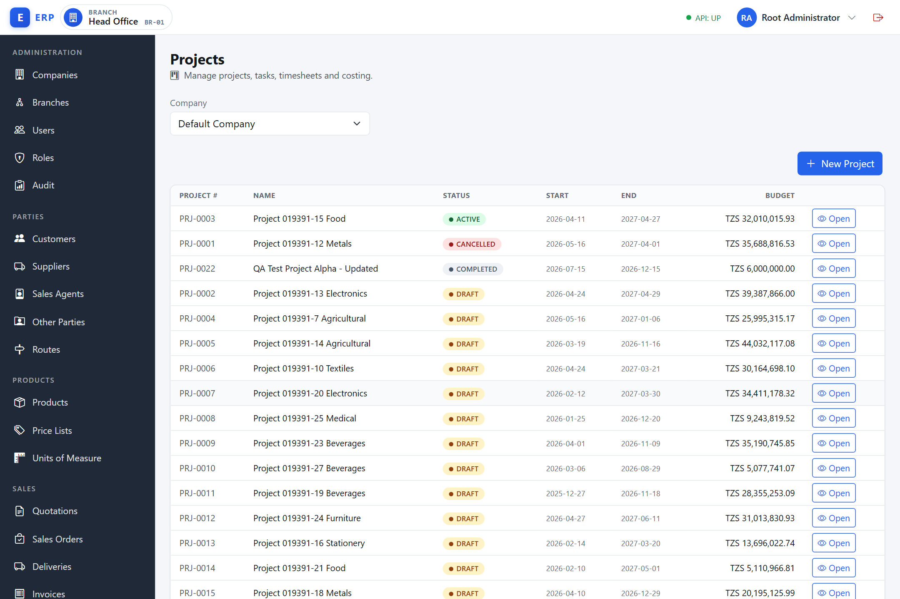
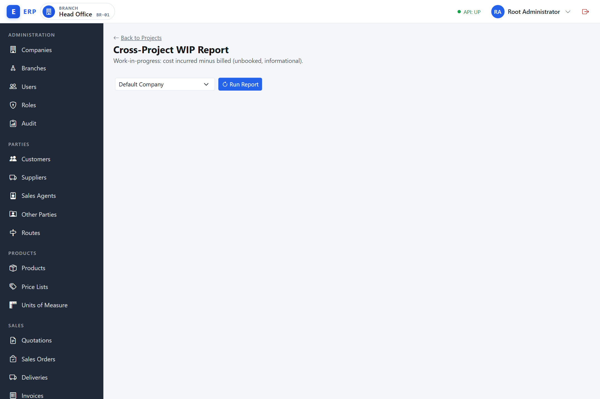

# Projects

**What is the Projects module?**
A project (also called a job) is a discrete unit of work undertaken for a customer or for internal purposes, with its own budget and a defined scope. The Projects module gives the business a **job-costing lens**: it tags costs (materials issued, supplier bills, labour timesheets) and revenues (sales invoices) with a project identifier so that the profit or loss on each individual job can be tracked — not just the company's overall profit. Without job costing, a company knows it made a profit last month but cannot tell which jobs were profitable and which were loss-making. This module does not create a separate cost ledger; instead it adds an analytical tag on the same journal lines the financial modules already post, and the Project P&L is a filtered view of the General Ledger grouped by project. This design guarantees that the project figures always agree with the company's financial statements (ADR-0033).

This chapter covers creating and managing projects, adding tasks, recording time, issuing materials to a project, and viewing the project P&L and the cross-project WIP report. All screens are available from the **Projects** navigation group.

---

## 1. Permissions quick reference

| Task | Permission code required |
|---|---|
| View the project list and project detail | `PROJECTS.PROJECT.VIEW` |
| Create a project | `PROJECTS.PROJECT.CREATE` |
| Edit a project and manage its lifecycle | `PROJECTS.PROJECT.MANAGE` |
| View project tasks | `PROJECTS.TASK.VIEW` |
| Create, edit, and deactivate tasks | `PROJECTS.TASK.MANAGE` |
| View timesheets for a project | `PROJECTS.TIMESHEET.VIEW` |
| Record a timesheet entry | `PROJECTS.TIMESHEET.RECORD` |
| Issue materials to a project | `PROJECTS.ISSUE.CREATE` |
| View the project P&L and WIP report | `PROJECTS.COSTING.VIEW` |

Navigation items are hidden when the corresponding permission is absent. A user who has `PROJECTS.COSTING.VIEW` but not `PROJECTS.PROJECT.VIEW` sees only the WIP Report link.

---

## 2. Project lifecycle

**Why does a project have a lifecycle?**
A project lifecycle controls what actions can be taken at each stage. A Draft project is being set up; costs and timesheets cannot yet be recorded against it. An Active project is open for work. On Hold pauses activity while still allowing ad-hoc material issues if needed. Completed and Cancelled are terminal: once a job is done or abandoned, no more costs can be added (which would distort the final profitability figure). The lifecycle exists to prevent accidental cost postings to the wrong job state and to create a clear audit trail showing when a project was open for charges.

A project passes through a defined set of statuses. The allowed transitions are:

```
DRAFT
  |-- (activate)  --> ACTIVE
  |                     |-- (hold)     --> ON_HOLD
  |                     |                     |-- (resume) --> ACTIVE
  |                     |-- (complete) --> COMPLETED (terminal)
  \-- (cancel)    --> CANCELLED (terminal)
                 (cancel also from ACTIVE, ON_HOLD)
```

- Only **Active** and **On Hold** projects accept material issues and timesheets.
- **Completed** and **Cancelled** are terminal; no further lifecycle transitions are possible.
- A project cannot be moved back to Draft from any other status.

---

## 3. Creating a project

Navigate to **Projects > Projects** (`/admin/projects`) and click **New Project**. An inline create form opens.




1. Enter the **Name** (required, up to 160 characters).
2. Optionally enter a **Budget Amount**, a **Start Date** and **End Date**, and **Notes**.
3. Click **Create Project**.

The create form has only these five fields — there is no customer, manager, or currency input at create time. The budget amount is recorded in the company's base currency.

The project is created with status **Draft** and a system-generated project number (e.g. `PRJ-0001`). A success alert shows the project number.

To set the customer, open the project detail after creation (see section 4.2). (The project manager cannot currently be set from the UI — see section 4.2.)

**Validation.** Project name is required. Name must not exceed 160 characters.

---

## 4. Project detail

Click the **Open** button on any project row to navigate to the project detail screen (`/admin/projects/uid/:uid`). The detail screen is divided into panels:

- **Header** — project number, name, and two status tags (the lifecycle status and the master record status), with the lifecycle action buttons.
- **Project Details** — the always-visible inline edit form (see section 4.2).
- **Tasks** — the list of tasks assigned to this project.
- **Timesheets** — paged list of time entries.
- **Issue Materials to Job** — material and cost issue panel.
- **Project P&L Report** — project profit and loss panel (requires `PROJECTS.COSTING.VIEW`).

The project number is the human identifier shown throughout the UI. The internal identifier appears only in the browser address bar.

### 4.1 Lifecycle actions

The lifecycle-transition buttons shown depend on the current status:

| Current status | Lifecycle-transition buttons available |
|---|---|
| Draft | Activate, Cancel |
| Active | Hold, Complete, Cancel |
| On Hold | Resume, Complete, Cancel |
| Completed | (none — terminal) |
| Cancelled | (none — terminal) |

Click the relevant button to apply the transition immediately. A reason is not required for any transition. The lifecycle buttons appear only when the user holds `PROJECTS.PROJECT.MANAGE`.

The table above lists only the **lifecycle-transition** buttons. The header also shows an **Archive** button independently of the lifecycle status: it appears for any project whose master status is not already **Archived** — including terminal (Completed and Cancelled) projects — whenever the user holds `PROJECTS.PROJECT.MANAGE`. See section 4.3.

### 4.2 Editing the project

There is no separate Edit button. The detail screen always shows an inline **Project Details** card. When the user holds `PROJECTS.PROJECT.MANAGE`, the fields are editable and a **Save Changes** button appears; otherwise the fields are read-only (disabled) and no Save button is shown.

The card contains the following fields:

- **Name**
- **Budget Amount** (in base currency)
- **Start Date** and **End Date**
- **Notes**
- **Customer (optional)** — chosen via the customer picker.
- **Manager (optional)** — chosen via the user picker (hint shows username).

Click **Save Changes** to apply.

> **Known limitation — the Manager picker does not work.** Although the **Manager** picker is shown on the form, the project manager is **never saved**. The backend ignores the submitted manager when creating or updating a project, so picking a manager has no effect and no project manager can be set from the UI today.

> **Known limitation — the Customer and Manager pickers do not pre-fill on load.** When you open a project, the Project Details card loads the Name, Budget, dates, and Notes, but the **Customer** and **Manager** pickers always start blank — even when the project already has a customer linked. Because saving the form sends whatever the picker currently shows, **clicking Save Changes without re-selecting the customer will clear the existing customer link.** If you only need to change another field, re-pick the customer first, or make the edit through a workflow that does not require Save. (Setting the Customer to a value and saving does persist that customer.)

### 4.3 Archiving a project

Click **Archive** (in the header action buttons, available when the user has `PROJECTS.PROJECT.MANAGE`) to move the project to **Archived** master status. Archived projects are hidden from the project list.

Archiving does not change the lifecycle status (a DRAFT project stays DRAFT; it is simply hidden from the list).

> **Note.** The project list has no status filter. It always shows the company's **Active**-master-status projects, so once a project is archived there is currently no way to view it again from the project list UI. (The status tag in the list reflects the lifecycle status — Draft/Active/On Hold/Completed/Cancelled — not the master status.)

---

## 5. Project tasks

**What is a project task?**
A task is a sub-division of a project — a discrete work package within the job. Tasks allow costs and time to be recorded at a more granular level than the project as a whole. For example, a construction project might have tasks for "Foundation Works", "Structural Frame", and "Electrical Installation". When materials are issued or timesheets are recorded, they can be linked to a specific task, which lets the project manager see which parts of the job are over budget or behind schedule. Tasks are optional: if a project is simple enough, all costs and time can be recorded against the project without specifying a task.

Tasks are managed within the **Tasks** panel on the project detail screen. There is no standalone task list screen.

### 5.1 Creating a task

1. In the Tasks panel, click **Add Task**.
2. Enter a **Code** (the task code, up to 30 characters, unique within the project) and a **Name** (up to 160 characters).
3. Enter optional **Planned Hours**.
4. Tick **Billable** if time spent on this task is billable to the customer.
5. Click **Create Task**.

The task is created with **Active** status.

### 5.2 Editing a task

Click the pencil (edit) icon on a task row. The task form reopens pre-filled. You can change the code, name, planned hours, and billable flag. Click **Update Task**.

### 5.3 Deactivating a task

Click the **deactivate** (x) icon on an Active task row. The task moves to **Inactive** status and disappears from the default (Active) task list. Inactive tasks are not deleted and can be viewed by filtering for Inactive tasks via the API. Deactivation is a soft operation. (The x icon is shown only on rows whose status is Active.)

---

## 6. Timesheets

**What is a timesheet entry?**
A timesheet entry records the hours a person worked on a project on a given day. In this module, timesheet entries are **informational** rather than financial: they are stored and shown on the project but they do not post a labour cost to the General Ledger (in v1, actual labour cost reaches the project P&L through payroll journals tagged to the project, not through timesheet entries directly). Timesheets are used to track planned vs actual hours, monitor workforce utilisation, and support billing for time-and-materials projects. Entries are permanent once recorded: they cannot be edited or deleted.

Timesheets record hours worked against a project (and optionally a specific task). They are managed within the **Timesheets** panel on the project detail screen.

### 6.1 Recording a timesheet entry

1. In the Timesheets panel, click **Record Time**.
2. Enter the **User ID** (the numeric user identifier — ask your administrator if you do not know it).
3. Enter the **Work Date** (yyyy-MM-dd).
4. Enter the **Hours** (decimal; minimum 0.01).
5. Optionally enter a **Rate (optional)** — an informational planned rate; it is stored but does not post any GL entry.
6. Optionally pick a **Task (optional)** from the picker to link the entry to a specific task.
7. Optionally enter **Notes**.
8. Tick **Billable** if the time is billable.
9. Click **Record**.

The timesheet entry is appended to the panel list. Time entries are permanent; they cannot be edited or deleted after recording.

**Validation.** User ID, Work Date, and Hours are required. Hours must be greater than zero.

### 6.2 Viewing timesheets

The Timesheets panel lists entries with columns **Date**, **User** (shown as the user's display name), **Hours**, **Billable**, and **Notes**. Entries are shown in pages of 20; use the paginator (First, Previous, page numbers, Next, Last) to move between pages.

---

## 7. Issuing materials to a project

**What is a material issue to a job?**
Issuing materials to a project is the act of transferring stock items from the warehouse to a specific job. When you issue materials, three things happen simultaneously: (1) the stock quantity is reduced at the current branch; (2) the stock value (based on the product's current moving-average cost) is transferred from the Inventory balance sheet account to Cost of Sales on the profit and loss account; and (3) the GL entry is tagged with the project identifier, so the cost appears in the project P&L under the "Material" cost type. This is how the cost of physical materials consumed on a job is tracked. Without issuing materials, materials pulled from the store for a job would remain as stock on the balance sheet even though they have been consumed, overstating inventory and understating job costs.

The **Issue Materials to Job** panel on the project detail screen records the issue of stock items to the project. The issue deducts stock and posts a COGS entry tagged to the project.

Materials can only be issued to **Active** or **On Hold** projects. The panel is hidden for Draft, Completed, and Cancelled projects (and also requires `PROJECTS.ISSUE.CREATE`).

### 7.1 Recording an issue

1. Open the project detail (status must be Active or On Hold).
2. In the Issue Materials to Job panel, click **Issue Materials**.
3. For each item line:
   - Pick the **Product** from the picker (hint shows the product code). Only GOODS (stockable) products are valid.
   - Enter the **Qty**.
   - Click **Add Line** to add another line.
4. Optionally enter an **Issue Date (optional)** and a **Reason (optional)**.
5. Click **Issue to Job**.

The system generates an issue number (e.g. `PJI-0001`). A success banner then appears in the panel showing the issue number, the **total value** issued (with its currency), and a **View COGS Entry** link that opens the posted GL journal entry.

For each line, the system:

1. Deducts the quantity from stock at the current branch.
2. Values the issue at the product's current moving-average cost.
3. Posts a GL entry: DR Cost of Sales / CR Inventory.
4. Tags the stock movement and GL entry with the project (and task if specified) dimension.

**Cost-skipped lines.** If a product has no established average cost, the quantity is still deducted from stock but no GL cost entry is posted. An anomaly is logged. The line appears in the issue with a value of zero.

**Validation.** At least one line is required. Product and quantity are required per line. Quantity is treated as a positive magnitude regardless of sign.

---

**Example — Issue materials to a construction job and verify stock deduction:**

Project manager Salma Abdallah is running project `PRJ-0007` (Kariakoo Office Fit-Out), status **Active**. The site team needs electrical cables and paint for the first week.

1. Navigate to **Projects › Projects** (`/admin/projects`), click **Open** on `PRJ-0007` to open the detail at `/admin/projects/uid/:uid`.
2. Scroll to the **Issue Materials to Job** panel. Click **Issue Materials**.
3. Add lines:
   - Product: `Electrical Cable 2.5mm (ELC-025)`, Qty: `150` (metres).
   - Product: `Interior Paint 20L (PNT-INT)`, Qty: `8` (tins).
4. Issue Date: `2026-06-10`; Reason: `Week 1 site works`. Click **Issue to Job**.
5. System generates issue `PJI-0014`. For each line:
   - 150 metres of cable deducted from stock at DSM Branch at the cable's current moving-average cost (TZS 4,200/m = TZS 630,000).
   - 8 tins of paint deducted at TZS 38,500/tin = TZS 308,000.
   - GL entries posted: DR Cost of Sales / CR Inventory, each tagged to project `PRJ-0007`.
6. Total materials issued: TZS 938,000. The project's P&L now reflects this cost under the **Material** cost type.

---

## 8. Project P&L

**What is the Project P&L, and what does it show?**
The Project P&L (Profit and Loss) is a filtered view of the General Ledger that shows only the income and costs tagged to a single project. Revenue is the total of sales invoices tagged to the project; cost is broken down by type — Material (stock issues and goods purchases), Labour (payroll entries tagged to the project), Subcontract (service supplier bills), Overhead (other expense bills), and Other. The margin is the difference between revenue and total cost. The **WIP (Work in Progress)** figure shows how much cost has been incurred that has not yet been matched by billing: it represents work done but not yet invoiced, which sits as an asset on the balance sheet until the customer is billed. The budget variance shows whether the job is tracking above or below its planned cost. A Reconciliation bar confirms that the P&L figures are consistent with the underlying GL postings.

The **Project P&L Report** panel is shown when the user holds `PROJECTS.COSTING.VIEW`. Click **Load P&L** in the panel to run the report. It then displays as a set of KPI tiles plus a cost-by-type table and a reconciliation bar:

| KPI / section | Contents |
|---|---|
| Revenue | Total income tagged to this project from GL |
| Total Cost | Sum of all cost lines |
| Margin | Revenue − Total Cost, with the margin % shown beneath (blank if no revenue) |
| WIP (unbooked) | max(0, Total Cost − Revenue) — unbilled cost |
| Budget | The planned budget set on the project |
| Budget Variance | Budget − Total Cost |
| Cost by Type | A table of subtotals per cost type (Material, Labour, Overhead, Subcontract, Other) |
| Reconciliation | Computed totals from the project ledger vs GL account totals |

The reconciliation bar shows **Reconciliation OK** when the computed figures match the GL figures. If they do not, it shows **Reconciliation MISMATCH** with the computed-vs-GL revenue and cost figures — this indicates a system defect requiring finance/support review.

---

**Example — View the project P&L mid-project and check the WIP balance:**

Three weeks into project `PRJ-0007` (Kariakoo Office Fit-Out), Salma Abdallah wants to check profitability before the final billing.

1. Open the project detail at `/admin/projects/uid/:uid` for `PRJ-0007`.
2. In the Project P&L Report panel, click **Load P&L** (requires `PROJECTS.COSTING.VIEW`). The panel loads:

| Section | Amount (TZS) |
|---|---|
| Revenue | 3,500,000 |
| Cost — Material | 2,175,000 |
| Cost — Labour | 840,000 |
| Cost — Overhead | 120,000 |
| Total Cost | 3,135,000 |
| Gross Margin | 365,000 |
| Margin % | 10.4% |
| Budget | 4,200,000 |
| Budget Variance | +1,065,000 (cost below budget) |
| WIP | 0 (Revenue > Cost) |

The reconciliation bar shows **Reconciliation OK** — the project ledger ties to the GL account totals. Revenue of TZS 3.5M was posted via a sales invoice tagged to this project; costs include the two material issues (TZS 938,000 from week 1 + TZS 1,237,000 from week 2) plus labour timesheets. Since revenue exceeds total cost, WIP is zero. Salma notes the healthy margin and continues to the next billing milestone.

---

## 9. Cross-project WIP report

**What is the WIP report, and who uses it?**
The WIP (Work in Progress) report is a company-wide summary that shows, for every project, how much cost has been incurred versus how much has been billed. WIP represents costs that have been spent but not yet recovered from the customer — it is an asset (money owed back to the company through future billing) and it appears on the balance sheet. Finance managers and project directors use the WIP report at month-end to understand the total unbilled exposure across all jobs, to flag jobs that are heavily over-cost relative to billing, and to support the preparation of interim billing or progress claims. A project with high WIP and low revenue may indicate that billing is overdue.

Navigate to **Projects > WIP Report** (`/admin/projects/wip-report`); the screen is titled **Cross-Project WIP Report**. Requires `PROJECTS.COSTING.VIEW`.




1. Select the **Company** (the selector is shown only when you belong to more than one company).
2. Click **Run Report**.

The report lists the company's active projects that have WIP (cost incurred greater than billed), showing:

| Column | Contents |
|---|---|
| Project # | Human project number |
| Name | Project name |
| Cost Incurred | Total cost posted to the project |
| Billed | Total revenue or billings tagged to the project |
| WIP | max(0, Cost Incurred − Billed) |
| (Actions) | An **Open** button (eye icon) that navigates to the project detail |

A footer row shows the totals (Cost Incurred, Billed, WIP) across all listed projects. When no project has WIP, the panel shows "No active projects with WIP for the selected company."

The WIP report is not paginated. All projects are shown in a single list.

---

## 10. Frequently asked questions

**Can I issue materials to a project that is On Hold?**
Yes. Both Active and On Hold projects accept material issues and timesheet entries. Issue is blocked only for Draft, Completed, and Cancelled projects.

**What happens if I complete a project with open WIP?**
Completing a project changes its status to Completed but does not post any accounting entries. Open WIP remains on the balance sheet until it is cleared by a billing entry or a journal.

**Can I record timesheets against a Completed project?**
No. Timesheet recording (and material issue) requires the project to be Active or On Hold.

**Why does my issue have zero value for some lines?**
The product had no established moving-average cost at the time of issue. The quantity was deducted from stock, but the COGS entry was skipped. Set an opening valuation for the product (see the Inventory chapter) and then record the cost via a manual GL journal for this issue.

**What does the WIP balance on the P&L represent?**
WIP (Work in Progress) is the cost incurred on the project that has not yet been matched by revenue or billing. It represents an asset on the balance sheet — costs that are recoverable but not yet recognised as expense. Once the project is billed and revenue is recognised, the WIP reduces to zero.

**Can I reopen a Completed or Cancelled project?**
No. These are terminal statuses. If you need to continue work on the project, create a new project and reference the original project number in the notes.
