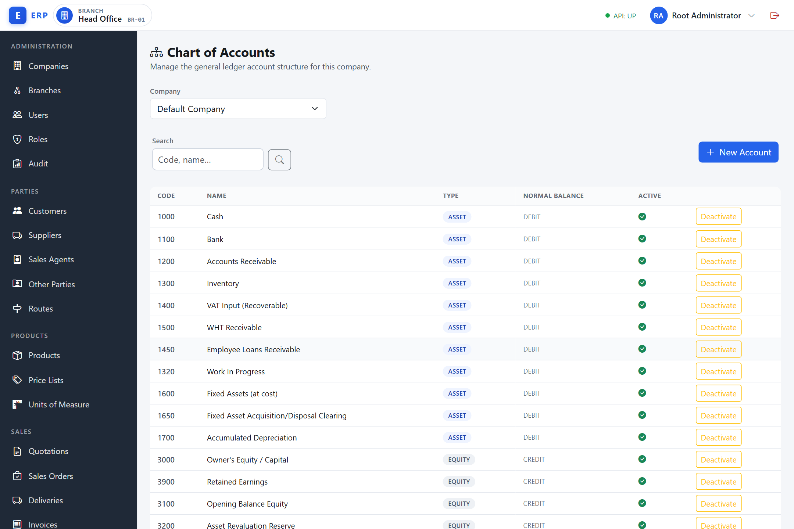
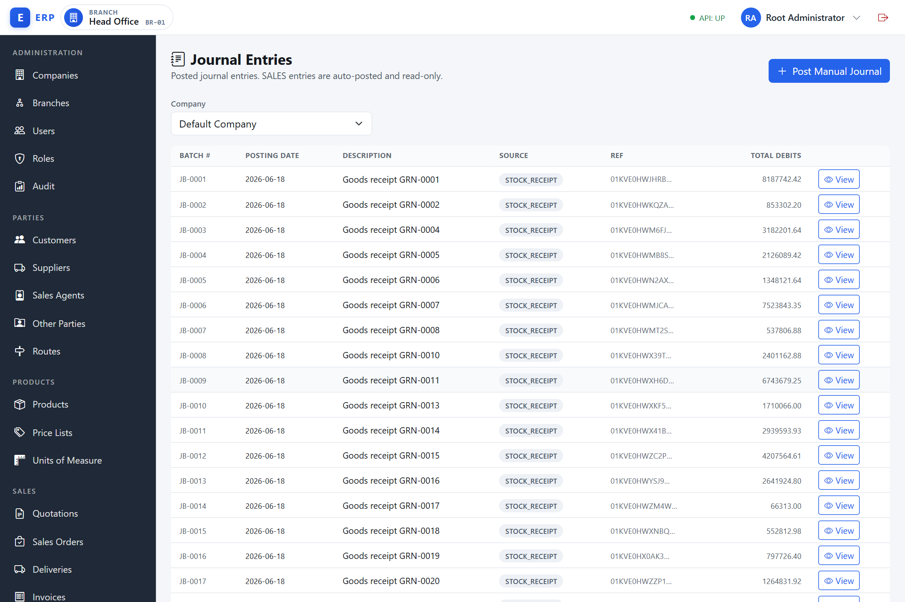
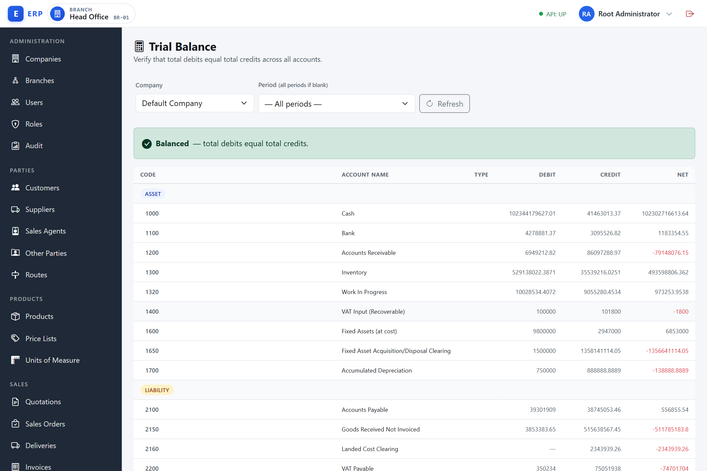
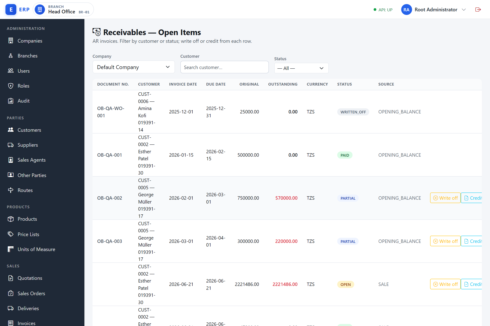
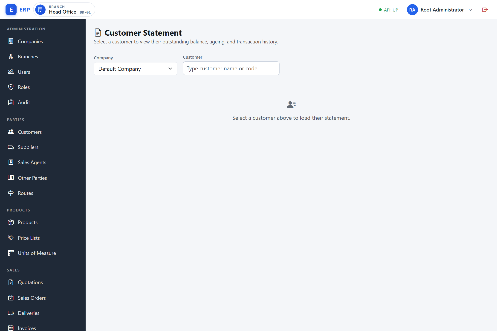
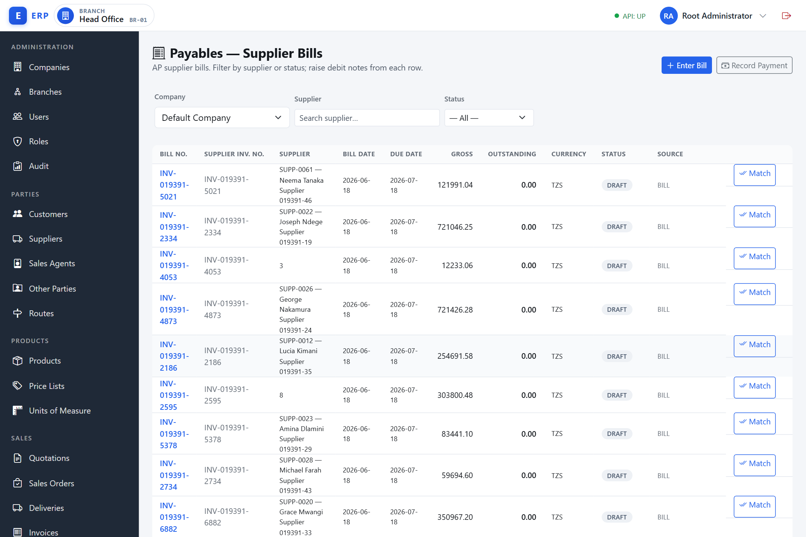
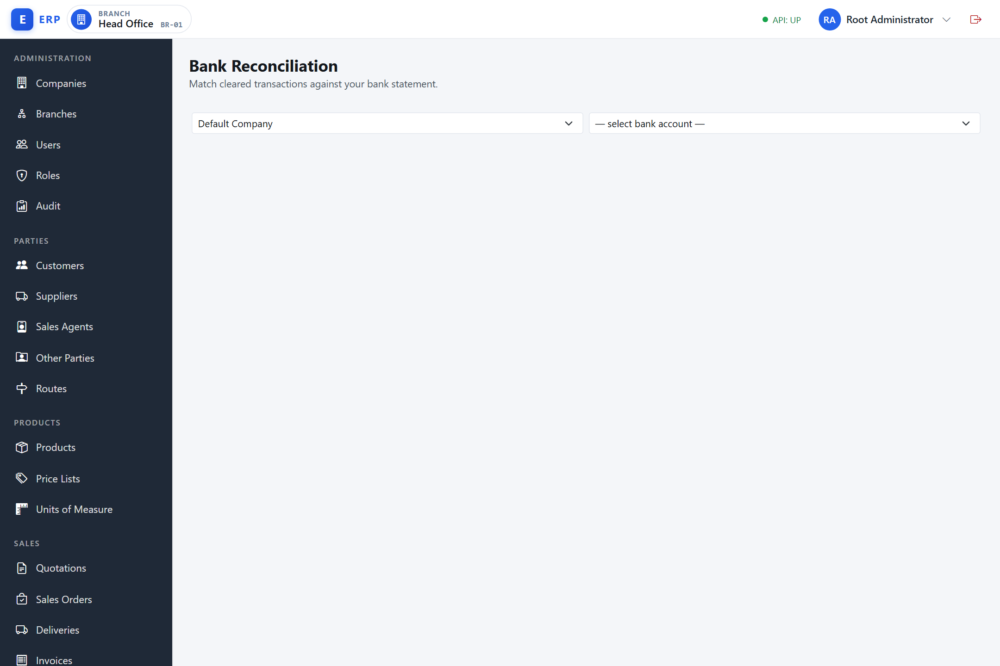
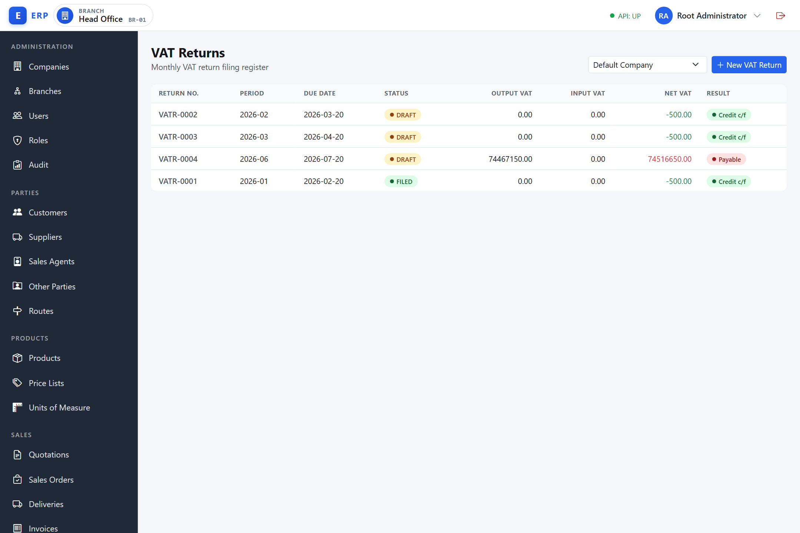
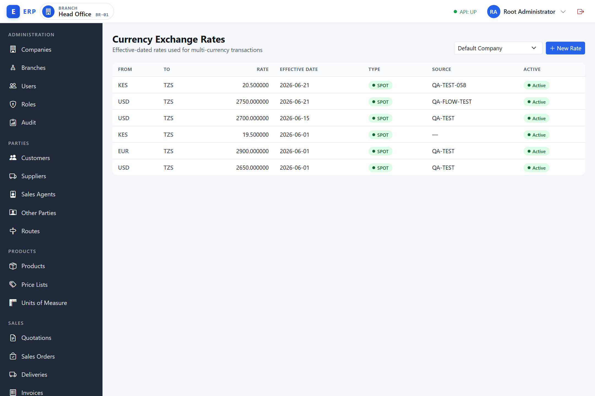

# Finance & Accounting

This chapter covers every module available under the **Accounting** navigation group: General Ledger, Accounts Receivable, Accounts Payable, Cash & Bank, Tax, and Foreign Exchange (FX). The chapter is written for finance staff — accountants, AP/AR clerks, and treasury officers — who use the system day-to-day.

> **Currency fields.** Most currency fields in this chapter (receipts, opening balances, supplier bills, credit notes, and so on) use the filtered **Currency Picker** — a dropdown limited to the company's enabled currencies and pre-set to the company default, where you do not type a 3-letter currency code. This is documented once in Chapter 0 (Getting Started) → *Common UI Patterns*; this chapter only points to it. Two screens are exceptions: the AP **debit-note** modal has no currency field at all (it follows the bill's currency), and the **FX Exchange Rate** form offers the full seeded currency list (not the enabled-only allow-list) and falls back to typing a 3-letter ISO code if that list fails to load — see *Maintaining Currencies and Rates*.

> **Concurrency and error handling.** If two users edit the same record at once, the second save is rejected with a `409 Conflict` and a retryable "please retry" message — reload and try again. Bad input and data-integrity problems surface as clean `400`/`409`/`415` alerts, not raw server errors. These responses apply across all finance screens and are referenced throughout this chapter.

---

## General Ledger

The **General Ledger (GL)** is the central book of record for your company's finances. Think of it as the master filing system into which every financial event — a sale, a payment, a bank transfer, a year-end adjustment — is eventually recorded as a pair of entries. Every other finance module in this system (AR, AP, Cash & Bank, VAT) feeds its financial effect into the GL. If you want to know "where does the company stand financially right now?", you read the GL; if you want to understand what produced that position, you trace back through the documents that posted to it.

The GL works on the principle of **double-entry bookkeeping**, explained below. Two prerequisites must exist before any posting can happen: a **Chart of Accounts** (the master list of ledger accounts) and at least one open **Fiscal Period** (the calendar gate that controls which dates accept entries).

---

### Chart of Accounts

**What it is.** The Chart of Accounts (CoA) is the master list of all GL accounts for your company. Every financial event in the system is expressed as movements between two or more of these accounts. An account is simply a named bucket that collects amounts of a particular kind — "Cash", "Accounts Receivable", "Sales Revenue", "VAT Payable", etc.

**Why it exists.** Without a structured account list, the books would be an unclassified mass of transactions with no way to produce a trial balance, profit-and-loss statement, or balance sheet. The CoA is the taxonomy that turns a log of transactions into a set of readable financial statements. Each account is assigned one of five **types** (ASSET, LIABILITY, EQUITY, INCOME, EXPENSE), which determines where it appears on financial reports and what its **normal balance** is.

**Understanding account types and normal balances.** The five types map to the two sides of the balance sheet and the profit-and-loss statement:

| Type | What it represents | Normal Balance |
|---|---|---|
| ASSET | Things the company owns or is owed (cash, receivables, inventory) | DEBIT |
| LIABILITY | Amounts the company owes to others (payables, VAT due) | CREDIT |
| EQUITY | The owners' stake in the business (capital, retained earnings) | CREDIT |
| INCOME | Revenue earned | CREDIT |
| EXPENSE | Costs incurred | DEBIT |

A "normal balance" tells you which side — debit or credit — makes the account go up. An ASSET account increases with a debit and decreases with a credit; a LIABILITY account increases with a credit and decreases with a debit. The system derives and stores the normal balance automatically from the account type, so you never need to set it manually.

**Double-entry bookkeeping in plain language.** Every financial event is recorded as at least two entries — one account is debited (left side) and another is credited (right side) — and the total debits across all lines must always equal the total credits. This is the fundamental rule: **debits = credits in every transaction**. The system enforces this; the Post button is disabled until the entry balances. Why? Because a debit to one account must come from somewhere, and a credit to another must go somewhere. Money does not appear or disappear — it moves. A sale, for example, debits Accounts Receivable (the customer owes more) and credits Sales Revenue (income goes up) and VAT Payable (the tax liability goes up). The two sides always balance because they are two perspectives on the same event.

**When it is used.** The CoA is set up before any other finance work begins and is maintained by a user with the `GL.MANAGE` permission whenever a new account category is needed. Once created, accounts are available immediately for posting.

Navigate to **Accounting > Chart of Accounts** (`/admin/gl/accounts`).

The table shows:

| Column | Meaning |
|---|---|
| Code | Unique account code assigned at creation |
| Name | Human-readable account name |
| Type | One of: **ASSET, LIABILITY, EQUITY, INCOME, EXPENSE** |
| Normal Balance | Derived from type — ASSET and EXPENSE accounts carry a **DEBIT** normal balance; LIABILITY, EQUITY, and INCOME accounts carry a **CREDIT** normal balance. Not user-editable. |
| Status | ACTIVE or INACTIVE |

**Control accounts and manual-posting protection.** Some accounts are owned by a sub-ledger and must never be touched by a hand-entered journal. Each account therefore carries two additional, related properties:

- A **control-type classification** — one of `AR`, `AP`, `BANK`, `CASH`, `INVENTORY`, `TAX`, `PAYROLL_CLEARING`, `FX_CLEARING`, or none (an ordinary account). A non-null control type marks the account as owned by a specific sub-ledger (for example, the AR control account is the GL mirror of the receivables sub-ledger).
- An **allow manual posting** flag. When this is off, a manual journal (or a direct cash/bank entry) that targets the account is rejected. Genuine sub-ledger controls — AR, AP, INVENTORY, TAX, PAYROLL_CLEARING, FX_CLEARING — are locked this way so a stray manual entry cannot silently break the sub-ledger reconciliation. **CASH and BANK control accounts are deliberately left postable**, because bank charges, interest, and corrections legitimately need direct cash/bank entries (see Direct Cash/Bank Entries).

The practical effect is that a manual journal line (and a direct cash-entry counter account) targeting a locked control account is refused with a `409 Conflict` and a message naming the account and its control type — see *Posting a Manual Journal* below.

**Required dimensions per account.** An account may also be flagged to require a **cost-centre**, **department**, or **project** dimension on every *manual* journal line that posts to it. A manual line missing a required dimension is rejected, naming the account and the missing slot. System and event-driven postings (sales, AP/AR settlement, inventory, payroll, depreciation, FX, year-end close) are exempt — they do not carry operator dimension context. This per-account control is independent of the company-wide mandatory-dimension setting (see *Cost-Centre Dimensions*).

> The control-type classification, the allow-manual-posting flag, and the per-account required-dimension flags are administered on the account record. The Chart of Accounts list itself shows Code, Name, Type, Normal Balance, and Active.

**To create an account** (requires permission `GL.MANAGE`):

1. Click **New Account**.
2. Enter a unique **Code** and **Name**.
3. Choose the account **Type**. The system derives the normal balance automatically.
4. Click **Create**. The new account is immediately available for journal posting and GL config mapping.

> **Note:** The Chart of Accounts list does not expose an edit screen for an existing account's name or type — the only row actions are **Deactivate** and **Reactivate** (below). Editing the name or type of an account already in use is not available in the current UI.

**To deactivate an account** (requires `GL.MANAGE`):

1. Click **Deactivate** on the row.
2. The account becomes inactive and disappears from all posting pickers.
3. An inactive account can be reactivated by clicking **Reactivate** on its row.

> **Note:** Deactivation is soft — the account record is never deleted. No posting can be made to an inactive account (business rule BR-GL-04).

---

### Posting a Manual Journal

**What it is.** A journal entry is the fundamental unit of posting: a dated, described set of two or more lines that debit and credit specific accounts in balanced amounts. A **manual journal** is one that you compose directly, as opposed to a journal that the system creates automatically (for example, when a sale is finalised or a receipt is recorded). Manual journals are used for accounting adjustments, accruals (recording an expense before the invoice arrives), prepayment amortisation, and error corrections.

**Why it exists.** The automated posting paths cover the main transaction types, but accountants always need a mechanism to make entries the system cannot anticipate — month-end accruals, depreciation write-downs, inter-account reclassifications, and period-end corrections. Manual journals provide this escape valve under controlled, permission-gated conditions.

**When it is used.** Typically at month-end by an accountant or finance manager who holds the `GL.POST` permission. Common triggers include: preparing for period close, recording a provision, or correcting a misposting discovered in review.

**How it works.** A manual journal posts directly (there is no draft state). You compose the lines, verify that debits equal credits, and click Post. The system validates the balance, checks that each account is active, enforces the control-account and required-dimension guards (below), and checks that the posting date falls inside an open fiscal period. If everything passes, a batch number (`JB-####`) is assigned, the entry is written to the ledger, and it is immediately immutable. Corrections are made by reversal (see below), never by editing. The journal is then visible in the journal list and feeds the trial balance.

Whatever you do here is always recorded with source type **MANUAL**. This endpoint cannot post a system source type (SALES, AR_RECEIPT, YEAR_END_CLOSE, etc.); those are produced only by their originating modules. Because the entry is MANUAL, the control-account and per-account required-dimension guards always apply to every line:

- **Control-account guard.** A line may not target a locked sub-ledger control account — AR, AP, INVENTORY, TAX, PAYROLL_CLEARING, or FX_CLEARING. Such a line is rejected with a `409 Conflict` naming the account and its control type. (CASH and BANK control accounts remain postable.) The same guard applies whether the account is locked via its **allow manual posting** flag or via its **control-type** classification.
- **Required-dimension guard.** If a target account is flagged to require a cost-centre, department, or project dimension, a manual line missing that dimension is rejected, naming the account and the missing slot.

Navigate to **Accounting > Journals** (`/admin/gl/journals`) and click **Post journal** (`/admin/gl/journals/post`).

The Journal Entries list shows every posted batch — its batch number, posting date, description, source (MANUAL or a system source such as STOCK_RECEIPT or SALES), reference, and total debits — with a **View** action on each row and a **Post Manual Journal** button at the top right. SALES and other system entries are auto-posted and read-only; only MANUAL entries you compose here can later be reversed.

**Requirements before posting (requires permission `GL.POST`):**

- At least two active accounts must exist.
- The posting date must fall inside an **OPEN** fiscal period.
- Total debits must equal total credits (the entry must be balanced — business rule BR-GL-01).

**Steps:**

1. Set the **Posting Date** (defaults to today). Verify it falls within an open period.
2. Enter a **Description** summarising the purpose of the entry. Optionally add a **Source Reference** (e.g. a supporting document number).
3. Each line requires exactly one of a debit or credit amount (not both — business rule BR-GL-08).
   - Use the **Account** dropdown on each line to select an account (shown as `code — name`). Only active accounts are listed.
   - Enter the **Debit** or **Credit** amount for that line, and an optional line **Memo**.
4. The form shows running **Debits**, **Credits**, and **Difference** totals and a **Balanced** indicator. The **Post Journal** button remains disabled until the difference is exactly zero.
5. Click **Post Journal**. A success message shows the generated batch number (`JB-####`). You are redirected to the journal detail page.

**Adding and removing lines:**

- Click **Add Line** to insert another line.
- Click the remove (trash) icon on a line to delete it. The minimum is two lines.

**Validation errors surfaced by the server:**

- Unbalanced entry (BR-GL-01) — total debits do not equal total credits.
- Too few lines (BR-GL-01) — a journal needs at least two lines.
- Line not one-sided (BR-GL-08) — a line carries both a debit and a credit, or neither, or a negative amount.
- Inactive account (BR-GL-04) — choose an active account.
- Wrong company account (BR-GL-05) — the account belongs to a different company.
- Closed period (BR-GL-03) — the posting date is in a closed or missing fiscal period.
- Control account rejected (`409 Conflict`) — the line targets a locked control account (AR, AP, INVENTORY, TAX, PAYROLL_CLEARING, or FX_CLEARING) or an account whose **allow manual posting** flag is off. Choose a non-control account. (CASH/BANK control accounts are exempt.)
- Missing required dimension (`409 Conflict`) — the target account requires a cost-centre, department, or project dimension and the line did not supply it.
- Wrong-base-currency line (BR-GL-06) — journal lines post in the company base currency only.
- Concurrent edit (`409 Conflict`) — another change to the same data landed first; retry the action (see *Concurrency and error handling*).

---

### Reversing a Manual Journal

**What it is.** A reversal is a new journal entry that mirrors an existing one exactly but with every debit and credit swapped. The result is that the two entries cancel each other out on every account, leaving the books as if the original entry had never been made.

**Why it exists.** The GL is **append-only**: once a journal is posted, it cannot be edited or deleted. This is not a limitation — it is a deliberate design principle that protects the integrity of the audit trail. Any change to a posted entry would make it impossible to reconstruct what the books showed at a prior date. Reversal solves the problem by adding a counteracting entry, so the historical record shows both the original entry and the correction, and investigators can see exactly what happened.

**When it is used.** When you discover that a manual journal was posted to the wrong account, with the wrong amount, or in error. The reversal is initiated by the same user who posted (or any user with `GL.POST`), typically at month-end during review.

**How it works.** A reversal defaults to today's date (the reversal date — an explicit date can be supplied), references the original entry via a `Reversal Of` link, and posts with source type MANUAL. When a reason is supplied it is preserved in the reversal entry's description (`Reversal of entry <uid> — <reason>`). Because it is the exact swap of a balanced entry, the reversal is balanced by construction. It lands in its own open fiscal period. The original and the reversal coexist permanently in the ledger. An entry can be reversed only once: a second attempt to reverse the same entry, or an attempt to reverse a reversal entry, is refused with a `409 Conflict` (BR-GL-11).

Corrections to a posted journal are always made by **reversal** — a new entry with every line's debit and credit swapped. The ledger is append-only; the original entry is never modified.

**To reverse a journal (requires `GL.POST`):**

1. Open the journal detail from **Accounting > Journals**.
2. If the entry has `Source Type = MANUAL` and is not itself a reversal, the **Reverse Entry** button is visible.
3. Click **Reverse Entry**. A new journal is created immediately (defaulting to today as the reversal date) with all amounts swapped. The reversal entry links back to the original and is flagged as a **Reversal entry** on its detail page.

> System-posted entries (source types such as SALES, OPENING\_BALANCE, YEAR\_END\_CLOSE) cannot be reversed here — the **Reverse Entry** button is shown only for MANUAL entries that are not themselves reversals. Correct system-posted entries through their originating module. Already-reversed entries and reversal entries cannot be reversed again (`409 Conflict`, BR-GL-11).

---

### Fiscal Periods (Open/Close)

**What they are.** The fiscal calendar divides the financial year into monthly accounting periods. Each period has a start date, an end date, and a status (OPEN or CLOSED). A **fiscal year** groups twelve such periods.

**Why they exist.** Without period gates, journals could be posted with any date — including dates months or years in the past — which would silently change already-reported figures. Closing a period locks it: no new posting can land in a closed period, so the financial statements for that period are frozen once it closes. This is essential for accurate monthly reporting, auditing, and regulatory filing.

**When they are used.** The finance manager opens a new fiscal year once before it begins (or at system setup). Periods are closed at month-end by a user with the `GL.PERIOD.CLOSE` permission, usually after reconciliations are complete and the month's reports have been approved.

**How they work.** Each fiscal period covers one calendar month. A posting is accepted only when its posting date falls inside an OPEN period. The system derives which period a date belongs to automatically. Closing a period is reversible (a period can be reopened if a late adjustment is needed); closing the entire fiscal year is a separate, more final operation (see Year-End Close below).

Navigate to **Accounting > Fiscal Periods** (`/admin/gl/periods`).

The screen shows two panels:

- **Fiscal Years** — each year with its code and current status (OPEN or CLOSED).
- **Fiscal Periods** — the twelve monthly periods within the selected year, each showing period number, date range, and status.

**Opening a new fiscal year (requires `GL.MANAGE`):**

1. Click **Open fiscal year**.
2. Enter a unique year code (e.g. `FY2027`), the start month (1 = January), and the calendar year.
3. Click **Open Year**. Twelve monthly periods are created, all in OPEN status.

**Closing a fiscal period (requires `GL.PERIOD.CLOSE`):**

1. On a period row, click **Close**.
2. The period status changes to CLOSED. No further journal postings can be made into a closed period.

**Reopening a period (requires `GL.PERIOD.CLOSE`):**

1. On a CLOSED period row, click **Reopen**.
2. The period returns to OPEN and accepts journal postings again.

> Closing a period is reversible. Closing a fiscal **year** is a separate, more permanent action (see Year-End Close below).

---

### Trial Balance

**What it is.** The Trial Balance is a summary report that lists every GL account with its total debits, total credits, and net balance for a selected period. It is the most direct proof that double-entry has been maintained: if the system's books are correct, the grand total of all debit balances must equal the grand total of all credit balances.

**Why it exists.** The trial balance is the starting point for preparing financial statements (profit-and-loss, balance sheet) and for period-end review. It lets an accountant see every account's movement in one view, spot unexpected balances, and confirm that no unbalanced entries have slipped through.

**When it is used.** Typically at month-end review and before period close, by an accountant or finance manager holding the `GL.VIEW` permission. It can also be run at any time for a diagnostic check.

**How it works.** The system aggregates all journal line amounts by account, grouping them by the account type in canonical order (ASSET, LIABILITY, EQUITY, INCOME, EXPENSE). A balanced set of books shows total debits = total credits in the footer. A non-zero difference is a finance-grade defect requiring investigation.

Navigate to **Accounting > Trial Balance** (`/admin/gl/trial-balance`).

- Select your company (if multi-company).
- Optionally select a specific **fiscal period** to view only that period's movements.
- The table groups accounts by type in canonical order (ASSET, LIABILITY, EQUITY, INCOME, EXPENSE) and shows each account's code, name, total debit, total credit, and net balance.
- The footer shows total debits, total credits, and a **Balanced** indicator. A balanced set of books shows equal debits and credits.

Permission required: `GL.VIEW`.

---

### GL Posting-Account Config

**What it is.** The GL Config is a mapping table that tells the system which specific account in your Chart of Accounts to use when it needs to post automatically. For example, when a sales invoice is finalised, the system needs to know which account is your "Accounts Receivable" control account and which is your "Sales Revenue" account. GL Config provides those answers.

**Why it exists.** Hardcoding account codes into the system software would force every business to use identical account numbers, which is impractical. GL Config externalises that mapping, letting you point each posting role to whatever account you have created in your CoA. A missing mapping fails the posting loudly (an error is raised) rather than posting to a wrong or null account.

**When it is used.** Set up once during initial configuration by a user with `GL.MANAGE` permission. Revisited when account restructuring changes the CoA.

**How it works.** Each config key represents a posting role. The system resolves the relevant key at the moment it needs to post, reads the mapped active account, and uses it as the debit or credit leg of the automatic journal. If the mapped account is inactive or the mapping is missing, the posting fails and the operator is notified to fix the mapping.

Navigate to **Accounting > GL Config** (`/admin/gl/config`). The page is headed **Posting Accounts**.

Permission required: `GL.MANAGE`.

The table shows each configuration key and the currently mapped account. The keys relevant to the core modules include:

- `ACCOUNTS_RECEIVABLE` — the AR control account
- `SALES_REVENUE` — the revenue account for sales auto-posting
- `VAT_PAYABLE` — the output VAT control account
- `CASH` — the default cash posting account
- `RETAINED_EARNINGS` — required for the year-end close

**To set or change a posting account:**

1. Click **Edit** on the key row (or **Add Posting Account** to map a new key). The inline form opens, titled **Set Posting Account —** followed by the config key.
2. Pick the account from the **Account** dropdown (shown as `code — name (type)`). Only active accounts are listed.
3. Click **Save**. The mapping takes effect immediately.

> All four sales keys (`ACCOUNTS_RECEIVABLE`, `SALES_REVENUE`, `VAT_PAYABLE`, `CASH`) must be configured before sales invoices can be auto-posted to the GL.

---

### Cost-Centre Dimensions

**What they are.** Dimensions (also called **cost centres** or **department codes**) are analysis tags that can be attached to journal lines. They do not change which account a posting hits — the account, amount, and double-entry balance are completely unaffected. Instead, they let you slice the books by a management category: "Which department incurred this expense?", "Which cost centre drove this revenue?".

**Why they exist.** The main GL accounts give a company-level view of the books, but management typically needs to see performance broken down by department, branch, project, or profit centre. Dimensions provide that without multiplying the number of GL accounts (one account per department would make the CoA unmanageable). They are the analytical layer on top of the financial layer.

**When they are used.** Dimension values can be tagged on manual journal lines (per line) through the API, and are inherited automatically from source documents (sales invoices, supplier bills, stock adjustments). Finance or operations staff with `COSTING.MANAGE` permission maintain the dimension value master. Reporting users with `COSTING.VIEW` and `GL.VIEW` run the dimension-sliced trial balance.

> **UI limitation.** The **Post Journal** screen does not expose a cost-centre, department, or project picker on its lines — each line carries only an account, a debit or credit amount, and a memo. Per-line dimension tagging (and therefore posting to an account that requires a dimension) is currently an API/integration capability only; a manual post from the screen to a require-dimension account is rejected with no UI way to supply the value.

**How they work.** The system seeds two built-in dimension types: **Cost Centre** and **Department**. Alongside these, every company has two further, initially-unused dimension **slots** ("Dimension 3" and "Dimension 4") that a user with `COSTING.MANAGE` can manually claim for a custom dimension — see *Adding a Custom Dimension* below. Whichever type a dimension slot holds, you create the actual values under it (e.g. "Sales Dept", "Nairobi Branch"). A dimension type can be made **mandatory** on manual journal entries, in which case every manually posted line must carry a value for that slot — system-automated postings (sales, year-end, etc.) are exempt. The dimension-sliced trial balance groups account balances by dimension value, giving a department-level or cost-centre-level P&L.

Navigate to **Accounting > Cost Centre > Dimensions** (`/admin/cost-centre/dimensions`).

**Dimension types** are pre-seeded per company: **Cost Centre** and **Department** are **built-in** (shown with a lock icon in the **Built-in** column) and can never be created, renamed, or deleted. A company also has two spare custom slots — while a slot is free, a user with `COSTING.MANAGE` can claim it with a custom dimension type of their own naming (see below). Every dimension type, built-in or custom, can only have its **mandatory** flag toggled afterwards — there is no rename or delete. Navigate to **Accounting > Cost Centre > Values** (`/admin/cost-centre/values`) to manage the actual dimension values.

**Adding a custom dimension (requires `COSTING.MANAGE`):**

**What it is.** A custom dimension is a company-defined dimension type — for example "Project" or "Region" — that claims one of the two spare slots (`DIMENSION_3`, then `DIMENSION_4`) behind the built-in Cost Centre and Department types. A company can have at most two custom dimensions.

1. On the Dimensions screen, while at least one custom slot is free, an **Add Dimension** form is shown above the dimension-types table.
2. Enter a unique **Code** and **Name** for the new dimension type, and an optional **Description**.
3. Click **Add Dimension**. The system assigns the next free slot automatically — you do not choose the slot — and the new type appears in the table, listed with its assigned slot (`DIMENSION_3` or `DIMENSION_4`) in the **Slot** column.

Once both custom slots are in use, the form is replaced by the message "Both custom dimension slots are in use. You can have at most 2 custom dimensions." If another administrator claims the last slot first (a race), submitting from an already-open form is instead rejected with a shorter inline error under the form fields: "You can have at most 2 custom dimensions."

**To create a dimension value (requires `COSTING.MANAGE`):**

1. Select the dimension type from the type picker.
2. Click **Add value**.
3. Enter a unique code and name. Optionally select a parent value to build a hierarchy.
4. Save.

**Mandatory enforcement:** if a dimension is set to mandatory, every manually posted journal line must include that dimension slot. System-posted entries (sales, year-end, etc.) are exempt.

**Per-account required dimensions:** independently of the company-wide mandatory setting, an individual Chart-of-Accounts account can be flagged to require a **cost-centre**, **department**, or **project** dimension (see *Chart of Accounts*). A manual journal line posting to such an account is rejected if it omits the required dimension, naming the account and the missing slot. As with the company-wide rule, system and event-driven postings are exempt. This lets you enforce dimension tagging on a specific expense account without making the dimension mandatory across the whole company. Because the Post Journal screen has no line-level dimension picker (see the *UI limitation* note above), such a post can only be supplied through the API.

**Viewing the dimension-sliced trial balance:** Navigate to **Accounting > Cost Centre > Report** (`/admin/cost-centre/report`). Requires both `COSTING.VIEW` and `GL.VIEW`. Select a **Dimension slot** (Cost Centre, Department, Dimension 3, or Dimension 4 — the last two are offered whether or not the company has claimed them as a custom dimension), optionally filter to a specific value, toggle **Roll up** to include descendants, and click **Run**.

---

### Year-End Close

**What it is.** The year-end close is an accounting operation performed once at the end of each fiscal year. It posts a special journal entry that transfers the net profit or loss for the year into the **Retained Earnings** account on the balance sheet, and simultaneously zeros out all income and expense accounts so they start the new year at zero. The fiscal year is then locked (CLOSED).

**Why it exists.** Income and expense accounts accumulate balances over the course of a year. At year-end, those balances need to be moved to equity (retained earnings) so that the new year starts fresh. Without this close, the income and expense accounts would carry over prior-year totals and the P&L for the new year would be polluted by prior-year figures. The year-end close is also the event that legally "locks the books" for the year, preventing backdated adjustments to a period whose financial statements have been approved and filed.

**When it is used.** Once per year, after all period 12 journals have been posted and reviewed, by a user with the `GL.YEAR.CLOSE` permission. All fiscal periods within the year must have been closed first, and prior fiscal years must already be closed (you cannot close year N if year N-1 is still open).

**How it works.** The system reads the net balance of every INCOME and EXPENSE account for the year, builds one balanced closing journal (source type `YEAR_END_CLOSE`), and posts it. Each income account is debited to zero and each expense account is credited to zero; the net difference (profit or loss) is posted to the Retained Earnings equity account as either a credit (profit) or a debit (loss). All periods in the year are then closed and the year status becomes CLOSED. The closing journal is visible in the journal list and is permanently linked to the fiscal year record. If the close needs to be undone, a reopen operation (available on the most-recently-closed year only) reverses the closing journal as a new append-only entry and reopens all periods.

Navigate to **Accounting > Year-End Close** (`/admin/gl/year-end`).

Permission required: `GL.YEAR.CLOSE`.

**Prerequisites:**

- The `RETAINED_EARNINGS` GL config key must be mapped to an active EQUITY account.
- All prior fiscal years must already be CLOSED (you cannot close year N if year N-1 is still open — business rule BR-CLOSE-04).
- The year must have at least one fiscal period.

**To close a fiscal year:**

1. On the year row showing OPEN, click **Close**.
2. Review the confirmation panel, which describes the retained-earnings posting that will be made.
3. Confirm. The system:
   - Posts a `YEAR_END_CLOSE` journal zeroing every INCOME and EXPENSE account.
   - Credits (net profit) or debits (net loss) the Retained Earnings account.
   - Closes all periods within the year.
   - Sets the year status to CLOSED.
4. A success message appears referencing the closing journal number.

**To reopen a fiscal year (requires `GL.YEAR.CLOSE`):**

Only the most-recently-closed year may be reopened. Click **Reopen** on the CLOSED year row. The system reverses the closing journal (as a new append-only entry) and reopens all periods.

---

## Accounts Receivable

**What it is.** Accounts Receivable (AR) is the module that tracks money owed to your company by customers. When a credit-sale invoice is finalised, the system creates an **AR open item** — a record of the amount the customer owes. Every subsequent receipt, credit note, or write-off against that invoice is tracked here. Together these records form the **AR sub-ledger**: the customer-level detail behind a single GL control account (account 1200 Accounts Receivable).

**Why it exists.** The GL control account tells you the total amount owed to the company, but it does not tell you which customer owes what, how long the balance has been outstanding, or which specific invoice is unpaid. The AR sub-ledger provides that customer-level detail. It also enforces the reconciliation invariant: the sum of all open AR balances in the sub-ledger always equals the balance on account 1200 in the GL. If these two figures disagree, there is a posting error that must be investigated.

**When it is used.** Every time a credit sale is finalised (automatically), or whenever an AR clerk records a receipt, issues a credit note, writes off a bad debt, or loads an opening balance brought forward from a prior system.

**How it works.** Each open item carries an original amount (the full invoice value) and a current outstanding amount (reduced every time a receipt is allocated, a credit note is applied, or a write-off is made). The status (OPEN, PARTIAL, PAID, WRITTEN_OFF) is derived automatically from the outstanding balance. Receipts are posted synchronously to both the AR sub-ledger and the GL in a single operation, so the two are always in agreement.

AR tracks amounts owed to your company by customers. Open items (invoices) are created automatically when a sales invoice is finalised, or manually via the opening-balance screen.

### AR Invoices (Open Items)

**What they are.** An AR invoice (also called an **open item**) is the sub-ledger record of a specific amount a customer owes. For credit sales, open items are created automatically when the sales invoice is finalised. Opening-balance invoices can also be loaded manually to represent debts brought forward from a prior system.

**Why they exist.** The open item is the unit the AR module tracks through its lifecycle — from creation (OPEN) through partial payment (PARTIAL) to full settlement (PAID) or write-off (WRITTEN_OFF). All receipt allocations, credit notes, and write-offs reference the open item and reduce its outstanding balance. Without this per-invoice tracking, you could not determine which specific debts are unpaid, how old they are, or what the ageing exposure looks like.

**When they are used.** Created automatically on credit-sale finalisation, or manually loaded as opening balances. Viewed and managed by AR clerks and finance staff with `AR.VIEW` permission.

Navigate to **Accounting > Receivables** (`/admin/ar/invoices`).

The list shows all AR open items for the company: document number, customer name, original amount, outstanding amount, currency, invoice date, due date, and status. Each OPEN or PARTIAL row carries a **Write off** and a **Credit** action (visible to users who hold the relevant permission).

**Invoice statuses:**

| Status | Meaning |
|---|---|
| OPEN | Unpaid; full outstanding balance remains |
| PARTIAL | A receipt has been applied but a balance remains |
| PAID | Fully settled |
| WRITTEN\_OFF | Outstanding amount written off as uncollectable |

**Filtering:** use the customer picker (search by name) and the status dropdown to narrow the list. The customer is selected by name — no uid is typed.

---

### Recording a Receipt

**What it is.** A receipt records money received from a customer. It consists of two parts: the **cash leg** (which GL account the money went into) and the **allocation** (which open invoice or invoices the money is applied against).

**Why it exists.** Receiving money from a customer is a separate event from issuing the invoice, and the two must be matched (allocated) to reduce the outstanding balance. A receipt that is recorded but not allocated to any invoice is held **on account** — the customer has a credit balance but no specific invoice is settled. An automatic oldest-first allocation distributes the receipt across the customer's oldest unpaid invoices first, which is standard practice.

**When it is used.** By an AR clerk when a customer makes a payment — by cash, bank transfer, mobile money, or cheque. Requires the `AR.RECEIPT.RECORD` permission. The receipt triggers a GL posting immediately (DR Cash / CR Accounts Receivable).

**How it works.** The cash leg posts to the GL in the same transaction as the sub-ledger write, so the control account and the open-item balances are always in agreement at every committed moment. Re-allocating an existing receipt between invoices (changing which invoice the money is applied to) does NOT create a new GL posting — it is a sub-ledger-only change. The receipt amount and every allocation slice must be **positive**, and a receipt may only be allocated to invoices belonging to the **same customer** — an attempt to allocate against another customer's invoice is rejected with a `409 Conflict`.

Navigate to **Accounting > Record Receipt** (`/admin/ar/receipts/record`). Permission required: `AR.RECEIPT.RECORD`.

1. Pick the **customer** by name in the typeahead.
2. Enter the **receipt amount**, pick the **currency** (the Currency Picker — see Chapter 0, *Common UI Patterns*), and set the **receipt date**.
3. Choose the **tender type** (Cash, Mobile Money, Bank Transfer, Cheque, Other). For mobile or bank payments, optionally enter the bank/mobile reference.
4. The customer's open invoices load in the **allocation editor**.
   - Click **Auto oldest-first** to distribute the receipt against invoices starting from the oldest outstanding.
   - Or manually enter allocation amounts against individual invoices.
   - The editor shows the receipt total, allocated total, and unallocated balance. The **Record Receipt** button is disabled if any allocation line exceeds the invoice's outstanding balance.
5. Optionally add a **WHT** amount (see WHT section below).
6. Click **Record Receipt**. The receipt is recorded and the allocated invoices update their outstanding balances. Any unallocated remainder is held **on account** (the receipt shows status UNALLOCATED or PARTIAL).

**Receipt statuses:**

| Status | Meaning |
|---|---|
| UNALLOCATED | No invoices have been allocated |
| PARTIAL | Part of the receipt amount is allocated; a balance remains |
| ALLOCATED | The full receipt amount has been applied |

**WHT on receipt:** if your company withholds tax from customer receipts, select the WHT type (kind = `WHT_ON_RECEIPT`) and enter the WHT amount. The GL posts: Cash DR (amount minus WHT), WHT Receivable DR (WHT amount), AR Control CR (full amount).

**Viewing receipts:** Navigate to **Accounting > Receipts** (`/admin/ar/receipts`). The list is paged and can be filtered by customer. Click any row to open the receipt detail, which shows the header and allocation lines.

---

### Credit Notes

**What it is.** A credit note is a document that reduces the amount a customer owes. It is issued when goods are returned, when a billing error has been made, or when a discount is agreed after the fact.

**Why it exists.** Mistakes happen — an invoice may have been overcharged, or goods may be returned after the invoice was raised. Deleting or editing the original invoice would break the audit trail (the ledger is append-only). A credit note is the correct mechanism: it creates a new, countervailing document that reduces the outstanding balance and posts a contra entry to the GL (reversing the relevant portion of revenue and VAT).

**When it is used.** By a user with the `AR.CREDITNOTE` permission, initiated from the invoice list when an overcharge or return is identified.

**How it works (raise then apply).** A credit note has a two-stage lifecycle:

- **Raise** posts the full contra to the GL **once** (DR Sales Revenue, DR VAT Payable, CR Accounts Receivable) at the credit note's exchange rate, and sets an **unapplied amount** equal to the note total. Its status starts at **UNAPPLIED**.
- **Apply** is a sub-ledger move that reduces the chosen invoice's outstanding balance and decrements the note's unapplied amount. Apply posts nothing to the GL except a realized-FX adjustment when the settlement rate differs from the invoice rate. The note's status moves to **PARTIAL** and then **APPLIED** as the unapplied amount falls to zero.

When you raise a credit note directly against an invoice (the usual case from the invoices list), the system raises and immediately applies it in one step, so the invoice outstanding drops right away. Either way the credit note may only be applied to invoices belonging to the **same customer** — a cross-customer application is rejected with a `409 Conflict`. The invoice status updates automatically (OPEN, PARTIAL, or PAID depending on the remaining balance).

A credit note reduces a customer's outstanding balance. It is raised from the invoices list. Permission required: `AR.CREDITNOTE`.

1. On **Accounting > Receivables**, find the target invoice row (OPEN or PARTIAL).
2. Click **Credit note** (visible only when `AR.CREDITNOTE` is held).
3. In the **Raise Credit Note** modal, set the **Note Date**, pick the **Currency** (the Currency Picker — see Chapter 0, *Common UI Patterns*), and enter the **Net Amount**, optional **VAT Amount**, and **Reason**.
4. Click **Raise Credit Note**. The invoice outstanding is reduced and the GL contra posting is made.

**Statuses:** UNAPPLIED (raised, nothing applied yet), PARTIAL (some of the note applied; an unapplied balance remains), APPLIED (fully applied).

---

### Write-Offs

**What it is.** A write-off removes an uncollectable balance from AR. When a debt cannot be collected — the customer has gone bankrupt, the debt has been litigated unsuccessfully, or it is simply too old to pursue — the outstanding balance is written off to a Bad Debt Expense account.

**Why it exists.** Carrying uncollectable balances on the books overstates the company's assets (accounts receivable) and makes financial statements misleading. A write-off acknowledges the economic reality: the money is not coming and the loss should be recognised as an expense. The audit trail is preserved — the original invoice and the write-off record coexist permanently.

**When it is used.** By a user with the `AR.WRITEOFF` permission, after management has decided a specific debt is uncollectable. Should not be used as a routine alternative to chasing payments.

**How it works.** The invoice's outstanding amount is set to zero and its status becomes WRITTEN_OFF. The GL posts DR Bad Debt Expense / CR Accounts Receivable for the written-off amount. Both the open item and the write-off record are retained for audit purposes.

A write-off removes an uncollectable balance from AR. Permission required: `AR.WRITEOFF`.

1. On **Accounting > Receivables**, find the OPEN or PARTIAL invoice.
2. Click **Write off**.
3. Enter a reason and confirm the date.
4. Submit. The invoice moves to WRITTEN\_OFF status; the outstanding balance is posted to the Bad Debt Expense account.

Invoices already PAID or WRITTEN\_OFF cannot be written off again.

---

### AR Opening Balances

**What it is.** An opening balance is an AR invoice that represents a debt that existed before this system was put into use. When a company migrates from a prior accounting system, the outstanding customer balances that already exist need to be loaded so that the new system shows the correct receivables position from day one.

**Why it exists.** Without loading opening balances, the new system would show zero receivables even though customers actually owe money. Opening balances are treated as ordinary AR open items — they age, can be receipted against, and appear in customer statements — the only difference is their source is `OPENING_BALANCE` rather than `SALE`.

**When it is used.** Once, during system go-live or at the start of a new fiscal year, by a user with the `AR.OPENING.SET` permission.

**How it works.** The opening balance creates an AR invoice (source = OPENING_BALANCE) and posts a GL entry (DR Accounts Receivable / CR Opening Balance Equity) to bring the control account into agreement with the sub-ledger from the first day.

To load balances brought forward from a prior system, navigate to **Accounting > AR Opening Balance** (`/admin/ar/opening-balance`). Permission required: `AR.OPENING.SET`.

1. Pick the customer by name.
2. Enter the original amount, pick the **currency** (the Currency Picker — see Chapter 0, *Common UI Patterns*), set the invoice date, and add an optional due date and document number.
3. Click **Set Opening Balance**. An opening-balance invoice (source = `OPENING_BALANCE`) is created and posted to the AR control account.

---

### Customer Statements and Ageing

**What they are.** A **customer statement** is a snapshot of a specific customer's full AR position: their outstanding invoices, recent receipts, and ageing breakdown. **Ageing** classifies outstanding balances by how many days they are overdue, providing a practical indicator of collection risk.

**Why they exist.** AR management is not just about recording receipts — it is about proactively chasing overdue debts. The ageing report identifies which customers are overdue and by how much, allowing the AR team to prioritise collection calls. Customer statements can also be shared with customers as a formal record of what they owe and what they have paid.

**When they are used.** By AR clerks and finance managers reviewing collections. The statement can be reviewed internally or shared with a customer to resolve a dispute. Requires `AR.STATEMENT.VIEW` for the statement, `AR.VIEW` for the ageing lookup.

**How they work.** Ageing is calculated dynamically by comparing each open invoice's due date to the current date. The system places each outstanding amount in the appropriate bucket. The balance lookup shows the net AR balance for a specific customer (open invoices minus any unallocated receipt balance).

**Customer statement:** Navigate to **Accounting > Customer Statement** (`/admin/ar/statement`). Permission required: `AR.STATEMENT.VIEW`. Pick a customer by name to view total outstanding, ageing breakdown, open items, and recent receipts.

**Ageing buckets:**

| Bucket | Days Overdue |
|---|---|
| Current | 0 or not yet due |
| 1–30 | 1 to 30 days past due date |
| 31–60 | 31 to 60 days past due date |
| 61–90 | 61 to 90 days past due date |
| 90+ | More than 90 days past due date |

**Customer balance lookup:** on the **Accounting > AR Ageing** screen (`/admin/ar/ageing`), use the balance lookup section to check a specific customer's net balance (outstanding invoices minus unallocated receipts). Permission required: `AR.VIEW`.

---

## Accounts Payable

**What it is.** Accounts Payable (AP) is the module that tracks money your company owes to suppliers. When a supplier invoice is entered and matched against the purchase order and goods receipt, the system creates a **payable** in the AP sub-ledger. Payments against that payable are recorded here. The AP sub-ledger is the supplier-level detail behind the GL control account 2100 Accounts Payable.

**Why it exists.** Just as AR tracks what customers owe you, AP tracks what you owe suppliers. Without it, the company might pay the same invoice twice, miss a payment, or have no systematic way to match supplier invoices against what was ordered and received. AP also provides the first GL posting for a purchase — unlike the goods receipt (which records a stock movement only), the matched supplier bill is the point at which the purchase cost hits the books.

**When it is used.** By AP clerks when a supplier invoice arrives. The bill is entered, matched, and eventually paid. Requires AP permissions (by default, ORG\_ADMIN holds these).

**How it works.** A supplier bill goes through a lifecycle: entered as DRAFT, then matched via a 3-way match (bill vs purchase order vs goods receipt). If it matches within tolerance, it posts immediately to the GL (DR Purchases / CR Accounts Payable). If there is a variance, it is held (HELD) for a finance user to review and accept. Payments reduce the outstanding balance and post the cash leg to the GL.

AP tracks amounts your company owes to suppliers. Only users with the appropriate AP permissions can access this module. By default, only the ORG\_ADMIN role is granted AP permissions.

### Entering a Supplier Bill

**What it is.** A **supplier bill** (also called an invoice from a supplier) is the formal demand for payment that a supplier sends after goods or services have been delivered. Entering the bill in this system registers it as a payable and triggers the 3-way match.

**Why it exists.** Entering the bill and running the 3-way match is the control that prevents your company from paying for goods it did not order, did not receive, or was charged incorrectly for. The bill is the third leg of the match: purchase order (what you ordered at what price) + goods receipt (what you actually received) + supplier bill (what the supplier says you owe). Discrepancies are surfaced as variances requiring explicit approval, not silently accepted.

**When it is used.** By an AP clerk when a supplier's invoice arrives, after the goods receipt has been entered. Requires `AP.BILL.ENTER` permission.

**How it works (3-way match).** The system compares each bill line against the corresponding purchase order line (price tolerance, default 2%) and the goods receipt line (quantity). If all lines are within tolerance, the bill moves to MATCHED and the GL posts DR Purchases (or the configured purchases account) / CR Accounts Payable. If any line exceeds tolerance, the bill moves to HELD, flagging which lines have a price or quantity variance. A user with `AP.BILL.MATCH` must review and accept each variance before the bill can match and post.

Navigate to **Accounting > Enter Bill** (`/admin/ap/supplier-bills/enter`). Permission required: `AP.BILL.ENTER`.

1. Pick the **supplier** by name in the typeahead.
2. Enter the **Supplier Invoice No.**, **Bill Date**, and **Due Date**.
3. Enter the header **VAT Amount** (0 if none), pick the **Currency** (the Currency Picker — see Chapter 0, *Common UI Patterns*), and, for a PO-matched bill, choose the **Purchase Order** (optional — leave blank for a service bill). For foreign-currency bills, an FX rate for the bill date must exist.
4. Add one or more lines. Each line is a free-text **Description**, a **Billed Qty**, a **Unit Cost**, a computed **Line Net**, and — for goods supplied against a Purchase Order — an optional **PO Line** picker that drives the 3-way match.
5. Click **Enter Bill & Match**. The system runs a **3-way match** automatically:
   - If all lines are within the price and quantity tolerance (default 2%), the bill moves to **MATCHED** and a GL posting is made (DR Purchases / CR AP Control).
   - If any line exceeds tolerance, the bill is **HELD** with a price or quantity variance flag.

> A bill can only be entered against the supplier's own purchase orders — a PO belonging to a different supplier is rejected.

> **Behind the scenes.** Supplier bill lines can also carry per-line VAT and a per-line GL account override (when a line carries VAT the header VAT becomes the sum of the line VAT amounts). These finer controls are available through the API; the Enter Bill screen above uses a single header VAT field and the default Purchases routing.

**Accepting a variance (requires `AP.BILL.MATCH`):**

On a HELD bill, each variance line shows the variance amount and percentage. Click **Accept variance** to approve the line. When all variance lines are accepted the bill moves to MATCHED and the GL posts.

**Service bills (no PO):** leave the PO field blank and enter free-text line descriptions.

---

### Viewing and Navigating Bills

Navigate to **Accounting > Payables** (`/admin/ap/supplier-bills`). The list shows all bills with status, outstanding amount, and source. Click a bill number to open its detail screen, which shows the header, lines, and match result. The header carries **Enter Bill** and **Record Payment** buttons, and a HELD or DRAFT row shows a **Match** action.

**Bill statuses:**

| Status | Meaning |
|---|---|
| DRAFT | Entered but not yet matched |
| MATCHED | 3-way match passed; GL posted |
| HELD | Match variance requires acceptance |
| APPROVED | Explicitly approved for payment |
| PARTIALLY\_PAID | One or more payments made; balance remains |
| PAID | Fully paid |

---

### Payments

**What they are.** A payment is the settlement of a supplier bill — transferring money from the company's cash or bank account to the supplier. Payments can be made for a single bill or as a **payment run** covering multiple bills for the same supplier.

**Why they exist.** The payment closes out the payable: it reduces the outstanding balance on the bill and posts the cash leg to the GL (DR Accounts Payable / CR Cash/Bank). Without recording the payment, the AP sub-ledger would continue to show amounts owed even after the supplier has been paid, and the bank/cash accounts would not reflect the outflow.

**When they are used.** By a user with `AP.PAYMENT.RUN` permission, typically when the company's payment schedule falls due (weekly or monthly payment runs are common). A payment run is a batch operation that pays all selected outstanding bills for a supplier in one action.

**How they work.** Each payment allocates a specified amount against one or more bills, reducing each bill's outstanding balance. If the payment covers the full outstanding amount, the bill moves to PAID; otherwise it becomes PARTIALLY_PAID. The GL posts immediately in the same transaction as the sub-ledger write (DR Accounts Payable / CR the chosen cash/bank account), keeping the control account and the sub-ledger in agreement.

**Single-bill payment:** From the **Accounting > Payments** list (`/admin/ap/payments`), use the inline pay form. Permission required: `AP.PAYMENT.RUN`.

1. Select the bill to pay (by bill number).
2. Enter the payment amount (can be partial), payment date, and tender type.
3. Submit. The GL posts DR AP Control / CR Cash.

**Payment run (multiple bills):** Navigate to **Accounting > Record Payment** (`/admin/ap/payments/record`).

1. Pick the supplier by name.
2. Their payable bills (MATCHED, APPROVED, or PARTIALLY\_PAID) load as a checkbox list.
3. Select the bills to pay. Use **Select all** to pay all outstanding bills for that supplier.
4. Set the payment date and tender type.
5. Optionally add a **WHT on payment** amount (see WHT section below).
6. Click **Record Payment** (the button shows the count of selected bills, e.g. **Record Payment (3 bills)**). A payment run record (`PAYRUN-####`) is created covering all selected bills.

**WHT on payment:** select a WHT type (kind = `WHT_ON_PAYMENT`) and enter the WHT amount. The GL reduces the cash credit by the withheld amount.

---

### Debit Notes

**What it is.** A debit note is a document that reduces the amount owed to a supplier. It is issued when goods are returned to the supplier, when you were overcharged, or when a credit is agreed after the bill has been matched.

**Why it exists.** Just as a customer credit note reduces a receivable, a debit note reduces a payable — symmetrically. The supplier has charged too much or goods have been returned, so the amount owed must be reduced. The debit note is the formal, auditable record of that reduction, posting a contra entry to the GL (DR Accounts Payable / CR Purchases).

**When it is used.** By a user with `AP.DEBITNOTE` permission, when a return or billing dispute is resolved after the bill has been matched.

**How it works (raise then apply).** A debit note mirrors the AR credit note lifecycle exactly:

- **Raise** posts the full contra to the GL **once** (DR Accounts Payable / CR Purchases, plus CR VAT Input where VAT is present) at the note's exchange rate, and sets an **unapplied amount** equal to the note total. Its status starts at **UNAPPLIED**.
- **Apply** is a sub-ledger move that reduces the chosen bill's outstanding balance and decrements the note's unapplied amount, posting only a realized-FX adjustment when the settlement rate differs from the bill rate. The note's status moves to **PARTIAL** and then **APPLIED** as the unapplied amount falls to zero.

When you raise a debit note directly against a bill (the usual case from the payables list), the system raises and immediately applies it in one step, so the bill outstanding drops right away. If the reduction brings the outstanding to zero, the bill moves to PAID.

A debit note reduces the amount owed to a supplier. Raised from the payables list. Permission required: `AP.DEBITNOTE`.

1. On **Accounting > Payables**, find a MATCHED, APPROVED, or PARTIALLY\_PAID bill.
2. Click **Debit note**.
3. In the **Raise Debit Note** modal, set the **Note Date** and enter the **Net Amount**, optional **VAT**, and **Reason**.
4. Click **Raise Debit Note**. The bill outstanding is reduced and the GL posts DR AP / CR Purchases.

**Statuses:** UNAPPLIED (raised, nothing applied yet), PARTIAL (some of the note applied; an unapplied balance remains), APPLIED (fully applied).

---

### AP Opening Balances

**What it is.** An AP opening balance is a supplier bill that represents a debt the company already owed when it started using this system — a balance brought forward from a prior system.

**Why it exists.** Without loading opening balances, the AP sub-ledger would show no amounts owed to suppliers on day one, even though real debts exist. Opening balances create proper payable records so that subsequent payments are correctly recorded against them.

**When it is used.** Once, at system go-live, by a user with `AP.OPENING.SET` permission.

Navigate to **Accounting > AP Opening Balance** (`/admin/ap/opening-balance`). Permission required: `AP.OPENING.SET`.

1. Pick the supplier by name.
2. Enter the **Gross Amount**, pick the **Currency** (the Currency Picker — see Chapter 0, *Common UI Patterns*), and set the bill date, due date, and optional supplier invoice number.
3. Click **Set Opening Balance**. An opening-balance supplier bill is created (source = `OPENING_BALANCE`).

---

### Supplier Statement

**What it is.** The supplier statement shows a specific supplier's full AP position: total outstanding, ageing breakdown, open bills, and a reconciliation between the AP sub-ledger and the GL control account.

**Why it exists.** Supplier statements serve two purposes. First, they help AP staff track what is owed to each supplier and how overdue the balances are (useful before payment runs). Second, the **reconciliation** section compares the AP sub-ledger total against the GL 2100 Accounts Payable balance — a zero difference confirms the books are in agreement; a non-zero difference is a finance-grade discrepancy that must be investigated and corrected before period close.

**When it is used.** By AP clerks and finance managers before payment runs, at month-end, or when resolving a supplier query. Requires `AP.VIEW` permission.

Navigate to **Accounting > Supplier Statement** (`/admin/ap/statement`). Permission required: `AP.VIEW`.

Pick a supplier by name to view:

- **Outstanding balance** — total of unpaid bills.
- **Ageing breakdown** — same bucket structure as AR (Current, 1–30, 31–60, 61–90, 90+).
- **Open bills** — all bills with a remaining balance.
- **Reconciliation** — compares the AP sub-ledger total against the GL AP control account. A zero difference confirms the books are in agreement. A non-zero difference is a finance-grade discrepancy requiring investigation.

---

## Cash & Bank

**What it is.** Cash & Bank is the module that manages the company's named money locations — petty cash boxes, tills, and bank accounts. Each cash/bank account is linked to a specific GL asset account, and every movement through the account (a receipt from a customer, a payment to a supplier, a bank transfer, or a direct entry for interest/charges) is recorded here and posted to the linked GL account in the same operation.

**Why it exists.** Without a dedicated cash/bank module, the company has no structured way to track the balance of individual accounts, match book records against a bank statement, or manage cheques. The key acceptance criterion is the **reconciliation invariant**: a cash/bank account's book balance must always equal its linked GL asset account balance. Because every movement posts synchronously to both the cash module and the GL, they are always in agreement at every committed moment.

**When it is used.** Every time money moves into or out of a named account: on recording a customer receipt, running a supplier payment, making a bank transfer, recording a bank charge or interest entry, or performing the monthly bank reconciliation.

---

### Cash and Bank Accounts

**What they are.** A cash or bank account in this system represents a physical money location (a till, a petty cash box, or a bank account). Each account is linked one-to-one with a GL asset account, so the module balance and the GL balance always track together.

**Why they exist.** Different money locations need to be tracked separately — the head-office petty cash has a different balance from the main bank account, and the company needs to know the balance of each location independently. Linking each account to its own GL asset account (rather than all sharing a single `CASH` mapping) means the books are accurate at the location level, not just in aggregate.

**When they are used.** Created by a user with `CASH.ACCOUNT.MANAGE` permission during system setup or when a new physical account is opened. The default account is used as the cash leg when no specific account is selected on a payment or receipt.

Navigate to **Accounting > Cash & Bank Accounts** (`/admin/cash/accounts`). Permission required: `CASH.VIEW` to view; `CASH.ACCOUNT.MANAGE` to create or set the default.

The list shows all cash and bank accounts for the company: code, name, type (CASH or BANK), linked GL account, currency, default flag, and active status.

**To create an account (requires `CASH.ACCOUNT.MANAGE`):**

1. Click **New account**.
2. Enter the account name and select the account type.
   - For **BANK** accounts, also enter the bank name (required), bank account number, and branch.
3. Select the linked **GL Asset account** from the picker (only ASSET-type accounts are listed).
4. Optionally tick **Set as default account**.
5. Click **Save Account**. The account code is generated automatically.

**To set the default account:** click **Set default** on any non-default row.

---

### Cash Transfers

**What it is.** A cash transfer moves funds from one cash or bank account to another within the company — for example, from the main bank account to the petty cash box, or between two bank accounts.

**Why it exists.** Physically moving cash between accounts needs to be recorded so that the book balances of both accounts update correctly and the GL reflects both the outflow from one account and the inflow to the other. Without recording the transfer, one account would show a higher balance than it actually has and the other would show a lower balance.

**When it is used.** By a user with `CASH.TRANSFER` permission, whenever funds are moved between two accounts. Common at month-end replenishment of petty cash or when consolidating bank account balances.

**How it works.** A transfer records one movement OUT of the source account and one movement IN to the destination account, and posts a single balanced GL journal (DR destination account's GL asset / CR source account's GL asset). The transfer is given a unique reference number (`CBT-####`).

To move funds between two accounts, navigate to **Accounting > Cash Transfer** (`/admin/cash/transfers/record`). Permission required: `CASH.TRANSFER`.

1. Select the **Source account** and **Destination account** from the pickers (by code — name). Source and destination must differ.
2. Enter the **amount**, **transfer date**, and an optional **reference**.
3. Click **Record Transfer**. A transfer number (`CBT-####`) is generated. The GL posts a balanced entry covering the two accounts.

View the transfers list at **Accounting > Transfers** (`/admin/cash/transfers`). Click a row to see the transfer detail.

---

### Direct Cash/Bank Entries

**What they are.** A direct entry records a transaction that moves money into or out of a cash or bank account but does not originate from an AR receipt, AP payment, or inter-account transfer. The most common examples are bank interest credited by the bank, bank charges debited by the bank, and direct income receipts that bypass the AR module.

**Why they exist.** Not every cash movement is driven by a sales invoice or supplier bill. Bank charges, interest, returned cheque fees, and similar items are imposed by the bank and need to be recorded directly. Without direct entries, these amounts would never appear in the books and the cash account statement would not reconcile to the bank statement.

**When they are used.** By a user with `CASH.ENTRY.RECORD` permission, when a bank statement item cannot be matched to an AR receipt or AP payment.

**How they work.** The entry records the direction (IN or OUT), the amount, and a counter GL account (the other side of the double entry — typically an income, expense, or equity account). The GL is posted in the same transaction, so the cash module balance and the linked GL account balance stay in agreement.

Because a direct cash/bank entry is user-driven, its counter account is subject to the **same control-account guard as a manual journal**: a counter GL account that is a locked control account (AR, AP, INVENTORY, TAX, PAYROLL_CLEARING, or FX_CLEARING) or that has its **allow manual posting** flag off is rejected with a `409 Conflict`. Choose a non-control account. CASH and BANK accounts are exempt — that is exactly what this screen is for. The amount must be positive.

For transactions that do not originate from AP, AR, or a transfer (e.g. bank interest, bank charges), navigate to **Accounting > Cash / Bank Entry** (`/admin/cash/entries/record`). Permission required: `CASH.ENTRY.RECORD`.

1. Select the **Cash / Bank Account** by name.
2. Choose the **Direction** (IN for money received by the account, OUT for money leaving the account).
3. Enter the **Amount** and **Transaction Date**.
4. Select a **Counter GL Account** from the picker. The picker lists INCOME, EXPENSE, and EQUITY accounts; locked control accounts are excluded.
5. Enter an optional **Memo**.
6. Click **Record Entry**. A transaction number is generated and the success banner shows the direction and amount.

The entry's currency is the company base currency — there is no currency field on this screen. Direct entries appear in the account statement but are not shown in a separate list screen.

---

### Bank Reconciliation

**What it is.** Bank reconciliation is the process of comparing the company's book records for a bank account against the bank's own statement. The goal is to confirm that every transaction in the books matches a transaction on the bank statement, and that the closing balance agrees.

**Why it exists.** The bank's records and the company's records are maintained independently and can differ for legitimate reasons (outstanding cheques not yet presented, deposits in transit, timing differences) or for error reasons (a transaction recorded in the books but not on the bank statement, or vice versa). Reconciliation surfaces those differences. Completing a reconciliation with a zero difference is a strong control that reduces the risk of fraud and ensures the bank balance on the balance sheet is accurate.

**When it is used.** Monthly, by a user with `CASH.RECONCILE` permission, after the bank statement for the period is received. Only BANK-type accounts can be reconciled (CASH-type accounts do not have a bank statement to match against).

**How it works.** The reconciliation opens with the account's uncleared book transactions. You mark each transaction as cleared when it appears on the bank statement. The system tracks the cleared book balance and computes the difference against the statement closing balance. When all matched transactions are ticked and the difference reaches zero, the reconciliation can be completed. A completed reconciliation is locked and cannot be modified.

Bank reconciliation matches your book records against your bank statement. Navigate to **Accounting > Bank Reconciliation** (`/admin/cash/reconciliations`). Permission required: `CASH.RECONCILE`.

**Opening a reconciliation:**

1. Select a **BANK** account (only bank accounts can be reconciled).
2. The account's uncleared transactions load.
3. Click **Open reconciliation**.
4. Enter the **Statement Date** and the **Statement Closing Balance** from your bank statement.
5. Submit. A reconciliation is opened in **DRAFT** status.

**Marking transactions cleared:**

1. Tick the **Cleared** checkbox against each transaction that appears on the bank statement.
2. The **Cleared book balance** and **Difference** update in real time.
   - Difference = cleared book balance − statement closing balance.

**Completing the reconciliation:**

1. When the difference is exactly zero, the **Complete** button becomes active.
2. Click **Complete**. The reconciliation moves to **COMPLETED** status and is locked.

A completed reconciliation cannot be modified. The difference must be zero to complete — a non-zero difference means there are unidentified items on either side.

---

### Cheque Register

**What it is.** The cheque register tracks cheques that have been written and issued against a bank account. Each cheque goes through a simple lifecycle: ISSUED (written and handed out), CLEARED (presented to the bank and cleared), or CANCELLED (voided or stopped).

**Why it exists.** Issued cheques that have not yet cleared the bank are "outstanding cheques" — they are not on the bank statement yet but are a real liability. Tracking them in the register means they can be identified during bank reconciliation as legitimate outstanding items rather than unexplained differences. Cancelled cheques provide an audit trail of voided instruments.

**When it is used.** By a user with `CHEQUE.MANAGE` permission whenever a cheque is written. Status is updated when the cheque clears or is cancelled.

Track issued cheques at **Accounting > Cheques** (`/admin/cash/cheques`). Permission required: `CHEQUE.MANAGE`.

**Registering a cheque:**

1. Click **Register cheque**.
2. Select the **BANK account** (only bank accounts issue cheques).
3. Enter the cheque number, payee, amount, issue date, and value date.
4. Click **Register**. The cheque is recorded with status **ISSUED**.

**Cheque lifecycle:**

- ISSUED — cheque has been written and handed out.
- Click **Clear** when the cheque has been presented and cleared the bank → status becomes **CLEARED**.
- Click **Cancel** if the cheque is lost, stopped, or voided → status becomes **CANCELLED**.

CLEARED and CANCELLED are terminal states; no further transitions are possible.

> **Behind the scenes.** The cheque model also supports inbound (customer) cheques with a direction flag and a deposit/bounce flow (a bounce posts a reversing GL entry and restores the related receipt's outstanding balance). These inbound actions are available through the API; the Cheque Register screen above currently registers outbound cheques and exposes only Clear and Cancel.

---

### Cash Account Statement

**What it is.** The cash account statement shows the transaction history of a cash or bank account with a running balance. It also shows a GL reconciliation — a comparison between the account's book balance and the linked GL asset account balance.

**Why it exists.** A running statement lets treasury staff see the account's full activity in date order, trace individual transactions, and confirm that the cash module and the GL are in agreement. A non-zero GL reconciliation difference is a posting anomaly requiring investigation.

**When it is used.** By finance staff with `CASH.VIEW` permission, during daily cash management or at month-end review.

Navigate to **Accounting > Cash Statement** (`/admin/cash/statement`). Permission required: `CASH.VIEW`.

Select an account by name to view:

- **Current balance** — the running book balance.
- **Transaction history** — each cash transaction in date order with a running balance column (IN transactions increase the balance; OUT transactions decrease it).
- **GL reconciliation** — compares the account's book balance against the linked GL asset account balance. A zero difference confirms agreement. A non-zero difference requires investigation.

---

### End-of-Day Cash Count

**What it is.** An end-of-day cash count is a reconciliation of a physical **till** (a CASH-type cash/bank account) against its book balance. The cashier counts the drawer note-by-note and coin-by-coin, the system compares that counted total against the amount the books say should be there (the **expected** balance), and any **over** or **short** difference is posted to the ledger.

**Why it exists.** A till's book balance is only as trustworthy as the physical cash behind it. Counting the drawer at the end of the day catches theft, miscounts at the counter, and un-rung sales while they are still traceable. Posting the over/short variance to the GL means the cash account on the balance sheet always matches the money actually in the drawer, and the loss or gain is recognised in the period it happened.

**When it is used.** At the close of each business day (or each shift), by a cashier or supervisor with the `CASH.COUNT.MANAGE` permission. Viewing past counts requires `CASH.COUNT.VIEW`.

**How it works.** A count moves through three states — **OPEN** (started; the expected balance has been captured), **COUNTED** (the denomination breakdown has been entered and the counted total and variance computed), and **RECONCILED** (finalised; any variance posted to the GL and the count locked). Only CASH-type accounts can be counted — a bank account has no physical drawer. When the count is reconciled, an over posts **DR till cash / CR Cash Over (income)** and a short posts **DR Cash Short (expense) / CR till cash**, and a matching cash-book entry is written so the till's cash book and its GL account always move together to the counted figure. A count with **zero variance posts no journal** — nothing needs correcting. A count is locked once reconciled and can never be re-opened or re-counted.

**Viewing counts.** Navigate to **Accounting > Cash Counts** (`/admin/cash/counts`). Because counts are held per till, pick the **company** (if multi-company) and then the **till** from the selectors; the table then lists that till's counts with count number, business date, expected, counted, variance (green for over, red for short), and status. Click the eye icon to open a count.

**Opening a count (requires `CASH.COUNT.MANAGE`):**

1. From the Cash Counts list, click **New Count** (or go to `/admin/cash/counts/new`).
2. Choose the **company** (if you belong to more than one), the **Till (Cash Account)** — only CASH-type accounts are listed — and the **Business Date** (defaults to today).
3. Click **Open Count**. The system records the till's **expected** book balance as at that date and opens the count in **OPEN** status. You are taken to the count workspace.

> Only one live count per till per day. If an OPEN or COUNTED count already exists for that till and date, opening another is rejected — finish or reconcile the first.

**Entering the count and saving:**

1. In the count workspace, the top shows three figures: **Expected** (the book balance), **Counted** (the live total of what you have entered), and **Variance** with an **Over** / **Short** / **Balanced** tag.
2. In the **denomination grid**, enter the **quantity** of each note and coin you counted (the ladder is 10,000 / 5,000 / 2,000 / 1,000 / 500 / 200 / 100 / 50). The line amount and the running counted total update as you type.
3. Click **Save Count**. The count moves to **COUNTED** and the server records the counted total and the variance. You can re-save as many times as you need while the count is not yet reconciled.

**Reconciling (posting the variance):**

1. Once the count is COUNTED, click **Reconcile**.
2. The count moves to **RECONCILED** and locks. If there is an over or short, the variance is posted to the GL and a **View GL Entry** link appears; a zero-variance count simply locks with no posting.

> The denomination ladder is fixed to the standard TZS notes and coins in this release — a configurable per-currency ladder is a planned follow-up.

---

### Petty Cash

**What it is.** A petty cash fund is a small **imprest float** — a fixed amount of cash held by a named custodian to pay for minor day-to-day expenses (taxi fares, tea, small stationery) that do not justify a cheque or bank payment. This screen tracks each fund's float, its current balance, and every disbursement and replenishment against it.

**Why it exists.** Small cash payments still need a record. Without a petty cash ledger, these amounts leave no trail, the custodian cannot be held accountable for the float, and the balance on hand can drift with no way to check it. Tracking each movement keeps the custodian's cash box auditable and shows at a glance how much of the float has been spent and needs replenishing.

**When it is used.** By a user with the `PETTY_CASH.MANAGE` permission to create funds and record movements; `PETTY_CASH.VIEW` to view. Movements are recorded as they happen — a disbursement when cash is paid out, a replenishment when the float is topped back up.

**How it works.** Each fund has a **float** (the authorised ceiling) and a **balance** (the cash actually on hand, which starts at zero and moves only through recorded transactions). Three transaction types move the balance: a **Disbursement** decreases it (cash paid out), a **Replenishment** increases it (float topped back up), and an **Adjustment** is a signed correction (a positive amount increases the balance, a negative amount decreases it). The system refuses any transaction that would push the balance below zero. The float is informational — it does not hard-block a disbursement, it simply tells you the ceiling the fund should be topped up to.

> **Record-only.** Petty cash movements are **not posted to the general ledger** in this release. Even the optional expense GL account on a disbursement is captured for reference only — it does not create a journal. Reflect petty cash spending in the GL through a manual journal or the periodic replenishment payment.

**Viewing funds.** Navigate to **Accounting > Petty Cash Funds** (`/admin/petty-cash/funds`). Pick the **company** (if multi-company); the table lists each fund's code, name, custodian, float, current balance, and status (ACTIVE / INACTIVE / ARCHIVED). Click the eye icon to open a fund.

**Creating a fund (requires `PETTY_CASH.MANAGE`):**

1. From the Petty Cash Funds list, click **New Fund** (or go to `/admin/petty-cash/funds/new`).
2. Enter a unique **Fund Code** (e.g. `PCF-001`) and a **Fund Name** (e.g. "Front Office Petty Cash").
3. Optionally select a **Custodian** (a user in the company) who is responsible for the float.
4. Enter the **Float Amount** (the authorised ceiling) and the **Currency** (defaults to the company base currency).
5. Click **Create Fund**. The fund opens with a balance of zero — record a replenishment to put the opening cash in.

> The company must already have at least one branch before a petty cash fund can be created.

**Recording a transaction (requires `PETTY_CASH.MANAGE`):**

On the fund detail screen, use the **Record Transaction** panel:

1. Choose the **Type**: **Disbursement** (cash out), **Replenishment** (cash in), or **Adjustment** (a correction).
2. Enter the **Amount** (must be positive for a disbursement or replenishment; for an adjustment, enter a negative amount to decrease the balance) and the **Date**.
3. For a **Disbursement**, optionally pick the **Expense GL Account** the spend relates to (captured for the record only — see the record-only note above).
4. Optionally add a **Reference** and a **Description**.
5. Click **Record Transaction**. The fund balance updates immediately and the movement appears in the **Transaction Ledger** below, showing the transaction number, type, amount, and the running balance after each entry.

> A transaction that would take the balance below zero is rejected. Transactions can be recorded only against an **ACTIVE** fund.

---

## Tax

**What it is.** The Tax module covers two statutory obligations: the monthly **VAT return** (filed with TRA) and the **WHT (Withholding Tax) register**. Both work from the same underlying transaction data — sales invoices for output VAT, supplier bills for input VAT, and AR/AP payment legs for WHT — but they are separate filings with separate regulatory purposes.

**Why it exists.** Tanzania (and most countries) requires businesses to collect VAT on sales (output VAT), claim VAT paid on qualifying purchases (input VAT), and remit the net difference to the revenue authority monthly. Without a VAT return module, the company would need to aggregate these figures manually from the GL each month, increasing the risk of error and late filing. The WHT register similarly provides the structured record needed for regulatory compliance.

---

### VAT Returns

**What it is.** A VAT return is a monthly declaration to TRA of your company's output VAT (collected from customers on sales), input VAT (paid to suppliers on qualifying purchases), and the net amount due (output minus input). A positive net is remitted to TRA; a negative net (input exceeds output) is carried forward as a credit.

**Why it exists.** VAT is a pass-through tax: the company collects it from customers on behalf of TRA and may recover it from TRA on qualifying business purchases. Without a monthly return, the company has no formal mechanism to net these obligations, report them to TRA, or settle the balance. The return module automates the computation from the system's existing sales and purchase records, produces the net figure, handles manual adjustments for exceptional items, and locks the return once filed to create an auditable record.

**When it is used.** By a user with `VAT.RETURN.PREPARE` permission each month, after all sales invoices and supplier bills for the period have been entered. The return must be filed with `VAT.RETURN.FILE` permission once ready.

**How it works.** Output VAT (on account 2200 VAT Payable) accumulates continuously as sales are finalised; input VAT (on the VAT_INPUT control account) accumulates as supplier bills are matched. The return reads the period's movements on both control accounts and computes the net. Any prior-period credit is carried forward from the last FILED return. Manual adjustments can be added for items like credit note VAT or bad debt relief. Filing locks the return (FILED), posts a settlement journal to clear both control accounts to a dedicated VAT_DUE liability, and records the TRA filing reference.

Navigate to **Accounting > Tax > VAT Returns** (`/admin/tax/vat-returns`). Permission required: `VAT.VIEW`.

The list shows all VAT returns for the company with their return number, period, due date, status, output VAT, input VAT, net VAT, and a result flag (Payable, Credit c/f, or Nil), plus a **New VAT Return** button.

**VAT return statuses:**

| Status | Meaning |
|---|---|
| DRAFT | Being prepared; editable |
| FILED | Submitted to TRA; locked |

**Opening a new VAT return (requires `VAT.RETURN.PREPARE`):**

1. Click **New VAT Return**.
2. Select the **year** and **month**.
3. Submit. The system creates a DRAFT return for the period and performs an initial computation. The opening credit (if any) is carried forward from the most recent FILED prior-period return.

**VAT return detail:** click a return row to open its detail. The detail screen shows:

- **Output VAT** — VAT collected on sales, broken down by tax band (Standard 18%, Zero-rated, Exempt).
- **Input VAT** — VAT paid on purchases.
- **Manual Adjustments** — optional signed adjustment lines (see below).
- **Opening Credit b/f** — carry-forward from the prior FILED return.
- **Net VAT** — output VAT − input VAT + adjustments − opening credit.
- The net label shows **"Payable to TRA"** (net > 0), **"Credit carried forward"** (net < 0), or **"Nil"** (net = 0).

**Recomputing a DRAFT return (requires `VAT.RETURN.PREPARE`):**

Click **Recompute** on the detail screen to re-read the current sales and purchase figures. This is useful after new invoices or bills have been entered for the period.

---

### VAT Adjustments

**What they are.** A VAT adjustment is a signed correction line added to a DRAFT VAT return to account for items that do not flow through the standard sales or purchase figures — for example, VAT relief on a bad debt that has been written off, VAT corrections for prior-period errors, or the VAT component of a credit note issued after the relevant period was filed.

**Why they exist.** Not every VAT correction can be handled by recomputing the sales and purchase figures. TRA rules allow for specific adjustment types (bad debt relief, prior-period corrections, credit/debit note VAT) to be reflected in the return as signed adjustment lines, each with an identifiable reason and narrative.

**When they are used.** By a user with `VAT.ADJUST` permission, on a DRAFT return, when a specific regulatory adjustment is identified before filing.

Adjustments can be added to a DRAFT return to correct prior-period errors or reflect credit/debit note VAT amounts. Permission required: `VAT.ADJUST`.

**To add an adjustment:**

1. On the DRAFT return detail, click **Add Adjustment**.
2. Choose the **Reason**:
   - Bad Debt Relief
   - Prior Period Correction
   - Credit Note VAT
   - Debit Note VAT
   - Other
3. Choose the **Effect** (Increase VAT or Decrease VAT).
4. Enter a positive **Amount** and an optional narrative.
5. Submit. The net VAT recalculates immediately.

To remove an adjustment, click the remove icon on the adjustment row. Adjustments cannot be added or removed from a FILED return.

---

### Filing a VAT Return

**What it is.** Filing is the act of submitting the prepared VAT return to TRA and locking it in the system. Filing is irreversible — a filed return cannot be edited.

**Why it exists.** Filing separates preparation (a workflow step, editable) from submission (a regulatory commitment, locked). Once filed, the return is a permanent record with a TRA reference number. The GL settlement journal it posts clears the VAT control accounts, so the new period starts with only that period's VAT movements on the accounts.

**When it is used.** By a user with `VAT.RETURN.FILE` permission, after the return has been reviewed, any adjustments added, and the amount payable confirmed. All prior-period returns must be FILED before the current one can be filed.

**How it works.** Filing runs a final recompute, posts the settlement journal (DR VAT_PAYABLE output amount / CR VAT_INPUT input amount / net to VAT_DUE), records the TRA filing reference and date, and sets the return status to FILED.

Filing locks the return and posts the settlement journal to the GL. Permission required: `VAT.RETURN.FILE`.

**Requirements:**

- The return must be in DRAFT status.
- All prior-period returns for the same company must be FILED (you cannot file period N while period N-1 is still DRAFT).
- The GL config keys `VAT_PAYABLE`, `VAT_INPUT`, and `VAT_DUE` must be mapped to active accounts.

**Steps:**

1. On the DRAFT return detail, click **File Return**.
2. Enter the **TRA Filing Reference** and **Filing Date**.
3. Click **Confirm File**. The system:
   - Runs a final recompute.
   - Posts a settlement journal (DR VAT\_PAYABLE output amount / CR VAT\_INPUT input amount / balancing leg to VAT\_DUE).
   - Sets the return to FILED and records the filing date and reference.
   - Shows a link to the posted journal.

A nil-activity return (output and input both zero) files and locks without posting a journal.

---

### WHT Types and Register

**What WHT is.** Withholding Tax (WHT) is tax that one party deducts from a payment before remitting the balance to the other party. It works in two directions. When your company **pays a supplier**, it may be required by TRA regulations to withhold a percentage of the payment, remit that withheld amount to TRA, and issue the supplier a WHT certificate (`WHT_ON_PAYMENT`). When a customer **pays your company**, the customer may withhold tax from the receipt; you receive less than the invoice amount and are issued a WHT certificate in return — a tax credit you can use against your own tax liability (`WHT_ON_RECEIPT`).

**Why WHT types exist.** Different categories of payment attract different WHT rates under Tanzanian tax law (professional fees, rent, interest, etc.). WHT types let you configure the rate for each category once and select the appropriate type on each payment or receipt, ensuring the correct amount is withheld and the correct GL accounts are used.

**When they are used.** WHT types are maintained by a user with `WHT.MANAGE` permission during initial setup or when a new rate category is needed. WHT is applied optionally on individual AP payments and AR receipts by selecting a WHT type and amount during recording.

**What the register shows.** The WHT register is the period summary of all WHT certificates — how much was withheld on supplier payments (payable to TRA) and how much was withheld by customers from your receipts (a receivable credit against your tax bill). It is the data source for preparing the WHT remittance to TRA.

**WHT Types:** Navigate to **Accounting > Tax > WHT Types** (`/admin/tax/wht-types`). Permission required: `WHT.VIEW` to view; `WHT.MANAGE` to create, edit, and deactivate.

WHT types define the rates at which tax is withheld. Each type has:

- A unique code and name.
- A kind: **WHT\_ON\_PAYMENT** (withheld when paying a supplier) or **WHT\_ON\_RECEIPT** (withheld by the customer from your receipt).
- A rate percentage.

To create a WHT type:

1. Click **New WHT Type**.
2. Enter the code, name, kind, and rate percentage (0 or greater).
3. Save.

The kind is fixed at creation and cannot be changed. To deactivate a type, click **Deactivate** on its row. An inactive type is excluded from the pickers in the AP payment and AR receipt screens.

**WHT Register:** Navigate to **Accounting > Tax > WHT Register** (`/admin/tax/wht-register`). Permission required: `WHT.VIEW`.

The register shows all WHT certificates in a period, grouped into two sections:

- **WHT Payable to TRA** — certificates from supplier payments (`WHT_ON_PAYMENT`).
- **WHT Receivable** — certificates from customer receipts (`WHT_ON_RECEIPT`).

Select the period by choosing **Month** mode (year + month) or **Range** mode (start and end dates), then click **Load**.

> **Behind the scenes.** A WHT certificate can be marked as remitted to TRA once the withheld tax has been paid over (API: `POST /wht/register/transactions/{uid}/remit`, permission `WHT.REMIT`). This mark-remitted action is not yet exposed on the WHT Register screen above.

---

## Foreign Exchange (FX)

**What it is.** The FX module enables your company to issue sales invoices, enter supplier bills, and record receipts and payments in foreign currencies (USD, EUR, KES, GBP) while keeping the GL in the company's **base currency** (TZS). Every foreign-currency document is converted to TZS at the effective exchange rate on the document date; the GL always carries TZS amounts only.

**Why it exists.** Many businesses transact in foreign currencies — exporting in USD, importing from Europe in EUR — but keep statutory accounts in TZS. Without the FX module, the company would have to manually convert every foreign transaction before posting, with no systematic rate history, no automatic recognition of exchange gains and losses, and no way to revalue open foreign balances at period-end. FX makes multi-currency transacting systematic and auditable while preserving the integrity of the base-currency ledger.

**When it is used.** Any time a sales invoice, supplier bill, receipt, or payment is denominated in a currency other than TZS. The FX module must be configured first (exchange rates entered) before any foreign-currency document can be posted.

**Key concepts:**

- **Base currency.** The currency in which the company keeps its books (TZS by default). All GL postings are in the base currency regardless of the document currency. The base currency is a per-company setting and **cannot be changed once any journal entries exist** for the company.
- **Enabled currencies and default document currency.** Each company (and optionally each branch) has an admin-configured allow-list of **enabled currencies** and a configurable **default document currency**. Document currency fields across finance and sales use the filtered **Currency Picker**, which offers only the company's enabled currencies and pre-selects the default — see Chapter 0, *Common UI Patterns*. The one exception is the FX Exchange Rate form below, whose From/To selects list the full seeded currency set (not the enabled-only allow-list) and fall back to a typed 3-letter ISO code if the list fails to load.
- **Exchange rate.** The conversion rate between a foreign currency and TZS, expressed as "1 unit of foreign currency = X TZS" (e.g. 1 USD = 2,500 TZS). Rates are effective-dated: the system uses the most recent SPOT rate on or before the document date.
- **Realized gain/loss.** When a foreign-currency invoice is settled (received or paid), the TZS equivalent at the settlement rate may differ from the TZS equivalent when the invoice was raised. That difference is a **realized FX gain or loss** — it crystallises at the point of settlement and is posted to the books automatically (no manual action).
- **Unrealized gain/loss.** Open foreign-currency balances (unpaid invoices, unsettled bills) gain or lose TZS value as exchange rates move. At period-end, these open balances are **revalued** to the current spot rate. The resulting unrealized gain or loss is posted as a provisional GL entry and reversed at the start of the next period (because it is provisional — it only becomes realized when the invoice is actually settled).

---

### Maintaining Currencies and Rates

**What it is.** The exchange rate master is a per-company, effective-dated list of rates between each foreign currency and TZS. Rates are entered manually and are append-only — a correction is a new rate row with the correct value, not an edit of the existing row.

**Why it exists.** Without an accurate, dated rate history, the system cannot convert foreign documents at the right rate, cannot compute realized FX on settlement, and cannot revalue open balances at period-end. The effective-dating ensures that a document dated in the past uses the rate that was in effect on that date, not today's rate.

**When it is used.** By a user with `CURRENCY.MANAGE` permission whenever an exchange rate needs to be entered or updated — typically daily or at the start of each period.

Navigate to **Accounting > FX > Exchange Rates** (`/admin/fx/rates`). Permission required: `CURRENCY.VIEW` to view; `CURRENCY.MANAGE` to add rates.

A set of currencies (TZS, USD, EUR, KES, GBP) is seeded at system setup. Which of these a company may actually use on *documents* is governed by its admin-configured **enabled-currency allow-list** (with a default document currency); the Currency Picker on every document offers only the enabled currencies (see Chapter 0, *Common UI Patterns*). The **From / To** selects on this rate-entry form are an exception: they list the full seeded currency set, not the enabled-only allow-list. The rate list shows all effective-dated exchange rates for the company, newest first.

**To add a new rate (requires `CURRENCY.MANAGE`):**

1. Click **New Rate**. The **New Exchange Rate** form opens.
2. Select the **From Currency** and **To Currency** from their dropdowns (each shown as `code — name`). The two must differ; the form does not require the To currency to be the company base currency — to keep the GL in base currency you would normally set To to TZS, but it is not enforced here. (If the currency list fails to load, both fields fall back to a typed 3-letter ISO code.)
3. Enter the **Rate** (expressed as: units of the To-currency per 1 unit of the From-currency), the **Effective Date**, and optionally a **Rate Type** (the dropdown defaults to **— none —**; choose Spot, Forward, or Official) and a **Source**.
4. Click **Save Rate**. The rate is effective from that date for documents and revaluations.

> Rate entry is append-only — there is no edit-in-place. To correct a rate, add a new row with the corrected value and the correct effective date. If a rate for the same currency, date, and type already exists, the entry is rejected. A self-currency rate (From = To) must be exactly 1; any other value is rejected.

The system uses the most recent SPOT rate on or before the document date when converting foreign-currency documents to base TZS.

---

### Foreign-Currency Documents

**What they are.** A foreign-currency document is any sales invoice, supplier bill, receipt, or payment that is denominated in a currency other than TZS.

**Why conversion happens at the document boundary.** The GL is strictly base-currency-only. Every journal line must carry TZS amounts. The conversion from foreign currency to TZS therefore happens at the moment of posting — inside the AR/AP/sales services, before the journal lines are built — not inside the GL engine itself. This design means the GL's double-entry integrity rules (debits = credits in TZS) are never weakened or complicated by multi-currency concerns.

**How it works.** When you enter a sales invoice, supplier bill, or receipt in a foreign currency, the system converts all GL postings to TZS using the effective SPOT rate for the document date. The document stores the face amounts in the foreign currency; all GL ledger entries are in TZS. The conversion rate and the TZS base amount are captured on the document at the point of creation and are immutable — they will not change even if new rates are added later.

When you enter a sales invoice, supplier bill, or receipt in a foreign currency (e.g. USD), the system automatically converts all GL postings to the company base currency (TZS) using the effective SPOT rate for the document date. The document stores the face amounts in the foreign currency; all GL ledger entries are in TZS.

If no rate exists for the document's currency on or before the document date, the posting is rejected with a rate-not-found error.

---

### Period-End Revaluation Run

**What it is.** A revaluation run is a period-end operation that adjusts the TZS value of open foreign-currency balances (unpaid AR invoices and unsettled AP bills) to the current spot rate. The adjustment is posted as an unrealized FX gain or loss, and a corresponding reversal is automatically scheduled for the first day of the next period.

**Why it exists.** If a USD invoice was raised when 1 USD = 2,500 TZS and the rate is now 2,600 TZS at period-end, the receivable on the books (2,500 TZS) is understated — the company could receive 2,600 TZS if paid today. The revaluation corrects the book value to 2,600 TZS and recognises the 100 TZS unrealized gain. This is an **accounting standards requirement** (IFRS/IAS 21): period-end statements must reflect current exchange rates on foreign balances. The gain is labelled "unrealized" because the invoice has not yet been paid — it reverses at the start of the next period so the actual settlement computes the real (realized) gain or loss against the original invoice rate, with no double-counting.

**When it is used.** At period-end, by a user with `FX.REVALUE` permission, after all foreign-currency invoices and bills for the period have been entered and before the period is closed. The run is idempotent — running it twice for the same period produces one run (the second attempt is rejected as already completed).

**How it works.** A preview (dry run) shows you the would-be adjustments without posting anything. Once you confirm, the system posts a single balanced GL journal (DR/CR the relevant control account / CR/DR the UNREALIZED_FX_GAIN or UNREALIZED_FX_LOSS account). If the next fiscal period is already open, the reversal is posted immediately; otherwise the system records the intent and posts the reversal when that period is opened.

At period end, open foreign-currency balances (AR invoices and AP bills not yet settled) must be revalued at the current spot rate. Navigate to **Accounting > FX > Revaluation Runs** (`/admin/fx/revaluation-runs`). Permission required: `FX.EXPOSURE.VIEW` to view runs; `FX.REVALUE` to preview and post.

**Running a preview (dry run):**

1. Select the company and click **Preview**.
2. Choose the **fiscal period** from the picker.
3. Optionally enter a **spot rate date** (defaults to the period end date).
4. Click **Run preview**. The system shows each open foreign item with its carrying base amount, revalued base amount, and adjustment (gain or loss). No GL is posted.

**Posting the revaluation:**

1. After reviewing the preview, click **Post**.
2. Enter the **posting date** and confirm.
3. A revaluation run record is created and a balanced unrealized FX journal posts to the GL.
4. If the next fiscal period is already open, the system automatically schedules and posts a reversal on the first day of the next period.
5. If the next period is not yet open, the run status is **POSTED** and the reversal can be triggered manually later (see below).

**Manually reversing a run:**

On a POSTED run in the runs list, click **Reverse**, enter the reversal date, and confirm. The reversal journal posts and the run status moves to **REVERSED**.

**Realized FX gains and losses** are posted automatically when a foreign-currency invoice is settled. The difference between the original invoice rate and the settlement rate is posted to the `REALIZED_FX_GAIN` or `REALIZED_FX_LOSS` accounts configured in GL config. No manual action is needed.
