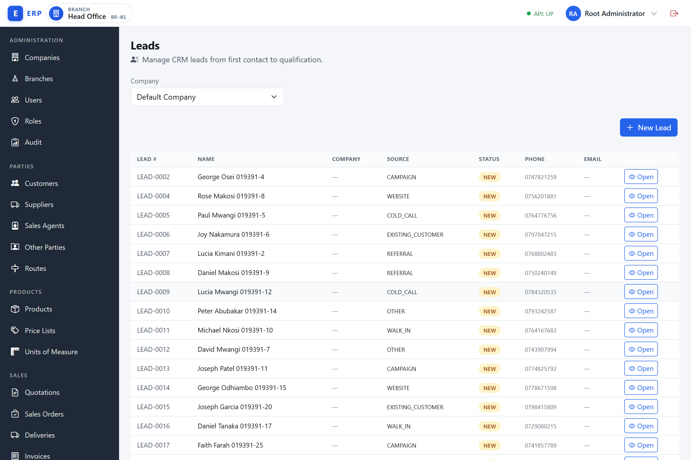
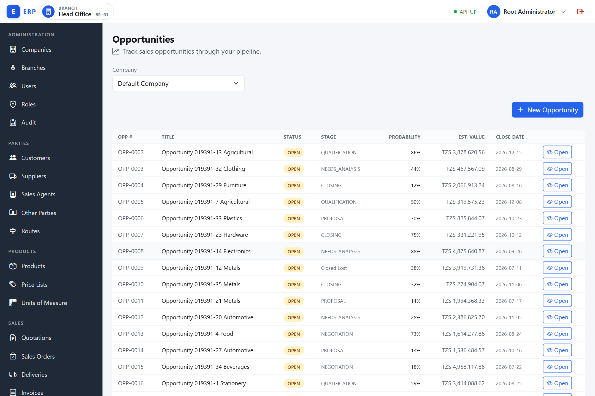
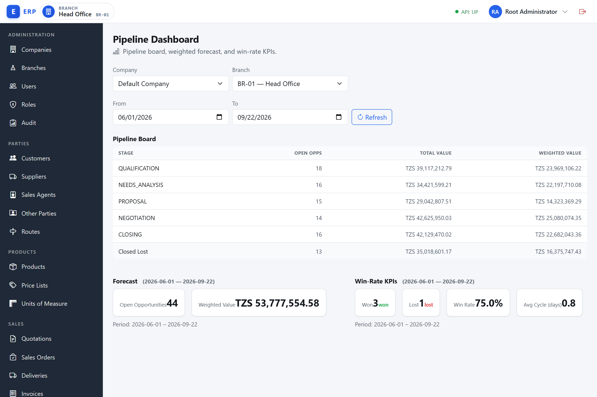
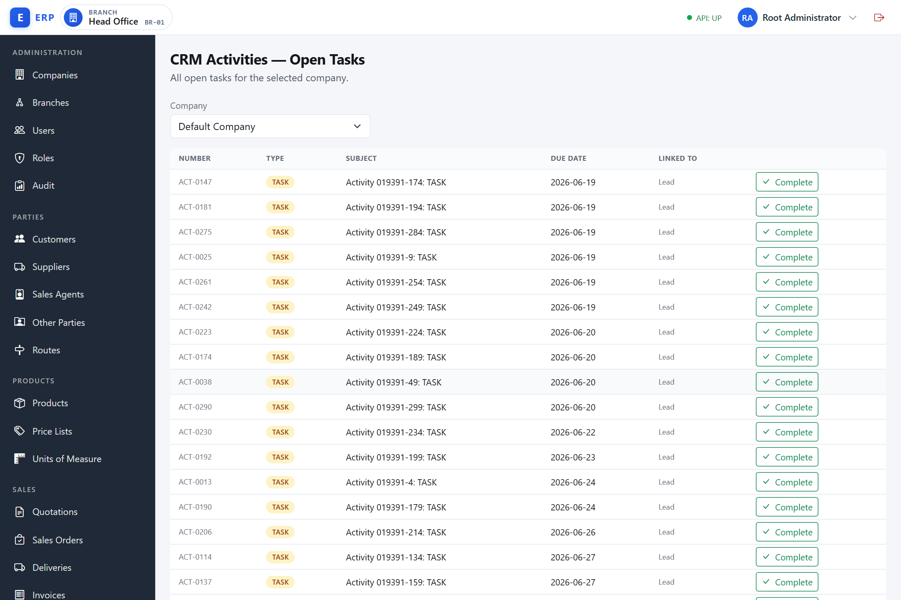

# CRM — Customer Relationship Management

The CRM module helps your sales team track every potential customer from first contact through to a closed sale. It is organised around three concepts:

- **Leads** — an initial expression of interest, before you know whether the person will become a customer.
- **Opportunities** — a qualified sales chance with an estimated value and a pipeline stage.
- **Activities** — any interaction logged against a lead or opportunity (calls, emails, meetings, notes, and tasks).

The CRM section also provides a **Pipeline Dashboard** showing deal value across stages, a **Forecast** for a chosen date range, and **Pipeline Stages** settings where an administrator can customise the stage list.

**Why CRM exists.** Without a systematic way to track potential sales, deals fall through the cracks: a promising contact made at a trade fair is forgotten, a follow-up call that was never made costs the company a contract, and the sales manager has no visibility of what the team is working on or what revenue to expect next quarter. CRM gives every prospect a permanent record, every interaction a logged entry, and every deal a position in the pipeline — so nothing is lost and performance is measurable.

**What CRM does and does not do.** CRM is a pre-sales layer: it captures prospects, works them through a pipeline, and — on a win — converts the opportunity into a formal sales document (quotation or sales order) that then runs through the standard order-to-cash process. CRM itself posts **no entries to the general ledger, moves no stock, and opens no accounts-receivable balance**. All financial and inventory effects occur in the sales and finance modules once the converted document is processed there.

**Navigation:** Sidebar **CRM** group — **Leads**, **Opportunities**, **Pipeline Dashboard**, **Pipeline Stages**, **CRM Activities**.

Each item in the CRM nav group is hidden if you do not have the required permission. The sections below state the required permission for each action.

---

## Leads

Navigate to **CRM › Leads** (`/admin/crm/leads`).

**View:** `CRM.LEAD.VIEW` | **Create / edit / contact / disqualify:** `CRM.LEAD.MANAGE` | **Qualify:** `CRM.LEAD.QUALIFY`



A **lead** is an early-stage record of someone who has expressed interest in your products or services but has not yet been confirmed as a genuine sales prospect. Think of it as a person or company at the "awareness" stage: you know they exist and they are interested, but you have not yet verified that they have a real budget, decision-making authority, or a genuine need. A lead is not a customer — it is a prospect.

**Why leads exist as a separate concept from customers.** If every enquiry were immediately converted into a customer record, the customer master would fill up with unqualified contacts — tyre-kickers, wrong numbers, and dead ends — obscuring the real buyers and inflating debtor and pricing reports. Leads are kept separate so that the customer master remains a curated list of verified trading parties. Only after a lead is assessed and confirmed as a real prospect is it **qualified** and linked to a customer record.

**When a lead is created.** Any member of the sales team (with the `CRM.LEAD.MANAGE` permission) creates a lead when a new enquiry arrives — a website form submission, a referral from an existing client, a walk-in, a cold call, or a trade-show contact. The **Lead Source** field records the origin so the business can later measure which channels generate the most qualified prospects.

**How a lead works — lifecycle.** A lead starts as **New** and moves through a series of statuses as the sales team engages with it. Once a lead reaches a terminal status (Converted or Disqualified) it is locked and cannot be edited further. The lead is always scoped to the branch where it was created.

### Lead status lifecycle

A lead passes through the following statuses:

```
NEW → CONTACTED → QUALIFIED → CONVERTED
              ↓                    ↑
         DISQUALIFIED       (via opportunity)
```

| Status | Meaning |
|---|---|
| **New** | Freshly captured; no contact made yet. |
| **Contacted** | You have made initial contact. |
| **Qualified** | Linked to a customer record; ready to become an opportunity. |
| **Converted** | An opportunity was created from this lead. Terminal — no further edits. |
| **Disqualified** | Ruled out. Terminal — no further edits. |

Once a lead reaches **Converted** or **Disqualified** it is locked: you cannot edit it, contact it, qualify it, or disqualify it again.

### How to capture a lead

1. Navigate to **CRM › Leads** (`/admin/crm/leads`).
2. Click **New Lead**. An inline form appears.
3. Enter the **Name** (required).
4. Select the **Source** from the dropdown (Website, Referral, Walk-in, Campaign, Cold Call, Existing Customer, or Other).
5. Optionally enter **Company / Org**, **Contact Person**, **Phone**, **Email**, and **Notes**.
6. Click **Create Lead**.

The system assigns a **Lead Number** (for example, `LEAD-0001`) and sets the status to **New**. The lead is stamped with your active branch.

### How to mark a lead as contacted

1. Open the lead from the list (`/admin/crm/leads/uid/:uid`).
2. Click **Mark Contacted** (only available when status is New).
3. The status changes to **Contacted**.

### How to qualify a lead

**Qualification** is the process of confirming that a lead represents a real sales opportunity. This step links the lead to a customer record — either an existing customer already in the system, or a newly created one — and moves the lead to **Qualified** status. You need the `CRM.LEAD.QUALIFY` permission.

1. Open a New or Contacted lead (`/admin/crm/leads/uid/:uid`).
2. Click **Qualify**.
3. Choose one of the two modes:

**Link an existing customer:**
- Select **Link existing customer**.
- Choose the customer by name from the picker. The customer must belong to the same company as the lead.
- Click **Qualify Lead**.

**Create a new customer from this lead:**
- Select **Create new customer**.
- Enter the new customer's **Customer Name** (required) and select **Kind** (Credit Account or Cash Walk-in).
- Optionally enter Phone, Email, and Address.
- Click **Qualify Lead**. A new customer record is created automatically and the lead is linked to it.

After qualifying, the status badge changes to **Qualified** and the linked customer name is shown on the detail page.

### How to convert a qualified lead to an opportunity

Once a lead is **Qualified**, a green **Convert to Opportunity** button appears in the action row on the lead detail page. This button is shown only while the lead is Qualified.

1. Open the qualified lead (`/admin/crm/leads/uid/:uid`).
2. Click **Convert to Opportunity**.
3. The opportunity create form opens with the **Source Lead** and **Customer** already pre-filled from this lead. Complete the remaining fields (Title, Pipeline Stage, Currency, and so on) as described under **How to create an opportunity**, then click **Create Opportunity**.

Creating the opportunity with this lead as its source moves the lead to **Converted** status.

### How to disqualify a lead

**Disqualification** is the formal rejection of a lead — the conclusion that this prospect will not become a customer, at least not from this enquiry. Recording a reason is required so the business can learn which types of leads are typically unsuitable and refine its lead-generation strategy.

1. Open any non-terminal lead (New, Contacted, or Qualified) at `/admin/crm/leads/uid/:uid`.
2. Click **Disqualify**.
3. Enter a **Reason** (required — for example, "Budget too low" or "Not the right fit").
4. Click **Confirm Disqualify**.

The status changes to **Disqualified**. The reason is stored and displayed on the detail page.

### Editing a lead

Open the lead detail page and change any editable fields (Name, Source, Company / Org, Contact Person, Phone, Email, Notes) in the **Lead Details** card. Click **Save Changes**. Editing is not available once the lead is Converted or Disqualified — terminal leads show a read-only view instead.

### Browsing the leads list

The Leads list has a company selector, a **New Lead** button, and the table of leads. There is no name-search box on this screen. Each row ends with an **Open** button (eye icon) that navigates to the lead detail page; there is no row-click. Pagination controls appear when the list exceeds 20 rows; use the First / Previous / page-number / Next / Last controls to move between pages.

**A note on how Source is displayed.** When you create or edit a lead you pick the Source from a dropdown with friendly labels (Referral, Walk-in, Cold Call, and so on). In the leads list and on the lead detail page, however, the Source is shown as the stored code — for example `REFERRAL`, `WALK_IN`, or `COLD_CALL` — rather than the friendly label.

---

**Example — Capture a referral lead and qualify it to a new customer:**

Sales executive Amina Msangi at Kijenge branch receives a phone call from Juma Banda, who was referred by an existing client and wants to discuss buying office furniture in bulk.

1. Navigate to **CRM › Leads** (`/admin/crm/leads`). Click **New Lead**.
2. Name: `Juma Banda`; Source: `Referral`; Phone: `+255754001122`; Notes: `Referred by Baraka Supplies — bulk office furniture interest`.
3. Click **Create Lead**. System creates `LEAD-0005`, status **New**.
4. Next day, Amina calls Juma. She opens `LEAD-0005` and clicks **Mark Contacted**. Status becomes **Contacted**.
5. After the call confirms he runs a legitimate business, Amina clicks **Qualify**. She selects **Create new customer**, enters Customer Name: `Banda Office Solutions`, Kind: `Credit Account`, Phone: `+255754001122`. Clicks **Qualify Lead**.
6. A new customer record "Banda Office Solutions" is created. Lead status flips to **Qualified**. The linked customer name appears on the detail page.
7. Amina now clicks **Convert to Opportunity** on the qualified lead to start a pre-filled opportunity (see Opportunities section).

---

## Opportunities

Navigate to **CRM › Opportunities** (`/admin/crm/opportunities`).

**View:** `CRM.OPPORTUNITY.VIEW` | **Create / edit / stage / win / lose:** `CRM.OPPORTUNITY.MANAGE` | **Convert to document:** `CRM.OPPORTUNITY.CONVERT`



An **opportunity** is a specific, identifiable sales deal being pursued with a known customer. Where a lead is a vague expression of interest, an opportunity is a concrete proposal: it has a named customer, an estimated monetary value, an expected close date, and a position in the sales pipeline indicating how far through the sales process the deal has progressed. An opportunity can also carry individual product lines — the specific items and quantities the customer is likely to buy.

**Why opportunities exist.** Opportunities bridge the gap between the customer master and the order-to-cash process. A sales team may have dozens of active deals at any time; without a systematic record of each one, deals lose momentum, forecasts are guesswork, and management has no way to prioritise effort. The opportunity record is where all of that is centralised: the value, the probability of winning, the stage, the history of interactions, and — at the end — the formal quotation or sales order that results from the win.

**When an opportunity is created.** A sales representative or manager creates an opportunity when a qualified lead turns into a real, pursuable deal, or directly against a known customer when a sales initiative begins. The opportunity must always be attached to a customer record (not a raw lead contact).

**How an opportunity works — lifecycle.** An opportunity starts **Open** and has two possible terminal outcomes: **Won** (the deal was closed in your favour) or **Lost** (the deal did not proceed). While Open, the opportunity moves through **pipeline stages** — configurable steps; the default seeded stages are `QUALIFICATION`, `NEEDS_ANALYSIS`, `PROPOSAL`, `NEGOTIATION`, and `CLOSING` — each with a default win probability percentage. The stage drives the weighted pipeline forecast. Once Won, the opportunity can be **converted** to a quotation or sales order in the order-to-cash module.

### Opportunity status lifecycle

```
OPEN → WON
OPEN → LOST
```

Once an opportunity is Won or Lost it is closed. Closed opportunities cannot be edited, and lines cannot be added or removed. Conversion to a quotation or sales order is still available on a closed opportunity (with the restrictions described below).

### How to create an opportunity

1. Navigate to **CRM › Opportunities** (`/admin/crm/opportunities`).
2. Click **New Opportunity** (or navigate to **CRM › Opportunities › Create** at `/admin/crm/opportunities/create`).
3. Select the **Customer** using the picker. Type part of the customer name to search; select from the results.
4. Select the **Pipeline Stage** from the dropdown. Only active stages are offered, each listed by its stored name (for a default-seeded company these read `QUALIFICATION`, `NEEDS_ANALYSIS`, and so on). The stage's default win probability is applied automatically unless you override it.
5. Enter the **Title** (required).
6. Pick the **Currency** from the Currency Picker. It offers only the currencies enabled for the company and pre-selects the company's default currency — see the **Common UI Patterns** section in *Getting Started* (ch00). The picker is disabled until a company is selected.
7. Optionally enter an **Est. Value**, a **Win % (0–100)** override (blank uses the stage default), and an **Expected Close Date**.
8. Optionally select a **Source Lead** using the picker — only Qualified leads appear in this list. Selecting a source lead converts that lead to **Converted** status. (When you reach this form via the **Convert to Opportunity** button on a qualified lead, the Source Lead and Customer are already pre-filled for you.)
9. Click **Create Opportunity**.

The opportunity is created with status **Open** and an automatically assigned number (for example, `OPP-0001`). You land on the opportunity detail page (`/admin/crm/opportunities/uid/:uid`).

### How to add lines to an opportunity

**Opportunity lines** are the individual products or services the customer is expected to buy. Adding lines serves two purposes: it gives the sales team a precise record of what the deal covers, and it pre-populates the resulting quotation or sales order when the opportunity is later converted — eliminating the need to re-enter every item.

Lines represent the products or services you expect to sell. You can add them while the opportunity is Open.

1. Open the opportunity detail page.
2. In the **Opportunity Lines** panel, type a product name or code into the **Product** search box and select the product (shown as `code — name`).
3. Select the **Unit** from the units dropdown.
4. Enter the **Qty** (must be greater than zero).
5. Optionally enter the **Unit Price** and a **Discount %** (0–100).
6. Click **Add**.

To remove a line, click the trash (Remove) icon on the row.

### How to advance the pipeline stage

**Advancing the stage** moves the opportunity forward in the sales funnel. Each stage represents a milestone in the sales process — for example, moving from `NEEDS_ANALYSIS` to `PROPOSAL` means you have finished diagnosing the customer's requirements and are now ready to present a formal proposal. (Stages appear under their stored names; a default-seeded company shows the code-style names shown here.) The stage's default win probability is suggested automatically; you can override it to reflect the specific circumstances of this deal.

1. Open the opportunity detail page (must be Open).
2. Click **Advance Stage**.
3. Select the **Target Stage** from the active-stages dropdown.
4. Optionally set a **Win % override** to override the stage default.
5. Click **Advance Stage**.

The stage and win probability update immediately.

### How to mark an opportunity as Won

1. Open the opportunity detail page (must be Open).
2. Click **Mark Won**.
3. Optionally set **Won At** (defaults to now).
4. Click **Confirm Won**.

Status changes to **Won**. Edit, add-line, advance-stage, win, and lose actions are no longer available. The Convert action remains available.

### How to mark an opportunity as Lost

1. Open an Open opportunity.
2. Click **Mark Lost**.
3. Enter a **Loss Reason** (required — for example, "Lost to competitor on price").
4. Click **Confirm Lost**.

Status changes to **Lost**.

### How to convert an opportunity to a quotation or sales order

**Conversion** is the moment a CRM deal becomes a formal commercial document. When you convert an opportunity, the system calls the order-to-cash module to create a quotation or sales order, pre-populated with the opportunity's customer, currency, and all of the lines you entered. The sales team can then take the resulting document through the normal approval, delivery, and invoicing workflow without re-entering any data. Conversion is **idempotent**: clicking Convert a second time returns the document already created rather than making a duplicate.

- A **Quotation** is appropriate when the deal is still being negotiated — you are giving the customer a formal price offer but have not yet received a commitment. An Open or Won opportunity can be converted to a quotation.
- A **Sales Order** is the binding commercial commitment — the customer has agreed to buy. Only a **Won** opportunity can be converted to a sales order, because converting to an SO implies the deal is closed.

Conversion creates a Sales document (Quotation or Sales Order) pre-populated with the opportunity's customer, currency, and lines. You need the `CRM.OPPORTUNITY.CONVERT` permission.

**Requirements before converting:**
- The opportunity must have at least one line.
- To convert to a **Quotation**: opportunity must be Open or Won.
- To convert to a **Sales Order**: opportunity must be Won.

**Steps:**
1. Open the opportunity detail page.
2. Click **Convert**.
3. In **Convert To**, choose **Quotation** or **Sales Order (requires WON)**.
4. For a Quotation, optionally set a **Valid Until (optional)** date. The field is blank by default; if you leave it blank, the resulting quotation is given a validity of today + 30 days by the server (this default is not pre-filled in the form).
5. Click **Convert**.

On success the form shows a confirmation with the created document's kind and number, plus a **View Document** button that opens the new Quotation or Sales Order. (Once converted, an info banner on the detail page also links to the document.)

Conversion is idempotent: if you click Convert a second time, the system returns the document that was already created rather than making a duplicate.

### Editing an opportunity

Open the detail page (must be Open). In the **Opportunity Details** card you can change the Title, Est. Value, Win % (0–100), Expected Close Date, and Notes; click **Save Changes**. (The pipeline stage is not changed here — use **Advance Stage** for that.) Editing is blocked once the opportunity is Won or Lost, where the detail page shows a read-only summary instead.

---

**Example — Full pipeline journey: lead → opportunity through stages → won → convert to sales order:**

Sales manager Benson Kileo at Dar es Salaam branch handles a qualified lead for Banda Office Solutions (created in the lead example above).

1. Navigate to **CRM › Opportunities › Create** (`/admin/crm/opportunities/create`).
2. Customer: `Banda Office Solutions`; Pipeline Stage: `QUALIFICATION` (this company still uses the default seeded stages, so the dropdown lists the stored code names); Title: `Bulk Office Furniture — Q3 2026`; Currency: picked from the company's enabled currencies (here the company default, `TZS`); Estimated Value: `4,500,000`; Expected Close Date: `2026-09-30`; Source Lead: `LEAD-0005 — Juma Banda` (auto-converts that lead to Converted).
3. Click **Create Opportunity**. Opportunity `OPP-0012` created, status **Open**.
4. Add lines to `OPP-0012`:
   - Executive Desk EXD-01, Unit: EA, Qty: 5, Unit Price: 480,000 = TZS 2,400,000.
   - Ergonomic Chair CHR-02, Unit: EA, Qty: 20, Unit Price: 105,000 = TZS 2,100,000.
5. After a needs-analysis call, Benson clicks **Advance Stage**, selects Target Stage `NEEDS_ANALYSIS` (default probability 25%). Clicks **Advance Stage** to confirm.
6. After sending a detailed proposal, Benson advances to `PROPOSAL` (50%). After negotiation the stage moves to `NEGOTIATION` (75%).
7. Juma accepts the quote. Benson opens the opportunity, clicks **Mark Won**, sets Won At: `2026-08-15`, then clicks **Confirm Won**. Status becomes **Won**.
8. Click **Convert**, Convert To: `Sales Order (requires WON)`. System creates `SO-0034` with all lines pre-filled. Benson clicks **View Document** to open the new Sales Order and proceeds with delivery.

---

## Pipeline Dashboard

Navigate to **CRM › Pipeline Dashboard** (`/admin/crm/pipeline`). **Permission:** `CRM.PIPELINE.VIEW`.



The **pipeline dashboard** is a management view that shows the current health of your sales funnel in real time. It answers three questions at a glance: where are your deals right now (the board), how much revenue can you expect in a given period (the forecast), and how effective is the team at closing deals (the KPIs)?

**Why the pipeline dashboard exists.** A sales manager without visibility of the pipeline is flying blind: they cannot see which stages are bottlenecks, whether the team has enough deals to meet the quarter's target, or whether the win rate has deteriorated. The dashboard distils the raw opportunity data into actionable numbers so management can intervene early, redirect effort, or adjust the forecast before it is too late.

The pipeline dashboard shows the current state of all open opportunities across your sales pipeline. It is scoped to a company and branch — select both to load the data.

### Board summary

The **Pipeline Board** shows each active pipeline stage with the count of open opportunities in that stage, their combined **Total Value**, and the **Weighted Value** (value × win probability).

### Weighted forecast

The **weighted forecast** is a more realistic estimate of expected revenue than a simple sum of all open deal values. It multiplies each open opportunity's estimated value by its win probability (expressed as a percentage) and sums the results. For example, an opportunity worth TZS 10,000,000 at a 50% probability stage contributes TZS 5,000,000 to the weighted forecast. This gives sales managers a probability-adjusted revenue estimate that accounts for the fact that not all open deals will close.

The Forecast section calculates expected revenue for a date range, weighting each opportunity's estimated value by its win probability. The panel shows two tiles: **Open Opportunities** (the count of open deals in the period) and **Weighted Value** (the probability-weighted total). Set the **From** and **To** dates at the top of the dashboard and click **Refresh**. (This single date range drives both the Forecast and the KPI panels.)

### Win-rate and cycle-time KPIs

The **Win-Rate KPIs** panel shows four tiles:
- **Won** — the count of opportunities marked Won in the selected period.
- **Lost** — the count of opportunities marked Lost in the selected period.
- **Win Rate** — the percentage of closed opportunities marked Won in the selected period.
- **Avg Cycle (days)** — the average number of days from opportunity creation to close.

**Win Rate** measures the sales team's effectiveness at closing deals. A low win rate may indicate that the team is pursuing too many unqualified leads, that the product-market fit is poor, or that competitors are winning on price. **Avg Cycle (days)** measures how long deals take to close — a rising cycle time may indicate bottlenecks in the proposal or approval process. Both KPIs are calculated for the date range you set at the top of the dashboard so that trends over time can be observed.

Adjust the date range and click **Refresh** to recalculate.

---

**Example — Reading the pipeline board and setting a forecast:**

Branch manager Zawadi Ngowi opens the **CRM › Pipeline Dashboard** (`/admin/crm/pipeline`), selects company `Kijenge Trading Ltd` and branch `DSM Main`. The board shows (this company still uses the default seeded stages, so the stage names appear in their stored code form):

| Stage | Open Opps | Total Value | Weighted Value |
|---|---|---|---|
| QUALIFICATION | 3 | TZS 8,200,000 | TZS 820,000 |
| NEEDS_ANALYSIS | 5 | TZS 21,500,000 | TZS 5,375,000 |
| PROPOSAL | 4 | TZS 18,750,000 | TZS 9,375,000 |
| NEGOTIATION | 2 | TZS 9,600,000 | TZS 7,200,000 |
| CLOSING | 1 | TZS 4,500,000 | TZS 4,050,000 |

Zawadi sets From: `2026-07-01`, To: `2026-09-30` and clicks **Refresh**. The Forecast panel shows Open Opportunities: 15 and a Weighted Value of TZS 29,340,000 (each deal's estimated value × its win probability). The Win-Rate KPIs panel shows four tiles — Won: 8, Lost: 5, Win Rate: 62%, and Avg Cycle (days): 34 — for deals closed in the selected period.

---

## Pipeline Stages (Settings)

Navigate to **CRM › Pipeline Stages** (`/admin/crm/settings/pipeline-stages`). **Permission to view the settings screen:** `CRM.STAGE.MANAGE` | **Permission to read stages via API:** `CRM.OPPORTUNITY.VIEW`

**Pipeline stages** are the named milestones in your sales process — the steps a deal must pass through between "new opportunity" and "closed sale." Stages are not universal: a software company might use stages called Discovery, Demo, Evaluation, and Negotiation, while a building-materials distributor might use Route Visit, Sample Sent, Proposal, and Closing. The system therefore makes stages **configurable per company** rather than hard-coding them.

**Why stages are configurable.** Every business has a different sales process. A fixed, one-size-fits-all set of stages would force companies to map their real process onto arbitrary labels, making the pipeline board meaningless. Configurable stages mean the board reflects the actual milestones the sales team uses, making stage-based reporting and coaching practical.

**The default stages.** When a company is first created, five stages are seeded automatically. They are stored — and therefore displayed everywhere in the UI — under code-style names: `QUALIFICATION` (10% probability), `NEEDS_ANALYSIS` (25%), `PROPOSAL` (50%), `NEGOTIATION` (75%), and `CLOSING` (90%). These cover the most common B2B sales process and can be used immediately. They can be renamed (for example to a friendlier "Needs Analysis"), reordered, supplemented, or deactivated without affecting historical opportunity records, so once you rename a default stage it appears under the new name.

**The default probability.** Each stage has a **default win probability** — the system's best guess at the likelihood of closing a deal that has reached this stage. This default is applied automatically when an opportunity is placed at that stage and drives the weighted forecast calculation. Sales reps can override the probability on individual opportunities to reflect the specific situation.

Pipeline stages define the steps in your sales process. Five stages are seeded per company under stored code names: `QUALIFICATION`, `NEEDS_ANALYSIS`, `PROPOSAL`, `NEGOTIATION`, and `CLOSING`. You can add, rename, reorder, change probabilities, and deactivate stages.

### How to create a stage

1. Navigate to **CRM › Pipeline Stages** (`/admin/crm/settings/pipeline-stages`).
2. Click **New Stage**.
3. Enter the **Stage Name** (must be unique within the company).
4. Enter the **Order** (a number; must be unique within the company).
5. Enter the **Default Win %** (0–100).
6. Click **Create Stage**.

### How to edit a stage

Click the pencil (Edit) icon button at the end of a row — it has no visible "Edit" text (its accessible label is "Edit stage <name>"). The row becomes an inline edit row where you can change the display order, name, default probability, or the **Active** checkbox. Click the check (Save) icon button to save (accessible label "Save changes"), or the **×** button to cancel.

### How to deactivate a stage

**Deactivating** a stage removes it from the stage selection dropdown when creating or advancing an opportunity, while keeping all historical opportunities that were in that stage intact. This is the correct action when a stage is no longer part of the sales process — for example, if a "Demo" stage is eliminated because demos are now handled differently. Deactivation is reversible.

Click the toggle (Deactivate) icon button on the row — it has no visible "Deactivate" text (its accessible label is "Deactivate stage <name>") and is shown only while the stage is active. Alternatively, clear the **Active** checkbox in the inline edit row and save. The stage record is kept but marked inactive. Inactive stages:
- No longer appear in the stage selection dropdowns when creating or advancing an opportunity.
- Are rejected if you attempt to use them via the API.
- Still appear in historical records.

Deactivation is not permanent — you can reactivate a stage by editing it and switching Active back on.

### Stage validation rules

- Name must be unique within the company.
- Display order must be a positive number and unique within the company.
- Default probability must be between 0 and 100 (whole number).

---

## Activities

Navigate to **CRM › CRM Activities** (`/admin/crm/activities`) for the open-task inbox. Activities are also embedded on Lead and Opportunity detail pages.

**View activities:** `CRM.ACTIVITY.VIEW` | **Log / complete activities:** `CRM.ACTIVITY.MANAGE`

An **activity** is a logged record of an interaction with a prospect or customer in the context of a specific lead or opportunity. Activities capture the history of a deal: the calls made, the emails sent, the meetings held, and the notes taken. They are also the mechanism for assigning follow-up **tasks** — future actions that need to be completed — and for tracking whether those tasks have been done.

**Why activities exist.** A sales cycle typically involves many touchpoints over days or weeks before a deal closes. Without a structured activity log, the sales team relies on memory and personal notes — which are unreliable, invisible to the manager, and lost when a rep leaves. The activity log on each lead or opportunity gives every team member and manager a complete, timestamped record of what happened and what still needs to happen. The open-task inbox surfaces all outstanding tasks across the whole pipeline so nothing slips through.

**When activities are used.** A sales representative logs an activity immediately after each interaction — after a call, after sending an email, after a meeting. A follow-up task is created when the next action is identified — for example, "Call back on Thursday to confirm the budget." The task appears in the open-task inbox until it is completed.

**How activities work.** Every activity is attached to exactly one parent: either a lead or an opportunity — not both, and not neither. There are five activity types. Four (Call, Email, Meeting, Note) are **historical records** — they record something that happened and have no completion state. The fifth (Task) is a **forward-looking action item** with a due date; only Tasks appear in the open-task inbox and only Tasks can be completed.

An activity records an interaction or a task related to a lead or opportunity. Every activity is attached to exactly one parent: either a lead or an opportunity — not both, and not neither.

### Activity types

| Type | Has due date | Can be completed |
|---|---|---|
| Call | No | No |
| Email | No | No |
| Meeting | No | No |
| Note | No | No |
| Task | Yes (required) | Yes |

Only **Task** activities appear in the open-task inbox. Only Tasks can be completed.

### How to log an activity on a lead or opportunity

1. Open the lead (`/admin/crm/leads/uid/:uid`) or opportunity (`/admin/crm/opportunities/uid/:uid`) detail page.
2. Scroll to the **Activities** panel.
3. Click **Log Activity**. The **Log New Activity** form appears.
4. Select the **Type** (Call, Email, Meeting, Note, or Task).
5. Enter the **Subject** (required).
6. For Call, Email, Meeting, and Note, optionally set an **Occurred At** date. For a **Task**, the Occurred At field is replaced by a **Due Date** field (required for Tasks).
7. Optionally enter **Notes**.
8. Click **Log Activity**.

The activity appears at the top of the panel list (latest first), and the system assigns an activity number (for example, `ACT-0001`).

### Activity panel pagination

The activity panel on a lead or opportunity detail page shows 10 activities per page. Use the paginator controls to move between pages if there are more than 10.

### How to complete a task

**Completing a task** marks it as done and removes it from the open-task inbox. This is the formal acknowledgement that the action was taken — for example, that the follow-up call was made. You cannot undo a completion once recorded.

A task can be completed from the open-task inbox or from the activity panel on the parent lead or opportunity.

1. Find the task (either on the detail page or in **CRM › CRM Activities** at `/admin/crm/activities`).
2. Click the complete control on the task row. The two surfaces look different:
   - In the open-task inbox (**CRM › CRM Activities**), this is a green button labelled **Complete** (with a check icon).
   - In the **Activities** panel embedded on a lead or opportunity detail page, it is an icon-only green check button with no visible text (its accessible label is "Complete task: <subject>"). The button appears only on open Task rows.

The task is marked done and disappears from the open-task inbox. You cannot complete an activity that is not a Task, and you cannot complete a Task that is already done.

### Open-task inbox

Navigate to **CRM › CRM Activities** (`/admin/crm/activities`). **Permission:** `CRM.ACTIVITY.VIEW` (view) / `CRM.ACTIVITY.MANAGE` (complete).



The **open-task inbox** is a unified list of all incomplete tasks across every lead and opportunity in the company — a personal and team-wide to-do list for the sales pipeline. It allows a sales manager to see at a glance what follow-up actions are pending, and allows each rep to check what they need to do today without opening every individual lead or opportunity record.

The CRM Activities screen lists all open (not-yet-done) Tasks for the selected company, across all leads and opportunities. It is scoped to the company you select via the company selector at the top of the screen.

The list is paginated (20 per page). Use the paginator controls to browse. When you complete a task, it is removed from the inbox and the list refreshes.

---

**Example — Log activities across the sales journey and manage the task inbox:**

Sales rep Farida Hassan is managing opportunity `OPP-0012` (Banda Office Solutions). She logs activities at each step.

1. After the initial qualification call, she opens `OPP-0012` at `/admin/crm/opportunities/uid/:uid`, scrolls to the Activities panel, clicks **Log Activity**: Type `Call`, Subject `Initial qualification call — confirmed budget TZS 4.5M`, Occurred At `2026-07-03`. Clicks **Log Activity** to save. Activity `ACT-0018` appears.
2. She sends a proposal by email: Type `Email`, Subject `Proposal email sent — 5 desks + 20 chairs`, Occurred At `2026-07-10`.
3. After the proposal, she needs a follow-up. She creates a task: Type `Task`, Subject `Follow up on proposal — confirm decision`, Due Date `2026-07-17`. Activity `ACT-0021` created.
4. On 2026-07-17, Farida opens **CRM › CRM Activities** (`/admin/crm/activities`). She sees `ACT-0021` in the open-task inbox. After a productive call, she clicks **Complete**. The task disappears from the inbox.
5. A meeting is later held: back on `OPP-0012`, Type `Meeting`, Subject `Site visit — DSM Main showroom`, Occurred At `2026-07-22`. The activity panel shows all four interactions, newest first.
