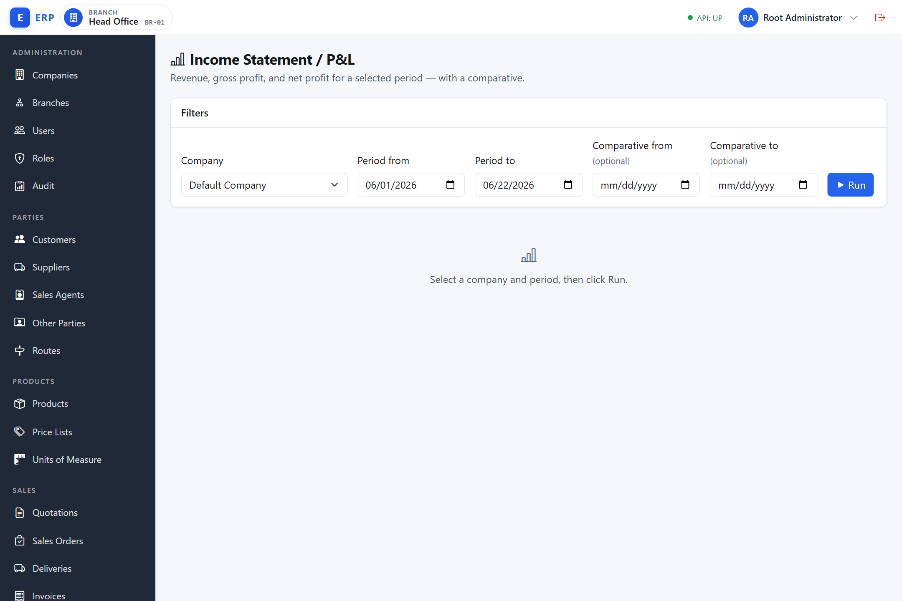
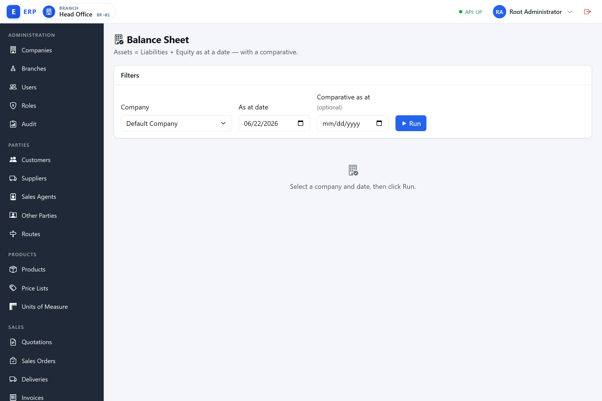
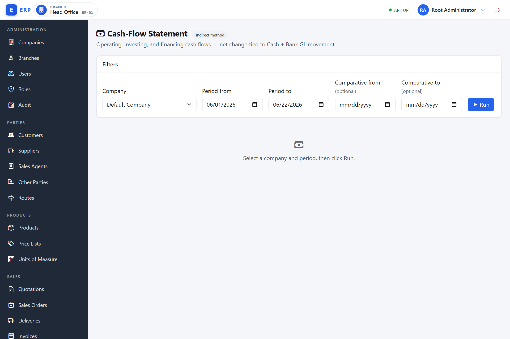
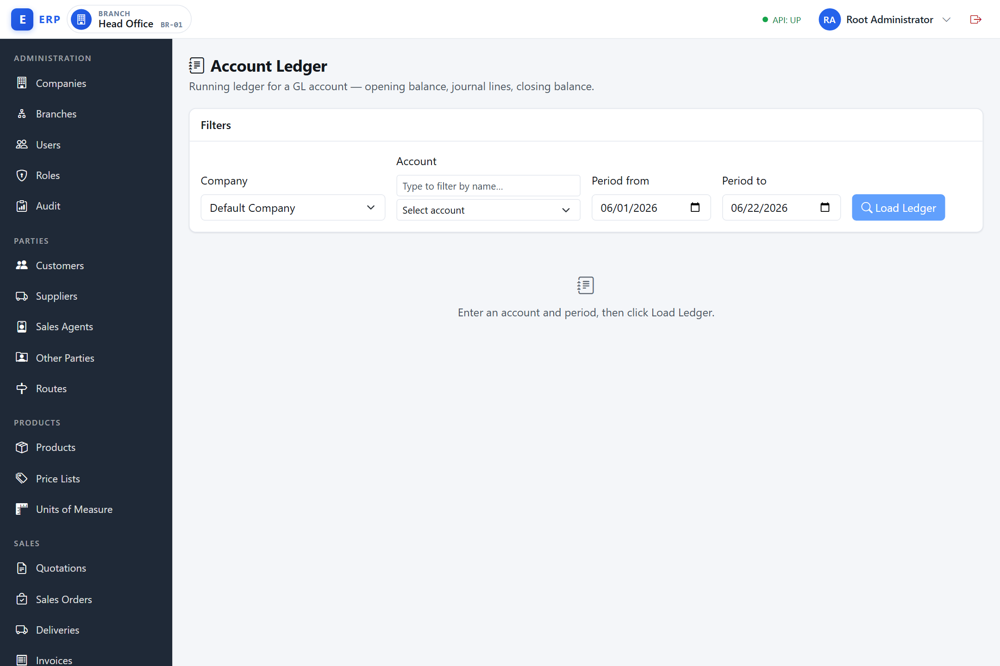
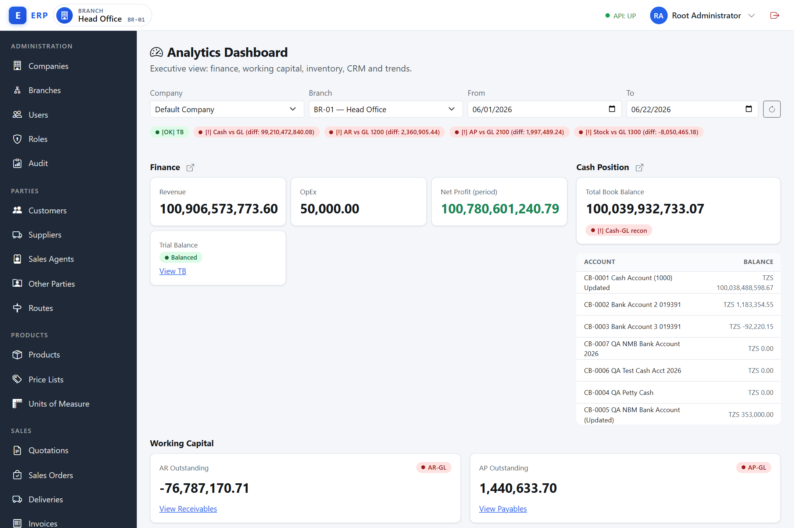

# Reporting and Business Intelligence

**What is the Reporting and BI module?**
Reporting and Business Intelligence (BI) is the read-only analytical layer of the system. It does not create, change, or post anything — it reads what the financial and operational modules have already recorded and presents the results in standard formats that management and external stakeholders (auditors, banks, tax authorities) can read and act on. The four financial statements summarise the company's performance and position in internationally recognised forms; the account ledger lets you drill into the individual transactions behind any figure; the BI dashboard composes key indicators from across all modules into a single at-a-glance view. Because all reports are computed on demand from the live General Ledger, a report run at any moment reflects the current state of the books. Nothing is stored or posted when you run a report (ADR-0018, ADR-0037).

This chapter describes the financial statements, the GL account-ledger drill-down, and the analytics dashboard. All reports are read-only and computed on demand — nothing is stored or posted when you run a report.

---

## Financial Statement Reports

**What are financial statements, and why do companies produce them?**
Financial statements are standardised summaries of a company's financial activity and position. They are the language that businesses, investors, lenders, and regulators use to assess financial health. Every trading company is legally required to produce them at least annually. In this system they are generated directly from the General Ledger and carry a reconciliation bar that confirms the figures tie back to the underlying journal entries — so there is no separate spreadsheet to maintain and no risk of a mismatch between the books and the reports.

The four financial statements are available from the **Accounting** navigation group. Each report requires the relevant permission and a company and period selection before it can be run.

**Common controls on every statement screen:**

- **Company selector** — if your organisation has more than one company, choose which company to report on by name.
- **Period inputs** — date fields specifying the reporting period.
- **Run button** — computes and displays the statement.
- **Export buttons** (PDF, Excel, CSV) — download the statement in the chosen format. Requires the additional `REPORT.EXPORT` permission. The buttons are hidden if you do not hold that permission.
- **Comparative period** — most statements accept an optional comparative period or date to populate a second column.
- **Reconciliation indicator** — a green **"Reconciled"** bar confirms the computed figures tie back to the underlying GL movement. A red **data-integrity alarm** means the figures do not agree and the books require investigation; the report is shown but no automatic correction is made.

---

### Profit & Loss (Income Statement)

**What is the Profit and Loss statement, and what does it tell you?**
The Profit and Loss statement (also called the Income Statement) shows how much revenue the company earned and how much it spent over a period of time, arriving at a net profit or loss. Revenue is income from sales and services; Cost of Sales is the direct cost of what was sold (purchases, materials, production); Operating Expenses are the overhead costs of running the business (salaries, rent, utilities). Gross Profit is Revenue minus Cost of Sales — a measure of trading margin. Net Profit is what remains after all operating expenses. The P&L answers the question: "Did the business make money this period, and where did the money come from and go?" It is the report most used for management decisions, bank covenants, and tax assessments. The comparative column lets you benchmark the current period against a prior period (same quarter last year, for example) to spot trends.

Navigate to **Accounting › Income Statement** (`/admin/reporting/income-statement`). Permission required: `REPORT.PL.VIEW`.

1. Select the company by name.
2. Set **Period from** and **Period to** (date inputs).
3. Optionally set a **Comparative from** and **Comparative to** to add a prior-period column.
4. Click **Run**.

The statement shows:

- Revenue lines grouped under **REVENUE**.
- Cost of sales lines under **COST OF SALES**.
- Operating expense lines under **OPERATING EXPENSES**.
- Section subtotals.
- A footer with **Gross Profit** and **Net Profit** rows, each carrying the current period amount and — if a comparative was set — the prior-period amount.

**Drill-through to the account ledger:** any account name shown as a link in the detail rows can be clicked to open the Account Ledger pre-filtered to that account and period.

**Export:** after running the statement, click **PDF**, **Excel**, or **CSV** in the export toolbar. The downloaded file is named `income-statement_<from>_<to>.<ext>`.

---

**Example — Run a comparative P&L for two quarters and export to Excel:**

Chief accountant Rehema Mwangi needs to compare Q1 2026 performance against Q1 2025 for the board report.

1. Navigate to **Accounting › Income Statement** (`/admin/reporting/income-statement`).
2. Company: `Kijenge Trading Ltd`.
3. Period from: `2026-01-01`; Period to: `2026-03-31`.
4. Comparative from: `2025-01-01`; Comparative to: `2025-03-31`.
5. Click **Run**.

The statement loads. The green **Reconciled** bar confirms net profit ties to the INCOME − EXPENSE GL movement. Results:

| Section | Q1 2026 | Q1 2025 |
|---|---|---|
| Revenue | TZS 48,250,000 | TZS 39,100,000 |
| Cost of Sales | TZS 29,340,000 | TZS 24,600,000 |
| Gross Profit | TZS 18,910,000 | TZS 14,500,000 |
| Operating Expenses | TZS 9,720,000 | TZS 8,850,000 |
| Net Profit | TZS 9,190,000 | TZS 5,650,000 |

Rehema clicks **Excel** in the export toolbar. The file `income-statement_2026-01-01_2026-03-31.xlsx` downloads with both columns. She forwards it to the board.

To drill into "Sales Revenue", she clicks the account name link — the Account Ledger opens pre-filled with that account and the Q1 2026 period, showing every posted journal line and a running balance.

---

### Balance Sheet

**What is the Balance Sheet, and what does it tell you?**
The Balance Sheet (also called the Statement of Financial Position) shows what the company owns and what it owes at a single point in time. **Assets** are what the company owns — cash, trade receivables, stock, fixed assets, and other resources. **Liabilities** are what the company owes — supplier payables, loans, tax obligations. **Equity** is the residual interest of the owners — the difference between assets and liabilities, representing the net worth of the business. A correctly prepared balance sheet always satisfies the fundamental accounting equation: Assets = Liabilities + Equity. If this equation does not balance, something has been mis-posted. The Balance Sheet answers the question: "What is the company worth, and how solvent is it?" It is used by banks to assess creditworthiness, by investors to evaluate the business, and by management to monitor liquidity. The comparative "as at" date lets you compare financial position at two year-ends side by side.

Navigate to **Accounting › Balance Sheet** (`/admin/reporting/balance-sheet`). Permission required: `REPORT.BS.VIEW`.

1. Select the company by name.
2. Set the **As-at date**.
3. Optionally set a **Compare as-at** date to add a prior-date column.
4. Click **Run**.

The statement shows sections for Current Assets, Non-Current Assets, Current Liabilities, Non-Current Liabilities, and Equity, each with detail lines, subtotals, and four total rows in the footer: **Total Assets**, **Total Liabilities**, **Total Equity**, and a grand-total **Total Liabilities + Equity** row. A balanced set of books shows Total Assets equal to the Total Liabilities + Equity row, confirmed by a green **Balanced** bar (helper text *Assets = Liabilities + Equity.*).

**Drill-through:** click any real account name link to open the Account Ledger for that account as at the selected date.

**Export:** file is named `balance-sheet_<asAt>.<ext>`.

---

**Example — Run a comparative balance sheet at year-end:**

Rehema Mwangi needs the balance sheet as at 30 June 2026 compared with 30 June 2025.

1. Navigate to **Accounting › Balance Sheet** (`/admin/reporting/balance-sheet`).
2. Company: `Kijenge Trading Ltd`; As-at date: `2026-06-30`; Compare as-at: `2025-06-30`.
3. Click **Run**.

The green **Balanced** bar appears, with the helper text *Assets = Liabilities + Equity.* Rehema spots that "Trade Receivables" has grown from TZS 12.4M to TZS 19.7M year-on-year. She clicks the "Trade Receivables" account name to open its ledger for the full fiscal year and reviews each transaction. She then exports to PDF for the audit file.

---

### Cash-Flow Statement

**What is the Cash-Flow Statement, and what does it tell you?**
The Cash-Flow Statement shows how cash moved into and out of the business over a period, organised into three categories. **Operating activities** are cash flows from the company's main trading activities — collecting from customers, paying suppliers, paying wages. **Investing activities** are cash flows from buying or selling long-term assets — purchasing a vehicle or machinery, receiving proceeds from selling an asset. **Financing activities** are cash flows from raising or repaying capital — new loans drawn, loan repayments, equity injections. The statement reconciles the opening and closing cash balance, confirming that the movement in the company's bank accounts is fully explained. The Cash-Flow Statement answers the question: "Where did the cash come from, and where did it go?" It is particularly important for businesses that are profitable on paper but cash-constrained in practice — a common situation when customers pay late or large capital purchases are made. The system uses the **indirect method** (starting from net profit and adjusting for non-cash items), which is the most common format for external reporting.

Navigate to **Accounting › Cash-Flow Statement** (`/admin/reporting/cash-flow`). Permission required: `REPORT.CASHFLOW.VIEW`.

1. Select the company by name.
2. Set **Period from** and **Period to**.
3. Optionally set a comparative period.
4. Click **Run**.

The indirect-method statement shows movements in three sections:

- **OPERATING ACTIVITIES** — cash generated from or used in trading activities.
- **INVESTING ACTIVITIES** — cash spent on or received from capital assets.
- **FINANCING ACTIVITIES** — cash from borrowings, equity, or repayments.

The opening position is shown as a body row at the top of the table (**Opening cash & bank balance**, under an **OPENING CASH POSITION** heading). The footer then shows **Net Change in Cash** and **Closing Cash & Bank Balance**. A green **Cash Tie-out: Reconciled** bar confirms the net change matches the change in cash-equivalent GL account balances.

**Export:** file is named `cash-flow_<from>_<to>.<ext>`.

---

**Example — Cash-flow analysis for H1 2026:**

1. Navigate to **Accounting › Cash-Flow Statement** (`/admin/reporting/cash-flow`).
2. Company: `Kijenge Trading Ltd`; Period from: `2026-01-01`; Period to: `2026-06-30`.
3. Click **Run**.

Results show Opening Cash: TZS 6,800,000; Operating inflow: TZS 11,250,000; Investing outflow: TZS −4,200,000 (purchase of delivery van); Financing outflow: TZS −1,500,000 (loan repayment); Net Change: TZS 5,550,000; Closing Cash & Bank Balance: TZS 12,350,000. The green **Cash Tie-out: Reconciled** bar confirms the net change ties to the actual movement in the bank account GL balances.

---

### Account-Ledger Drill-Down

**What is the Account Ledger, and when do you use it?**
The Account Ledger shows every individual journal line posted to a single GL account within a date range, with a running balance. It is the most granular view available in the system: while the financial statements show totals and subtotals, the ledger shows the individual transactions behind each total. It is the primary tool for investigating a balance — for example, if Trade Receivables on the balance sheet is higher than expected, you open the ledger for that account to see every invoice and receipt that has been posted. The ledger is also the standard tool for preparing a bank reconciliation (compare the bank account ledger to the bank statement) and for answering auditor queries about specific transactions. The opening balance is the account's position before the chosen date range, so every line in the report can be traced back to a source document.

Navigate to **Accounting › Account Ledger** (`/admin/reporting/account-ledger`). Permission required: `REPORT.LEDGER.VIEW`.

The account ledger shows every posted journal line for a single GL account within a date range, with a running balance.

1. Select the company by name.
2. In the **Account** picker (placeholder *Select account*), choose an account from the dropdown. Accounts are chosen by name; no uid is typed. The picker is a plain dropdown; a *Type to filter by name…* box appears above it only when the account list exceeds 12 entries.
3. Set **Period from** and **Period to**.
4. Click **Load Ledger** (the button carries a search icon).

The report shows:

- An **opening balance** (the account's balance as at the day before the from date).
- Every journal line in date order under the columns **Date**, **Source**, **Reference**, **Memo**, **Debit**, **Credit**, and **Balance** (the running balance). Negative running balances are shown in red.
- A **closing balance** (the account's balance at the end of the to date).

**Pagination:** if the account has more than 50 lines in the period, the shared paginator appears at the bottom. Navigate with the chevron icon buttons — first page, previous page, next page, and last page (their text is read out by screen readers via aria-labels) — and the numbered page buttons shown between them.

**Export:** the export is bounded at 10,000 rows per download. For very busy accounts spanning long periods, narrow the date range and export in segments. File is named `account-ledger_<accountCode>_<from>_<to>.<ext>`. Export requires `REPORT.EXPORT`.

---

**Example — Investigate the bank account movements for April 2026:**

1. Navigate to **Accounting › Account Ledger** (`/admin/reporting/account-ledger`).
2. Company: `Kijenge Trading Ltd`.
3. Account picker: select **Bank — Main Current (1100)** from the dropdown.
4. Period from: `2026-04-01`; Period to: `2026-04-30`.
5. Click **Load Ledger**.

Opening balance: TZS 12,350,000. The ledger shows 28 lines — 15 customer receipts credited and 13 payments debited, with a closing balance of TZS 14,890,000. The paginator is hidden (fewer than 50 lines). Rehema exports to CSV for the bank reconciliation working paper.

---

### Trial Balance

The Trial Balance is covered fully in the Finance chapter (Accounting › Trial Balance, `/admin/gl/trial-balance`). It can also be reached from the Accounting navigation group. Permission required: `GL.VIEW`. See the General Ledger section for full usage.

---

## Business Intelligence Dashboard

**What is the BI Dashboard, and who uses it?**
The Business Intelligence Dashboard is a single-screen summary that composes key performance indicators (KPIs) from Finance, Operations, and CRM into one view. Rather than opening the income statement, then the AR list, then the stock valuation report separately, a finance director or general manager can open the dashboard and see the essential health indicators at a glance: is the trial balance balanced? Are the AR and AP sub-ledgers in agreement with the GL? How much cash is in the accounts? What is the current pipeline forecast? Each panel has a health badge (green `[OK]` / red `[!]`) that instantly signals whether the underlying sub-ledger ties to the GL control account — a critical integrity check the finance team would otherwise have to perform manually. Drill-through links let the reader navigate directly to the relevant detail screen with a single click. The dashboard is permission-gated at the panel level: a user with only operations permissions sees the stock panel but not the finance panel, and gets a calm "no permission" message for the panels they cannot access (ADR-0037).

Navigate to **Analytics › Dashboard** (`/admin/dashboard`). Permission required: `BI.VIEW`.

The dashboard is a composite view of key performance indicators drawn from Finance, Operations, and CRM data. Each panel loads independently and has its own permission. If you hold `BI.VIEW` but lack a panel-specific permission, that panel shows a calm "no permission" message rather than blocking the whole page.

**Filters at the top of the page:**

- **Company** — a selector appears only if your organisation has more than one company; switching company reloads its branches and re-fetches the dashboard. With a single company it is selected automatically and no selector is shown.
- **Branch** — filter data to a specific branch (chosen as `code — name`); the dashboard re-fetches as soon as you change it.
- **From / To dates** — the reporting date range. **From** defaults to the first day of the current month and **To** defaults to today. Change the dates and click the circular **refresh** button (the arrow-clockwise icon beside the To date) to re-fetch all panels.

---

**Example — Read the dashboard KPIs and drill through to source screens:**

Finance director Gideon Moshi logs in, navigates to **Analytics › Dashboard** (`/admin/dashboard`). The company `Kijenge Trading Ltd` and branch `DSM Main` auto-select; dates default to the current month (2026-06-01 to 2026-06-14).

1. **Health strip** — all five pills (TB, Cash vs GL, AR vs GL 1200, AP vs GL 2100, Stock vs GL 1300) show green `[OK]`. No reconciliation issues, so no `(diff: …)` figures appear.

2. **Finance panel** — Revenue: TZS 9,850,000; OpEx: TZS 4,200,000; Net Profit (period): TZS 3,480,000. Trial Balance status: Balanced. Gideon clicks the drill icon in the **Finance** heading — this opens `/admin/reporting/income-statement` where he can run a full P&L; the **View TB** link beside the Trial Balance status opens the GL trial balance.

3. **Cash Position panel** — Total Book Balance across all accounts: TZS 14,890,000, with a green **Cash-GL recon** pill, and a per-account table showing each account's balance in its own currency. He uses the heading drill icon to open the cash & bank accounts list.

4. **Working Capital panel** — AR Outstanding: TZS 19,700,000 (green **AR-GL** pill). AP Outstanding: TZS 6,450,000 (green **AP-GL** pill). He clicks **View Receivables** to drill into the AR invoices list.

5. **Inventory panel** — Stock Value: TZS 38,250,000, with a **Stock-GL (acct 1300)** pill reading **Reconciled**. He uses the heading drill icon to open the stock valuation screen.

6. **CRM panel** — Pipeline by Stage shows 15 open deals across five stages; Win-Rate KPIs show Won, Lost, Win Rate 62%, and Avg Cycle (days); the Forecast block shows Open Opps and a Weighted Value of TZS 29,340,000. He uses the heading drill icon to open the pipeline dashboard.

7. Gideon changes the **Branch** to `Arusha Branch`. The dashboard re-fetches immediately on the branch change — all panels reload and show Arusha-scoped figures. (Changing the **From / To** dates instead requires clicking the refresh button to re-fetch.)

8. He selects format **Excel** in the export dropdown and clicks **Download**. File `dashboard.xlsx` downloads with the currently visible panel data. (Requires `BI.EXPORT`.)

---

### KPI Panels

**What are KPI panels?**
Each KPI panel on the dashboard is a self-contained summary of one operational or financial domain, sourced from the module that owns that data. The panels display figures that have already been computed by the underlying modules (the AR reconciliation query, the stock valuation query, the CRM pipeline query, etc.); the dashboard simply composes them into one screen. A health badge (`[OK]` or `[!]`) accompanies any panel whose data has a GL tie-out — it tells you at a glance whether the sub-ledger agrees with the General Ledger. A red badge is a prompt for the finance team to investigate before closing the period.

**Health strip** — a row of colour-coded status pills that show whether each sub-ledger reconciles with its GL control account. The badges are labelled by what they tie out: **TB** (trial balance), **Cash vs GL**, **AR vs GL 1200**, **AP vs GL 2100**, and **Stock vs GL 1300**. A green pill prefixed `[OK]` means the sub-ledger ties; a red pill prefixed `[!]` means there is a discrepancy, and the red pill also shows the numeric reconciliation difference inline (for example, `[!] AR vs GL 1200 (diff: 1,250.00)`) so the finance team can see how far out the balance is. These badges provide a quick finance-health summary.

**Finance panel (requires `BI.FINANCE.VIEW`):**

- Revenue, OpEx (Operating Expenses), and Net Profit (period) for the selected period.
- A **Trial Balance** stat-card with a status pill showing **Balanced** or **Out of balance** (whether total debits equal total credits), and a **View TB** link to the GL trial balance.
- The drill icon in the panel heading opens the Income Statement (P&L) report.

**Cash Position panel (requires `BI.FINANCE.VIEW`):**

- A **Total Book Balance** summary across all cash and bank accounts, with a **Cash-GL recon** status pill (`[OK]` / `[!]`) showing whether the cash book ties to the GL.
- A per-account table listing each cash/bank account (code and name) with its **Balance** shown in the account's own currency.
- Open the Cash & Bank accounts list via the drill-through link in the panel heading.

**Working Capital panel (requires `BI.FINANCE.VIEW`):**

- **AR Outstanding** balance with an **AR-GL** sub-ledger/GL reconciliation status pill, and a **View Receivables** link into the AR invoices list.
- **AP Outstanding** balance with an **AP-GL** sub-ledger/GL reconciliation status pill, and a **View Payables** link into the AP supplier-bills list.

**Inventory panel (requires `BI.OPS.VIEW`):**

- **Stock Value** and a **Stock-GL (acct 1300)** status pill showing whether the stock sub-ledger ties to the GL inventory account (**Reconciled**, or **Difference: …** with the figure when it does not tie).
- The drill icon in the panel heading opens the stock valuation screen.

**CRM pipeline panel (requires `BI.CRM.VIEW`):**

- A **Pipeline by Stage** bar chart, each bar showing the open opportunity count and total value for that stage.
- A **Win-Rate KPIs** block: **Won** count, **Lost** count, **Win Rate** (%), and **Avg Cycle (days)**.
- A separate **Forecast** block: **Open Opps** count and **Weighted Value** (the probability-weighted pipeline value for the period).
- Open the sales pipeline via the drill-through link in the panel heading.

**Revenue trend and Net Profit trend (requires `BI.FINANCE.VIEW`):**

- Bar charts showing the last 12 periods of revenue and net profit. Each bar represents one fiscal period.

---

### Drill-Through

Each panel offers one or more drill links to the relevant detail screen: a small drill icon in the panel heading (Finance → Income Statement, Cash Position → Cash Accounts, Inventory → Stock Valuation, CRM → Pipeline) plus inline text links inside the panels (**View TB**, **View Receivables**, **View Payables**). Clicking a drill link takes you to the live module (AR, AP, GL, Inventory, CRM) with your current company and branch context preserved.

The target screen has its own permission guard. If you do not hold the necessary permission for the target screen, you will be redirected to an access-denied page.

---

### Exporting the Dashboard

Requires `BI.EXPORT`. An export toolbar appears at the foot of the dashboard, below the trend panels.

1. Choose a format from the dropdown: **PDF**, **Excel**, or **CSV**.
2. Click **Download**.

The file is named `dashboard.<ext>` and includes the currently visible panel data for the selected company, branch, and date range.

---

## Analytical Reports

The following specialised reports sit under the **Budgeting** and **Costing** navigation groups but are described here because they are reporting outputs, not data-entry screens.

### Budget Variance Report

**What is the Budget Variance Report, and why is it produced?**
A budget variance report compares what the business planned to spend (or earn) against what actually happened. A variance is the difference: if you budgeted TZS 3,200,000 for fuel but spent TZS 3,850,000, the variance is TZS 650,000 **adverse** (worse than plan). For income accounts, spending more than budgeted is **favourable** (you earned more than expected). This report is the primary tool for **management by exception** — the finance team and department heads review it monthly to identify lines that have gone significantly off-plan and investigate why. It drives conversations about cost control, re-forecasting, and budget reallocation. For the report to show non-zero budget figures, at least one budget version covering the selected fiscal year and scope must have been **approved** (see Part 2 — Budgeting, in the HR, Budgeting, and Platform chapter).

Navigate to **Budgeting › Budget Variance Report** (`/admin/budgeting/variance`). Permission required: `BUDGETING.REPORT.VIEW`.

The report compares GL actuals against an approved budget version.

1. Select the company by name.
2. Choose the **Fiscal Year** from the picker. This is a name-picker dropdown (see *Common UI Patterns › Name pickers* in the Getting Started chapter): each option shows the year code, with the year's status (`OPEN` / `CLOSED`) as a hint, and the placeholder reads *Select fiscal year*. You select a year code from the list — no UID is typed or pasted. The picker is **reloaded when you switch company**: changing the **Company** selector clears the prior fiscal-year selection and re-fetches the year list for the newly selected company. The field is required; running without a year shows the validation message *Fiscal year is required.*
3. Set the **From Period** and **To Period** (1–12; from must be ≤ to). These are pre-filled with **1** and **12** respectively, so by default the report covers the whole year — change them only to narrow the range.
4. Optionally filter by **Account type** (All account types, Asset, Liability, Equity, Income, Expense) and enter a **Cost Centre UID** (leave blank for all cost centres).
5. Click **Run Report**.

If no **APPROVED** budget version covers the selected scope, a yellow warning banner appears above the results — *No **APPROVED** budget version found for this scope — all budget amounts are zero* — and the budget columns show zero. Approve a budget version first (see Part 2 — Budgeting) to populate them.

The report then shows:

- A **header summary card** restating the Fiscal Year code, the period range (P*from* – P*to*), and the Cost Centre (or *— All —*).
- A **Totals by Account Type** summary table with Budget, Actual, and Variance columns per account type (Asset, Liability, Equity, Income, Expense).
- A **Detail** table of account-level rows: Code, Account, Type, Cost Centre, Budget, Actual, Variance, **Var %**, and an **Assessment** column carrying a **Favourable**, **Adverse**, or **On budget** label. For income accounts, actual > budget is favourable. For expense accounts, actual < budget is favourable.

---

**Example — Run a budget variance report for the first half of the fiscal year:**

Management accountant Yasmin Juma navigates to **Budgeting › Budget Variance Report** (`/admin/budgeting/variance`).

1. Company: `Kijenge Trading Ltd`.
2. Fiscal Year: she opens the **Fiscal Year** picker and selects `FY2026` from the dropdown — no UID is copied or pasted.
3. From Period: `1`; To Period: `6` (January through June — overriding the default 1–12).
4. Account type: `Expense` (to focus the board on cost discipline).
5. Click **Run Report**.

Results show that "Fuel & Transport" (actual TZS 3,850,000 vs budget TZS 3,200,000) is marked **Adverse** by TZS 650,000, while "Office Supplies" (actual TZS 480,000 vs budget TZS 600,000) is **Favourable** by TZS 120,000. Yasmin notes the fuel over-run for discussion in the monthly management meeting.

---

### Departmental Actuals Report

**What is the Departmental Actuals Report?**
The Departmental Actuals Report shows real GL postings broken down by cost centre and account, without any budget comparison. It answers the question: "How much did each department actually spend on each expense type?" It is useful when a department manager wants to understand their spending in detail, or when the finance team needs to review allocations across departments without the distraction of a budget column. Cost centres are assigned to journal entries when transactions are posted; entries posted without a cost-centre tag appear as **Unallocated**.

Navigate to **Budgeting › Departmental Actuals** (`/admin/budgeting/departmental-actuals`). Permission required: `BUDGETING.REPORT.VIEW`.

Shows actual GL postings broken down by cost centre and account for the chosen fiscal year and period range.

1. Select the company by name.
2. Choose the **Fiscal Year** from the picker — the same name-picker used on the Budget Variance Report (year code in the list, status as a hint, *Select fiscal year* placeholder, no UID typed). It likewise reloads when you switch company, clearing any prior selection. The field is required.
3. Set the **From Period** and **To Period** (1–12; pre-filled with 1 and 12).
4. Click **Run Report**.

There is no Account-type filter or Cost Centre input on this report. The result shows a date-range card followed by a table with columns: **Cost Centre**, **Code**, **Account**, **Type**, **Normal Balance**, and **Actual (TZS)**. Entries posted without a cost-centre tag appear under **Unallocated**. This report has no budget comparison — it shows actuals only, useful for analysing spending by department or cost centre.

### Dimension-Sliced Trial Balance

Navigate to **Costing › Sliced Trial Balance** (`/admin/cost-centre/report`). Requires both `COSTING.VIEW` and `GL.VIEW`.

See the General Ledger section (Cost-Centre Dimensions) in the Finance chapter for full usage instructions.
