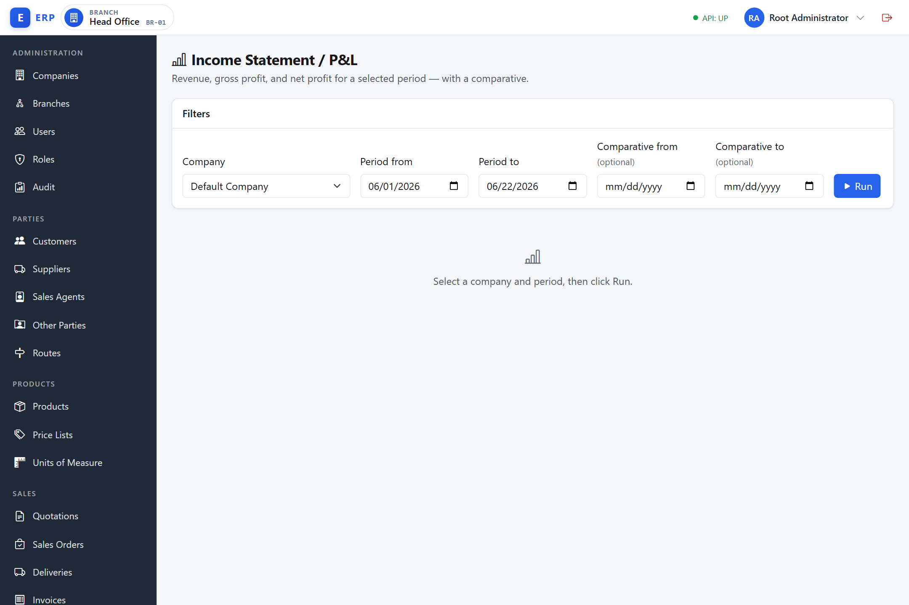
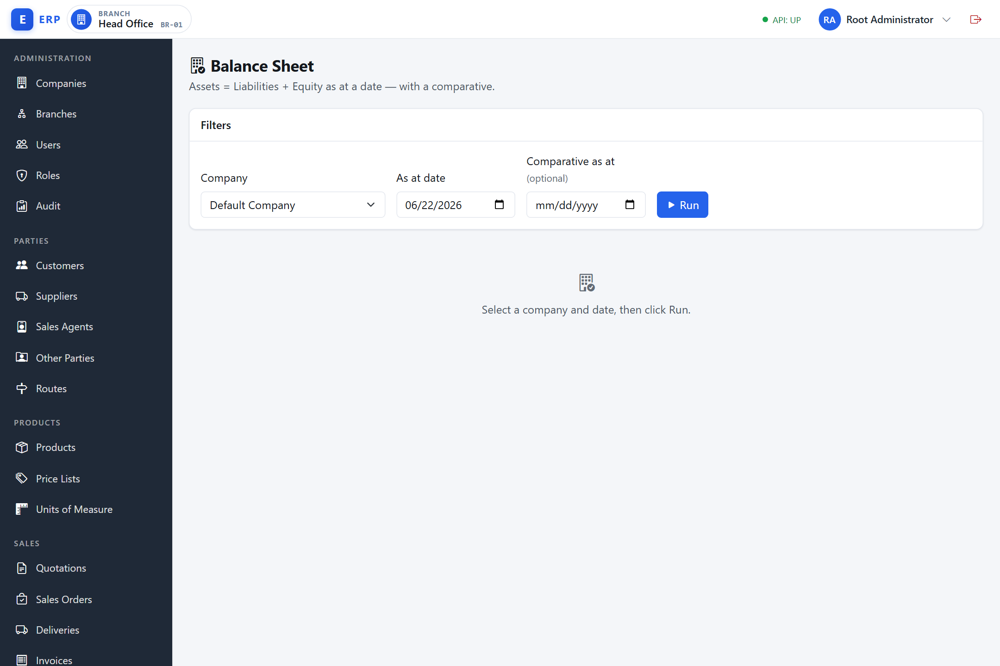
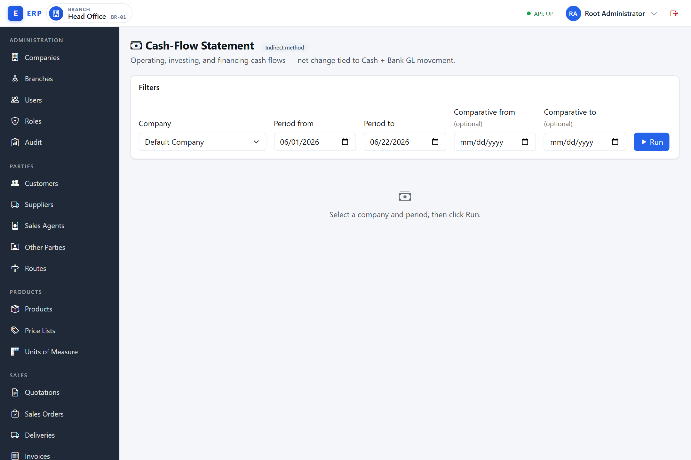
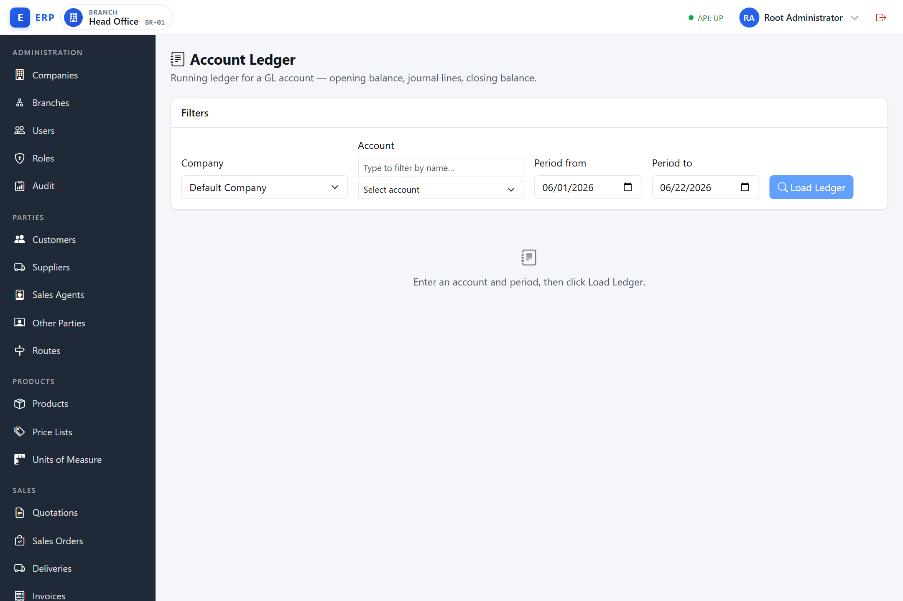
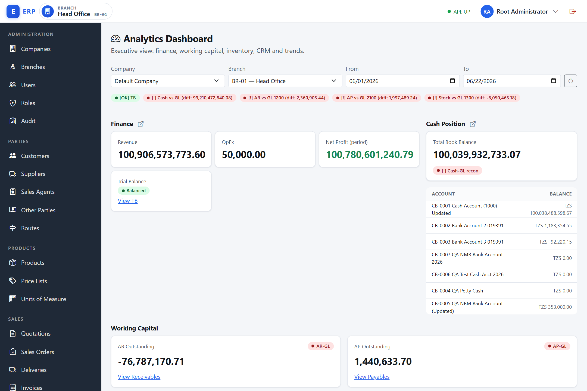

# Reporting and Business Intelligence

**What is the Reporting and BI module?**
Reporting and Business Intelligence (BI) is the read-only analytical layer of the system. It does not create, change, or post anything — it reads what the financial and operational modules have already recorded and presents the results in standard formats that management and external stakeholders (auditors, banks, tax authorities) can read and act on. The four financial statements summarise the company's performance and position in internationally recognised forms; the account ledger lets you drill into the individual transactions behind any figure; the BI dashboard composes key indicators from across all modules into a single at-a-glance view. Because all reports are computed on demand from the live General Ledger, a report run at any moment reflects the current state of the books. Nothing is stored or posted when you run a report (ADR-0018, ADR-0037).

This chapter describes the financial statements, the GL account-ledger drill-down, and the analytics dashboard. All reports are read-only and computed on demand — nothing is stored or posted when you run a report.

---

## Financial Statement Reports

**What are financial statements, and why do companies produce them?**
Financial statements are standardised summaries of a company's financial activity and position. They are the language that businesses, investors, lenders, and regulators use to assess financial health. Every trading company is legally required to produce them at least annually. In this system they are generated directly from the General Ledger and carry a reconciliation bar that confirms the figures tie back to the underlying journal entries — so there is no separate spreadsheet to maintain and no risk of a mismatch between the books and the reports.

The four financial statements are available from the **Accounting** navigation group. Each report requires the relevant permission and a company and period selection before it can be run.

**Common controls on every statement screen:**

- **Company selector** — if your organisation has more than one company, choose which company to report on by name.
- **Period inputs** — date fields specifying the reporting period.
- **Run button** — computes and displays the statement.
- **Export buttons** (PDF, Excel, CSV) — download the statement in the chosen format. Requires the additional `REPORT.EXPORT` permission. The buttons are hidden if you do not hold that permission.
- **Comparative period** — most statements accept an optional comparative period or date to populate a second column.
- **Branch** (Income Statement, Balance Sheet, Cash-Flow Statement and Financial Ratios) — leave it on *All branches* for the whole company, or pick a branch to see only the journals posted at that branch. The list offers only the branches you are assigned to; asking for another branch is refused with *"You are not assigned to that branch…"*. The statements also offer **Company-level entries (no branch)** — the journals that carry no branch: manual journals, opening balances, FX revaluation runs and the year-end close. The branches plus the company-level entries always add up exactly to the whole-company statement. The statement header names what you are looking at (a branch name, *All branches*, or *Company-level entries*), and so does the company line of every export.
- **Reconciliation indicator** — a green **"Reconciled"** bar confirms the computed figures tie back to the underlying GL movement. A red **data-integrity alarm** means the figures do not agree and the books require investigation; the report is shown but no automatic correction is made.

---

### Profit & Loss (Income Statement)

**What is the Profit and Loss statement, and what does it tell you?**
The Profit and Loss statement (also called the Income Statement) shows how much revenue the company earned and how much it spent over a period of time, arriving at a net profit or loss. Revenue is income from sales and services; Cost of Sales is the direct cost of what was sold (purchases, materials, production); Operating Expenses are the overhead costs of running the business (salaries, rent, utilities). Gross Profit is Revenue minus Cost of Sales — a measure of trading margin. Net Profit is what remains after all operating expenses. The P&L answers the question: "Did the business make money this period, and where did the money come from and go?" It is the report most used for management decisions, bank covenants, and tax assessments. The comparative column lets you benchmark the current period against a prior period (same quarter last year, for example) to spot trends.

Navigate to **Accounting › Income Statement** (`/admin/reporting/income-statement`). Permission required: `REPORT.PL.VIEW`.

1. Select the company by name.
2. Set **Period from** and **Period to** (date inputs).
3. Optionally set a **Comparative from** and **Comparative to** to add a prior-period column.
4. Click **Run**.

The statement shows:

- Revenue lines grouped under **REVENUE**.
- Cost of sales lines under **COST OF SALES**.
- Operating expense lines under **OPERATING EXPENSES**.
- Section subtotals.
- A footer with **Gross Profit** and **Net Profit** rows, each carrying the current period amount and — if a comparative was set — the prior-period amount.

**Drill-through to the account ledger:** any account name shown as a link in the detail rows can be clicked to open the Account Ledger pre-filtered to that account and period.

**Export:** after running the statement, click **PDF**, **Excel**, or **CSV** in the export toolbar. The downloaded file is named `income-statement_<from>_<to>.<ext>`.

**Year-end close:** the closing journal that moves a year's result into Retained Earnings is not income or expense, so the Income Statement leaves it out — a closed year still shows the profit it made.

---

**Example — Run a comparative P&L for two quarters and export to Excel:**

Chief accountant Rehema Mwangi needs to compare Q1 2026 performance against Q1 2025 for the board report.

1. Navigate to **Accounting › Income Statement** (`/admin/reporting/income-statement`).
2. Company: `Kijenge Trading Ltd`.
3. Period from: `2026-01-01`; Period to: `2026-03-31`.
4. Comparative from: `2025-01-01`; Comparative to: `2025-03-31`.
5. Click **Run**.

The statement loads. The green **Reconciled** bar confirms net profit ties to the INCOME − EXPENSE GL movement. Results:

| Section | Q1 2026 | Q1 2025 |
|---|---|---|
| Revenue | TZS 48,250,000 | TZS 39,100,000 |
| Cost of Sales | TZS 29,340,000 | TZS 24,600,000 |
| Gross Profit | TZS 18,910,000 | TZS 14,500,000 |
| Operating Expenses | TZS 9,720,000 | TZS 8,850,000 |
| Net Profit | TZS 9,190,000 | TZS 5,650,000 |

Rehema clicks **Excel** in the export toolbar. The file `income-statement_2026-01-01_2026-03-31.xlsx` downloads with both columns. She forwards it to the board.

To drill into "Sales Revenue", she clicks the account name link — the Account Ledger opens pre-filled with that account and the Q1 2026 period, showing every posted journal line and a running balance.

---

### Balance Sheet

**What is the Balance Sheet, and what does it tell you?**
The Balance Sheet (also called the Statement of Financial Position) shows what the company owns and what it owes at a single point in time. **Assets** are what the company owns — cash, trade receivables, stock, fixed assets, and other resources. **Liabilities** are what the company owes — supplier payables, loans, tax obligations. **Equity** is the residual interest of the owners — the difference between assets and liabilities, representing the net worth of the business. A correctly prepared balance sheet always satisfies the fundamental accounting equation: Assets = Liabilities + Equity. If this equation does not balance, something has been mis-posted. The Balance Sheet answers the question: "What is the company worth, and how solvent is it?" It is used by banks to assess creditworthiness, by investors to evaluate the business, and by management to monitor liquidity. The comparative "as at" date lets you compare financial position at two year-ends side by side.

Navigate to **Accounting › Balance Sheet** (`/admin/reporting/balance-sheet`). Permission required: `REPORT.BS.VIEW`.

1. Select the company by name.
2. Set the **As-at date**.
3. Optionally set a **Compare as-at** date to add a prior-date column.
4. Click **Run**.

The statement shows sections for Current Assets, Non-Current Assets, Current Liabilities, Non-Current Liabilities, and Equity, each with detail lines, subtotals, and four total rows in the footer: **Total Assets**, **Total Liabilities**, **Total Equity**, and a grand-total **Total Liabilities + Equity** row. A balanced set of books shows Total Assets equal to the Total Liabilities + Equity row, confirmed by a green **Balanced** bar (helper text *Assets = Liabilities + Equity.*).

**Drill-through:** click any real account name link to open the Account Ledger for that account as at the selected date.

**Export:** file is named `balance-sheet_<asAt>.<ext>`.

**A branch Balance Sheet** balances on its own, because every journal is posted to exactly one branch (or to none). Read it with two caveats, which the screen also prints under a branch statement:

- **Stock transfers between branches move quantities, not ledger value.** No journal is posted for a transfer, so a branch's *Inventory* reflects what it bought and sold, not what it holds — a branch that sells stock it received by transfer can show low or even negative Inventory, and the sender too much. The company total is right.
- **Company-level journals carry no branch.** After a year-end close, each branch keeps its closed years under *Retained earnings — prior years (unclosed)* because the close itself is company-level; the *Company-level entries* statement carries the matching opposite.

If a journal ever carried lines for different branches, the branch statement would show an explicit **Inter-branch balance (entries spanning branches)** line under Current Liabilities instead of silently failing to balance. Nothing the system posts today produces one.

---

**Example — Run a comparative balance sheet at year-end:**

Rehema Mwangi needs the balance sheet as at 30 June 2026 compared with 30 June 2025.

1. Navigate to **Accounting › Balance Sheet** (`/admin/reporting/balance-sheet`).
2. Company: `Kijenge Trading Ltd`; As-at date: `2026-06-30`; Compare as-at: `2025-06-30`.
3. Click **Run**.

The green **Balanced** bar appears, with the helper text *Assets = Liabilities + Equity.* Rehema spots that "Trade Receivables" has grown from TZS 12.4M to TZS 19.7M year-on-year. She clicks the "Trade Receivables" account name to open its ledger for the full fiscal year and reviews each transaction. She then exports to PDF for the audit file.

---

### Cash-Flow Statement

**What is the Cash-Flow Statement, and what does it tell you?**
The Cash-Flow Statement shows how cash moved into and out of the business over a period, organised into three categories. **Operating activities** are cash flows from the company's main trading activities — collecting from customers, paying suppliers, paying wages. **Investing activities** are cash flows from buying or selling long-term assets — purchasing a vehicle or machinery, receiving proceeds from selling an asset. **Financing activities** are cash flows from raising or repaying capital — new loans drawn, loan repayments, equity injections. The statement reconciles the opening and closing cash balance, confirming that the movement in the company's bank accounts is fully explained. The Cash-Flow Statement answers the question: "Where did the cash come from, and where did it go?" It is particularly important for businesses that are profitable on paper but cash-constrained in practice — a common situation when customers pay late or large capital purchases are made. The system uses the **indirect method** (starting from net profit and adjusting for non-cash items), which is the most common format for external reporting.

Navigate to **Accounting › Cash-Flow Statement** (`/admin/reporting/cash-flow`). Permission required: `REPORT.CASHFLOW.VIEW`.

1. Select the company by name.
2. Set **Period from** and **Period to**.
3. Optionally set a comparative period.
4. Click **Run**.

The indirect-method statement shows movements in three sections:

- **OPERATING ACTIVITIES** — cash generated from or used in trading activities.
- **INVESTING ACTIVITIES** — cash spent on or received from capital assets.
- **FINANCING ACTIVITIES** — cash from borrowings, equity, or repayments.

The opening position is shown as a body row at the top of the table (**Opening cash & bank balance**, under an **OPENING CASH POSITION** heading). The footer then shows **Net Change in Cash** and **Closing Cash & Bank Balance**. A green **Cash Tie-out: Reconciled** bar confirms the net change matches the change in cash-equivalent GL account balances.

**Export:** file is named `cash-flow_<from>_<to>.<ext>`.

A branch Cash-Flow Statement is read from that branch's journals on the company's cash and bank accounts, and ties to the movement on those accounts at that branch.

---

**Example — Cash-flow analysis for H1 2026:**

1. Navigate to **Accounting › Cash-Flow Statement** (`/admin/reporting/cash-flow`).
2. Company: `Kijenge Trading Ltd`; Period from: `2026-01-01`; Period to: `2026-06-30`.
3. Click **Run**.

Results show Opening Cash: TZS 6,800,000; Operating inflow: TZS 11,250,000; Investing outflow: TZS −4,200,000 (purchase of delivery van); Financing outflow: TZS −1,500,000 (loan repayment); Net Change: TZS 5,550,000; Closing Cash & Bank Balance: TZS 12,350,000. The green **Cash Tie-out: Reconciled** bar confirms the net change ties to the actual movement in the bank account GL balances.

---

### Statement of Changes in Equity

**What is the Statement of Changes in Equity?**
It is the fourth primary financial statement. Where the Balance Sheet shows the owners' equity at one date, this statement explains how it got from the opening figure to the closing one over a period: the profit earned, capital the owners put in, drawings and dividends they took out, and transfers between equity lines such as the year-end close moving the year's result into Retained Earnings. Auditors and banks expect it alongside the other three.

Navigate to **Accounting › Changes in Equity** (`/admin/reporting/changes-in-equity`). Permission required: `REPORT.BS.VIEW` (the same as the Balance Sheet, because its closing column *is* the Balance Sheet's equity). Export also requires `REPORT.EXPORT`.

1. Select the company by name.
2. Set **Period from** and **Period to**.
3. Click **Run**.

One row per equity component — each equity account (e.g. 3000 Owner's Equity / Capital, 3900 Retained Earnings) plus the two earnings lines the Balance Sheet shows (*Retained earnings — prior years (unclosed)* and *Current-year earnings*) — with these columns:

| Column | What it holds |
|---|---|
| Opening | the Balance Sheet figure the day before the period starts |
| Profit for the period | the Income Statement's net profit for the same dates (on the current-year earnings line) |
| Opening balances posted | equity posted by opening-balance journals |
| Capital introduced & other credits | every other credit to the account — capital injected, and any other credit |
| Drawings, dividends & other debits | every other debit to the account, shown as a negative amount |
| Transfers | the year-end close (out of earnings, into Retained Earnings) and, when the period crosses the start of a financial year, last year's "current-year earnings" becoming "prior years". The column always totals zero. |
| Closing | the Balance Sheet figure on the last day of the period |

The ledger records *which journal* moved an equity account, not *why*, so a capital injection and a correcting credit share one column — the column names say so.

A green **Ties to the Balance Sheet** bar confirms that opening plus every movement equals the Balance Sheet's equity at the period end. A component whose movements do not add up is flagged *does not add up* on its row, and the bar turns red with the difference — nothing is adjusted to make it tie.

The statement is company-wide (no branch filter). **Export:** PDF, Excel or CSV, named `changes-in-equity_<from>_<to>.<ext>`; the export footer repeats the tie-out result.

---

### Financial Ratios

**What are the financial ratios for?**
They turn the statements into a handful of numbers a manager or a bank can compare from one period to the next: can the business pay its short-term debts, how much of each sale it keeps, how geared it is, what return the owners earn, and how fast stock, customers and suppliers turn over.

Navigate to **Accounting › Financial Ratios** (`/admin/reporting/ratios`). Permission required: **both** `REPORT.PL.VIEW` and `REPORT.BS.VIEW` (the ratios disclose figures from both statements). Export also requires `REPORT.EXPORT`.

1. Select the company by name.
2. Set **Period from** and **Period to**.
3. Optionally pick a **Branch** (only branches you are assigned to are offered).
4. Click **Run**.

Every ratio is shown with its formula, the statement figures it was worked out from, and the result. The figures come from the Income Statement for the period and the Balance Sheet at its closing date and the day before it opens; "average" means (opening + closing) ÷ 2.

| Ratio | Formula |
|---|---|
| Current ratio | Current assets ÷ Current liabilities |
| Quick ratio | (Current assets − Inventory) ÷ Current liabilities |
| Gross margin | Gross profit ÷ Revenue × 100 |
| Net margin | Net profit ÷ Revenue × 100 |
| Debt-to-equity | Total liabilities ÷ Total equity |
| Return on equity | Net profit ÷ Average equity × 100 (for the period, not annualised) |
| Inventory turnover | Cost of sales ÷ Average inventory |
| Inventory days | Average inventory ÷ Cost of sales × Days in period |
| Debtor days (DSO) | Average receivables ÷ Revenue × Days in period |
| Creditor days (DPO) | Average payables ÷ Cost of sales × Days in period |

Inventory, receivables and payables are the accounts marked as Inventory, Accounts Receivable and Accounts Payable control accounts in the chart of accounts. Debtor days use total revenue because the ledger does not separate credit sales from cash sales (a shop with many cash sales shows fewer days than its credit customers really take); creditor days use cost of sales in place of credit purchases.

A ratio that cannot be worked out — because what it divides by is zero (no revenue, no cost of sales, no current liabilities…) — shows a dash and the reason, never 0.00. If the Income Statement or the Balance Sheet underneath fails its own check, a red warning says so.

For a branch, the ratios are that branch's and inherit the branch caveats above — in particular, inventory ratios are distorted by stock transfers. **Export:** PDF, Excel or CSV, named `financial-ratios_<from>_<to>.<ext>`.

---

### Account-Ledger Drill-Down

**What is the Account Ledger, and when do you use it?**
The Account Ledger shows every individual journal line posted to a single GL account within a date range, with a running balance. It is the most granular view available in the system: while the financial statements show totals and subtotals, the ledger shows the individual transactions behind each total. It is the primary tool for investigating a balance — for example, if Trade Receivables on the balance sheet is higher than expected, you open the ledger for that account to see every invoice and receipt that has been posted. The ledger is also the standard tool for preparing a bank reconciliation (compare the bank account ledger to the bank statement) and for answering auditor queries about specific transactions. The opening balance is the account's position before the chosen date range, so every line in the report can be traced back to a source document.

Navigate to **Accounting › Account Ledger** (`/admin/reporting/account-ledger`). Permission required: `REPORT.LEDGER.VIEW`.

The account ledger shows every posted journal line for a single GL account within a date range, with a running balance.

1. Select the company by name.
2. In the **Account** picker (placeholder *Select account*), choose an account from the dropdown. Accounts are chosen by name; no uid is typed. The picker is a plain dropdown; a *Type to filter by name…* box appears above it only when the account list exceeds 12 entries.
3. Set **Period from** and **Period to**.
4. Click **Load Ledger** (the button carries a search icon).

The report shows:

- An **opening balance** (the account's balance as at the day before the from date).
- Every journal line in date order under the columns **Date**, **Source**, **Reference**, **Memo**, **Debit**, **Credit**, and **Balance** (the running balance). Negative running balances are shown in red.
- A **closing balance** (the account's balance at the end of the to date).

**Pagination:** if the account has more than 50 lines in the period, the shared paginator appears at the bottom. Navigate with the chevron icon buttons — first page, previous page, next page, and last page (their text is read out by screen readers via aria-labels) — and the numbered page buttons shown between them. The running balance carries across pages: the first line of each page continues from the last line of the page before, and the last line of the last page equals the closing balance.

**Export:** the export is bounded at 10,000 rows per download. If the period has more lines than that, the document lists the first 10,000 and then one line "*N further lines not listed (net movement)*" carrying the net of the rest, so the printed figures still add up to the closing balance. For very busy accounts spanning long periods, narrow the date range and export in segments. File is named `account-ledger_<accountCode>_<from>_<to>.<ext>`. Export requires `REPORT.EXPORT`.

---

**Example — Investigate the bank account movements for April 2026:**

1. Navigate to **Accounting › Account Ledger** (`/admin/reporting/account-ledger`).
2. Company: `Kijenge Trading Ltd`.
3. Account picker: select **Bank — Main Current (1100)** from the dropdown.
4. Period from: `2026-04-01`; Period to: `2026-04-30`.
5. Click **Load Ledger**.

Opening balance: TZS 12,350,000. The ledger shows 28 lines — 15 customer receipts credited and 13 payments debited, with a closing balance of TZS 14,890,000. The paginator is hidden (fewer than 50 lines). Rehema exports to CSV for the bank reconciliation working paper.

---

### Trial Balance

The Trial Balance is covered fully in the Finance chapter (Accounting › Trial Balance, `/admin/gl/trial-balance`). It can also be reached from the Accounting navigation group. Permission required: `GL.VIEW`. See the General Ledger section for full usage.

---

## Business Intelligence Dashboard

**What is the BI Dashboard, and who uses it?**
The Business Intelligence Dashboard (the page is titled **Analytics Dashboard**) is a single-screen summary that composes key performance indicators (KPIs) from Finance, Operations, and CRM into one view. Rather than opening the income statement, then the AR list, then the stock valuation report separately, a finance director or general manager can open the dashboard and see the essential health indicators at a glance: is the trial balance balanced? Are the AR and AP sub-ledgers in agreement with the GL? How much cash is in the accounts? What is the current pipeline forecast? Each reconciled figure carries a health badge (green `[OK]` / red `[!]`) that instantly signals whether the underlying sub-ledger ties to the GL control account — a critical integrity check the finance team would otherwise have to perform manually. Drill-through links take the reader straight to the relevant detail screen. The dashboard is permission-gated at the panel level: a user with only operations permissions sees the stock panel but not the finance panels, and gets a calm "no permission" message for the panels they cannot access (ADR-0037).

Navigate to **Analytics › Dashboard** (`/admin/dashboard`). Permission required: `BI.VIEW`. Users who hold `BI.VIEW` also see a **Dashboard** card first on their home-page launchpad.

The dashboard is a composite view of key performance indicators drawn from Finance, Operations, and CRM data. Each panel has its own permission. If you hold `BI.VIEW` but lack a panel-specific permission, that panel shows a calm "no permission" message rather than blocking the whole page.

**Who sees which panels (standard roles):**

| Role | Finance, Cash, Working Capital, Trends, Sales by Branch | Inventory | CRM | Export |
|---|---|---|---|---|
| Finance Director | Yes | Yes | Yes | Yes |
| Accountant | Yes | — | — | Yes |
| Branch Manager | Yes | Yes | — | Yes |
| Sales Manager | — | — | Yes | Yes |
| Procurement Manager | — | Yes | — | Yes |

Root users see everything. A custom role sees exactly the panels whose permission it has been granted (see the panel list below).

---

### Filters at the top of the page

- **Company** — a selector appears only if your organisation has more than one company; switching company reloads its branches, resets **Branch** to "All branches", and re-fetches the dashboard. With a single company it is selected automatically and no selector is shown.
- **Branch** — **All branches** (the default) or one branch, shown as `code — name`. The dashboard re-fetches as soon as you change it. Only the **CRM** panel and the **Sales by Branch** panel are narrowed by this filter. The Finance, Cash Position, Working Capital, Inventory, Revenue Trend and Net Profit Trend panels are anchored to the GL at company level and always show company-wide figures — each of those panels carries a **Group-wide** tag, and while a branch is selected a short note under its heading reminds you: *Group-wide — not affected by the branch filter above.* The two panels that *do* follow the filter show a **This branch** tag instead.
- **You can only filter to a branch you are assigned to.** The list shows every branch of the company, but if you pick one you are not assigned to (in **Administration › Users**, branch assignments), the request is refused and every panel shows its "no permission" message. Pick one of your own branches, or go back to **All branches**. Root users are exempt.
- **From / To dates** — the reporting date range. **From** defaults to the first day of the current month and **To** defaults to today. Changing a date does **not** refresh on its own: click the circular **Refresh dashboard** button (the arrow-clockwise icon beside the To date) to re-fetch all panels.

**The scope line.** Once the data loads, a row of three grey tags appears under the filters, showing what the server actually filtered to: the **company name**, **Branch: …** (the branch name, or *All branches*), and the **period** (for example `2026-10-01 – 2026-10-02`). Read these tags rather than the pickers when you want to be sure what a figure covers. If they ever read *Branch: Unknown branch*, the branch you chose does not belong to this company, and the branch-filtered panels will be empty — choose the branch again.

---

**Example — Read the dashboard KPIs and drill through to source screens:**

Finance director Gideon Moshi logs in and opens **Analytics › Dashboard** (`/admin/dashboard`). The company `Kijenge Trading Ltd` is selected automatically, **Branch** is on **All branches**, and the dates default to the current month (2026-06-01 to 2026-06-14). The scope line reads `Kijenge Trading Ltd` · `Branch: All branches` · `2026-06-01 – 2026-06-14`.

1. **Health strip** — all five pills (TB, Cash vs GL, AR vs GL 1200, AP vs GL 2100, Stock vs GL 1300) show green `[OK]`. No reconciliation issues, so no `(diff: …)` figures appear.

2. **Finance panel** — Revenue: 9,850,000.00; OpEx: 4,200,000.00; Net Profit (period): 3,480,000.00 (shown green because it is positive). The Trial Balance card reads **Balanced**. Gideon clicks the drill icon in the **Finance** heading — this opens the Income Statement (`/admin/reporting/income-statement`) where he can run a full P&L; the **View TB** link on the Trial Balance card opens the GL trial balance.

3. **Cash Position panel** — Total Book Balance: 14,890,000.00, with a green **[OK] Cash-GL recon** pill, and a table listing each cash/bank account with its balance in its own currency. He uses the heading drill icon to open the cash & bank accounts list.

4. **Working Capital panel** — AR Outstanding: 19,700,000.00 (green **AR-GL** pill). AP Outstanding: 6,450,000.00 (green **AP-GL** pill). Below AR Outstanding a small line reads *Not converted: USD 1,200.00* — older US-dollar invoices that carry no reliable exchange rate, so they are listed separately instead of being added into the TZS figure. He clicks **View Receivables** to drill into the AR invoices list.

5. **Inventory panel** — Stock Value: 38,250,000.00, with a **Stock-GL (acct 1300)** pill reading **Reconciled**. He uses the heading drill icon to open the stock valuation screen.

6. **CRM panel** — Pipeline by Stage shows 15 open deals across five stages, each bar giving the stage's deal count and value; Win-Rate KPIs show Won, Lost, Win Rate 62.0%, and Avg Cycle (days); the Forecast block shows Open Opps and a Weighted Value of TZS 29,340,000.00. He uses the heading drill icon to open the CRM pipeline dashboard.

7. **Revenue Trend / Net Profit Trend** — twelve bars each, one per fiscal period (labelled `P1 2026`, `P2 2026`, …). The net-profit bars are green for a profit and red for a loss.

8. **Sales by Branch panel** — with **Branch** still on "All branches", the table lists every branch in descending order of sales: `DSM — DSM Main` leads with 5,120,000.00 across 34 finalised invoices, followed by `ARU — Arusha Branch` with 2,890,000.00 across 19 invoices and the remaining branches, with a **Total** row of 9,715,000.00 across 61 invoices. (This total is the VAT-inclusive value of finalised sales invoices, so it will not match the Finance panel's Revenue, which is net of VAT and taken from the GL.) The drill icon in the heading opens the sales invoices list.

9. Gideon changes **Branch** to `ARU — Arusha Branch`. The dashboard re-fetches immediately. The scope line now reads `Branch: Arusha Branch`; the CRM and Sales by Branch headings show **This branch**, and the Sales by Branch table shows a single row for Arusha. The other panels still show **Group-wide** with the "not affected by the branch filter" note, and their figures are unchanged.

10. He selects **Excel** in the **Export** dropdown and clicks **Download**. The file `dashboard_2026-06-01_2026-06-14.xlsx` downloads; its first line reads *Branch: Arusha Branch*, so the file states its own scope. (Requires `BI.EXPORT`.)

---

### KPI Panels

**What are KPI panels?**
Each KPI panel on the dashboard is a self-contained summary of one operational or financial domain, sourced from the module that owns that data. The panels display figures that have already been computed by the underlying modules (the AR reconciliation query, the stock valuation query, the CRM pipeline query, etc.); the dashboard simply composes them into one screen. A health badge (`[OK]` or `[!]`) accompanies any figure that has a GL tie-out — it tells you at a glance whether the sub-ledger agrees with the General Ledger. A red badge is a prompt for the finance team to investigate before closing the period.

All amounts are shown with two decimals and no currency symbol unless stated; they are in the company's **base currency** (the scope line names the company).

**Each panel has four possible states:** a *Loading…* spinner; the figures; an empty message when there is nothing yet for the period (for example *No finance data yet for this period.*); or a message when you cannot see it — either *You do not have permission to view …* (missing panel permission, or a branch you are not assigned to) or *Could not load … data.* (a temporary fault — click **Refresh dashboard** to try again).

**Health strip** — a row of colour-coded status pills under the scope line, showing whether each sub-ledger reconciles with its GL control account. The pills are labelled by what they tie out: **TB** (trial balance), **Cash vs GL**, **AR vs GL 1200**, **AP vs GL 2100**, and **Stock vs GL 1300**. A green pill prefixed `[OK]` means the figures tie; a red pill prefixed `[!]` means there is a discrepancy, and it also shows the difference inline (for example, `[!] AR vs GL 1200 (diff: 1,250.00)`) so the finance team can see how far out the balance is. You only see the pills for the panels you are allowed to view.

**Finance panel (requires `BI.FINANCE.VIEW`; Group-wide):**

- **Revenue**, **OpEx** (operating expenses, excluding cost of sales), and **Net Profit (period)** for the selected date range — the same figures the Income Statement gives for those dates. Net profit is green when positive and red when negative.
- A **Trial Balance** card with a status pill showing **Balanced** or **Out of balance** (whether total debits equal total credits), and a **View TB** link to the GL trial balance. The trial-balance check covers all postings to date, not just the selected range.
- The drill icon in the panel heading opens the Income Statement (P&L) report.

**Cash Position panel (requires `BI.FINANCE.VIEW`; Group-wide):**

- A **Total Book Balance** across all cash and bank accounts, with a **Cash-GL recon** pill (`[OK]` / `[!]`) showing whether the cash book ties to the GL.
- A table listing each cash/bank account (code and name) with its **Balance** in the account's own currency.
- The total simply adds the account balances together. If you keep cash or bank accounts in more than one currency, read the per-account table rather than the total.
- The drill icon in the panel heading opens the Cash & Bank accounts list.

**Working Capital panel (requires `BI.FINANCE.VIEW`; Group-wide):**

- **AR Outstanding** with an **AR-GL** reconciliation pill, and a **View Receivables** link into the AR invoices list.
- **AP Outstanding** with an **AP-GL** reconciliation pill, and a **View Payables** link into the AP supplier-bills list.
- Both balances are current (as at today) and in base currency. Foreign-currency items count at the rate they were booked at. **Older foreign-currency items with no reliable rate** (raised before multi-currency was switched on) are not added into the base figure; they appear underneath as *Not converted: USD 1,200.00, EUR 300.00* so nothing is hidden. The same rule applies to the AR and AP reconciliation pills and to the customer and supplier balances described in the Finance chapter.

**Inventory panel (requires `BI.OPS.VIEW`; Group-wide):**

- **Stock Value** and a **Stock-GL (acct 1300)** pill showing whether the stock sub-ledger ties to the GL inventory account (**Reconciled**, or **Difference: …** with the figure when it does not tie).
- The drill icon in the panel heading opens the stock valuation screen.

**CRM panel (requires `BI.CRM.VIEW`; follows the Branch filter):**

- A **Pipeline by Stage** bar chart: one bar per stage showing the number of open opportunities and their total value. This is the pipeline as it stands today — it does not follow the From / To dates.
- A **Win-Rate KPIs** block: **Won** count, **Lost** count, **Win Rate** (%), and **Avg Cycle (days)**, for the selected date range.
- A **Forecast** block: **Open Opps** count and **Weighted Value** (the probability-weighted pipeline value for the period).
- The drill icon in the panel heading opens the CRM Pipeline Dashboard.

**Revenue Trend and Net Profit Trend (requires `BI.FINANCE.VIEW`; Group-wide):**

- One bar per fiscal period for the company's last 12 fiscal periods, labelled `P<period> <year>` (for example `P3 2026`), with the value beside it. These charts do **not** follow the From / To dates — they always show the last 12 periods set up in the fiscal calendar (so if next year's periods are already open, they appear with zero).
- Net-profit bars are green for a profit and red for a loss.

**Sales by Branch panel (requires `BI.FINANCE.VIEW`; follows the Branch filter):**

- A table of finalised sales invoices in the selected date range, by branch: **Branch** (`code — name`), **Sales (TZS)** — each invoice's gross total *including VAT*, in base currency (the column heading names it) — and **Invoices** (count), with the highest-selling branch first. A **Total** row sums both columns.
- With **All branches** the table shows the full per-branch breakdown; selecting one branch narrows it to that branch's row.
- Only **FINALISED** invoices count, dated by when they were finalised; draft or voided invoices are excluded. Invoices raised in another currency count at their base-currency value.
- If no invoices were finalised in the period, the panel shows *No finalised invoices for this period.*
- The drill icon in the panel heading opens the sales invoices list (**Sales › Invoices**, `/admin/sales-invoices`).

---

### Drill-Through

Each panel offers one or more drill links to the relevant detail screen: a small drill icon in the panel heading (Finance → Income Statement, Cash Position → Cash & Bank Accounts, Inventory → Stock Valuation, CRM → Pipeline Dashboard, Sales by Branch → Sales Invoices) plus text links inside the panels (**View TB**, **View Receivables**, **View Payables**). Working Capital and the two trend charts have no heading icon.

The target screen opens with its own default filters — it does not carry over the dashboard's dates or branch filter, so set them again there if needed. It also has its own permission; if you do not hold it, you are taken to an access-denied page.

---

### Exporting the Dashboard

Requires both `BI.VIEW` and `BI.EXPORT`. The Finance Director, Accountant, Branch Manager, Sales Manager, and Procurement Manager roles have it as standard. Without it, no **Export** control is shown. The control sits just under the filters, above the panels.

1. Choose a format from the **Export** dropdown: **PDF** (the default), **Excel**, or **CSV**.
2. Click **Download**. The button reads *Exporting…* while the file is prepared.

The file is named `dashboard_<from>_<to>.<ext>` (for example `dashboard_2026-06-01_2026-06-14.pdf`, or `.xlsx` for Excel). It covers the same company, branch, and date range as the screen, and its first line states the branch (*Branch: All branches*, or the branch name).

**What the file contains.** Only the panels you are allowed to view. It has: the Finance summary (Revenue, Operating Expenses, Net Profit, trial-balance check); the Cash Position total with the Cash vs GL check; Working Capital (AR and AP outstanding with their GL checks); Inventory (stock value and its GL check); the CRM pipeline value per stage, KPIs, and weighted forecast; the 12-period Revenue and Net Profit trends; and the health indicators. The export does **not** include the per-account cash table, the *Not converted* foreign-currency lines, or the Sales by Branch table. For those, use the screen, or run the standard sales and cash reports.

If the export is refused or fails, a short message appears beside the button: *You don't have permission to export the dashboard.*, *The dashboard could not be exported with these filters. Check the dates and try again.*, or *Could not export the dashboard. Please try again.*

---

## Analytical Reports

The following specialised reports sit under the **Budgeting** and **Costing** navigation groups but are described here because they are reporting outputs, not data-entry screens.

### Budget Variance Report

**What is the Budget Variance Report, and why is it produced?**
A budget variance report compares what the business planned to spend (or earn) against what actually happened. A variance is the difference: if you budgeted TZS 3,200,000 for fuel but spent TZS 3,850,000, the variance is TZS 650,000 **adverse** (worse than plan). For income accounts, spending more than budgeted is **favourable** (you earned more than expected). This report is the primary tool for **management by exception** — the finance team and department heads review it monthly to identify lines that have gone significantly off-plan and investigate why. It drives conversations about cost control, re-forecasting, and budget reallocation. For the report to show non-zero budget figures, at least one budget version covering the selected fiscal year and scope must have been **approved** (see Part 2 — Budgeting, in the HR, Budgeting, and Platform chapter).

Navigate to **Budgeting › Budget Variance Report** (`/admin/budgeting/variance`). Permission required: `BUDGETING.REPORT.VIEW`.

The report compares GL actuals against an approved budget version.

1. Select the company by name.
2. Choose the **Fiscal Year** from the picker. This is a name-picker dropdown (see *Common UI Patterns › Name pickers* in the Getting Started chapter): each option shows the year code, with the year's status (`OPEN` / `CLOSED`) as a hint, and the placeholder reads *Select fiscal year*. You select a year code from the list — no UID is typed or pasted. The picker is **reloaded when you switch company**: changing the **Company** selector clears the prior fiscal-year selection and re-fetches the year list for the newly selected company. The field is required; running without a year shows the validation message *Fiscal year is required.*
3. Set the **From Period** and **To Period** (1–12; from must be ≤ to). These are pre-filled with **1** and **12** respectively, so by default the report covers the whole year — change them only to narrow the range.
4. Optionally filter by **Account type** (All account types, Asset, Liability, Equity, Income, Expense) and enter a **Cost Centre UID** (leave blank for all cost centres).
5. Click **Run Report**.

If no **APPROVED** budget version covers the selected scope, a yellow warning banner appears above the results — *No **APPROVED** budget version found for this scope — all budget amounts are zero* — and the budget columns show zero. Approve a budget version first (see Part 2 — Budgeting) to populate them.

The report then shows:

- A **header summary card** restating the Fiscal Year code, the period range (P*from* – P*to*), and the Cost Centre (or *— All —*).
- A **Totals by Account Type** summary table with Budget, Actual, and Variance columns per account type (Asset, Liability, Equity, Income, Expense).
- A **Detail** table of account-level rows: Code, Account, Type, Cost Centre, Budget, Actual, Variance, **Var %**, and an **Assessment** column carrying a **Favourable**, **Adverse**, or **On budget** label. For income accounts, actual > budget is favourable. For expense accounts, actual < budget is favourable.

---

**Example — Run a budget variance report for the first half of the fiscal year:**

Management accountant Yasmin Juma navigates to **Budgeting › Budget Variance Report** (`/admin/budgeting/variance`).

1. Company: `Kijenge Trading Ltd`.
2. Fiscal Year: she opens the **Fiscal Year** picker and selects `FY2026` from the dropdown — no UID is copied or pasted.
3. From Period: `1`; To Period: `6` (January through June — overriding the default 1–12).
4. Account type: `Expense` (to focus the board on cost discipline).
5. Click **Run Report**.

Results show that "Fuel & Transport" (actual TZS 3,850,000 vs budget TZS 3,200,000) is marked **Adverse** by TZS 650,000, while "Office Supplies" (actual TZS 480,000 vs budget TZS 600,000) is **Favourable** by TZS 120,000. Yasmin notes the fuel over-run for discussion in the monthly management meeting.

---

### Departmental Actuals Report

**What is the Departmental Actuals Report?**
The Departmental Actuals Report shows real GL postings broken down by cost centre and account, without any budget comparison. It answers the question: "How much did each department actually spend on each expense type?" It is useful when a department manager wants to understand their spending in detail, or when the finance team needs to review allocations across departments without the distraction of a budget column. Cost centres are assigned to journal entries when transactions are posted; entries posted without a cost-centre tag appear as **Unallocated**.

Navigate to **Budgeting › Departmental Actuals** (`/admin/budgeting/departmental-actuals`). Permission required: `BUDGETING.REPORT.VIEW`.

Shows actual GL postings broken down by cost centre and account for the chosen fiscal year and period range.

1. Select the company by name.
2. Choose the **Fiscal Year** from the picker — the same name-picker used on the Budget Variance Report (year code in the list, status as a hint, *Select fiscal year* placeholder, no UID typed). It likewise reloads when you switch company, clearing any prior selection. The field is required.
3. Set the **From Period** and **To Period** (1–12; pre-filled with 1 and 12).
4. Click **Run Report**.

There is no Account-type filter or Cost Centre input on this report. The result shows a date-range card followed by a table with columns: **Cost Centre**, **Code**, **Account**, **Type**, **Normal Balance**, and **Actual (TZS)**. Entries posted without a cost-centre tag appear under **Unallocated**. This report has no budget comparison — it shows actuals only, useful for analysing spending by department or cost centre.

### Dimension-Sliced Trial Balance

Navigate to **Costing › Sliced Trial Balance** (`/admin/cost-centre/report`). Requires both `COSTING.VIEW` and `GL.VIEW`.

See the General Ledger section (Cost-Centre Dimensions) in the Finance chapter for full usage instructions.
