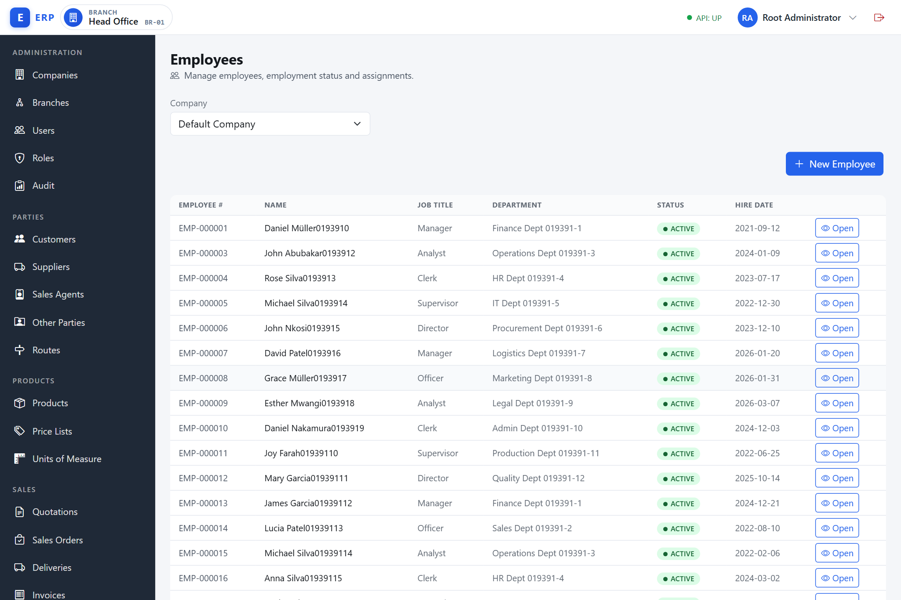
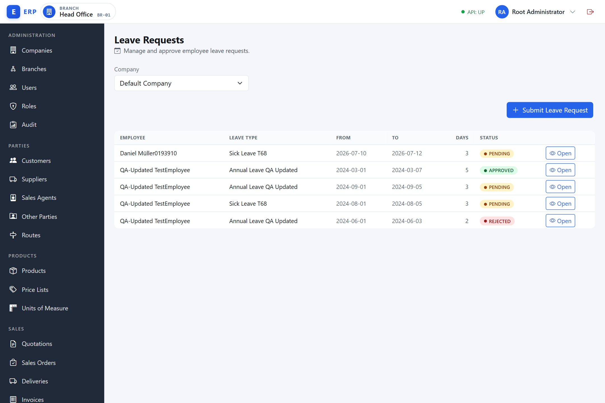
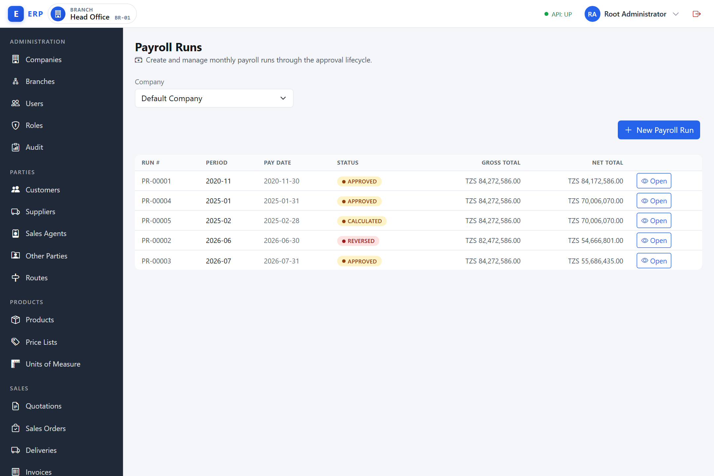
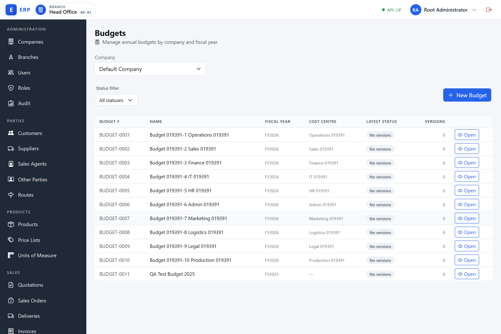
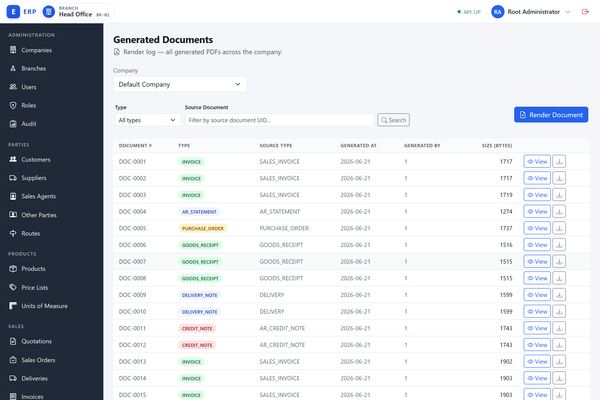
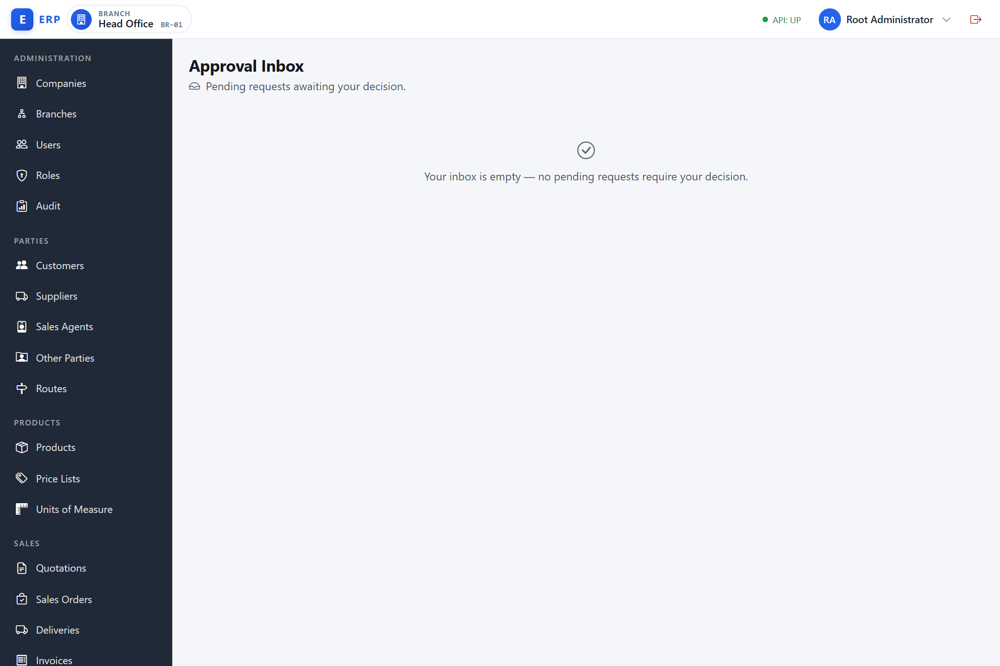

# HR & Payroll, Budgeting, and Platform Services

This chapter covers three cross-cutting domains: the Human Resources and Payroll module (departments, employees, contracts, leave, loans, pay components, payroll runs, and statutory setup), the Budgeting module (budget creation, version lifecycle, line entry, and management reports), and the Platform services used by all other modules (document generation, notifications, the approval engine, and the audit trail).

---

## Part 1 — Human Resources and Payroll

**What is the HR & Payroll module, and why does it exist?**
The HR & Payroll module is "Accounts Payable for staff". Just as AP manages what the business owes to suppliers, payroll manages what it owes to employees. It brings together the employee master (who works here, on what terms), the statutory framework (what the government requires to be deducted and remitted — PAYE income tax, NSSF pension, HESLB loan repayments, WCF worker-compensation fund, SDL skills-development levy), voluntary deductions (loans, savings schemes), and the periodic calculation that produces a payslip and a balanced GL journal. Without a formal payroll system, salary payments are unstructured (prone to error and duplication), statutory obligations are hard to track (creating tax and compliance risk), and the cost of labour does not appear correctly in the profit and loss account. The module uses a run lifecycle (DRAFT → CALCULATED → APPROVED → POSTED → PAID) that enforces separation of duties: the person who calculates payroll is not the same person who approves or posts it (ADR-0032).

The HR & Payroll module is accessible from the **HR & Payroll** navigation group. What appears in that group depends on your permissions.

### Permission requirements

| Screen | View permission | Manage / act permission |
|---|---|---|
| Departments | `HR.EMPLOYEE.VIEW` | `HR.EMPLOYEE.MANAGE` |
| Employees | `HR.EMPLOYEE.VIEW` | `HR.EMPLOYEE.MANAGE` |
| Employee Contracts | `HR.EMPLOYEE.VIEW` | `HR.EMPLOYEE.MANAGE` |
| Leave Types | `HR.LEAVE.VIEW` | `HR.LEAVE.MANAGE` |
| Leave Requests | `HR.LEAVE.VIEW` | `HR.LEAVE.MANAGE` (submit), `HR.LEAVE.APPROVE` (decide) |
| Employee Loans | `HR.LOAN.MANAGE` | `HR.LOAN.MANAGE` |
| Pay Components | `HR.PAYCOMPONENT.MANAGE` | `HR.PAYCOMPONENT.MANAGE` |
| Payroll Runs | `HR.PAYROLL.VIEW` | `HR.PAYROLL.RUN` / `APPROVE` / `POST` / `DISBURSE` / `REVERSE` |
| Statutory Setup | `HR.STATUTORY.MANAGE` | `HR.STATUTORY.MANAGE` |

A user holding none of the HR permissions will not see the **HR & Payroll** nav group and will be blocked from accessing any HR route directly.

---

### Departments

**What is a department, and why is it needed?**
A department is a logical grouping of employees within the company — for example Finance, Operations, or Sales. Departments serve two purposes. First, they appear on payroll reports and payslips, making it easy to see the cost of each part of the business. Second, they act as a cost-centre anchor: when payroll is posted to the General Ledger, the salary expense can be tagged with a department so that management accounts show the labour cost by business unit, not just as one undifferentiated total. Departments are company-level reference data that must be set up before employees can be registered.

Navigate to **HR & Payroll > Departments** (`/admin/hr/departments`).

Departments are company-level reference data. They are assigned to employees and appear on payroll reports.

**Creating a department:**

1. Click **New Department**.
2. Enter a **Code** (up to 30 characters) and a **Name** (up to 120 characters).
3. Click **Create Department**.

**Editing a department:** click the **Edit** action on the department row. The row turns into an inline edit form where both the **Code** and the **Name** can be changed; click **Save** to apply.

**Deactivating a department:** click **Deactivate** on the department row. The record is soft-deactivated, not deleted. Active employees in that department are not affected — the department reference is retained for historical records.

---

### Employees

**What is an employee record, and what is it used for?**
An employee record is the master data entry for a person employed by the company. It holds the information needed to calculate their pay (hire date, department, job title), satisfy statutory reporting requirements (national ID, TIN, NSSF number, HESLB number), and produce payslips. The system assigns an employee number automatically (`EMP-000001` format) that is used throughout HR and payroll screens. The employee record is created when the person joins and is archived (not deleted) when they leave, so that historical payroll records remain intact. Only one status is set at creation (ACTIVE); the only change available through the UI is archiving to TERMINATED.

Navigate to **HR & Payroll > Employees** (`/admin/hr/employees`).

The list shows employee number, name, job title, department name, and employment status. Use the paginator to navigate through large lists.



**Creating an employee (minimum required fields):**

1. Click **New Employee**.
2. Enter **First Name**, **Last Name**, and **Hire Date**.
3. Optionally fill in **Job Title**, **Gender**, **National ID**, **Department ID**, and **Branch ID**. The **Department ID** and **Branch ID** fields are free-text numeric-id entries (each shows the placeholder "Numeric id"), not name pickers — obtain the ids from your administrator.
4. Click **Create Employee**.

> TIN, NSSF number, HESLB number, and date of birth are not part of the create form; they are added later on the employee detail/edit page.

The system assigns an **employee number** automatically (format `EMP-000001`). The employee's status is set to **ACTIVE** on creation.

**Viewing and editing an employee:** click the **Open** action on the employee row to open the detail page. If you hold `HR.EMPLOYEE.MANAGE`, you can edit the employee's fields and save changes.

**Archiving an employee:** on the employee detail page, click **Archive**. This changes the status to **TERMINATED** and marks the record inactive. The employee record is retained for historical and payroll purposes. There is no way to restore an archived employee through the UI — contact your system administrator if this is needed.

**Employment status:** only **ACTIVE** (on create) and **TERMINATED** (on archive) are reachable through the HR screens. The statuses ON_LEAVE and SUSPENDED exist in the system but cannot be set from these screens.

---

### Employment Contracts

**What is an employment contract, and why are contract types important?**
An employment contract records the formal terms under which a person is employed: their type of engagement, base salary, start date, and — for fixed-term arrangements — end date. The contract type (PERMANENT, FIXED_TERM, CASUAL, or PROBATION) matters for statutory compliance: permanent and confirmed employees are typically subject to full PAYE and NSSF deductions, while casual workers may be treated differently. The statutory flags on the contract (PAYE Resident, NSSF Member, HESLB Borrower, WCF Covered, SDL Counted) directly control which deductions and employer contributions are calculated during the payroll run. An employee can have at most one active contract at a time; when terms change (a salary review, a change from probation to permanent), the current contract is terminated and a new one is created — preserving the full history of contractual changes.

Navigate to **HR & Payroll > Employee Contracts** (`/admin/hr/contracts`).

The contracts screen is employee-picker driven: you choose an employee first and their contracts are listed in a panel below.

**Viewing contracts for an employee:**

1. Select the **Company** if shown.
2. In the **employee picker**, start typing the employee's name or number and select them.
3. The panel shows all contracts for that employee: contract type, base salary (TZS), start date, end date, and active status.

**Creating a contract:**

An employee may have at most one active contract at a time. Creating a second contract while one is active will be rejected.

1. With the employee selected, click **New contract**.
2. Choose the **Contract type**: PERMANENT, FIXED_TERM, CASUAL, or PROBATION.
3. Enter the **Base salary** (stored in TZS) and **Start date**.
4. For FIXED_TERM contracts, enter an **End date**.
5. Set the statutory flags: **PAYE Resident**, **NSSF Member**, **HESLB Borrower**, **WCF Covered**, and **SDL Counted**. These control which statutory deductions and employer contributions are applied during payroll calculation.
6. Click **Create Contract**.

The pay frequency is fixed at MONTHLY (v1). Currency is fixed at TZS.

**Terminating a contract:** click **Terminate** on the contract row. The contract becomes inactive (`active = false`). Once the active contract is terminated, a new one can be created for the employee.

---

### Leave Types

**What is a leave type, and why is it configured?**
A leave type is the named category of time off an employee can apply for — for example Annual Leave, Sick Leave, Maternity Leave, or Unpaid Leave. Each leave type carries the policy that governs requests of that kind: whether the leave is paid or unpaid, the annual entitlement (how many days an employee accrues per year), how that entitlement accrues, whether days carry forward to the next year, whether the type requires approval, any gender eligibility restriction, and an optional cap on the maximum number of consecutive days. Defining leave types up front means every leave request is applied against a consistent, auditable policy rather than ad-hoc rules. A default set of leave types is seeded for each company.

**Where leave types are managed.** Leave Types are company-level reference data managed by an administrator. There is no dedicated leave-types screen in this version of the UI — create, edit, and deactivate are performed through the leave-types API (`/api/v1/hr/leave-types`). Viewing requires `HR.LEAVE.VIEW`; creating, editing, and deactivating require `HR.LEAVE.MANAGE`.

**Creating or editing a leave type:** an administrator supplies:

- **Code** (up to 30 characters) and **Name** (up to 120 characters).
- **Paid** — whether days of this type are paid. If a type is **not** paid (unpaid leave), approved days that overlap a payroll period reduce the employee's basic salary pro-rata (see Leave Requests).
- **Annual entitlement days** and the **accrual method**.
- **Carry forward** — whether unused days roll into the next year.
- **Requires approval** — whether requests of this type must be approved.
- **Gender eligibility** — an optional restriction (for example, maternity leave).
- **Max consecutive days** — an optional cap on the length of a single request.

A leave-type **code** must be unique within the company; a duplicate code is rejected. Deactivating a leave type is a soft-deactivation — the type is retained for historical records but is no longer offered for new requests.

---

### Leave Requests

**What is a leave request, and how does it affect payroll?**
A leave request is the formal record of an employee's application for time off — annual leave, sick leave, maternity leave, or any other type configured by the administrator. The approval workflow (PENDING → APPROVED or REJECTED) ensures that time off is authorised before it is recorded as taken. For **unpaid leave** (where the leave type is flagged as unpaid), the approval has a direct financial consequence: approved unpaid leave days that overlap a payroll period automatically reduce the employee's basic salary pro-rata when the payroll run is calculated (the system uses 22 working days per month as the standard period). This ensures the payroll accurately reflects the actual days worked. Without a formal leave system, unpaid leave deductions would have to be applied manually, risking errors, disputes, and payroll miscalculations.

Navigate to **HR & Payroll > Leave Requests** (`/admin/hr/leave-requests`).

The list shows employee name, leave type, from and to dates, number of days, and status. Use the paginator for large lists.



**Submitting a leave request (requires `HR.LEAVE.MANAGE`):**

Leave types are managed by an administrator (see **Leave Types** below). When submitting a request you identify the leave type by its numeric ID, which the administrator can supply.

1. Click **Submit Leave Request**.
2. Pick the **Employee** by name.
3. Enter the **Leave Type ID** (the numeric id of the leave type). This is a free-text numeric field, not a dropdown; the resolved leave-type name is shown back to you in the list once the request is saved.
4. Enter **From** date, **To** date, and the number of **Days**.
5. Optionally enter a **Reason**.
6. Click **Submit**. The request status is set to **PENDING**.

**Deciding a leave request (requires `HR.LEAVE.APPROVE`):**

1. Open the leave request from the list (link goes to `/admin/hr/leave-requests/uid/:uid`).
2. In the **Decision** dropdown, choose **Approve** or **Reject**.
3. Optionally enter a **Decision Note** (the note is optional for both Approve and Reject).
4. Click **Submit Decision**.

The only valid decisions are **APPROVED** or **REJECTED**. PENDING and CANCELLED are not valid decision values and will be rejected.

**Leave request statuses:**

| Status | Meaning |
|---|---|
| PENDING | Submitted, awaiting a decision |
| APPROVED | Approved; approved unpaid leave days reduce the employee's basic salary pro-rata in the payroll run |
| REJECTED | Declined |
| CANCELLED | Withdrawn before decision |

**Note on unpaid leave:** if the leave type is marked as unpaid (configured by the administrator), approved leave days that overlap a payroll period will reduce that employee's basic salary pro-rata. The system uses 22 working days per month as the standard period.

---

### Employee Loans

**What is an employee loan, and how does repayment work?**
An employee loan is a cash advance made by the company to an employee, to be repaid through regular deductions from their net pay. Examples include salary advances, housing loans, or emergency personal loans. The loan record tracks the original principal, the agreed monthly instalment, and the outstanding balance. A new loan starts in **PENDING** status and is **not** deducted in payroll until it is approved and becomes **ACTIVE**. Once ACTIVE, the payroll calculation engine automatically includes the instalment as a deduction in each payroll run until the balance reaches zero — at which point only the remaining balance is deducted rather than the full instalment. This prevents payroll errors caused by forgetting to stop a deduction. The GL account linked to the loan records the outstanding balance on the balance sheet as an asset (money owed to the company by the employee).

Navigate to **HR & Payroll > Employee Loans** (`/admin/hr/loans`).

The list shows loan number, employee name, principal, installment amount, outstanding balance, start date, and status. Viewing and managing loans both require `HR.LOAN.MANAGE`.

**Creating a loan:**

1. Click **New Loan**.
2. Pick the **Employee** by name.
3. Enter the **Principal** and the monthly **Installment** (the installment must not exceed the principal).
4. Choose the **Currency** from the Currency Picker. This is the filtered currency picker (only the company's enabled currencies are listed, pre-set to the company default) — see *Common UI Patterns* in Chapter 00 (Getting Started). You no longer type a 3-letter currency code.
5. Enter the **GL Account ID** — the numeric id of the GL account the loan is posted to. (This field is a numeric id entry; obtain the id from your administrator. An unknown id is rejected.)
6. Enter the **Start Date**.
7. Click **Create**. The loan is created in **PENDING** status with its outstanding balance equal to the principal.

**Approving a loan:**

1. Open the loan from the list (`/admin/hr/loans/uid/:uid`).
2. Click **Approve Loan**. The loan status changes from PENDING to **ACTIVE**.

Approval is only valid for a loan in PENDING status; attempting to approve a loan that is already ACTIVE (or SETTLED/CANCELLED) is rejected. Once ACTIVE, the loan installment is automatically deducted from the employee's net pay during each payroll calculation. If the outstanding balance is less than the installment, only the remaining outstanding amount is deducted.

**Loan statuses:**

| Status | Meaning |
|---|---|
| PENDING | Created but not yet approved; **not** picked up by payroll |
| ACTIVE | Approved; the installment is deducted in each payroll run until settled |
| SETTLED | Fully repaid |
| CANCELLED | Voided |

SETTLED and CANCELLED statuses exist in the system but can only be set by the system administrator — there is no Settle or Cancel button on the UI in this version.

---

### Pay Components

**What is a pay component, and why is it needed?**
A pay component is a named earning or deduction that is applied to employees during payroll calculation — for example "Housing Allowance" (an earning), "Medical Scheme Contribution" (a deduction), or "Transport Allowance" (an earning calculated as a percentage of basic salary). Pay components allow the payroll engine to handle the variety of terms in employment contracts without hard-coding allowances or deductions into the system. Each component is configured once (with its GL account, its basis — fixed amount or percentage of basic salary — and its tax/pension flags) and then assigned to specific employees as recurring items. This ensures that every employee's payslip is built from a consistent, auditable set of named items rather than ad-hoc adjustments.

Navigate to **HR & Payroll > Pay Components** (`/admin/hr/pay-components`).

Pay components define the earnings and deductions applied to employees during payroll calculation. They are company-level reference data. The list is not paginated. Viewing and managing pay components both require `HR.PAYCOMPONENT.MANAGE`.

**Creating a pay component:**

1. Click **New Pay Component**.
2. Enter a **Code** and a **Name**.
3. Set the **Kind**: EARNING (adds to gross) or DEDUCTION (reduces net).
4. Set the **Basis**: FIXED (a fixed amount per run) or PERCENT\_OF\_BASIC (a percentage of the employee's basic salary).
5. Enter the **GL Account ID** — earnings and deductions post to this account. This is a free-text numeric-id entry (placeholder "Numeric id"), not a name picker; obtain the id from your administrator.
6. Check **Taxable** if this component is subject to PAYE.
7. Check **Pensionable** if this component is included in the pension-contribution base.
8. Click **Create**.

**Editing and deactivating:** open the component by clicking the **Open** action on its row (`/admin/hr/pay-components/uid/:uid`). Edit the fields and save, or click **Deactivate** to soft-deactivate the component (it becomes inactive and will no longer appear in payroll calculations going forward).

**Per-employee recurring items** (the amounts for PERCENT\_OF\_BASIC components and any fixed amounts applied to specific employees) are configured by the administrator directly in the system. These are applied automatically during payroll calculation and do not have a separate UI screen.

---

### Payroll Runs

**What is a payroll run, and what does it produce?**
A payroll run is the process of computing every employee's pay for a given month and producing the payslips, the GL journal, and the cash disbursement that physically pays the employees. The run gathers all relevant inputs — base salaries from contracts, deductions from approved unpaid leave, loan instalments, voluntary pay-component items — and applies the current statutory rates (PAYE bands, NSSF rates, HESLB rates, WCF, SDL) to produce a balanced journal entry and a payslip for every employee. The lifecycle (DRAFT → CALCULATED → APPROVED → POSTED → PAID) enforces a four-eyes check: one person prepares and calculates, a second person approves, a third posts to the books, and a fourth authorises the actual payment. A POSTED run can be reversed if an error is found after posting. Only one run can be active per period — you cannot accidentally pay the same month twice.

Navigate to **HR & Payroll > Payroll Runs** (`/admin/hr/payroll-runs`).

A payroll run computes gross pay, statutory deductions, voluntary deductions, and loan repayments for all employees with an active contract in a given period. The list shows each run's number, period, pay date, status, and gross and net totals.



**Payroll run lifecycle:**

```
DRAFT → CALCULATED → APPROVED → POSTED → PAID
                                         ↓
                                      REVERSED
```

Each step requires a different permission. Only one active run can exist per period.

**Step 1 — Create a run (requires `HR.PAYROLL.RUN`):**

1. Click **New Payroll Run**.
2. Enter the **Year**, choose the **Month** from the dropdown, and enter the **Pay Date**. (The company is taken from your active session.)
3. Optionally enter a **Branch ID** if the run covers a specific branch. This is a free-text field (placeholder "Optional"), not a name picker.
4. Click **Create**. The run is created in **DRAFT** status with zero totals.

**Step 2 — Calculate (requires `HR.PAYROLL.RUN`):**

1. Open the run (`/admin/hr/payroll-runs/uid/:uid`).
2. Click **Calculate**. The system builds one payroll line per ACTIVE employee who has an ACTIVE contract:
   - Basic salary earning.
   - PAYE income tax (from the effective PAYE band set for the pay date, if `payeResident = true`).
   - NSSF deduction (employee share, if `nssfMember = true`).
   - HESLB deduction (if `heslbBorrower = true`).
   - Employer contributions (NSSF/WCF/SDL employer shares from the effective statutory rate sets).
   - Any voluntary pay-component recurring items configured for the employee.
   - Loan repayment deductions for any ACTIVE loans with an outstanding balance.
   - Pro-rata reduction for any approved unpaid leave overlapping the period.
3. The run status moves to **CALCULATED** and the **Payroll Lines** table populates.

You can recalculate from DRAFT, CALCULATED, or APPROVED status — recalculation rebuilds all lines from scratch.

**Reviewing lines:** the **Payroll Lines** table lists each employee's line. A line showing a **FLAGGED** badge means the line needs attention before approval — typically because the employee's net pay is negative after deductions, or because a payment target (payee/bank details) is missing for that employee. The reason is shown in the line's **Flag Reason** column. You must resolve flagged lines before the run can be approved — for example by reducing a loan installment, supplying the missing payee details, and then recalculating.

**Step 3 — Approve (requires `HR.PAYROLL.APPROVE`):**

1. With the run in CALCULATED status and zero FLAGGED lines, click **Approve**.
2. Status moves to **APPROVED**.

**Step 4 — Post (requires `HR.PAYROLL.POST`):**

1. With the run in APPROVED status, click **Post to GL**.
2. Status moves to **POSTED**. The GL journal is written asynchronously via the payroll posting handler. Payslips are generated (one per employee line).

**Step 5 — Disburse (requires `HR.PAYROLL.DISBURSE`):**

1. With the run in POSTED status, click **Disburse**.
2. Enter the **Cash / Bank Account UID** of the account from which the net wages will be paid. (This is a UID text field on this screen; obtain the account UID from your administrator or the Chart of Accounts.)
3. Optionally enter a **Transaction Date** (defaults to the run's pay date).
4. Click **Disburse**. Status moves to **PAID**. A Cash & Bank OUT entry is recorded (debit Net Wages Payable, credit the chosen bank/cash account).

**Reversing a run (requires `HR.PAYROLL.REVERSE`):**

A POSTED or PAID run can be reversed if needed (for example, a posting error). Click **Reverse** on the run detail. The status moves to **REVERSED** and a reversing GL journal is posted.

**Legal action matrix:**

| From status | Calculate | Approve | Post | Disburse | Reverse |
|---|---|---|---|---|---|
| DRAFT | Allowed | Blocked | Blocked | Blocked | Blocked |
| CALCULATED | Allowed (recalc) | Allowed (if no FLAGGED) | Blocked | Blocked | Blocked |
| APPROVED | Allowed (recalc) | Blocked | Allowed | Blocked | Blocked |
| POSTED | Blocked | Blocked | Blocked | Allowed (if net > 0) | Allowed |
| PAID | Blocked | Blocked | Blocked | Blocked | Allowed |
| REVERSED | Blocked | Blocked | Blocked | Blocked | Blocked |

---

### Statutory Setup

**What is the Statutory Setup, and why are the rates held in updatable tables?**
Statutory setup holds the tax bands and levy rates mandated by Tanzanian law: PAYE (Pay As You Earn income tax), NSSF (National Social Security Fund pension contributions), HESLB (Higher Education Students' Loans Board repayments), WCF (Workers' Compensation Fund), and SDL (Skills and Development Levy). These rates are set by the government and change periodically with each budget announcement. Because they are stored as **effective-dated data** in the system — not hard-coded in software — the administrator can add a new rate set with a future effective date when a budget announcement is made, and the payroll engine will automatically apply the correct rates when the pay date falls in the new period. This means a payroll run always reproduces exactly what the law required on that pay date, regardless of subsequent rate changes. Without effective-dated rate tables, every budget announcement would require a software update to change hard-coded constants.

Navigate to **HR & Payroll > Statutory Setup** (`/admin/hr/statutory`). Requires `HR.STATUTORY.MANAGE`.

The statutory setup screen shows two sections: **PAYE band sets** and **Statutory rate sets**. These sets determine how income tax and levies are calculated during payroll calculation.

**Creating a PAYE band set:**

**What is a PAYE band set?** A PAYE band set is a schedule of income tax rates that applies a progressive rate to different slices of monthly income. For example, the first TZS 270,000 per month might be tax-free, the next slice taxed at 9%, the next at 20%, and so on. Each band defines the lower income threshold at which the rate starts and the cumulative tax already payable on income up to that threshold (to avoid re-computing all lower bands for every employee). The system selects the most recently effective band set whose effective date is on or before the payroll run's pay date, ensuring the correct bands apply to each period.

1. Click **New Band Set**.
2. Enter an **Effective From** date, a **Tax-Free Threshold** (the monthly income amount below which no PAYE applies), and an optional **Description**.
3. Add one or more bands. Each band requires: band number (ascending), lower bound (monthly income where this rate starts), **Marginal Rate (%)** (entered as a percentage, e.g. `20` for 20%; the field accepts 0–100), and cumulative fixed tax (the tax already accumulated on income up to this band's lower bound).
4. Click **Create Band Set**.

The system uses the **most recently effective** band set whose effective date is on or before the payroll run's pay date.

**Creating a statutory rate set:**

**What is a statutory rate set?** A statutory rate set holds the percentage rates for one of the non-PAYE levies: NSSF, WCF, SDL, or HESLB. Each set records the employee rate, the employer rate (where applicable), the basis for the calculation (gross salary or basic salary), and — for SDL — a headcount threshold (SDL only applies to companies above a minimum employee count). Like PAYE band sets, rate sets are effective-dated so that rate changes can be scheduled in advance without software updates.

1. Click **New Rate Set**.
2. Choose the **Type**: NSSF, WCF, SDL, or HESLB.
3. Enter the **Effective From** date and the **Basis** — a free-text field (placeholder "e.g. GROSS").
4. Enter the applicable rates: **Employee Rate (%)** and/or **Employer Rate (%)**, entered as percentages (e.g. `20` for 20%; each field accepts 0–100).
5. Optionally enter a **Ceiling Amount** (the income cap above which the rate no longer applies).
6. For SDL, enter a **Headcount Threshold** (SDL applies only when the company headcount equals or exceeds this number).
7. Click **Create Rate Set**.

Contract statutory flags control which rate sets apply to each employee:
- `NSSF Member` → NSSF deductions apply.
- `PAYE Resident` → PAYE income tax applies.
- `HESLB Borrower` → HESLB deduction applies.
- `WCF Covered` → the employer WCF contribution is included for this employee.
- `SDL Counted` → the employee is counted towards SDL (the employer SDL levy applies to the run if an effective rate set exists and the SDL headcount threshold is met).

---

## Part 2 — Budgeting

**What is a budget, and how does the module work?**
A budget is a forward-looking financial plan: it states how much the business expects to earn and spend in a future period, account by account. It exists to give management a target to work towards, a benchmark to compare against actual results, and a tool for anticipating cash needs. Budgets in this system are **planning records only** — they never post to the General Ledger. Instead, the approved budget lines are held separately and compared at report time against actual GL postings, producing the **Budget Variance Report** (how far actuals diverged from plan). The system supports multiple **versions** of a budget so that the business can revise the plan during the year without losing the original, and each version goes through an approval lifecycle (DRAFT → SUBMITTED → APPROVED) to ensure the plan is authorised before it is used as a benchmark (ADR-0034).

The Budgeting module is accessible from the **Budgeting** navigation group. Budgets are planning tools only — they do not post to the General Ledger. GL actuals are read at report time for comparison purposes.

### Permission requirements

| Action | Permission |
|---|---|
| View budgets, versions, lines | `BUDGETING.BUDGET.VIEW` |
| Create and edit budgets, versions, lines | `BUDGETING.BUDGET.MANAGE` |
| Submit and recall versions | `BUDGETING.BUDGET.SUBMIT` |
| Approve and reject versions | `BUDGETING.BUDGET.APPROVE` |
| Run variance and actuals reports | `BUDGETING.REPORT.VIEW` |

---

### Creating a Budget

Navigate to **Budgeting > Budgets** (`/admin/budgets`). Requires `BUDGETING.BUDGET.MANAGE`.

**What is a budget header?** The budget header is the container for all the planning work. It identifies the fiscal year being budgeted and the scope — either the whole company, or a specific cost centre (a department or business unit). You create one budget per fiscal year per scope, and within it you manage one or more versions as the plan evolves. A company-wide budget covers all income and expense accounts; a cost-centre-scoped budget covers only the activity attributed to that centre.

A budget covers a specific fiscal year and may be scoped to a specific cost centre (dimension value) or set as company-wide.

1. Click **New Budget**.
2. Enter a **Name** for the budget.
3. Choose the **Fiscal Year** from the Fiscal-Year picker. This is a dropdown of the company's fiscal years (each option shows the year code with its status); select the year you are budgeting for. You no longer type a Fiscal Year UID.
4. Optionally enter a **Version label** (the label for the first version) and **Notes**.
5. Click **Create Budget**.

The system creates the budget and automatically creates **Version 1** in DRAFT status. There can be only one budget per fiscal year and cost-centre scope combination.

**Cost-centre scope.** The Create Budget screen creates company-wide budgets only — it does not expose a cost-centre field. A cost-centre-scoped budget cannot be created from this screen in this version; if you need one, contact your system administrator.

The budget list shows each budget's number, name, fiscal year, cost centre, latest version status, and the number of versions. A **Status filter** at the top narrows the list, and a pager appears at the bottom for long lists.



---

### Budget Versions and the Version Lifecycle

**What is a budget version, and why are multiple versions needed?**
A budget version is a specific iteration of the plan. The first version (V1) is the original budget prepared at the start of the year. If actual events require the plan to be revised — a new product launch, an unexpected cost increase, a change in strategy — a new version (V2, V3, etc.) is created. The version lifecycle ensures that each revision is authorised before it replaces the previous plan: the preparer submits the version for approval, the approver reviews and approves or rejects it, and only one version is APPROVED (active) at any time. All prior approved versions are moved to SUPERSEDED (kept for reference) when a new one is approved. Rejected versions are kept but cannot be used as a benchmark; a new version must be created to revise after a rejection. Lines can only be edited on DRAFT versions — once submitted, the plan is locked.

Each budget can have multiple versions representing revisions to the plan. Versions go through an approval cycle before becoming the active plan.

**Version statuses:**

| Status | Meaning |
|---|---|
| DRAFT | Under construction — lines can be edited |
| SUBMITTED | Submitted for approval — lines are locked |
| APPROVED | The active approved plan; supersedes any prior approved version |
| REJECTED | Declined — create a new version to revise |
| SUPERSEDED | A previously approved version replaced by a newer APPROVED version |

**Version lifecycle transitions:**

```
DRAFT → SUBMITTED (submit, requires ≥1 line)
SUBMITTED → DRAFT (recall)
SUBMITTED → APPROVED (approve — also supersedes the prior APPROVED version)
SUBMITTED → REJECTED (reject, reason required)
```

APPROVED, REJECTED, and SUPERSEDED are terminal — no further edits or lifecycle actions can be taken on a version in these states. To re-plan after a rejection, create a new version.

**Opening the budget detail:**

Click the **Open** action on the budget row to open its detail (`/admin/budgets/uid/:uid`). The detail shows the budget header and all versions, listed newest first. Each version row shows its version number ("V1", "V2", etc.), label, status badge, and line count.

**Creating a new version (Re-plan):**

1. On the budget detail, click **New Version / Re-plan**.
2. Optionally enter a **label** for this version.
3. To start from a prior version's lines, pick the source version from the **Seed from version** picker by its version label and status (e.g. "V1 — FY2026 base"). Leave blank to start with an empty version.
4. Click **Create**. The new version is created in DRAFT status.

---

### Entering Budget Lines

**What is a budget line?**
A budget line is the atomic planning unit: it links one GL account to one fiscal period and states the planned amount for that account in that period. For example, a line might say "Account: 5400 Fuel & Transport, Period: March 2026, Amount: TZS 3,200,000". The sum of all lines for an account across all periods is that account's annual budget. Lines are stored at the period grain (month by month) so that the variance report can show monthly deviations, not just annual totals. Lines can only be added, changed, or deleted when the version is in DRAFT status.

Open the version detail by clicking **View Lines** on the version (`/admin/budget-versions/uid/:uid`). The lines table shows account, period, amount (TZS), and memo. Lines are editable only when the version is in DRAFT status.

Click **Edit Lines (Replace All)** to open the line editor. Choose one of three entry modes:

**DIRECT — enter each line individually:**

1. Click **Add line**.
2. In the **Account** picker, choose the GL account by name.
3. In the **Period** picker, choose the fiscal period. Each option is labelled in the format `P{number} (start date – end date)` — for example "P3 (2026-03-01 – 2026-03-31)" — with the period's status shown as a hint.
4. Enter the **Amount** in TZS (must be ≥ 0).
5. Optionally enter a **Memo**.
6. Repeat for additional lines.
7. Click **Replace Lines**. The new lines replace all prior lines for this version.

**ANNUAL\_SPREAD — enter an annual total and spread it evenly across 12 periods:**

**When is this useful?** When the budget planner knows the full-year target for an account but does not want to apportion it manually month by month. The system splits the annual amount into 12 equal monthly lines, using HALF_UP rounding and adding any cent-level residual to the last period so that the 12 lines sum exactly to the annual total.

1. In the **Account** picker, choose the GL account by name.
2. Enter the **Annual amount** in TZS.
3. Click **Replace Lines**. The system creates 12 lines (one per period), spreading the annual amount as evenly as possible (HALF_UP rounding; any remainder is added to the last period so the sum equals the annual total exactly).

The fiscal year must have exactly 12 periods to use ANNUAL\_SPREAD mode.

**SEED — copy lines from another version:**

**When is this useful?** When creating a revised budget version that starts from the same lines as a prior version. Rather than re-entering all lines from scratch, you seed from V1 and then edit only the accounts that have changed. This also works across fiscal years: you can seed V1 of the FY2027 budget from the approved V2 of FY2026 as a starting point.

1. In the **Seed from version** picker, choose the source version by its label and status.
2. Click **Replace Lines**. All lines from the source version are copied to this version, replacing any existing lines.

**Note:** editing lines is blocked when the version is not in DRAFT status. If you need to edit a SUBMITTED version's lines, recall it to DRAFT first.

---

### Submitting, Approving, and Rejecting Versions

**Submit (requires `BUDGETING.BUDGET.SUBMIT`):**

1. On the budget detail, click **Submit for Approval** next to the DRAFT version.
2. The version must have at least one line. If it has no lines, submission is rejected.
3. Status moves to SUBMITTED. Lines are locked.

**Recall (requires `BUDGETING.BUDGET.SUBMIT`):**

If you need to revise a SUBMITTED version, click **Recall to Draft** to return it to DRAFT. The submission timestamp is cleared and lines become editable again.

**Approve (requires `BUDGETING.BUDGET.APPROVE`):**

1. Click **Approve** next to the SUBMITTED version.
2. Optionally enter an approval note.
3. Confirm.

The version status moves to APPROVED. If there was a previously APPROVED version for the same scope, it is automatically moved to SUPERSEDED. Only one version can be APPROVED at any time per scope.

**Reject (requires `BUDGETING.BUDGET.APPROVE`):**

1. Click **Reject** next to the SUBMITTED version.
2. Enter a **rejection reason** (required).
3. Confirm.

The version status moves to REJECTED. The rejection reason is recorded for reference. To re-plan, create a new DRAFT version.

---

### Budget Reports

Both reports require `BUDGETING.REPORT.VIEW` and are accessible from the **Budgeting** nav group.

**Budget Variance Report** (`/admin/budgeting/variance`):

Compares the approved budget lines against actual GL postings for the selected period range.

1. Select the **Company**.
2. Choose the **Fiscal Year** from the Fiscal-Year picker (a dropdown of the company's fiscal years; no UID is typed). Switching company clears the fiscal-year selection and reloads the picker for the newly selected company.
3. Set the **From Period** and **To Period** (1–12; from must be ≤ to). These default to 1 and 12.
4. Optionally filter by **Account type** (Income, Expense, Asset, Liability, Equity) and enter a **Cost Centre UID** to limit results to a specific centre.
5. Click **Run Report**.

The report shows account-level rows with budget amount, actual amount, variance (actual − budget), a variance percentage, and a Favourable/Adverse assessment, plus a Totals-by-Account-Type summary. For income accounts, actual > budget is favourable. For expense accounts, actual < budget is favourable.

If no APPROVED version exists for the selected scope, the report is returned with all budget amounts as zero and an on-screen "No APPROVED budget version found for this scope" warning banner — the report is never silently wrong.

**Departmental Actuals Report** (`/admin/budgeting/departmental-actuals`):

Shows actual GL postings grouped by cost centre and account, with no budget comparison. Useful for monitoring departmental spending.

1. Select the **Company**.
2. Choose the **Fiscal Year** from the Fiscal-Year picker (a dropdown of the company's fiscal years; no UID is typed). As on the Variance report, switching company clears and reloads the picker.
3. Set the **From Period** and **To Period**.
4. Click **Run Report**.

A null cost centre (transactions posted without a cost-centre dimension) appears as an **Unallocated** row.

---

## Part 3 — Platform Services

**What are Platform Services?**
Platform services are cross-cutting capabilities that every other module uses — they are not specific to Finance, HR, or Operations. Document generation produces the printable PDFs from data that already exists in the system. Notifications tells users what has happened that they need to act on. The approval engine intercepts high-value actions and routes them through a human authorisation chain. The audit trail records every state-changing action so that nothing can be silently altered. These services are the governance and communication spine of the ERP.

Platform services provide cross-cutting functionality used by all modules: document generation and management, notifications, the approval engine, and the audit trail.

---

### Documents

**What is the Document Generation module, and what does it produce?**
The Document Generation module renders formally formatted, branded PDF documents from transactions that already exist in the system. A sales invoice stored in the AR module, a purchase order in the Procurement module, or a goods receipt in the Inventory module all contain the data for a printable document, but that data is not yet in the layout a customer or supplier expects to receive. This module reads the source transaction as a read-only snapshot, merges it with the company's branding (logo, address, bank details, footer text), applies the chosen template, and produces a download-ready PDF. The generated document is stored in a log for audit purposes — you can re-download a document issued months ago without regenerating it. Every render is append-only: the log is never edited, and rendering a document never changes the source transaction. The six supported types in v1 are: Invoice, AR Statement, Purchase Order, Goods Receipt, Delivery Note, and Credit Note (ADR-0023).

#### Generated Documents Log

Navigate to **Documents > Generated Documents** (`/admin/documents`). Requires `DOCUMENT.VIEW`.

The log lists every document that has been rendered for the active company, with document number, type badge, source, and generated-at timestamp. Use the **Type** filter dropdown to narrow results by document type (Invoice, AR Statement, Purchase Order, Goods Receipt, Delivery Note, Credit Note). The **Render Document** button opens the render form, and each row carries **View** and **Download** actions.



#### Rendering a Document

Requires `DOCUMENT.RENDER`. The render form is on the same Generated Documents screen.

Six document types can be rendered in v1:

| Document type | Source |
|---|---|
| Invoice | A finalised sales invoice |
| AR Statement | A customer (with from/to date range) |
| Purchase Order | A confirmed purchase order |
| Goods Receipt | A received GRN |
| Delivery Note | A delivery record |
| Credit Note | A sales return/credit |

To render a document:

1. Click **Render document**.
2. Choose the **Document type** from the dropdown.
3. For all types except AR Statement: pick the **source record** by its number (invoice number, PO number, etc.) in the source picker.
4. For AR Statement only: enter the **customer** (chosen by name) and the **from date** and **to date** in the params section.
5. Click **Render**. A new row appears in the log.

To download a rendered document, click the **Download** button on the log row or detail page (also requires `DOCUMENT.RENDER`).

#### Document Templates

**What is a document template?**
A document template controls the layout and structure of a rendered document type. The system ships with a default template for each of the six renderable types. The template can be activated or deactivated — deactivating it prevents new renders of that type. Template content (the actual layout formatting) is maintained by the system administrator; the UI allows you to toggle the template's status and update its display title.

Navigate to **Documents > Document Templates** (`/admin/document-templates`). Requires `DOCUMENT.TEMPLATE.MANAGE`.

The template registry lists one row per renderable document type. You can change the template's **title** and toggle its **status** (ACTIVE or INACTIVE) by clicking the row and saving. Deactivating a template does not delete it.

#### Document Branding

**What is Document Branding?**
Document branding is the per-company configuration that controls what appears in the header and footer of every rendered PDF. Without branding, a PDF would carry no company name, address, tax ID, or bank details — it would be unacceptable as a formal document. The branding profile is a single set of settings per company (a "singleton"): there is no list to navigate, just one form that you edit and save. Changes take effect immediately on all subsequent renders; previously generated documents are not retroactively changed (the log is append-only).

Navigate to **Documents > Document Branding** (`/admin/document-branding`). Requires `DOCUMENT.BRANDING.MANAGE`.

The branding profile is a per-company singleton (one set of settings per company, no list). It controls what appears in the header and footer of rendered PDF documents.

1. Open the screen. The current branding values load into the form.
2. Edit: **Display name**, **Legal name**, **Tax ID**, **Address**, **Contact phone**, **Contact email**, **Website**, **Footer terms text**, and **Bank details**.
3. Click **Save**.

Changes take effect on all subsequent document renders. Previously generated documents are not changed (the log is append-only).

---

### Notifications

**What is the Notifications module, and how does it work?**
The Notifications module is the system's alerting spine. It listens for events that other modules emit — a payment received, an approval submitted, a payroll posted — and delivers an in-app message (and optionally an email) to the users who need to know. It also runs a scheduled background scanner for time-based conditions that have no single event trigger (such as an invoice becoming overdue overnight, or stock falling below its reorder level). Without notifications, users must actively poll every module to find out what has happened; notifications inverts this by pushing relevant information to the right person at the right time. Each notification type has an audience defined by permission (for example, an approval-submitted notification goes to all users who hold the approver role), and each user can customise their preferences — muting types they do not need, or disabling email delivery for types they prefer to see only in-app (ADR-0024).

#### Notification Inbox

Navigate to **Notifications > Inbox** (`/admin/notifications`). Requires `NOTIFICATION.VIEW`.

The inbox shows notifications sent to you within the active company, with title, message body, severity badge (INFO / WARNING / CRITICAL), and created-at timestamp.


- Toggle **Unread only** to filter to unread items only.
- Click **Mark read** on an individual row to mark it as read.
- Click **Mark all read** to clear the unread count at once.

The shell navigation bar shows a badge with the count of unread notifications. The badge reflects `GET /api/v1/notifications/unread-count`.

#### Notification Preferences

Navigate to **Notifications > Preferences** (`/admin/notification-preferences`). Requires `NOTIFICATION.PREFERENCE.MANAGE`.

Each notification type listed here can be tuned per user:

- **Muted** — suppress all delivery for this type for you.
- **Channels enabled** — choose which channels (IN\_APP, EMAIL) should deliver this type to you.

Click a preference row, adjust the settings, and save.

#### Notification Type Catalogue (Admin)

Navigate to **Notifications > Type Catalogue** (`/admin/notification-types`). Requires `NOTIFICATION.ADMIN`.

The catalogue lists all notification types registered in the system for the active company. Each type shows display name, audience permission, severity, default channels, and the company-level enabled/disabled toggle.

To disable a notification type company-wide (all users in the company stop receiving it), click the row, toggle **Company enabled** to off, and save. Any delivery attempts while the type is disabled will be recorded in the delivery log with suppression reason **COMPANY\_TYPE\_OFF**.

#### Notification Delivery Log (Admin)

Navigate to **Notifications > Delivery Log** (`/admin/notification-deliveries`). Requires `NOTIFICATION.ADMIN`.

The delivery log shows every notification delivery attempt with its outcome and, if suppressed, the reason. Use the **Channel** and **Outcome** filters to diagnose delivery problems.

| Suppression reason | Meaning |
|---|---|
| MUTED | The recipient muted this type |
| CHANNEL\_DISABLED | The channel (EMAIL/SMS) is not active |
| NO\_EMAIL | The recipient has no email address configured |
| COMPANY\_TYPE\_OFF | The type is disabled for this company |
| NO\_AUDIENCE | No eligible recipients found |

---

### Approvals

**What is the Approval Engine, and why is it a shared platform service rather than module-specific?**
The approval engine is a generic governance layer that intercepts certain high-value actions across the system and requires one or more human sign-offs before the action proceeds. Examples include confirming a large purchase order, posting a payroll run, or approving a budget version. Rather than each module building its own approval screen (which would lead to inconsistent behaviour and duplicate maintenance), the approval engine is a single shared service that any module can delegate to. A policy defines when approval is needed (which document type, above what monetary threshold, at which branch) and who must approve (which role). When a matching action is submitted, the engine creates an approval request, routes it to the appropriate approvers in sequence, and releases the action only when all steps are completed. If no policy matches, the action is auto-approved instantly. The engine posts nothing to the books; its sole purpose is to gate other modules' actions (ADR-0022).

Approval requests are created automatically by the relevant modules — there is no "create approval request" screen.

#### Approval Policies

**What is an approval policy?**
An approval policy defines the rule that triggers human approval: it says "for documents of type X, in the amount band [min, max), at scope Y, require approval from role Z". A policy can be company-wide (applies to all branches) or scoped to a specific branch (a branch-scoped policy takes priority when both match). The amount bands within a policy type must not overlap, and there can only be one active policy per (type, scope, band) combination — this ensures that every submission matches exactly one policy, making the outcome deterministic.

Navigate to **Approvals > Approval Policies** (`/admin/approvals/policies`). Requires `APPROVALS.POLICY.VIEW`.

Policies define when human approval is required and who must approve. Each policy targets one document type and a monetary band.

**Creating a policy (requires `APPROVALS.POLICY.MANAGE`):**

1. Click **New policy**.
2. Enter a **Name** and choose the **Document type** (e.g. Purchase Order).
3. Set the **Branch scope**:
   - **COMPANY\_WIDE** — applies to the entire company. Do not enter a branch.
   - **BRANCH** — applies to one specific branch. Pick the branch by name from the branch picker. A branch-scoped policy takes priority over a company-wide policy when both match the same request.
4. Set **Min amount** and **Max amount** (TZS). Leave **Max amount** blank for an unbounded top band (applies to all amounts ≥ Min amount).
5. Add one or more **Approval steps**. Each step has a **sequence number** (dense from 1) and an **Approver role code** (the permission role whose holders will see this request in their inbox). Click **Add step** to add another level of approval.
6. Click **Save**.

Policy changes only affect future submissions. In-flight PENDING requests continue under the policy that existed when they were created.

**Deactivating a policy:** open the policy detail (`/admin/approvals/policies/uid/:uid`), click **Deactivate**. Status moves to INACTIVE. Inactive policies are not matched on new submissions.

#### Approval Inbox (My Inbox)

**What is the Approval Inbox?**
The inbox shows every approval request that is currently waiting for your decision — specifically, requests where the current open step is routed to one of your permission roles. It is the daily working screen for managers, finance directors, and senior staff who hold approver roles. You see only the requests assigned to your role; you do not see requests routed to other roles. Approving moves the request to its next step (or resolves it if it was the final step); rejecting ends the entire request immediately and marks all remaining steps as skipped.

Navigate to **Approvals > My Inbox** (`/admin/approvals/inbox`). Requires `APPROVALS.DECIDE`.

The inbox shows PENDING requests whose current open step is routed to one of your roles. These are the requests waiting for your decision. When nothing is awaiting you, the screen shows an "Your inbox is empty" message.



1. Click a request to open its detail.
2. Review the request: document type, amount, submitter, submission date, and step chain.
3. Click **Approve** (and optionally add a comment) or **Reject** (comment required).
4. Confirm.

When you approve a step:
- If this was the last step in the chain, the request moves to **APPROVED** and the originating document is released.
- If there are further steps, the request remains PENDING and the next step becomes the active one.

When you reject a step, the whole request moves to **REJECTED** and all remaining steps are marked **SKIPPED**.

#### All Requests

Navigate to **Approvals > All Requests** (`/admin/approvals/requests`). Requires `APPROVALS.REQUEST.VIEW`.

Shows all approval requests for the active company regardless of who the approver is. Filter by status (PENDING / APPROVED / REJECTED / RECALLED / CANCELLED) to narrow the list.

**Request statuses:**

| Status | Terminal? | Meaning |
|---|---|---|
| PENDING | No | Awaiting a decision on the current open step |
| APPROVED | Yes | All steps approved (or auto-approved) |
| REJECTED | Yes | A step was rejected; remaining steps skipped |
| RECALLED | Yes | Withdrawn by the submitter |
| CANCELLED | Yes | Cancelled by an administrator |

Terminal requests cannot be acted on further — all action buttons are hidden on a terminal request detail.

**Recalling a request (requires `APPROVALS.REQUEST.VIEW`, submitter only):**

The original submitter can recall their own PENDING request from the All Requests list. Open the request detail and click **Recall**. Status moves to RECALLED.

**Cancelling a request (requires `APPROVALS.ADMIN`):**

An administrator can cancel any non-terminal PENDING request. Open the request detail and click **Cancel**. Status moves to CANCELLED.

---

### Audit Trail

**What is the Audit Trail, and why is it append-only?**
The audit trail is the system's immutable record of every state-changing action — who did what, to which record, when, and from where. It is the primary tool for investigating a suspicious change, resolving a dispute ("who approved this payment?"), and satisfying auditor and regulatory requirements for a documented chain of custody. The audit trail is append-only: no record can be deleted or edited, not even by a system administrator. This property is fundamental to its integrity — an editable audit trail is no audit trail at all. Every module writes to the same audit trail so that you can search across the entire system in one place.

Navigate to **Audit** (`/admin/audit`). Requires `AUDIT.VIEW`.

The audit trail is a read-only, append-only log of all state-changing actions in the system. No records can be added, edited, or deleted from the UI.

The list shows:
- **Actor** (username)
- **Action** (event code, e.g. `USER.CREATE`, `PAYROLL.POST`, `APPROVAL.STEP.DECIDE`)
- **Target type and identifier**
- **Company and branch**
- **Timestamp** and IP address

Rows are sorted newest first (default page size 50, maximum 200 per page).

**Filters:**

- **Actor** — choose a user from the user picker by name.
- **Action** — enter or select an action code.
- **Target type** and **Target UID** — filter to records affecting a specific resource.
- **From date** and **To date** — filter by time range.

Non-root users are confined to their own active company's audit rows. The system administrator (`rootadmin`) can view audit records across all companies.
